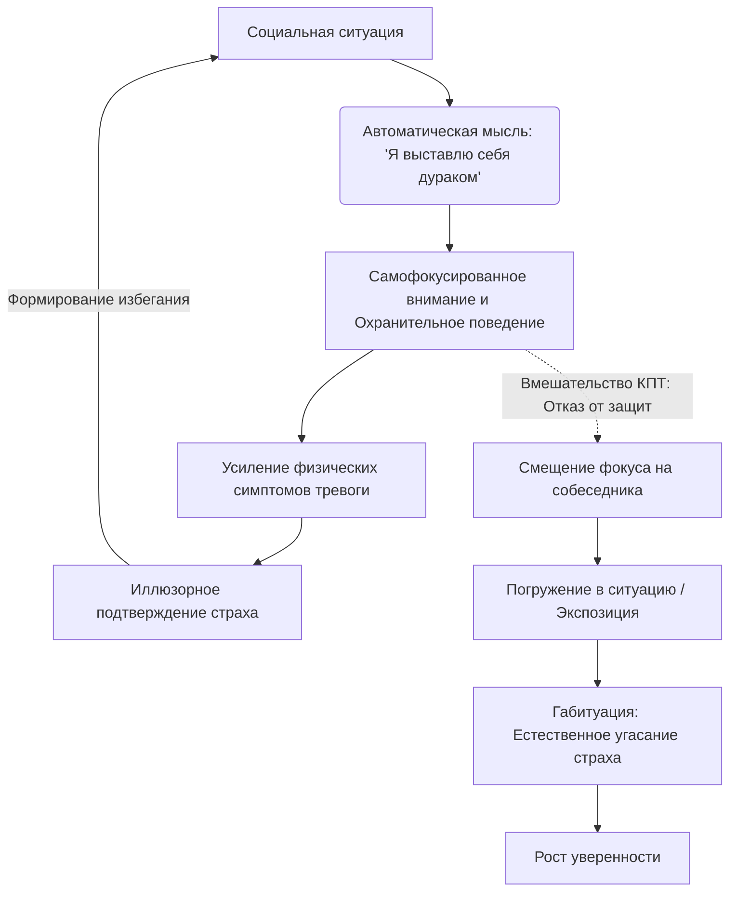

Каждый из нас время от времени беспокоится о том, какое впечатление он производит на окружающих. Но иногда этот страх становится настолько всепоглощающим, что превращается в невидимую клетку. Он заставляет отказываться от новых знакомств, карьерных возможностей и полноценной жизни, ошибочно убеждая нас в том, что избегание людей — это единственный способ защитить себя от боли и осуждения.

Когнитивно-поведенческая терапия (КПТ) предлагает научно обоснованный и четкий алгоритм, который позволяет разрушить эту клетку. Этот инструмент не обещает, что вы навсегда перестанете волноваться, но он дает надежную пошаговую инструкцию. Вы научитесь переводить внимание с внутренних переживаний на объективную реальность, лишая тревогу власти над вашими решениями и возвращая себе свободу общения.

## Отказ от страха оценки: Сущность и польза метода

В основе описываемой проблемы лежит **социальная фобия** (сильный и стойкий страх негативной оценки, смущения или унижения со стороны других людей) *(Лихи, 2018)*. Человек, сталкивающийся с этой проблемой, глубоко внутри уверен, что окружающие непрерывно замечают его неловкость, судят его и презирают. Любое общение начинает восприниматься как суровый экзамен, который невозможно сдать.

Главная практическая польза когнитивно-поведенческого подхода заключается в том, что он позволяет разорвать цикл болезненной изоляции. Освободившись от навязчивого страха, вы получаете возможность смело отстаивать свои интересы, строить искренние отношения и реализовывать свой потенциал, больше не оглядываясь на парализующий страх того, «что подумают другие» *(Reddy et al., 2020)*.

## Архитектура уверенности: Механика процесса

Процесс преодоления социальной тревоги опирается на три ключевых компонента, которые необходимо применять в комплексе:

1. **Когнитивная реструктуризация:** Выявление и изменение искаженных мыслей, а также предварительной катастрофизации (привычки прокручивать в голове все возможные способы выставить себя дураком еще до начала встречи) *(Лихи, 2018)*.
2. **Смещение фокуса внимания:** Отказ от чрезмерного погружения в свои физические симптомы и перенаправление внимания на внешний мир и собеседника.
3. **Градуированная экспозиция:** Систематическое, постепенное столкновение с пугающими социальными ситуациями на практике.

**Под капотом (Как это работает):** В основе социальной тревоги лежит **самофокусированное внимание** (смещение внимания внутрь себя для постоянного отслеживания своих симптомов тревоги, таких как дрожь или потливость, и «ошибок» в поведении) *(Reddy et al., 2020)*. Из-за этого человек начинает применять **охранительное поведение** (действия, используемые для предотвращения пугающего исхода, например, избегание зрительного контакта, заучивание текста наизусть или крепкое сжимание стакана в руке) *(Лихи, 2018)*. Ирония заключается в том, что именно эти защиты делают поведение неестественным и усиливают внутреннее напряжение.

Терапия работает за счет механизма **габитуации** (естественного физиологического угасания тревоги при длительном и безопасном контакте с триггером). Намеренно отказываясь от охранительного поведения и оставаясь в ситуации, вы доказываете мозгу, что реальной угрозы нет *(Лихи, 2018)*.

## Сцена и прожектор: Ментальные модели и границы

**Аналогия (Прожектор на темной сцене):** Представьте, что вы стоите на абсолютно темной сцене, и прямо на вас направлен ослепительный прожектор. Вы четко видите только свои дрожащие руки, неловкую позу и пятнышко на рубашке, но совершенно не видите зрительный зал. Вам кажется, что все зрители замечают каждую вашу оплошность. КПТ учит разворачивать этот прожектор в зал — начинать искренне интересоваться другими людьми, рассматривать их лица, слушать их слова, а не свой внутренний монолог. Когда прожектор светит вовне, вы перестаете быть ослепленным собственным страхом *(Лихи, 2018)*.

**Чем это не является:** Работа с социальной тревогой — это не попытка стать идеальным оратором, душой компании или замаскировать свое волнение. Это приобретение права быть неидеальным и совершать ошибки без паники.

| Избегающее мышление (Усиливает тревогу) | КПТ-подход (Снижает тревогу) |
| :--- | :--- |
| **Чтение мыслей:** «Они заметили, что я покраснел, и считают меня слабаком» *(Reddy et al., 2020)*. | **Опора на факты:** «Я не умею читать мысли. Никто не сказал мне ни слова о моем лице, беседа идет нормально». |
| **Использование защит:** Мысленное проигрывание и заучивание диалога десятки раз перед звонком *(Лихи, 2018)*. | **Спонтанность:** Намеренное вступление в диалог без подготовки, фокус на содержании разговора. |
| **Пост-событийная руминация:** Бесконечное обдумывание и критика того, как неловко вы пошутили после встречи *(Reddy et al., 2020)*. | **Принятие фактов:** Констатация события («Шутка была не очень»), отказ от «пережевывания» и переключение на текущие дела. |

## Практическое руководство: Алгоритм работы и клинический кейс

Для успешного преодоления страха необходимо применять структурированный алгоритм. Рассмотрим каждый его шаг на сквозном примере Алексея (26 лет), который панически боялся общаться с людьми.

**Шаг 1. Создание иерархии страхов**
Составьте список социальных ситуаций, которых вы избегаете, и оцените их по **Шкале субъективного дистресса (СУД)** от 0 до 100, где 100 — это максимальная паника *(Лихи, 2018)*.
* *Пример Алексея:* Спросить дорогу (30 баллов) -> Позвонить в клинику для записи к врачу (45 баллов) -> Пойти на обед с малознакомыми коллегами (70 баллов) -> Выступить с отчетом (95 баллов).

**Шаг 2. Выявление защитных механизмов**
Честно проанализируйте свое охранительное поведение — что именно вы делаете, чтобы «спрятаться» или предотвратить катастрофу *(Лихи, 2018)*.
* *Пример Алексея:* «Перед звонком я записываю весь текст на бумажку и репетирую 5 раз. Я говорю очень быстро, чтобы скорее закончить диалог. Я сильно сжимаю ручку, чтобы никто не заметил дрожь».

**Шаг 3. Планирование поведенческого эксперимента**
Выберите ситуацию средней сложности (40-50 баллов). **Поведенческий эксперимент** — это запланированное действие для проверки вашей пугающей мысли в реальности *(Бек, 2021)*.
* *Пример Алексея:* Ситуация — звонок в клинику (45 баллов). *Негативное предсказание:* «Если я буду звонить без бумажки, я запнусь. Администратор решит, что я глупый, начнет грубить, и мне будет так стыдно, что я брошу трубку».

**Шаг 4. Погружение в ситуацию без защиты**
Идите в пугающую ситуацию, намеренно отказавшись от любых «спасательных кругов». Сфокусируйте 100% внимания на внешнем мире, а не на своих физических симптомах *(Reddy et al., 2020)*.
* *Пример Алексея:* Он убирает блокнот, не репетирует текст и звонит. Во время разговора он намеренно делает небольшую паузу. Вместо того чтобы прислушиваться к своему сердцебиению (самофокусированное внимание), он концентрируется на голосе администратора и звуках на заднем фоне.

**Шаг 5. Оценка реальности**
Сразу после завершения события запишите реальные факты и сравните их с первоначальным прогнозом *(Добсон и Добсон, 2021)*.
* *Пример Алексея:* «Я запнулся. Администратор просто подождала, а затем спокойно уточнила детали и вежливо попрощалась. Никто не смеялся и не грубил. Вывод: Мой худший прогноз не сбылся. Моя запинка — это рядовая ситуация, мне не нужно писать сценарии для звонков».

> **Важный нюанс:** Никогда не используйте техники расслабления (например, судорожное глубокое дыхание) как охранительное поведение в момент общения, чтобы «подавить» тревогу *(Reddy et al., 2020)*. Ваша цель — показать мозгу, что сама по себе тревога безопасна.

## Долгосрочная свобода через временный дискомфорт

Овладение навыком уверенного нахождения среди людей радикально преображает жизненную траекторию. Открытость миру и способность спокойно выносить чужие взгляды высвобождают огромные запасы энергии, которые ранее бессмысленно расходовались на поддержание масок, избегание и внутреннюю самокритику. Вы обретаете способность выстраивать искренние отношения и прямо заявлять о своих правах, опираясь на твердые факты безопасности, а не на мрачные социальные фантазии.

Однако за обретение этой независимости потребуется заплатить немалыми усилиями. Ваша нервная система, приученная видеть угрозу выживанию в малейшем потенциальном отвержении, будет бить в колокола и требовать немедленного возвращения в зону комфорта. Потребуется жесткая, каждодневная дисциплина, чтобы регулярно, шаг за шагом, добровольно идти навстречу острому дискомфорту и сознательно отбрасывать привычные психологические костыли. Это трудный процесс, но именно методичное столкновение со страхом позволяет навсегда переписать устаревшие нейронные правила и доказать себе, что социальный мир больше не представляет для вас смертельной угрозы.

## Главный вывод и литература

> Убегая от общения и прячась за защитными ритуалами, вы лишь кормите свой страх. Развернув «прожектор» внимания на окружающий мир и готовность шагнуть навстречу дискомфорту, вы доказываете своему мозгу, что социальная среда безопасна, возвращая себе законное право быть собой.

**Источники:**
* *American Psychiatric Association. (2013). Diagnostic and Statistical Manual of Mental Disorders (5th ed.).*
* *Clark, D. M., & Wells, A. (1995). A cognitive model of social phobia. In Social Phobia: Diagnosis, Assessment, and Treatment (pp. 69–93). The Guilford Press.*
* *Rapee, R. M., & Heimberg, R. G. (1997). A cognitive-behavioral model of anxiety in social phobia. Behaviour Research and Therapy, 35, 741–756.*
* *Reddy, Y. C. J., Sudhir, P. M., Manjula, M., Arumugham, S. S., & Narayanaswamy, J. C. (2020). Clinical Practice Guidelines for Cognitive-Behavioral Therapies in Anxiety Disorders and Obsessive-Compulsive and Related Disorders. Indian Journal of Psychiatry, 62(Suppl 2), S230–S250.*
* *Бек, Дж. С. (2021). Когнитивно-поведенческая терапия. От основ к направлениям (3-е изд.). ООО "Прогресс книга".*
* *Добсон, Д., & Добсон, К. (2021). Научно-обоснованная практика в когнитивно-поведенческой терапии. Питер.*
* *Лихи, Р. (2018). Лекарство от нервов. Как перестать волноваться и получить удовольствие от жизни. Питер.*
* *Лихи, Р. (2018). Свобода от тревоги. Справься с тревогой, пока она не расправилась с тобой. Питер.*

---

### Проверка понимания

Представьте, что клиент с сильной социальной тревогой наконец-то решился пойти на корпоративную вечеринку. Чтобы не показаться глупым, он заранее заготовил и выучил наизусть три темы для разговора. В теплый вечер он надел плотный пиджак (чтобы никто не заметил возможных пятен пота). Во время беседы с коллегами он крепко вцепился в стакан с водой (чтобы никто не увидел, как дрожат его руки) и непрерывно сканировал свои ощущения: не дрожит ли его голос, ровно ли он сидит, не покраснели ли щеки. В результате он чувствовал себя абсолютно истощенным, а собеседница сочла его напряженным и отстраненным.

**Вопрос:** Опираясь на механизмы поддержания социальной тревоги, объясните, какие грубые ошибки совершил клиент во время этого свидания? Как ему следовало поступить с фокусом своего внимания и своей одеждой/действиями, чтобы этот опыт стал по-настоящему терапевтичным и снизил уровень страха?
