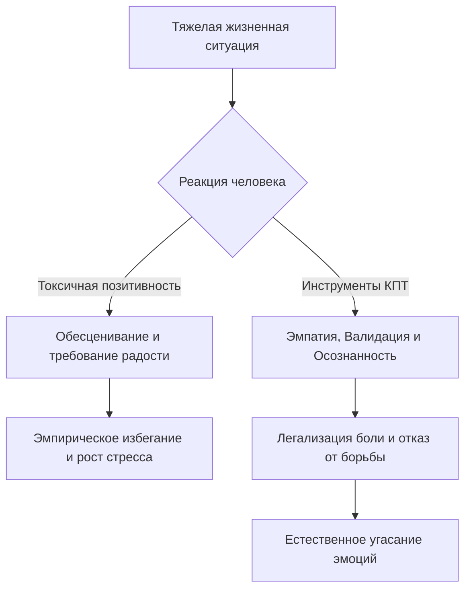

Каждому из нас знакомы моменты глубокой печали, тревоги или острого разочарования. В такие периоды общество или наш собственный разум часто требуют немедленно «взять себя в руки», «мыслить позитивно» и «искать во всем плюсы». Мы надеваем искусственную улыбку, надеясь, что бодрые лозунги заглушат внутреннюю боль, однако этот жизнерадостный фасад не приносит облегчения, а лишь загоняет нас в ловушку вины и одиночества.

Современная психотерапия предлагает совершенно иной путь. Вместо того чтобы притворяться, что проблемы не существует, мы можем использовать проверенные инструменты, чтобы честно взглянуть на свою боль, признать ее законное право на существование и обрести подлинную, а не искусственную устойчивость к жизненным кризисам.

## Отказ от искусственных улыбок: Суть и польза

**Токсичная позитивность** — это автоматическое обесценивание, минимизация или подавление реальных человеческих переживаний с помощью нереалистичного, искусственного оптимизма *(Лихи, 2021)*. На клиническом языке это состояние представляет собой деструктивную комбинацию **слепого оптимизма** (игнорирования объективных фактов) и **эмпирического избегания** (попытки любой ценой уйти от дискомфортных мыслей, чувств или телесных ощущений) *(Bentley et al., 2021)*.

Главная функция распознавания этого феномена — освобождение от разрушительного чувства вины за собственные нормальные человеческие реакции. Отказываясь от токсичного позитива, вы прекращаете бессмысленную борьбу со своими эмоциями и предотвращаете превращение естественной боли в хроническое страдание. Это позволяет высвободить энергию для реального решения проблем с опорой на факты, а не на пустые лозунги *(Lee et al., 2020)*.

## Три опоры подлинного проживания: Механика процесса

Вместо того чтобы превращаться в «чирлидера-оптимиста», когнитивно-поведенческая терапия (КПТ) и ее направления третьей волны предлагают опираться на три фундаментальных компонента:

1. **Эмпатическое слушание:** Способность открыто и безоценочно воспринимать боль (свою или чужую), поощряя выражение чувств без немедленных попыток «исправить» ситуацию *(Лихи, 2021)*.
2. **Валидация:** Искреннее подтверждение того, что эмоции человека понятны, обоснованны и имеют полное право на существование в данных обстоятельствах *(Department of Veterans Affairs, 2020)*.
3. **Радикальное принятие и осознанность:** Готовность позволить негативному опыту просто быть, наблюдая за ним без осуждения и не пытаясь его немедленно переделать в позитивный *(Barlow et al., 2011)*.

**Механика работы (Под капотом):** Когда мы пытаемся применить «тяжелую артиллерию» в виде **позитивных аффирмаций** (повторения нереалистичных фраз вроде «С каждым днем я становлюсь все счастливее»), наш мозг попросту в них не верит *(Хэррис, 2022)*. Пытаясь насильно заменить тревогу на радость, мы используем избегание, посылая нервной системе сигнал о том, что наша эмоция смертельно опасна. Это лишь усиливает физиологическое напряжение *(Bentley et al., 2021)*. Напротив, эмпатия и валидация работают как клапан сброса давления: когда эмоция легализована, миндалевидное тело мозга перестает бить тревогу, и интенсивность переживаний снижается естественным образом *(Добсон и Добсон, 2021)*.

## Лечение раны, а не слой свежей краски: Границы метода

**Аналогия (Закрашивание ржавчины):** Токсичная позитивность подобна попытке закрасить свежей яркой краской глубокую ржавчину на кузове автомобиля. Снаружи машина выглядит отлично, но процесс разрушения внутри только ускоряется. Подходы КПТ (осознанность, радикальное принятие) — это процесс зачистки металла. Это требует времени, это неприятно и обнажает саму проблему, но только так можно остановить коррозию и действительно восстановить деталь.

**Чем это не является:** Классическая когнитивная реструктуризация никогда не ставит целью заменить негативную мысль на слепую позитивную иллюзию; цель — найти баланс *(Technical Compendium, n.d.)*.

| Токсичная позитивность (Слепой оптимизм) | Подходы КПТ (Сбалансированный реализм) |
| :--- | :--- |
| **Обесценивание:** «Не расстраивайся, всё будет хорошо! Посмотри на светлую сторону!» | **Валидация:** «Я понимаю, почему ты так расстроен. Это тяжелая ситуация, и злиться абсолютно нормально» *(Department of Veterans Affairs, 2020)*. |
| **Слепой позитив:** «Я обязательно получу эту работу, я идеальный кандидат!» | **Реализм:** «Я могу не получить эту работу, но я смогу справиться с отказом и сделать выводы» *(Technical Compendium, n.d.)*. |
| **Избегание:** «Я просто не буду думать об этой проблеме и буду улыбаться». | **Осознанность:** Наблюдение за тревогой без попыток её прогнать, позволяя ей просто быть *(Barlow et al., 2011)*. |

## Жизнь со всем спектром эмоций: Практический алгоритм

Вместо зацикливания на хорошем самочувствии, здоровая психология сосредотачивается на способности чувствовать весь спектр эмоций и продолжать развиваться *(Лихи, 2021)*.

*   **Ситуация — Действие — Результат (Эмпатическое слушание):** Пациент делится тревогой по поводу развода. Неопытный терапевт мог бы сказать: «Зато теперь вы свободны!» (токсичный позитив).
    *   *Действие:* Терапевт использует эмпатическое слушание, перефразирует услышанное и валидирует боль *(Department of Veterans Affairs, 2020)*.
    *   *Результат:* Пациент чувствует себя в безопасности, перестает защищаться и начинает глубоко исследовать свои страхи.
*   **Ситуация — Действие — Результат (Осознанность против избегания):** Женщина испытывает вину и пытается заглушить её аффирмациями «Я хорошая мать» *(Bentley et al., 2021)*.
    *   *Действие:* Она применяет осознанность: садится, замечает физическую тяжесть в груди и просто наблюдает за виной без осуждения *(Barlow et al., 2011)*.
    *   *Результат:* Эмоция проживается, теряет интенсивность, и женщина спокойно возвращается к ребенку.

**Пошаговый алгоритм противостояния токсичному позитиву:**

1. **Заметьте обесценивание.** Отследите момент, когда вы пытаетесь сказать себе «все будет отлично» вместо признания реальной проблемы *(Лихи, 2021)*.
   * *Пример заполненного результата:* «Я поймал себя на мысли 'не переживай, это ерунда', когда получил отказ после важного собеседования».
2. **Примените эмпатическое слушание к себе.** Спросите себя: «Что я сейчас чувствую на самом деле?» Дайте себе пространство для честного ответа без осуждения *(Лихи, 2021)*.
   * *Пример заполненного результата:* «Я чувствую сильную тревогу в животе, обиду и страх за свое профессиональное будущее».
3. **Валидируйте эмоцию.** Скажите себе вслух формулу признания *(Department of Veterans Affairs, 2020)*.
   * *Пример заполненного результата:* «Учитывая, что я готовился к этому проекту целый месяц и возлагал на него большие надежды, чувствовать грусть и разочарование сейчас — это абсолютно логично и нормально».
4. **Проведите реалистичную оценку.** Вместо пустых аффирмаций найдите факты «за» и «против», формируя реалистичную картину *(Лихи, 2020)*.
   * *Пример заполненного результата:* «Этот отказ болезненный, но он не означает конец моей карьеры. У меня есть качественное портфолио, и я могу использовать полученный опыт для подачи заявки в другую компанию».

*Типичная ловушка:* Считать, что эмпатия и валидация лишь усугубят депрессию. Нам кажется, что если позволить слезам пролиться, они никогда не закончатся. На самом деле именно запрет на эмоции делает их хроническими, тогда как валидация позволяет им угаснуть *(Добсон и Добсон, 2021)*.

## Смелость быть уязвимым ради внутренней устойчивости

Отказ от привычки натягивать счастливую маску и требовать того же от окружающих требует колоссальной внутренней дисциплины. Нашему мозгу и нашей социальной природе гораздо комфортнее спрятаться за дежурным «всё будет отлично!», чем добровольно шагнуть в пространство чужой или собственной боли. Эмпатическое слушание требует готовности переносить временный, но порой весьма острый дискомфорт, оставаясь в контакте с уязвимостью в те моменты, когда инстинкты кричат о необходимости немедленно отвлечься.

Однако эти методичные инвестиции душевных сил приносят фундаментальные плоды. Переставая истощать себя борьбой за иллюзорное постоянное счастье, вы обретаете право на настоящую, живую реакцию. Отношения, построенные на искренней валидации, становятся несоизмеримо крепче и безопаснее. Энергия, ранее уходившая на эмпирическое избегание, возвращается в виде подлинной психологической гибкости — способности уверенно стоять на ногах в самые темные времена, опираясь на объективную реальность, а не на хрупкие стеклянные замки слепого оптимизма.

## Главный вывод и литература

> Негативные эмоции — это не признак слабости, а естественный ответ психики на сложности. Мы не обязаны всегда мыслить позитивно. Истинное исцеление начинается там, где мы позволяем себе просто быть людьми, признавая реальность такой, какая она есть.

**Источники:**
* *Barlow, D. H., Farchione, T. J., Fairholme, C. P., et al. (2011). The unified protocol for transdiagnostic treatment of emotional disorders: Therapist guide. Oxford University Press.*
* *Bentley, K. H., Bernstein, E. E., Wallace, B., & Mischoulon, D. (2021). Treatment for Anxiety and Comorbid Depressive Disorders: Transdiagnostic Cognitive-Behavioral Strategies. Psychiatric Annals, 51(5), 226–230.*
* *Department of Veterans Affairs South Central MIRECC. (2020). A Provider’s Guide to Brief Cognitive Behavioral Therapy.*
* *Hayes, S. C., Strosahl, K. D., & Wilson, K. G. (2012). Acceptance and commitment therapy: The process and practice of mindful change (2nd ed.). The Guilford Press.*
* *Lee, E. B., Homan, K. J., Morrison, K. L., et al. (2020). Acceptance and commitment therapy for trichotillomania: A randomized controlled trial of adults and adolescents. Behavior Modification, 44, 70–91.*
* *Technical Compendium of Evidence-Based Protocols and Repositories in Cognitive Behavioral Therapy. (n.d.).*
* *Добсон, Д., & Добсон, К. (2021). Научно-обоснованная практика в когнитивно-поведенческой терапии. Питер.*
* *Лихи, Р. (2018). Лекарство от нервов. Как перестать волноваться и получить удовольствие от жизни. Питер.*
* *Лихи, Р. (2020). Техники когнитивной психотерапии. Питер.*
* *Лихи, Р. (2021). Не верь всему, что чувствуешь. Как тревога и депрессия заставляют нас поверить тому, чего нет. Питер.*
* *Хэррис, Р. (2022). Ловушка счастья. Перестаем переживать — начинаем жить. Манн, Иванов и Фербер.*

---

### Проверка понимания

Представьте, что ваш близкий друг потерял работу, которую очень любил. Он приходит к вам подавленным и говорит: «Я не знаю, как мне теперь жить, я чувствую себя полным ничтожеством и мне очень страшно». В ответ вы хлопаете его по плечу и бодро заявляете: *«Да ладно тебе, не вешай нос! Закрывается одна дверь — открывается другая. Все обязательно будет супер, просто думай о хорошем и возьми себя в руки!»*

**Вопрос:** Опираясь на концепции токсичной позитивности и эмпирического избегания, объясните, почему ваш ответ заставит друга почувствовать себя еще хуже? Как бы звучал ваш ответ, если бы вы применили навык валидации и эмпатического слушания для поддержки его текущего состояния?
