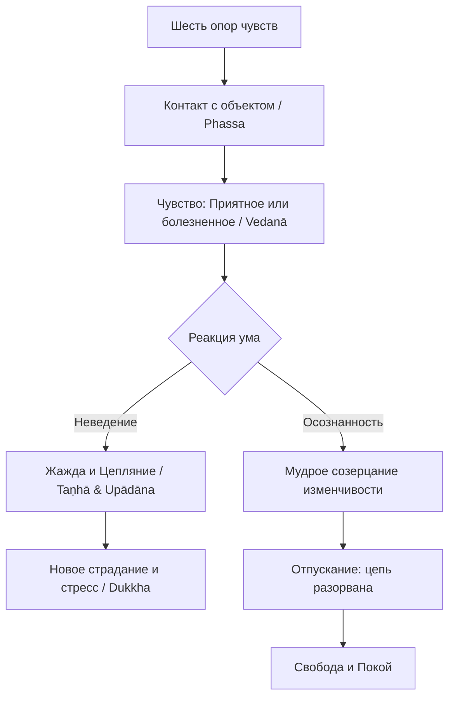

В современном мире мы часто чувствуем себя заложниками обстоятельств: мы бежим в колесе бесконечных задач, испытываем стресс от непредсказуемости будущего и глубоко страдаем, когда наши планы рушатся. Нам кажется, что жизнь — это либо хаотичный набор случайностей, либо жестко предопределенная судьба, на которую мы не в силах повлиять. Такое мировоззрение порождает чувство бессилия и хроническую неудовлетворенность (*dukkha*).

Учение Будды предлагает совершенно иной взгляд на реальность, возвращая нам контроль над собственной жизнью. Будда открыл, что наши страдания не являются ни божественным наказанием, ни случайным сбоем системы. Они возникают в результате предсказуемой цепной реакции. Поняв этот механизм, мы получаем в свои руки точный инструмент для того, чтобы разорвать порочный круг стресса и обрести подлинную, непоколебимую свободу.

## Зависимое возникновение: Анатомия нашего страдания

**Зависимое возникновение** (*paṭiccasamuppāda*) — это фундаментальный закон причинно-следственной связи, лежащий в основе всего обусловленного существования и составляющий саму суть Дхаммы. Краткая формула этого закона звучит так: «Когда есть это, возникает то; с возникновением этого, возникает то. Когда этого нет, то не возникает; с прекращением этого, прекращается то».

Какую главную ментальную проблему решает этот инструмент? Он распутывает узел нашего фундаментального неведения и вытекающего из него страдания. Учение подробно описывает механизм возникновения и прекращения страдания в виде двенадцати взаимосвязанных факторов — от неведения до старения и смерти. Показывая, как именно одно обусловливает другое, *paṭiccasamuppāda* дает нам ясную дорожную карту: устранив причину (например, жажду), мы неизбежно устраняем и следствие (страдание и дальнейшее перерождение).

## Взгляд на систему и механика ума

Двенадцатизвенная цепь охватывает всю динамику нашего существования. Традиция делит эти 12 звеньев на три взаимодействующих круга (*vaṭṭa*):

1.  **Круг омрачений (*kilesavaṭṭa*):** Включает неведение (*avijjā*), жажду (*taṇhā*) и цепляние (*upādāna*). Это наши базовые слепые пятна и зависимости, которые толкают нас к действию.
2.  **Круг кармы (*kammavaṭṭa*):** Включает волевые конструкции (*saṅkhārā*) и кармическое становление (*kammabhava*). Это те самые действия умом, речью и телом, которые мы совершаем под влиянием омрачений.
3.  **Круг результатов (*vipākavaṭṭa*):** Включает сознание (*viññāṇa*), имя-и-форму (*nāmarūpa*), шесть опор чувств (*saḷāyatana*), контакт (*phassa*), чувство (*vedanā*), а также рождение (*jāti*) и старение со смертью (*jarāmaraṇa*). Это пассивный опыт и страдания, которые мы пожинаем как плоды своих действий.

**Механика ума:** Эта схема показывает, что внутри нас нет неизменного «Я» или вечной души; есть лишь непрерывный поток обусловленных явлений. Всякий раз, когда через органы чувств происходит контакт (*phassa*) с объектом, возникает чувство (*vedanā*). Если ум ослеплен неведением, приятное чувство мгновенно порождает жажду (*taṇhā*), а та перерастает в жесткое цепляние (*upādāna*), заставляя нас совершать новые кармические действия.

> С неведением как условием возникают волевые конструкции; с волевыми конструкциями как условием, возникает сознание... Таково возникновение всей этой груды страдания.
>
> — ([СН 12.1](https://theravada.ru/Teaching/Canon/Suttanta/Texts/sn12_1-paticca-samuppada-sutta-sv.htm))

Однако, если мы вносим осознанность в момент возникновения чувства и не позволяем жажде появиться, цепь разрывается. Без топлива жажды новые страдания не возникают.

## Ментальные модели и границы

**Снопы тростника:** Для описания взаимозависимости факторов Будда использовал метафору двух снопов тростника, опирающихся друг на друга. Если убрать один, немедленно упадет и второй. Точно так же сознание (*viññāṇa*) и психофизический организм (*nāmarūpa*) опираются друг на друга; с прекращением одного прекращается другое.

Зависимое возникновение — это «срединное учение», пролегающее строго между двумя философскими крайностями:

| Характеристика | Зависимое возникновение (*Paṭiccasamuppāda*) | Искаженное мировоззрение (Крайности) |
| :--- | :--- | :--- |
| **Природа личности** | Поток взаимосвязанных процессов, лишенных вечного ядра. | **Этернализм**: Вера в вечную, неизменную душу или независимое «Я». |
| **Отношение к смерти** | Сознание и страдание продолжаются в новых формах, пока не устранена жажда. | **Аннигиляционизм**: Вера в то, что после смерти человек полностью уничтожается. |
| **Степень контроля** | Человек способен разорвать цепь страданий, устранив их причины. | **Фатализм / Случайность**: Вера в то, что всё предрешено судьбой, Богом или случайностью. |

## Практическое руководство: Дхамма в повседневности

**Сценарий 1: Информационная зависимость (Думскроллинг)**

  * *Ситуация:* Вы устали и машинально открываете ленту новостей. Вы видите тревожный заголовок, пугаетесь и продолжаете бесконтрольно листать дальше, истощая свою нервную систему.
  * *Действие Дхаммы:* Примените понимание цепи. Осознайте: произошел визуальный **контакт** (*phassa*), который вызвал болезненное **чувство** (*vedanā*). Ваше желание читать дальше — это **жажда** (*taṇhā*), пытающаяся избавиться от дискомфорта. Внесите осознанность на этапе чувства: просто отметьте «болезненное чувство», не превращая его в жажду действий.
  * *Результат:* Вы разрываете цепную реакцию на самом критическом звене. Лента закрывается, ум успокаивается, вы не создаете новую карму стресса.

**Сценарий 2: Кризис самоидентификации после неудачи**

  * *Ситуация:* Вы потерпели крупную неудачу в бизнесе. Ум мгновенно делает вывод: «Я неудачник, моя жизнь разрушена».
  * *Действие Дхаммы:* Вспомните, что нет монолитного «Я», которое можно было бы разрушить. То, что произошло — это безличный результат **волевых конструкций** (*saṅkhārā*) и условий в прошлом.
  * *Результат:* Вы избегаете крайности этернализма. Снимая ярлык «Я», вы объективно анализируете причины ошибки и спокойно двигаетесь дальше.

**Алгоритм разрыва цепи (Практика в моменте):**

## Главный вывод и источники

Учение о зависимом возникновении — это интеллектуальное и практическое сердце Дхаммы. Оно исцеляет нас от чувства безысходности, доказывая, что мы не являемся жертвами слепого случая или жесткой судьбы. Привнося мудрость и осознанность в то, как мы реагируем на приятные и болезненные чувства каждую секунду своей жизни, мы лишаем механизм сансары его главного топлива — жажды. Так шаг за шагом мы приходим к полному прекращению страданий и высшей свободе.

**Источники для изучения:**

  * ([СН 12.1: Патичча-самуппада-сутта](https://theravada.ru/Teaching/Canon/Suttanta/Texts/sn12_1-paticca-samuppada-sutta-sv.htm))
  * ([СН 12.15: Каччанаготта-сутта](https://theravada.ru/Teaching/Canon/Suttanta/Texts/sn12_15-kachayanagotta-sutta-sv.htm))
  * ([СН 12.67: Налакалапи-сутта (Снопы тростника)](https://theravada.ru/Teaching/Canon/Suttanta/Texts/sn12_67-nalakalapiyo-sutta-sv.htm))

-----

**Проверка понимания:**

Представьте, что вы практикуете медитацию сидя, и внезапно в колене возникает острая физическая боль. Ваш ум немедленно сжимается, появляется раздражение, и вы думаете: *«Я не могу это терпеть, я должен немедленно сменить позу, моя медитация испорчена»*.

Опираясь на звенья Зависимого возникновения (*paṭiccasamuppāda*), объясните: на каком именно этапе телесный процесс перешел в психологическое страдание? Между какими двумя звеньями цепи вам следует сейчас «вставить» осознанность, чтобы прервать создание новой кармы стресса, и как это сделать практически?
