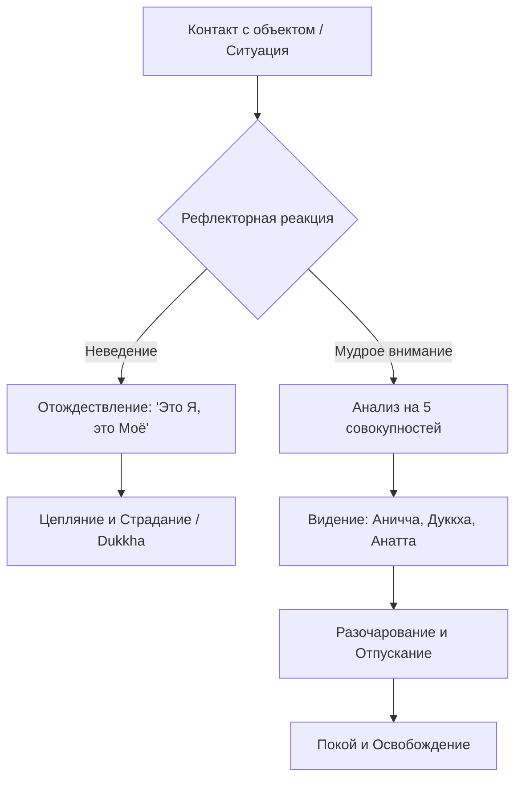

Наша повседневность нередко сводится к изматывающей защите собственной идентичности. Мы выстраиваем образ себя вокруг своего тела, эмоций, интеллектуальных способностей и социального статуса. Но поскольку тело стареет, чувства меняются каждую секунду, а мнения подвергаются критике, это концептуальное «Я» постоянно находится под угрозой. Мы инстинктивно пытаемся удержать то, что по своей природе является изменчивым, и это постоянное ментальное напряжение порождает фоновую тревогу и глубокую неудовлетворенность (*dukkha*).

Учение Будды предлагает точный и терапевтический инструмент для распутывания этого узла. Вместо того чтобы пытаться защитить или «улучшить» свое эго, Будда предложил разобрать его на составные части. Разбирая иллюзию плотного «Я» на элементы, мы лишаем наши страхи и комплексы основы, превращая стресс в путь к глубокому освобождению.

## Пять совокупностей: Анатомия иллюзии «Я»

**Пять совокупностей** (*pañcakkhandha*) — это исчерпывающая классификация всего психофизического опыта живого существа. В буддийской психологии нет места неизменной душе; человек рассматривается как динамичный процесс, состоящий из пяти базовых строительных блоков:

1.  **Материальная форма** (*rūpa*): Наше физическое тело и воспринимаемые материальные объекты внешнего мира.
2.  **Чувство** (*vedanā*): Базовый эмоциональный тон любого переживания — приятный, неприятный или нейтральный.
3.  **Восприятие / Распознавание** (*saññā*): Способность ума узнавать объекты и навешивать на них ярлыки (цвета, звуки, концепции) на основе прошлого опыта.
4.  **Умственные конструкции / Формации** (*saṅkhāra*): Волевые импульсы, намерения, кармические реакции и эмоции (гнев, любовь, жадность).
5.  **Сознание** (*viññāṇa*): Сам факт осознавания, базовая способность познавать через любую из шести опор чувств (зрительное, слуховое, ментальное и т.д.).

Сами по себе эти компоненты нейтральны, это просто природные процессы. Проблема возникает, когда они становятся совокупностями, «подверженными цеплянию» (*upādānakkhandhā*). Невежественный ум захватывает эти процессы и выстраивает из них ложное чувство личной идентичности (*sakkāyadiṭṭhi*). Как только мы начинаем видеть, что «Я» — это лишь удобный ярлык для пяти непрерывно меняющихся потоков, узел эгоистичной привязанности распускается.

## Архитектура опыта и механика ума

Чтобы понять, как именно работает этот инструмент, мы можем разделить механику цепляния и освобождения на три ключевых этапа:

1.  **Сырые данные (Сами совокупности):** Наш опыт всегда состоит исключительно из этих пяти элементов. Вне их нет ничего, что мы могли бы пережить.
2.  **Механизм цепляния (Присвоение и Отождествление):** Трагедия начинается, когда в дело вступает неведение (*avijjā*). Оно заставляет нас хвататься за совокупности двумя способами: через присвоение (жажда, *taṇhā*, диктующая «это моё») и через отождествление (воззрения и самомнение, диктующие «это я», «такова моя суть»).
3.  **Антидот (Три характеристики):** Механика освобождения запускается, когда мы применяем к совокупностям мудрость (*paññā*). Мы начинаем видеть их через призму Трех характеристик бытия (*ti-lakkhaṇa*): они непостоянны (*anicca*), неизбежно связаны со страданием (*dukkha*) и безличны (*anattā*). Осознание того, что непостоянные вещи не могут быть надежным убежищем, вызывает глубокое разочарование (*nibbidā*), которое ведет к отпусканию и освобождению.

## Ментальные модели и границы

Для наглядной демонстрации природы нашего цепляния Будда использовал образ **собаки на привязи**. Как собака, привязанная к столбу, бегает только вокруг него, так и необученный человек постоянно крутится вокруг формы, чувства, восприятия, формаций и сознания, считая их своим «Я», и потому никогда не может вырваться из цикла перерождений.

Другая важнейшая метафора — **Тяжелая ноша** (*bhāra*). Пять совокупностей — это объективно тяжелый груз. Взятие этого груза на плечи — это наша жажда и цепляние. Сбрасывание груза — это полное прекращение привязанности.

Чтобы показать глубинную пустотность каждой совокупности и избавить ум от иллюзий, традиция предлагает пять классических метафор:

> Монахи, вообразите себе, как осенью с небес льётся дождь и капают крупные дождевые капли, а на поверхности воды появляются и тут же лопаются водяные пузыри... Подобно этому... какое бы ни было чувство — прошлое, будущее или настоящее... монах рассматривает его... так тщательно, что оно предстаёт ему как пустое, полое внутри, лишённое сущности.
>
> — ([СН 22.95](https://theravada.ru/Teaching/Canon/Suttanta/Texts/sn22_95-phena-pinduphama-sutta-sv.htm))

Согласно этой сутте, **форма** подобна полому комку пены, **чувство** — водяному пузырю, **восприятие** — зыбкому миражу, **волевые конструкции** — стволу бананового дерева (не имеющему твердой сердцевины), а **сознание** — магической иллюзии. Все они лишены плотной, неизменной сущности.

Важно четко понимать границы этой практики. Буддийский анализ совокупностей **не** является психологической диссоциацией.

| Характеристика | Постижение совокупностей в Дхамме | Современное «уничтожение Эго» / Нигилизм |
| :--- | :--- | :--- |
| **Цель** | Мудрое видение процессов для устранения цепляния. | Агрессивная борьба со своей личностью, ведущая к фрустрации. |
| **Отношение к опыту** | Бережное, но объективное наблюдение явлений как безличных (*anattā*). | Подавление мыслей силой, ненависть к телу, патологическая оторванность. |
| **Результат** | Глубокий покой, легкость и освобождение от тревог. | Эмоциональное выгорание, апатия, страх пустоты. |

## Практическое руководство: Деконструкция в повседневности

Учение о пяти совокупностях — это не абстрактная философия, а мощный инструмент когнитивного рефрейминга для применения «здесь и сейчас».

**Сценарий 1: Критика в социальных сетях или на работе**

  * *Ситуация:* Кто-то оставил едкий, обесценивающий комментарий в ваш адрес. Ваше сердце бьется чаще, возникает жгучая обида и желание написать резкий ответ.
  * *Действие Дхаммы:* Заметьте контакт через призму совокупностей: пиксели на экране (форма) и ментальное распознавание слов (*saññā*). Учащенный пульс — это форма (*rūpa*). Обида — неприятное чувство (*vedanā*). Гнев и намерение защитить «себя» — это волевые конструкции (*saṅkhāra*).
  * *Результат:* Рассматривая их мудростью («это не моё, это не я»), вы понимаете, что гнев — это просто безличное явление. Лишив эмоцию энергии цепляния, вы позволяете реакции угаснуть самой по себе. Вы можете ответить профессионально, сохранив покой.

**Сценарий 2: Физическое старение и боль**

  * *Ситуация:* Вы замечаете возрастные изменения в теле или испытываете сильную боль в спине после работы. Возникает страх, уныние и сопротивление реальности.
  * *Действие Дхаммы:* Вы применяете мудрость и разделяете опыт: «Эта форма (*rūpa*) непостоянна. Чувство боли (*vedanā*) — лишь ощущение от контакта. Это не моё истинное «Я»».
  * *Результат:* Как обученный ученик, вы перестаете пронзать себя «второй стрелой». Физическая боль остается, но умственное страдание (*dukkha*), вызванное сопротивлением, растворяется.

**Алгоритм интеграции (Випассана):**

## Итог и источники

Пять совокупностей, подверженных цеплянию, охватывают абсолютно весь наш мирской опыт. Наше страдание возникает не из-за того, что существуют тело и ум, а из-за того, что мы невежественно пытаемся присвоить эти хрупкие, изменчивые процессы. Истинное освобождение наступает тогда, когда с помощью прозрения мы проникаем в их непостоянную и безличную природу, навсегда сбрасывая тяжелую ношу жажды.

**Источники для изучения:**

  * ([СН 56.11: Дхаммачаккапаваттана-сутта](https://www.theravada.ru/Teaching/Canon/Suttanta/Texts/sn56_11-dhammacakka-pavatana-sutta-sv.htm)) — О Первой благородной истине.
  * ([СН 22.59: Анатталаккхана-сутта](https://theravada.ru/Teaching/Canon/Suttanta/Texts/sn22_59-anatta-lakkhana-sutta-sv.htm)) — Беседа о характеристике безличностности.
  * ([СН 22.95: Пхенапиндупама-сутта](https://theravada.ru/Teaching/Canon/Suttanta/Texts/sn22_95-phena-pinduphama-sutta-sv.htm)) — Метафоры пустотности совокупностей.
  * ([СН 22.22: Бхара-сутта](https://theravada.ru/Teaching/Canon/Suttanta/Texts/sn22_22-bhara-sutta-sv.htm)) — О тяжелой ноше и её сбрасывании.

-----

**Проверка понимания:**
Проанализируйте две следующие ситуации сквозь призму учения о пяти совокупностях:

1.  **Ловушка блаженства:** Медитирующий во время глубокой практики испытывает невероятное чувство покоя, радости и кристальной ясности. Внутри возникает мысль: *«Наконец-то я достиг своей истинной сущности. Этот блаженный покой — и есть моё подлинное, вечное «Я»»*. В какую тонкую ловушку попал практикующий? Какие именно совокупности он пытается присвоить в этот момент?
2.  **Разбитый телефон:** Вы случайно разбиваете дорогой смартфон. У вас перехватывает дыхание (*rūpa*), вы чувствуете резкую душевную боль (*vedanā*), а в уме проносится: *«Какой же я неудачник, вечно всё валится из рук\!»*. Какая конкретно совокупность (*khandha*) ответственна за формирование образа «неудачника», и как объективное применение мудрого внимания к ней остановит страдание?
