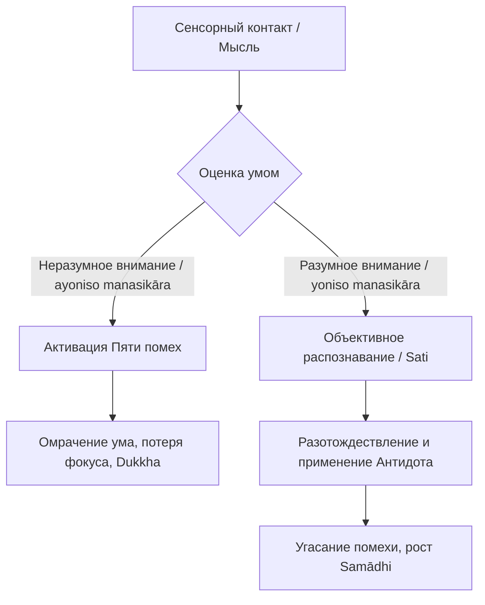

Мы часто садимся за важную задачу или закрываем глаза для медитации в надежде на ясный и сфокусированный ум, но вместо этого сталкиваемся с глухим внутренним сопротивлением. Внимание рассеивается, тело наливается тяжестью, вспыхивает беспричинное раздражение или накатывает волна тревожных сомнений. Попытки решить эту проблему жестким тайм-менеджментом или внешними стимуляторами дают лишь временный эффект, потому что корень рассеянности лежит не в усталости или внешних отвлечениях, а в фундаментальных привычках самого сознания.

Учение Будды классифицирует эти внутренние блоки как **Пять помех** (*pañcanīvaraṇā*). Умение объективно распознавать их природу и применять к ним точные «противоядия» — это первый и абсолютно необходимый шаг к обретению кристальной ясности, глубокого покоя и освобождающей мудрости.

## Пять помех: Внутренние барьеры на пути к ясности

**Пять помех** (*pañcanīvaraṇā*) — это основные ментальные препятствия, которые блокируют путь к освобождению, помрачают качество осознанности и лишают ум энергии и пластичности. Их главная «работа» заключается в том, чтобы разрывать наше внимание на части и не позволять уму достичь состояния глубокого сосредоточения (*samādhi*) и прозрения (*vipassanā*). Без временного усмирения этих помех достижение глубоких состояний медитации (джхан) абсолютно невозможно.

Буддийская психология делит эти состояния на три группы, отражающие разные виды ментального дисбаланса:

1.  **Силы притяжения и отторжения:**
      * **Чувственное желание (*kāmacchanda*):** Страстная тяга к пяти видам чувственных удовольствий, фантазиям, статусу или славе. Ум судорожно «прилипает» к объекту. *Специфическое противоядие:* Размышление о непривлекательности (*asubha*) или непостоянстве.
      * **Недоброжелательность (*vyāpāda*):** Синоним отвращения, включающий гнев, обиду, раздражение и неприязнь. Ум агрессивно отталкивает объект. *Специфическое противоядие:* Развитие любящей доброты (*mettā*) и сострадания.
2.  **Дисбаланс энергии:**
      * **Лень и апатия (*thīna-middha*):** Дефицит энергии. Лень проявляется как умственная инерция, а апатия — как тяжесть ума, тусклость и погружение в сонливость. *Специфическое противоядие:* Пробуждение энергии (*viriya*) и восприятие яркого света.
      * **Беспокойство и сожаление (*uddhacca-kukkucca*):** Избыток энергии. Беспокойство с бешеной скоростью гонит ум в будущее (тревога), а сожаление возвращает в прошлое (раскаяние за ошибки). *Специфическое противоядие:* Развитие безмятежности и спокойствия (*samatha*).
3.  **Парализующий туман:**
      * **Сомнение (*vicikicchā*):** Хроническая нерешительность, скептицизм и отсутствие ясности, из-за которых ум буксует на месте. *Специфическое противоядие:* Изучение, исследование и ясное определение феноменов.

## Механика ума и ментальные модели

Помехи не приходят извне; они активируются из глубоких слоев ума через неразумное, невнимательное отношение (*ayoniso manasikāra*) к сенсорному опыту. Привлекательные объекты провоцируют желание, неприятные — недоброжелательность, а неопределенные — неведение.

В классическом буддийском примере ум сравнивается с чашей воды, в которой человек пытается увидеть отражение своего лица. Пять помех делают это невозможным:

  * *Чувственное желание* — это вода, смешанная с яркими красками.
  * *Недоброжелательность* — это кипящая, бурлящая вода.
  * *Лень и сонливость* — вода, заросшая густой ряской и водорослями.
  * *Беспокойство* — вода, взболтанная сильным ветром.
  * *Сомнение* — мутная, грязная вода, поставленная в темноте.

Будда также иллюстрировал сковывающую природу помех, сравнивая их с тяжелыми мирскими невзгодами: наличие этих препятствий подобно жизни в долгах, тяжелой болезни, тюремному заключению, рабству или опасному пути через пустыню. Избавление от них воспринимается как абсолютная свобода и безопасность.

Важно понимать, что правильная работа с помехами — это не избегание реальности и не подавление эмоций:

| Характеристика | Правильная работа (Дхамма) | Неправильная практика (Подавление) |
| :--- | :--- | :--- |
| **Отношение к состоянию** | Спокойное признание: «В уме есть гнев». | Отрицание, чувство вины: «Я плохой практик». |
| **Механизм устранения** | Внимательное наблюдение за возникновением помехи. | Насильственное вытеснение мысли, попытка отвлечься. |
| **Результат** | Глубокое спокойствие, понимание причин реакций. | Фоновое напряжение, невроз, внезапные срывы. |

## Практическое руководство: Дхамма в повседневности

Пять помех атакуют нас не только на подушке для медитации, но и в гуще рабочей или семейной жизни.

**Сценарий 1: Прокрастинация и цифровые отвлечения**

  * *Ситуация:* Вы сели за сложную задачу, возникает тяжесть в голове (*thīna-middha*), и рука рефлекторно тянется к смартфону за дофамином (*kāmacchanda*).
  * *Действие Дхаммы:* Заметьте сам импульс и мысленно повесьте ярлык: «желание впечатлений» или «тупость ума». Не ругайте себя, но примените противоядие: намеренно вызовите в уме образ яркого света и приложите волевое усилие (*viriya*) для возвращения к задаче.
  * *Результат:* Ментальная инерция рассеивается, осознанность создает микро-паузу, и помеха угасает без слепого следования ей.

**Сценарий 2: Тревога из-за прошлых ошибок**

  * *Ситуация:* Перед сном вы постоянно прокручиваете в голове неудачный диалог, испытывая стыд (*uddhacca-kukkucca*) и начиная злиться на собеседника (*byāpāda*).
  * *Действие Дхаммы:* Признайте: «В уме присутствует беспокойство и недоброжелательность». Отпустите контент мыслей (историю о конфликте) и мягко перенаправьте внимание на чистые физические ощущения дыхания, развивая умиротворение (*passaddhi*).
  * *Результат:* Тревожные мысли лишаются концептуальной подпитки, ум стабилизируется и погружается в покой.

**Алгоритм преодоления помех:**

## Главный вывод и источники

Пять помех — это не внешние враги и не дефекты характера, а естественные реакции необученного ума, дремлющие в нашем континууме. Искусно отслеживая их появление с помощью осознанности и устраняя их специфическими противоядиями, мы очищаем свой ум. Когда помехи устранены, ум наполняется возвышенной радостью и беспрепятственно входит в состояния глубокого медитативного поглощения, подготавливая почву для абсолютного освобождения.

**Источники для изучения:**

  * ([ДН 22: Махасатипаттхана-сутта](https://theravada.ru/Teaching/Canon/Suttanta/Texts/dn22-mahasatipatthansa-sutta-01-ivahnenko.htm)) — Большая сутта об основах памятования.
  * ([МН 39: Маха-ассапура-сутта](https://theravada.ru/Teaching/Canon/Suttanta/Texts/mn39-maha-assapura-sutta-sv.htm)) — Метафоры долга, болезни и тюрьмы.
  * ([СН 46.51: Ахара-сутта](https://theravada.ru/Teaching/Canon/Suttanta/Texts/sn46_51-ahara-sutta-sv.htm)) — Пища для препятствий.

-----

**Проверка понимания:**
Представьте, что после долгой и изнурительной рабочей недели (по 12 часов за компьютером) вы садитесь в субботу утром медитировать. Ваше тело физически измучено, спина ноет, а глаза сами собой закрываются. Ваш ум мгновенно делает вывод: *«Моя медитация ужасна, я полностью захвачен третьей помехой — ленью и сонливостью (thīna-middha), у меня слабая воля и плохая карма»*.

Опираясь на буддийскую психологию и понимание механики ума, проанализируйте эту ситуацию: является ли чисто физическое истощение организма помехой *thīna-middha*? Какую дополнительную помеху (или даже две) вы незаметно для себя активировали, вынеся такой жесткий судящий вердикт своей практике? Как следует применить осознанность к этой ситуации прямо сейчас?
