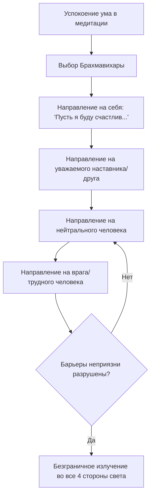

Мы привыкли защищать свою психику от чужой боли, агрессии и несправедливости, возводя вокруг себя глухие стены цинизма и равнодушия. Когда же мы сталкиваемся с чужим успехом, эти оборонительные редуты не спасают нас от острых уколов зависти. Пытаясь изолировать свое эго от жизненных потрясений, мы лишь загоняем себя в ловушку хронического стресса, тревоги и глубокой внутренней неудовлетворенности (*dukkha*).

Учение Будды предлагает совершенный и экологичный механизм настройки наших эмоций. Практика развития возвышенных качеств ума — это не просто набор сентиментальных переживаний, а строгий метод трансформации сознания. Он искореняет злобу, зависть и жестокость, превращая наше отношение к миру в несокрушимый источник покоя и эмпатии, недосягаемый для жизненных бурь.

## Божественные обители: Эмоциональный иммунитет ума

Четыре неизмеримых качества (*appamaññā*), также известные как «божественные обители» (*brahmavihārā*), представляют собой возвышенные социальные установки. Практикующий постепенно развивает их до универсального излучения, охватывающего всех без исключения живых существ.

Их главная «работа» — служить прямыми и абсолютными противоядиями от самых токсичных ядов ума: гнева, жестокости, зависти и слепой привязанности. Буддийская психология рассматривает их как благотворные ментальные факторы, которые освобождают ум от ограничений эгоизма, подготавливая прочную основу для глубокого сосредоточения (*samādhi*) и высшего освобождения.

## Четыре столпа и механика ума

Будда выделил четыре неизмеримых качества, каждое из которых имеет свою специализацию и нацелено на устранение конкретной ментальной болезни:

1.  **Любящая доброта** (*mettā*): Безусловное, искреннее пожелание истинного счастья и благополучия себе и всем без исключения существам. Она является прямым противоядием от недоброжелательности и злобы, опираясь на ментальный фактор отсутствия ненависти (*adosa*).
2.  **Сострадание** (*karuṇā*): Глубокое желание, чтобы существа освободились от боли; свойство, заставляющее сердце трепетать при виде чужих страданий. Оно полностью противоположно жестокости и насилию.
3.  **Сорадование** (*muditā*): Искренняя, альтруистическая радость успехам, процветанию и добродетелям других людей. Это качество сжигает зависть (*issā*), ревность и соревновательную горечь.
4.  **Невозмутимость** (*upekkhā*): Ровное, сбалансированное состояние ума, взирающее на всех существ с беспристрастностью. Опираясь на мудрость о том, что все существа являются наследниками своей кармы, она устраняет предвзятость, фаворитизм и защищает от эмоциональных качелей и выгорания.

**Механика ума:** Практика осуществляется через последовательное излучение. Медитирующий наполняет ум каждым из этих состояний и направляет его поочередно в одну сторону света, затем в другие, а затем вверх, вниз и повсюду. Если практик развивает их до уровня глубокого медитативного поглощения (*jhāna*), он обеспечивает себе перерождение в высших мирах (например, любящая доброта ведет в обитель свиты Брахмы, а равностность — к дэвам Великого плода).

## Ментальные модели и границы

Для наглядного объяснения мощи этой практики Будда использовал метафору сильного трубача:

> Подобно тому как трубный глас горниста слышен без препятствий во всех четырёх сторонах света, так и когда освобождение ума через доброжелательность взращено таким образом, в нём не остаётся места ограничениям, они не присутствуют в нём.
>
> — ([МН 99](https://theravada.ru/Teaching/Canon/Suttanta/Texts/mn99-subha-sutta-sv.htm))

Другая классическая аналогия для понимания баланса этих качеств — образ матери, у которой есть четверо детей. К младенцу она испытывает безусловную любовь (*mettā*), к заболевшему ребенку — глубокое сострадание (*karuṇā*), успехам подростка она радуется (*muditā*), а за самостоятельного взрослого сына испытывает спокойную невозмутимость (*upekkhā*).

У каждого качества есть «дальний враг» (прямая противоположность) и «ближний враг» (искажение, маскирующееся под добродетель, но опирающееся на цепляние):

| Брахмавихара | Истинная суть | Ближний враг (Опасная подделка) | Дальний враг |
| :--- | :--- | :--- | :--- |
| **Mettā** | Бескорыстное пожелание блага всем без разбора. | Эгоистичная привязанность, собственническая любовь к «своим». | Злоба, ненависть, гнев. |
| **Karuṇā** | Трепетное, активное желание устранить страдание. | Жалость свысока, парализующая скорбь, отчаяние. | Жестокость, садизм. |
| **Muditā** | Чистая радость чужому успеху. | Лицемерие, лесть, радость ради собственной косвенной выгоды. | Зависть (*issā*), скупость. |
| **Upekkhā** | Мудрая, сбалансированная беспристрастность. | Равнодушие, апатия, черствость и цинизм. | Предвзятость, тревога, цепляние. |

## Практическое руководство в повседневности

**Сценарий 1: Чужой успех (Преодоление зависти)**

  * **Ситуация:** Вы видите, как ваш коллега получает премию или публикует фото с престижной наградой. Внутри мгновенно зарождается зависть и обида.
  * **Действие Дхаммы:** Заметьте возникновение зависти. Намеренно примените сорадование (*muditā*). Мысленно искренне скажите: «Как замечательно, что этот человек процветает. Пусть его успех только приумножается».
  * **Результат:** Токсичная зависть растворяется, ум обретает легкость и светлую радость. Вы сохраняете профессиональные отношения и не отравляете свою жизнь горечью.

**Сценарий 2: Неизлечимая болезнь близкого (Защита от выгорания)**

  * **Ситуация:** Вы сделали все возможное, чтобы помочь болеющему человеку, но его состояние ухудшается, и вы чувствуете отчаяние и эмоциональное истощение от сопереживания.
  * **Действие Дхаммы:** Заметьте, что сострадание (*karuṇā*) провалилось в своего ближнего врага — горе. Перейдите к невозмутимости (*upekkhā*). Напомните себе закон кармы: «Все существа являются владельцами своих действий и наследниками своей кармы».
  * **Результат:** Скорбь утихает, сменяясь мудрым спокойствием. Вы отпускаете невротический контроль и продолжаете заботиться о человеке, но уже без саморазрушения.

**Алгоритм интеграции (Механика излучения):**

## Заключительное слово и источники

Четыре неизмеримых качества — это не просто моральный идеал, а суровый и эффективный метод очищения сознания. Преодолевая недоброжелательность, жестокость, зависть и предвзятость, мы делаем наш ум безграничным. Эти божественные состояния переплавляют сырой материал наших повседневных конфликтов в чистое золото эмпатии и служат мощным фундаментом, на котором расцветает мудрость, способная привести к Ниббане.

**Источники для изучения:**

  * ([МН 99: Субха-сутта](https://theravada.ru/Teaching/Canon/Suttanta/Texts/mn99-subha-sutta-sv.htm))
  * ([АН 4.125: Метта-сутта](https://theravada.ru/Teaching/Canon/Suttanta/Texts/an4_125-pathama-metta-sutta-sv.htm))
  * ([АН 8.36: Пуннякирия ваттху-сутта](https://theravada.ru/Teaching/Canon/Suttanta/Texts/an8_36-punnya-kiriya-vatthu-sutta-sv.htm))

-----

**Проверка понимания:**

Представьте практикующего, который медитирует на страданиях животных (например, в приюте) или голодающих людей. Он настолько глубоко проникается их болью, что впадает в тяжелую депрессию, плачет днями напролет и теряет способность нормально жить и работать, считая свое состояние истинным духовным проявлением Дхаммы. Вдобавок он начинает яростно ненавидеть тех, кто, по его мнению, причиняет им вред.

Какую тонкую когнитивную ошибку совершает практикующий с точки зрения буддийской психологии? С каким «ближним врагом» и «дальним врагом» он спутал истинное сострадание (*karuṇā*), и какую именно из четырех Брахмавихар ему следует немедленно применить для восстановления ментального баланса?
