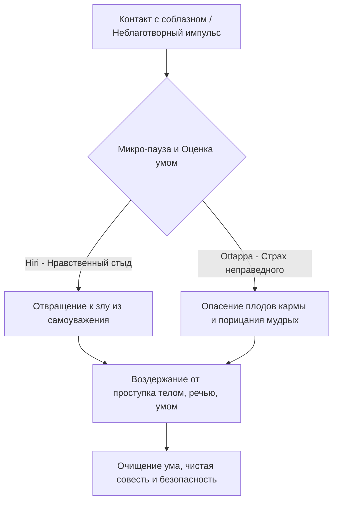

Современная культура часто воспринимает понятия стыда и страха как исключительно токсичные, невротические эмоции, от которых необходимо избавиться. В эпоху культа личного успеха мы привыкли считать, что свобода — это возможность делать всё, что хочется, не оглядываясь на моральные авторитеты. Нам кажется, что маленькая ложь ради выгоды или скрытая манипуляция не принесут вреда, если о них никто не узнает. Однако эта иллюзия безнаказанности ведет к внутреннему истощению, фоновому напряжению, хроническому чувству вины и разрушению социальных связей.

Учение Будды проводит строгую границу между невротическим чувством вины и подлинным моральным компасом. Дхамма предлагает нам два мощных, исцеляющих качества ума: нравственный стыд (*hiri*) и страх перед неправедным (*ottappa*). В буддийской психологии они не являются источником стресса; напротив, это светлые, защитные факторы ума, которые берегут нас от создания плохой кармы и обеспечивают глубокую внутреннюю безопасность.

## Стыд и страх перед неправедным: Стражи мира и ума

**Нравственный стыд** (*hiri*) и **страх перед неправедным** (*ottappa*) — это два дополняющих друг друга прекрасных, благих качества ума (*sobhanacetasika*), которые всегда возникают вместе. Будда и его комментаторы называли их «стражами мира» (*lokapāla*).

Какую главную работу они выполняют? Их функция — останавливать нас на краю пропасти, предотвращая совершение неблагих поступков телом, речью и умом *до того*, как они будут совершены. Если бы эти два качества не охраняли человечество, мир превратился бы в арену животного хаоса. Внутри нашего ума они служат надежным тормозом, который блокирует проявление алчности (*lobha*), ненависти (*dosa*) и неведения (*moha*), не давая им перерасти в разрушительные действия.

## Анатомия нравственной защиты и механика ума

Буддийская психология предельно точно разделяет механику работы этих двух факторов, показывая, что они опираются на разные мотивационные базы:

1.  **Внутренний компас (Стыд — *hiri*):** Характеризуется внутренним отвращением к злу. Он управляется сильным чувством **самоуважения**, чести и личного достоинства. Человек, обладающий *hiri*, отказывается совершать подлости, потому что считает их грязными и ниже своего достоинства. На практике он проявляется как чистая совесть.
2.  **Внешний тормоз (Страх перед неправедным — *ottappa*):** Характеризуется трепетом и боязнью перед совершением зла. Он управляется **уважением к мнению мудрых** людей и ясным пониманием закона кармы. Это не панический животный страх, а благоразумное опасение кармических последствий (например, перерождения в низших мирах или потери доброго имени).
3.  **Отсутствие стражей (Опасность):** Если эти факторы ослабевают, их место мгновенно занимают бесстыдство (*ahirika*) и моральная безрассудность (*anottappa*). Они порождают готовность творить любое зло: бесстыдство проявляется как отсутствие отвращения к дурным поступкам, а безрассудность — как отсутствие страха перед их последствиями.

**Механика ума:** При контакте с провоцирующим объектом (например, возможностью присвоить чужие деньги) в уме может возникнуть жадность. Если осознанность отсутствует, бесстыдство и безрассудность шепчут: «Бери, никто не узнает». Поступок совершается, создавая страдание. Но если ум натренирован, на перехват мгновенно выходят *hiri* и *ottappa*. Они отсекают жадность, возвращая уму кристальную ясность и покой.

## Ментальные модели и границы

В суттах Будда сравнивал человека, наделенного нравственным стыдом, с благородным скакуном, который отшатывается от тени кнута еще до того, как получит удар.

Традиционные комментарии также предлагают наглядный образ **железного прута**:
Представьте, что перед вами лежит кусок железа, испачканный в нечистотах. Вы не станете трогать его из-за отвращения к грязи и чистоплотности — это работает **стыд (*hiri*)**. А теперь представьте раскаленный докрасна железный шар. Вы не станете хватать его из-за страха получить тяжелый ожог — это работает **страх перед неправедным (*ottappa*)**.

Чтобы практика была правильной, критически важно не путать эти светлые качества ума с мирскими неврозами:

| Характеристика | Стыд и Страх Дхаммы (*hiri* и *ottappa*) | Мирская вина и токсичный стыд |
| :--- | :--- | :--- |
| **Корень / Основа** | Мудрость (*paññā*), высокое самоуважение, понимание кармы. | Неведение, эгоцентризм, низкая самооценка, зависимость от мнения толпы. |
| **Вектор времени** | Направлены на **настоящее и будущее**: предотвращают зло *до* его совершения. | Направлены на **прошлое**: бесконечное пережевывание старых ошибок. |
| **Результат в уме** | Чистота, светлая радость безупречности, освобождение от страха возмездия. | Депрессия, стресс, парализующая ненависть к себе («Я ничтожество»). |

## Практическое руководство: Дхамма в повседневности

**Сценарий 1: Профессиональный соблазн и уклонение от ответственности**

  * *Ситуация:* Вы совершили ошибку в важном проекте, или у вас появилась возможность незаметно обмануть клиента ради выгоды. Возникает импульс солгать, и вы уверены, что об этом никто не узнает.
  * *Действие Дхаммы:* Вы активируете «стражей». *Hiri* (стыд) говорит: «Я практикую Дхамму. Воровство и ложь — это грязь, это недостойно меня». *Ottappa* (страх) добавляет: «Даже если люди не узнают, это создаст карму, которая принесет страдания, и мудрые осудили бы такой поступок».
  * *Результат:* Вы отказываетесь от махинации и честно признаете ошибку. Краткосрочный дискомфорт сменяется светлой радостью собственной нравственной чистоты.

**Сценарий 2: Злонамеренные сплетни в компании**

  * *Ситуация:* Ваши коллеги начинают с упоением обсуждать и осуждать общего знакомого. Вас тянет присоединиться, чтобы не отрываться от коллектива.
  * *Действие Дхаммы:* Вы осознаете, что злонамеренная речь ранит других и оскверняет ум. Отвращение к этому грязному занятию (*hiri*) и боязнь кармических последствий злой речи (*ottappa*) заставляют вас промолчать или мягко сменить тему.
  * *Результат:* Вы защищаете свой ум от неблаготворной кармы и не умножаете вражду в мире.

**Алгоритм защиты ума:**

## Главный вывод и источники

Стыд (*hiri*) и страх перед неправедным (*ottappa*) в учении Будды — это не тяжелые кандалы, ограничивающие нашу свободу, а элегантная и надежная броня, защищающая ум от саморазрушения. Они возникают не из комплекса неполноценности, а из высочайшего уважения к себе и законам мироздания. Опираясь на этих двух стражей, практикующий избавляется от мучительного груза сожалений, легко соблюдает нравственные предписания и закладывает нерушимый фундамент для развития глубокой медитации и мудрости.

> Есть ли где-нибудь в мире человек,
> Которого сдерживает чувство стыда,
> Который избегает порицания,
> Как хорошая лошадь – кнута?
>
> — ([СН 1.18: Хири-сутта](https://theravada.ru/Teaching/Canon/Suttanta/Texts/sn1_18-hiri-sutta-sv.htm))

**Источники для изучения:**

  * ([СН 1.18: Хири-сутта](https://theravada.ru/Teaching/Canon/Suttanta/Texts/sn1_18-hiri-sutta-sv.htm)) — Знаменитая сутта о совести и лошади с кнутом.
  * ([АН 2.9: Локапала-сутта / Чарья-сутта](https://theravada.ru/Teaching/Canon/Suttanta/Texts/an2_9-cariya-sutta-sv.htm)) — О двух светлых качествах как стражах мира.
  * Бхиккху Бодхи, эссе "The Guardians of the World" (Стражи мира).

-----

**Проверка понимания:**
Многие люди годами страдают от гнетущего чувства вины за ошибки, совершенные ими десять или двадцать лет назад. Они считают, что эта непрекращающаяся душевная боль и парализующее самобичевание (мысленно называя себя «ничтожеством») доказывают, что у них высоко развиты *hiri* (стыд) и *ottappa* (страх перед злом).

Опираясь на буддийскую концепцию вектора времени применения этих качеств (таблица контрастов) и их принадлежность к категории «благих» (*sobhana*) факторов ума, объясните: почему это мучительное состояние является не практикой Дхаммы, а активным культивированием неблагого корня отвращения (*dosa*)? Какая из пяти помех скрыто управляет ими в данный момент, маскируясь под «совесть», и как правильно применить *hiri* и *ottappa* к прошлой ошибке?
