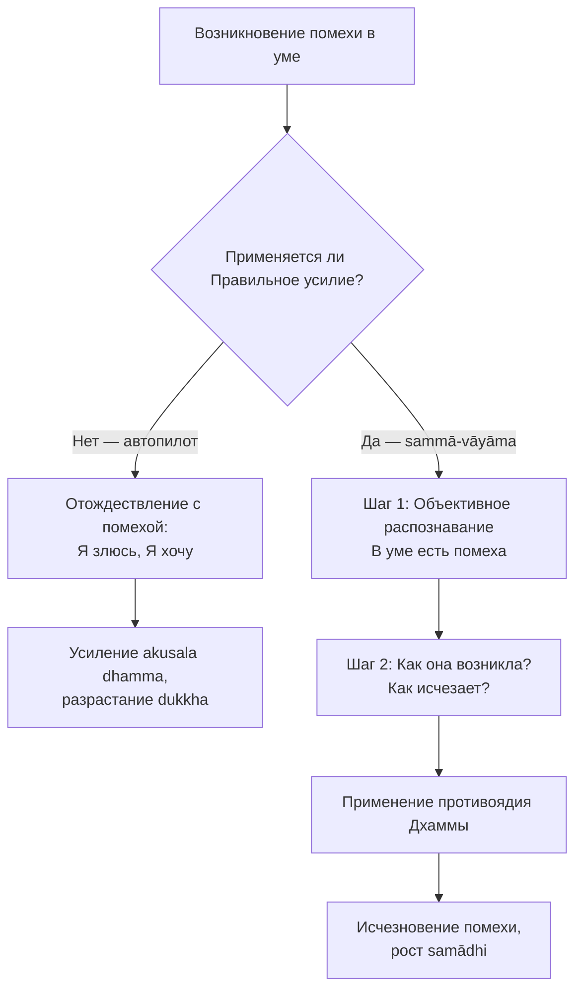
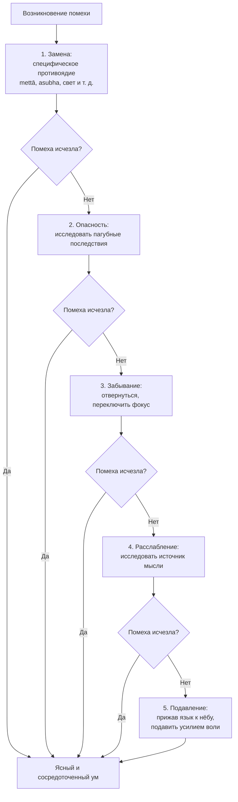

Ум современного человека постоянно атакован внешними стимулами: рекламные образы разжигают желания, новости провоцируют тревогу, многозадачность истощает внимание. Когда человек садится медитировать или пытается сосредоточиться на важной задаче, он сталкивается с глубоким внутренним сопротивлением — фоновой неудовлетворённостью (*dukkha*). В буддийской психологии это состояние есть следствие пяти конкретных ментальных барьеров, известных как **пять помех** (*pañca nīvaraṇāni*).

Буддийская традиция предлагает точный и практичный инструмент — **Правильное усилие** (*sammā-vāyāma*), шестой фактор Благородного восьмеричного пути. Оно учит методично устранять уже возникшие неблагие состояния. Это не борьба с собой и не подавление эмоций, а искусная работа с умом, возвращающая ему естественную ясность.

## Правильное усилие: шестой фактор Благородного пути

**Правильное усилие** (*sammā-vāyāma*) подразделяется на четыре вектора — «Четыре правильных старания»:

1. Предотвращение возникновения ещё не возникших неблагих состояний.
2. **Устранение** уже возникших неблагих состояний — главная тема этой статьи.
3. Культивирование ещё не возникших благих состояний.
4. Поддержание уже возникших благих состояний.

Второй вектор направлен именно против пяти помех. Задача практикующего — с помощью бдительности и мудрости распознать эти барьеры и лишить их силы, создав пространство для внутренней тишины и медитативного сосредоточения (*samādhi*).

## Пять помех (Pañca Nīvaraṇā)

В буддизме нежелательные психические состояния называют «помехами» (`nīvaraṇa`). Их главная «работа» — создавать слепые пятна. Подобно тому как мутная вода, тина или рябь не дают увидеть своё отражение на поверхности озера, каждая из помех искажает восприятие реальности и блокирует достижение *samādhi*. Помехи питаются вниманием и неведением (*avijjā*): когда ум слепо сливается с эмоцией, она усиливается.

Всего помех пять:

1. **Чувственная жажда**, `kāmacchanda` — страстная тяга к приятным объектам: еде, сексу, развлечениям, комфорту. Ум привязывается к приятным образам или блуждает в фантазиях. Возникает из неразумного внимания к привлекательным аспектам объектов.
2. **Недоброжелательность**, `vyāpāda` (или `byāpāda`) — гнев, раздражение, ненависть, обида, неприязнь. Ум зациклен на объектах неприязни или желает причинить вред. Возникает из неразумного внимания к отталкивающим объектам и ситуациям.
3. **Вялость и сонливость**, `thīna-middha` — ментальная неповоротливость и тяжесть, апатия. Тело ощущается тяжёлым, ум затуманен, внимание «прилипает». Возникает из потакания скуке, лени и унынию.
4. **Неугомонность и беспокойство**, `uddhacca-kukkucca` — тревога, сожаление, чувство вины. Ум скачет с мысли на мысль, анализирует прошлые ошибки или конструирует страхи о будущем. Возникает из неразумного размышления о тревожных мыслях.
5. **Сомнение**, `vicikicchā` — нерешительность и скептицизм в отношении учения, учителя или собственной практики. Парализует действие. Возникает из неразумного обдумывания сомнительных вопросов.

Когда человек уделяет внимание образу, связанному с одной из помех, в нём возникают плохие, неблагие мысли, связанные с жаждой, злобой или заблуждением.

## Три шага устранения: алгоритм из Махасатипаттхана сутты

Согласно наставлениям Будды в **Махасатипаттхана сутте** (ДН 22), устранение любой возникшей помехи строится на трёх шагах:

1. **Объективное распознавание.** Практик чётко фиксирует факт наличия помехи: «В уме присутствует чувственное желание». Это выводит помеху из подсознания в поле осознанности (*sati*). Блуждающая мысль нередко утихает сразу, как только её замечают.
2. **Исследование механизма.** Практик наблюдает, как именно это состояние возникло — какой триггер его запустил — и как происходит его исчезновение. Помеха анализируется как временное состояние ума, а не как часть личности.
3. **Предотвращение рецидива.** Ум постигает причину помехи настолько глубоко, что понимает, как не допустить её возникновения в будущем.

> Когда в нём присутствует чувственное желание, он распознаёт, что в нём есть чувственное желание... Он распознаёт, как происходит возникновение невозникшего чувственного желания; он распознаёт, как происходит исчезновение возникшего чувственного желания; он распознаёт, как происходит невозникновение в будущем исчезнувшего чувственного желания.
>
> — ДН 22 Махасатипаттхана сутта

Применяя Правильное усилие, практикующий не бьёт по помехе гневом. Достаточно луча осознанности — под ним любая помеха испаряется, подобно капле воды на раскалённой сковороде.

## Пять методов избавления от помех (Pañca vitakkasanthānabhedā)

Согласно шестому фактору восьмеричного пути, практикующий применяет пять методов-противоядий последовательно: если первый не помог — переходит ко второму. Эти пять методов описаны в **Витаккасантхана сутте** (МН 20).

### 1. Переключение на противоположный образ

Вместо того чтобы уделять внимание нежелательному образу, практикующий переключает внимание на противоположный, благой образ.

> Подобно тому как умелый плотник или его ученик использовал бы небольшой колышек, чтобы выбить, вытащить, извлечь большой колышек, — точно так же, когда монах уделяет внимание некоему образу, из-за этого образа в нём возникают плохие, неблагие мысли… он уделяет внимание некоему иному образу… ум становится внутренне утверждённым, успокоенным, приведённым к единению, сосредоточенным.

Для каждой помехи предусмотрено специфическое противоядие.

**Чувственная жажда `kāmacchanda` → медитация на непостоянство (`anicca`)**

Когда возникает чувственная жажда, ум цепляется за привлекательные аспекты объекта — те, что при контакте вызывают приятные ощущения. При этом всё остальное ум игнорирует. Практика *anicca* возвращает полноту картины: практикующий намеренно переносит внимание на непостоянство, уязвимость и зависимость объекта от условий.

*Пример.* Ум привязан к дорогим часам: они красивые, точные, статусные. Медитация на *anicca* переключает фокус: часы требуют обслуживания, в любой момент могут поцарапаться или разбиться, их могут украсть, а их демонстрация способна вызвать зависть у окружающих. Привязанность держалась на избирательном внимании к привлекательному — *anicca* разрушает эту избирательность.

**Чувственное влечение `kāmarāga` → созерцание непривлекательности (`asubha`)**

Когда ум охвачен влечением к человеку, он фиксируется на форме, воспринимая её как стабильную и желанную. Практика *asubha* предлагает исследовать ту же форму глубже — не с целью вызвать отвращение, а чтобы разрушить иллюзию постоянства.

*Пример.* Ум цепляется за облик молодого человека или девушки двадцати лет с привлекательной внешностью. Практикующий переносит внимание: это тело состоит из костей, кожи и сухожилий. В любой момент оно может заболеть, получить травму или начать стареть. Форма, к которой ум цепляется сейчас, изменится неизбежно. Влечение держалось на иллюзии, будто эта форма — устойчивая основа счастья. *Asubha* обнажает эту иллюзию.

**Недоброжелательность `byāpāda` → медитация любящей доброты (`mettā`)**

Недоброжелательность возникает, когда ум фиксируется на раздражающих или угрожающих аспектах существа или ситуации. Практика *mettā* — систематическое пожелание счастья, здоровья и покоя: сначала себе, затем нейтральным людям, затем тем, кто вызывает трудности. Ненависть и доброжелательность не способны одновременно занимать один и тот же ум.

**Вялость и сонливость `thīna-middha` → пробуждение энергии (`viriya`) и восприятие света**

Лень и апатия возникают, когда ум теряет яркость и склоняется к инертности. Самым прямым противоядием является восприятие света: практикующий визуализирует яркий дневной свет или солнечный диск, вводя в ум ощущение бодрости и ясности. Дополнительно помогают медитация при ходьбе, умывание холодной водой или твёрдое намерение продолжить практику.

**Неугомонность и беспокойство `uddhacca-kukkucca` → осознанность к дыханию (`ānāpānasati`) и безмятежность (`samatha`)**

Беспокойство возникает, когда ум мечется между объектами тревоги. Внимание к дыханию даёт уму простой, нейтральный, ритмичный объект, к которому можно возвращаться снова и снова. Безмятежность *samatha* развивается как качество ума — через повторное успокоение метаний.

**Сомнение `vicikicchā` → исследование Дхаммы (`dhamma-vicaya`)**

Сомнение парализует именно потому, что ум отказывается прояснять неопределённость. Практикующий не подавляет сомнение и не терпит его молча, а исследует: задаёт вопросы, изучает учение, обращается к опытному учителю. Ясные ответы рассеивают туман неопределённости и восстанавливают устойчивость практики.

### 2. Размышление об опасности неблагих мыслей

С помощью этого метода практикующий мобилизует **моральный стыд** (*hiri*) и **нравственный страх** (*ottappa*). Следует исследовать опасность плохих мыслей: «Эти мысли — неблагие, они достойны порицания, они приводят к страданию».

> Подобно тому как юная девушка была бы шокирована, оскорблена, испытала бы омерзение, если бы труп змеи, собаки или человека повесили бы ей на шею, — точно так же… ему следует изучить опасность этих мыслей… ум становится внутренне утверждённым, успокоенным, приведённым к единению, сосредоточенным.

### 3. Забывание неблагих мыслей

Когда неблагая мысль настойчиво требует внимания, практикующий отсекает её, перенаправляя внимание в другое место. Это похоже на то, как человек закрывает глаза или отводит взгляд, чтобы не видеть неприятного зрелища.

> Подобно тому как человек с хорошим зрением, который не хотел бы видеть формы, закрыл бы глаза или отвернулся, — точно так же… он старается забыть эти мысли, старается не уделять им внимание.

### 4. Расслабление неблагих мыслей

Этот метод противоположен предыдущему. Практикующий не отворачивается от нежелательной мысли, а изучает её как внешний объект — исследует характеристики и источник. Неблагая мысль подобна вору: она создаёт проблемы только тогда, когда её действия скрыты. Под пристальным вниманием мысль успокаивается и исчезает.

> Подобно тому как если бы быстро идущий человек подумал: «Зачем я иду быстро? Почему бы мне не пойти медленно?» — и пошёл медленно. Затем подумал: «Зачем я иду медленно? Почему бы мне не остановиться?» И остановился... Делая так, он заменил грубую позу более утончённой. Точно так же… [его ум] становится внутренне утверждённым, успокоенным, приведённым к единению, сосредоточенным.

### 5. Подавление неблагих мыслей

Этот метод применяют только в крайнем случае, когда остальные четыре не помогли. Практикующий энергичным волевым усилием подавляет нежелательную мысль «со стиснутыми зубами и поджатым к нёбу языком».

> Подобно тому как если бы сильный человек схватил слабого за голову или плечи, сбил бы его, сдержал, сокрушил его, — точно так же… [его] ум становится внутренне утверждённым, успокоенным, приведённым к единению, сосредоточенным.

## Дхамма против подавления: принципиальное различие

В западной культуре устранение эмоций нередко путают с их невротическим подавлением. Это принципиально разные процессы.

| Характеристика | Правильное устранение (`sammā-vāyāma`) | Ложное подавление (вытеснение) |
| :--- | :--- | :--- |
| **Отношение к эмоции** | Ясное, бесстрастное признание: «В уме есть недоброжелательность». | Отрицание, стыд: «Я буддист, я не имею права злиться!» |
| **Инструмент** | Исследование причин и применение специфического противоядия Дхаммы. | Насильственное «заталкивание» эмоции вглубь подсознания. |
| **Последствия** | Помеха исчезает с корнем, ум становится лёгким и ясным. | Эмоция накапливается, порождая фоновый стресс и срывы. |

Ум под властью пяти помех подобен решету (*sieve*): пытаться накопить в нём спокойствие и мудрость — всё равно что носить воду в решете. Применяя Правильное усилие, практикующий не давит на «течи» силой воли, а устраняет их причину — неразумное внимание.

## Практика в повседневной жизни

Работа с помехами применима не только на медитационной подушке, но и в гуще социальной жизни.

**Сценарий 1: Критика на совещании и недоброжелательность (`byāpāda`)**

Начальник резко критикует вашу работу. В груди вспыхивает жар, ум захватывает гнев и желание отомстить. Немедленно включите Правильное усилие: констатируйте — «В уме присутствует недоброжелательность». Исследуйте: она возникла из уязвлённого эго. Если пойдёте у неё на поводу, она сожжёт вашу же психику. Применяйте противоядие `mettā` — пожелайте начальнику освободиться от его собственного стресса. Вы не подавили гнев, а лишили его топлива.

**Сценарий 2: Вечерняя апатия перед практикой (`thīna-middha`)**

Вы устали после работы и намеревались медитировать, но ум заволакивает тяжёлый, липкий туман лени и сонливости. Признайте: «В уме есть лень и сонливость». Активируйте противоположный фактор — усердие (*viriya*): встаньте, умойтесь холодной водой, сделайте практику при ходьбе, визуализируйте яркий шар света. Ментальная тяжесть рассеивается.

### Заключение и Литература

Благодаря отмечанию помех и целенаправленному применению пяти методов человек становится хозяином путей мыслей. Пять помех — не врождённые дефекты личности, а безличные ментальные факторы, подлежащие методичному устранению. Практикующий, овладевший шестым фактором Пути, перестаёт быть рабом своих реакций. Систематически устраняя корни помех — доброй волей против гнева, светом против сонливости, спокойствием против тревоги — он расчищает путь к глубокому медитативному сосредоточению и окончательному освобождению.

> Оставив эти пять помех, загрязнения ума, которые ослабляют мудрость... он очищает свой ум от сомнений... [и] достигает первой джханы...
>
> — МН 39 Маха-ассапура сутта

**Литература:**

*Mahā-assapura Sutta* (МН 39). (n.d.). *Большая сутта об Ассапуре*. Theravada.ru. https://theravada.ru/Teaching/Canon/Suttanta/Texts/mn39-maha-assapura-sutta-sv.htm

*Mahāsatipaṭṭhāna Sutta* (ДН 22). (n.d.). *Большая сутта об основах осознанности*. Theravada.ru. https://theravada.ru/Teaching/Canon/Suttanta/Texts/dn22-mahasatipatthan-sutta-sv.htm

*Vibhaṅga Sutta* (СН 45.8). (n.d.). *Анализ Благородного восьмеричного пути*. Theravada.ru. https://theravada.ru/Teaching/Canon/Suttanta/Texts/sn45_8-vibhanga-sutta-sv.htm

*Vitakkasanthāna Sutta* (МН 20). (n.d.). *Сутта об устранении помыслов*. Theravada.ru. https://theravada.ru/Teaching/Canon/Suttanta/Texts/mn20-vitakkasanthana-sutta-sv.htm

---

Вы сидите в медитации, и ум внезапно охватывает сильная неугомонность и беспокойство (`uddhacca-kukkucca`) из-за нерешённой финансовой проблемы. Желая строго следовать «Правильному усилию», вы крепко сжимаете челюсти, задерживаете дыхание и мысленно кричите на себя: «Я должен перестать думать об этом! Я запрещаю себе беспокоиться!»

Опираясь на алгоритм Махасатипаттхана сутты и таблицу различий между Дхаммой и психологическим подавлением, объясните: почему ваше действие является грубой ошибкой и нарушением Правильного усилия (*sammā-vāyāma*)? Какое именно противоядие из первого метода вам следовало применить — и почему оно устраняет неугомонность экологично?
