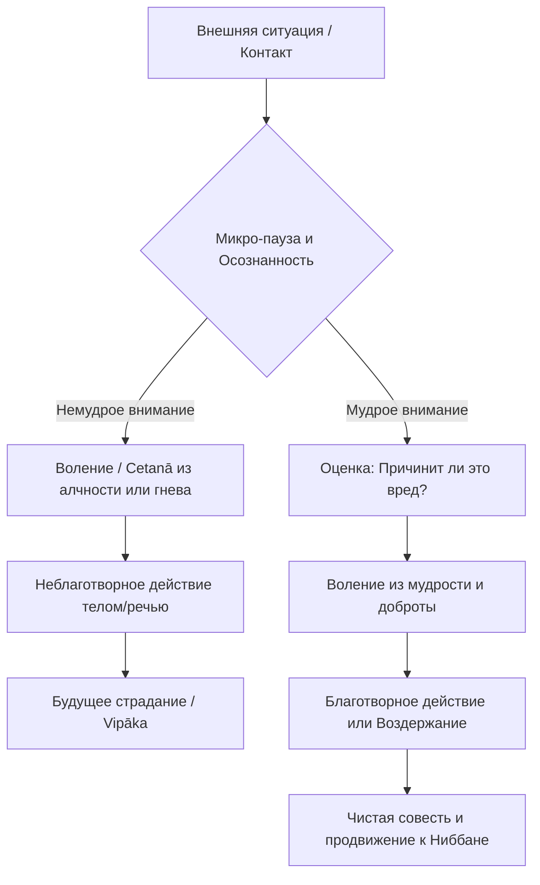

Каждый из нас рано или поздно сталкивается с мучительным чувством экзистенциальной несправедливости. Мы можем вести себя безупречно, усердно трудиться, но внезапно терять здоровье или терпеть крах, в то время как другие достигают успеха, казалось бы, без малейших этических усилий. Это порождает глубокую тревогу, гнев и ощущение себя беспомощной жертвой слепого случая или жесткой социальной системы.

Учение Будды о камме предлагает радикальный и глубоко терапевтический выход из этого состояния бессилия. Возвращая нам ясное понимание причинно-следственных связей, это учение вручает нам штурвал от нашей собственной судьбы. Понимая, что наше будущее формируется не мистическим роком, а нашими ежесекундными выборами, мы перестаем тратить энергию на обиды и обретаем ключи к подлинному освобождению ума.

## Закон каммы: Архитектор нашей реальности

В буддизме палийское слово «камма» (*kamma*) буквально переводится как «действие». Однако этот термин имеет строго определенный психологический смысл, кардинально отличающийся от бытового понимания. Будда четко отождествлял камму исключительно с нашим волевым намерением (*cetanā*).

> «Монахи, именно воление я называю каммой. Обладая намерением, человек совершает действия телом, речью или умом».
>
> — ([АН 6.63](https://theravada.ru/Teaching/Canon/Suttanta/Texts/an6_63-nibbedhika-sutta-sv.htm))

Главная «задача» этого учения — развязать ментальный узел фатализма. Закон каммы гласит, что наши волевые действия обладают объективной этической силой, которая неизбежно возвращается к нам в виде соответствующих результатов. Признавая, что мы являемся полноправными наследниками своих действий, мы берем на себя 100% ответственности за свой духовный прогресс. Невольные, бессознательные и случайные действия не являются каммой, поскольку в них отсутствует воля — главный фактор, создающий кармический отпечаток.

## Механика нравственной причинности

Вся человеческая активность и формирование судьбы реализуются через три «двери действия» (*kammadvāra*): тело, речь и ум. Чтобы понять механику этого процесса, мы опираемся на три ключевых аспекта:

1.  **Корни действий:** Камма является неблаготворной (*akusala*), если она произрастает из трех ядовитых корней ума: жадности (*lobha*), ненависти (*dosa*) и заблуждения (*moha*). Она является благотворной (*kusala*), когда эти корни отсутствуют, проявляясь позитивно как щедрость, доброжелательность и мудрость.
2.  **Десять путей действия:** Опираясь на эти корни, формируются десять неблаготворных путей: три телесных (убийство, воровство, сексуальные проступки), четыре речевых (ложь, клевета, грубость, пустословие) и три умственных (алчность, недоброжелательность, ложные воззрения). Осознанный волевой отказ от них формирует десять чистых, благотворных путей каммы.
3.  **Созревание плодов (*vipāka*):** Каждое волевое действие оставляет отпечаток в ментальном континууме в виде дремлющего потенциала. Плоды этих действий созревают в три различных периода: в течение текущей жизни, в течение следующей жизни (определяя характер перерождения) или в последующих жизнях, когда сложатся подходящие условия.

## Ментальные модели и границы

Для наглядного описания процесса накопления и созревания каммы в традиции используется классическая **земледельческая метафора**. Будда говорил, что камма — это поле, сознание — это семя, а жажда (*taṇhā*) — это влага, необходимая для того, чтобы сознание могло укорениться и прорасти в новой сфере существования. Без влаги слепой жажды кармическое семя не прорастет, и болезненный круг перерождений остановится.

Также полезна **метафора фруктового дерева** (из диалогов царя Милинды). Вы не можете найти плод манго внутри ствола дерева зимой. Но когда наступает сезон и складываются благоприятные условия (солнце, вода), дерево приносит плод. Так же и камма дремлет в нашем психофизическом потоке, ожидая момента для созревания.

Для правильной практики критически важно отличать Дхамму от искаженных мирских воззрений:

| Концепция | Правильное понимание Дхаммы | Ложное или мирское восприятие (Фатализм) |
| :--- | :--- | :--- |
| **Природа судьбы** | Динамичный процесс. Мы обладаем моральной свободой и формируем будущее в настоящем. | Строгая предопределенность: существа лишены воли и подчиняются слепому року. |
| **Источник опыта** | Камма — важный, но не единственный природный закон. Не любая боль вызвана прошлыми поступками. | Абсолютно всё, что мы чувствуем (болезни, аварии) — это мистическая расплата за прошлое. |
| **Моральный Судья** | Объективный закон причинности, подобный гравитации, встроенный в ткань природы. | За каждым поступком стоит некая высшая сущность, назначающая награды и наказания. |

## Практическое руководство: Дхамма в действии

Понимание каммы — это мощный рабочий инструмент для трансформации наших автоматических реакций.

### Сценарии для мирян

  * **Ситуация (Случайная ошибка):** Из-за сильной усталости вы случайно удалили важную рабочую базу данных или наступили на насекомое. Возникает жуткое чувство вины и самобичевание.

  * **Действие Дхаммы:** Вспомните, что случайные, ненамеренные действия не являются каммой. Вы не создали карму разрушения или убийства, так как не было воления (*cetanā*). Вы прагматично признаете техническую ошибку, но не позволяете уму скатываться в самоуничижение.

  * **Результат:** Вы сохраняете ясность ума. Предотвращается создание новой, неблаготворной ментальной каммы на основе корня гнева к самому себе.

  * **Ситуация (Столкновение интересов):** В транспорте кто-то грубо вас толкает, или коллега в сети хвастается незаслуженным успехом. Внутри вспыхивает импульс толкнуть в ответ или написать язвительный комментарий.

  * **Действие Дхаммы:** Вы перехватываете формирование воли. Вы осознаете, что ответная агрессия или зависть — это неблаготворная камма, которая неизбежно принесет страдание вам самим. Вы делаете осознанный выбор промолчать или практикуете сорадование.

  * **Результат:** Ваш ум остается чистым от яда. Вы разрываете кармическую цепь ненависти, не позволяя внешнему раздражителю заставить вас создать причину для будущей боли.

### Алгоритм перехвата намерения

## Итог и источники

Учение о камме — это величайшая декларация нашей фундаментальной свободы. Мы не в силах изменить свое прошлое, и нам, так или иначе, придется столкнуться с созревшими плодами уже совершенных действий. Однако прямо сейчас, контролируя свои намерения, мы являемся полноправными творцами своей реальности. Взяв под контроль волю (*cetanā*), мы перестаем быть беспомощными жертвами сансары и становимся кузнецами собственного абсолютного освобождения.

**Источники для глубокого изучения:**

  * ([АН 6.63: Ниббедхика-сутта](https://theravada.ru/Teaching/Canon/Suttanta/Texts/an6_63-nibbedhika-sutta-sv.htm)) — О природе каммы как волевого намерения.
  * ([МН 135: Чулакаммавибханга-сутта](https://theravada.ru/Teaching/Canon/Suttanta/Texts/mn135-cula-kammavibhanga-sutta-sv.htm)) — Малое наставление об анализе каммы и её плодах.

-----

**Проверка понимания:**
Представьте, что вы ведете автомобиль. Вы едете с разрешенной скоростью, строго соблюдаете все правила дорожного движения и внимательно следите за дорогой. Внезапно из кустов прямо под колеса бросается собака, и, несмотря на экстренное торможение, вы случайно сбиваете её. Вы глубоко расстроены этим фактом и испытываете жалость к животному.

Опираясь на буддийское определение каммы как волевого намерения (*cetanā*), создали ли вы в этот момент неблаготворную камму убийства, которая в будущем созреет в виде ваших собственных страданий? Почему да или почему нет?
