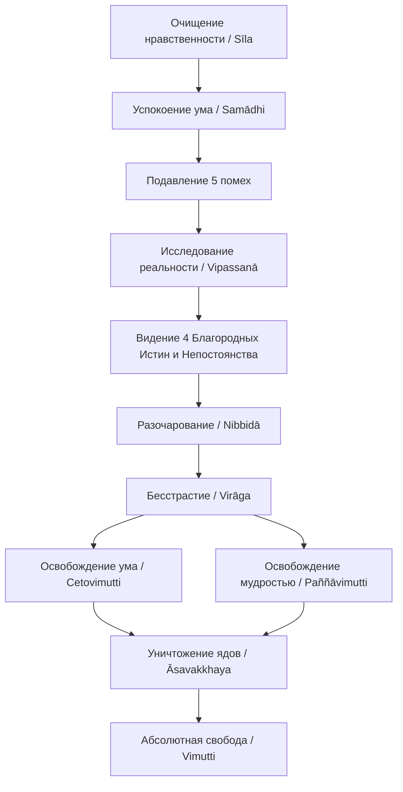

Современная жизнь часто напоминает бесконечный бег в лабиринте: мы гонимся за успехом, отношениями и материальным комфортом, надеясь, что обретение этих вещей принесет нам окончательный покой. Но когда мы достигаем желаемого, радость быстро угасает, сменяясь страхом потери и новой жаждой. Мы смотрим на мир через плотные фильтры наших ожиданий и эгоистичных желаний, что неизбежно ведет к разочарованиям и глубокой неудовлетворенности (*dukkha*). Пытаясь обрести свободу, мы меняем работу или уезжаем в отпуск, но эти внешние побеги дают лишь временную передышку. Настоящая тюрьма находится внутри нас самих.

Учение Будды не предлагает нам просто смириться с этим стрессом или убежать от него в фантазии. Оно указывает путь к полному и окончательному выходу — освобождению (*vimutti*). Это не физический уход в мистическую сферу, а глубинная структурная перестройка сознания. Сбрасывая путы неведения и жажды, мы обретаем способность оставаться в самом центре бурной жизни, сохраняя абсолютную, нерушимую внутреннюю свободу и ясность.

## Освобождение: Сброс оков искаженного восприятия

**Освобождение** (*vimutti*) — это высшая цель всей буддийской практики, означающая полное избавление ума от цепляния, загрязнений и цикла перерождений.

В обыденном состоянии наш ум связан «узлами», которые искажают реальность. Как только мы видим что-то привлекательное, в нас мгновенно вспыхивает желание обладать этим, а если объект нам неприятен — возникает отторжение. Главная задача *vimutti* — навсегда очистить ум от трех фундаментальных «моральных ядов» (*āsava*): жажды чувственных удовольствий (*kāmāsava*), жажды нового существования (*bhavāsava*) и фундаментального неведения (*avijjāsava*).

Пока эти яды присутствуют в уме, мы остаемся рабами автоматических реакций. Когда ум достигает освобождения, он избавляется от уз, развращающих красоту мира, и начинает видеть вещи такими, какие они есть, без мутных фильтров эгоистичных интересов.

## Механика освобождения: Три ступени прозрения

Освобождение не падает на нас внезапно; оно является закономерным результатом последовательной тренировки. В суттах этот процесс описывается строгой причинно-следственной связью:

1.  **Разочарование (*nibbidā*):** Это не эмоциональная депрессия, а мудрое отворачивание от обусловленного существования. Ясно видя, что все формы и чувства непостоянны и подвержены разрушению, ученик перестает искать в них надежное прибежище.
2.  **Бесстрастие (*virāga*):** Высшая стадия прозрения, на которой страстная жажда и привязанность к миру полностью угасают. Это отсечение самой причины страдания.
3.  **Освобождение (*vimutti*):** Когда жажда исчезает, ум освобождается. За этим неизбежно следует «знание и видение освобождения» — непоколебимая уверенность в том, что круг перерождений остановлен и всё, что должно было быть сделано, сделано.

Сам процесс охватывает два аспекта: **освобождение ума** (*cetovimutti*), достигаемое через глубокое сосредоточение и подавление омрачений, и **освобождение мудростью** (*paññāvimutti*), наступающее при полном искоренении неведения.

Архитектура освобождения не является однородной; традиция выделяет три типа практикующих:
*   *Освобождение через мудрость (*paññāvimutta*):* Разрушение ядов ума (*āsava*) благодаря острой мудрости, без обязательного достижения высших джхан.
*   *Двойное освобождение (*ubhatobhāgavimutta*):* Овладение глубочайшими уровнями спокойствия (восьмью освобождениями) с последующим искоренением загрязнений мудростью.
*   *Освобождение через веру (*saddhāvimutta*):* Опора на глубокую преданность и веру при практике Дхаммы.

## Ментальные модели и границы

Для понимания *vimutti* мастер Аджан Сумедо приводит пример с восприятием красоты. Обычно, видя прекрасный цветок, мы попадаем в ловушку эгоизма, желая присвоить эту красоту. Истинное освобождение позволяет наслаждаться красотой природы или людей без желания контакта, оставляя вещи такими, какие они есть.

**Модель «Выпущенная из рук змея»:** Представьте человека, который в темноте по ошибке схватил ядовитую змею, думая, что это веревка. Пока он держит ее, он в опасности. Вспышка молнии (мудрость, *paññā*) освещает реальность. Поняв, *что* он держит, человек не уговаривает себя отпустить змею; его рука разжимается автоматически. *Vimutti* — это естественное разжатие ума, когда он распознает ядовитую природу цепляния.

Важно понимать границы истинной свободы:

| Характеристика | Истинное освобождение (*vimutti*) | Мирское равнодушие / Эскапизм |
| :--- | :--- | :--- |
| **Отношение к реальности** | Ясное видение вещей без фильтров неведения, бдительное присутствие без цепляния. | Игнорирование реальности, бегство от проблем (смена работы, алкоголь, фантазии). |
| **Отношение к красоте** | Искренняя радость и восхищение без жажды обладания или присвоения. | Либо страстное желание (*taṇhā*), либо циничный отказ от восприятия прекрасного. |
| **Корень состояния** | Мудрость (*paññā*) и полное искоренение неведения (*avijjā*). | Отторжение (*dosa*) текущей ситуации, скука или страх. |
| **Результат в уме** | Знание своей свободы, разрушение уз, непоколебимый покой. | Эмоциональное выгорание, скрытый страх, сохранение латентных омрачений. |

## Практическое руководство: Дхамма в действии

Элементы этой свободы можно интегрировать в повседневную жизнь.

**Сценарий 1: Восхищение без привязанности**
*   *Ситуация:* Вы встречаете невероятно харизматичного человека или видите роскошную вещь. Ум строит фантазии, возникает вожделение и чувство нехватки.
*   *Действие Дхаммы:* Примените мудрость. Признайте красоту формы, но отсеките желание сделать её «своей». Осознайте, что попытка присвоить непостоянную форму неизбежно приведет к страданию.
*   *Результат:* Вы наслаждаетесь эстетикой с чистым сердцем, без искажающей призмы эгоизма. Ум остается спокойным и свободным.

**Сценарий 2: Потеря статуса или рабочий кризис**
*   *Ситуация:* Проект срывается по вине коллег, или вы теряете должность. Ум кричит: «Моя жизнь разрушена!» или заперт в клетке обвинений и гнева.
*   *Действие Дхаммы:* Исследуйте свои чувства. Увидьте, что они подобны горящему пламени. Откажитесь от цепляния за уязвленное эго и статус. Позвольте возникнуть мудрому разочарованию (*nibbidā*).
*   *Результат:* Как только вы перестаете цепляться за идею «Я есть мой статус», возникает бесстрастие и микро-освобождение ума (*cetovimutti*). Вы решаете проблему хладнокровно, не разрушая нервную систему.

**Алгоритм малого освобождения:**
1.  **Диагностика оков:** В любой стрессовой ситуации спросите себя: «За какую идею или желание мой ум сейчас судорожно цепляется?».
2.  **Мудрое отражение (*yoniso manasikāra*):** Напомните себе, что этот объект цепляния непостоянен и не принесет прочного счастья. Это змея, а не веревка.
3.  **Разжатие руки:** Сделайте выдох и сознательно расслабьте ментальную хватку, позволив вещам быть такими, какие они есть.

## Главный вывод и источники

Освобождение (*vimutti*) — это не посмертная награда и не мистический подарок небес, а живой опыт кристально чистого сознания, закономерный результат правильной тренировки ума. Ежедневно применяя нравственность, сосредоточение и проницательность, мы ослабляем хватку своих страхов и желаний. Сбрасывая покровы жажды и неведения, мы перестаем быть заложниками реакций. Освобожденный ум способен взаимодействовать с миром и воспринимать его красоту, оставаясь абсолютно независимым, непоколебимым и умиротворенным.

> «Когда сосредоточенный ум стал таким очищенным, ясным, безупречным, лишенным загрязнений... этот монах направляет и склоняет свой ум к знанию прекращения моральных ядов... Ум этого монаха, который так знает и так видит, освобождается от яда чувственных удовольствий (kāmāsava), от яда существования (bhavāsava) и от яда неведения (avijjāsava). Когда он освобожден, возникает знание об освобождении».
>
> — ([МН 51: Кандарака-сутта](https://theravada.ru/Teaching/Canon/Suttanta/Texts/mn51-kandaraka-sutta-sv.htm))

**Источники для изучения:**
*   [СН 12.23: Упаниса-сутта](https://theravada.ru/Teaching/Canon/Suttanta/Texts/sn12_23-upanisa-sutta-sv.htm) — О причинно-следственной связи к освобождению.
*   [СН 22.61: Адитта-сутта](https://theravada.ru/Teaching/Canon/Suttanta/Texts/sn22_61-aditta-sutta-sv.htm) — Об уме, подобном пламени.
*   [ДН 2: Саманняпхала-сутта](https://theravada.ru/Teaching/Canon/Suttanta/Texts/dn2-samannaphala-sutta-01-sirkin.htm) — О плодах отшельничества и достижении освобождения ума.
*   [АН 9.34: Ниббана-сутта](https://theravada.ru/Teaching/Canon/Suttanta/Texts/an9_34-nibbana-sutta-sv.htm) — О счастье Ниббаны и освобождении.
*   [Пуггалапаньнятти](https://suttacentral.net/pli-abhidhamma/puggalapannatti) — Описание освобожденных двумя путями и освобожденных мудростью.

-----

**Проверка понимания:**
Представьте, что опытный практик достиг очень глубоких стадий медитации (джхан) и может пребывать в них часами, наслаждаясь абсолютным покоем. Однако, когда он возвращается к обычным делам, он по-прежнему испытывает легкое раздражение, если дела идут не по плану, и тайно гордится своими медитативными успехами перед другими.

Или представьте другого практикующего, который живет в лесу, избегает людей и говорит: *«Мир отвратителен. Я закрываю глаза на любую красоту, потому что всё это — приманка Мары. Я подавил в себе все чувства»*.

Опираясь на концепции *cetovimutti* и *paññāvimutti* (и правильного отношения к красоте), скажите: достигли ли эти люди окончательного освобождения (*vimutti*)? Какие именно фундаментальные «яды» (*āsava*) или фильтры неведения они не смогли искоренить, и какого важнейшего элемента практики им не хватает для полной свободы?
