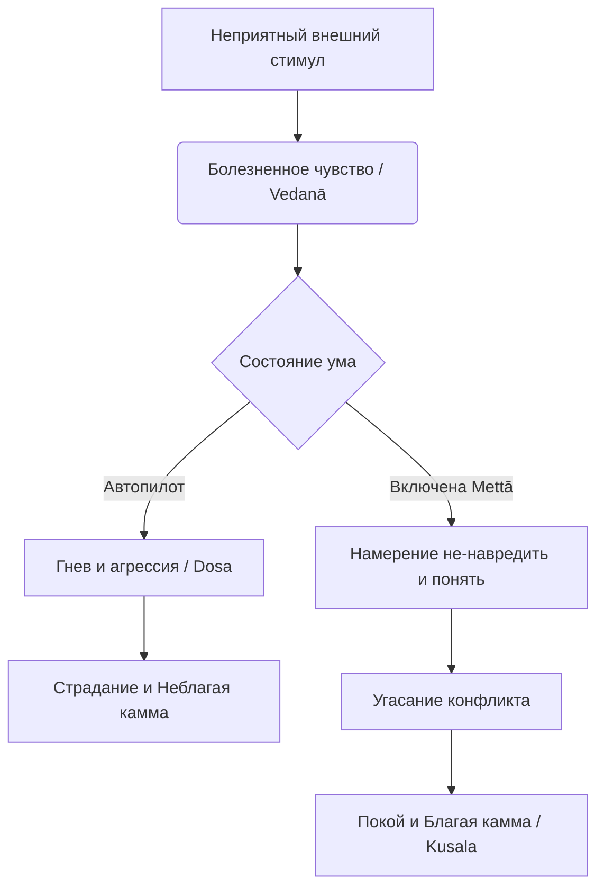

Ежедневная рутина в переполненном мегаполисе, напряжение на рабочем месте, социальные сети и политические кризисы — всё это погружает нас в среду непрерывной конкуренции и агрессии. Мы привыкли реагировать на этот постоянный стресс раздражением и защитной злобой, изолируя себя от других и воспринимая их как угрозу. Однако гнев работает как кислота: он разъедает сосуд, в котором хранится, неизбежно ведя к внутреннему напряжению, выгоранию и глубоким страданиям (*dukkha*).

Учение Будды предлагает радикально иной, исцеляющий подход. Вместо того чтобы пытаться изменить неконтролируемый внешний мир или подавлять свои эмоции, мы можем использовать мощный инструмент для разрушения стен эгоизма — практику любящей доброты (*mettā*). Это не пассивная сентиментальность, а строгий и систематический метод трансформации ума, который создает внутри нас безопасное пространство, неуязвимое для внешних бурь.

## Любящая доброта: Активное противоядие от враждебности

**Любящая доброта** (*mettā*) — это интенсивное чувство бескорыстной любви, глубокое и безусловное пожелание истинного счастья, безопасности и благополучия себе и всем живым существам. Само палийское слово происходит от слова «друг» (*mitta*). Эта практика является первой из Четырех Божественных Обителей (*brahmavihārā*) — высочайших состояний ума.

Главная «работа» метты в буддийской психологии — служить прямым и абсолютным противоядием от недоброжелательности (*byāpāda*) и гнева (*dosa*). Когда мы испытываем злобу, ум сужается и фиксируется на недостатках объекта. Любящая доброта расслабляет эту хватку, позволяя реагировать на трудности не из состояния уязвленного эго, а из состояния внутренней полноты. Будда указывал, что погружение в это состояние приносит одиннадцать благих плодов (от спокойного сна до защиты от опасностей) и обеспечивает быстрое сосредоточение ума (*samādhi*), которое служит основой для медитации прозрения (*vipassanā*).

## Архитектура любви и механика ума

Практика развития любящей доброты (*mettā-bhāvanā*) не полагается на случайные всплески хорошего настроения; она тренируется систематически и опирается на три ключевых этапа:

1.  **Любовь к себе:** Практика всегда начинается с направления доброты на самого себя. Искренняя любовь к другим невозможна, если мы полны скрытого недовольства собой, порождающего враждебность к миру.
2.  **Эмпатический сдвиг:** Расширение доброты происходит через изменение чувства идентичности. Мы осознаем, что все живые существа имеют базовое стремление быть счастливыми, и используем собственное желание счастья как ключ к пониманию других.
3.  **Безграничное излучение:** Мы последовательно направляем пожелание блага на разные категории людей (дорогой человек, нейтральный, враг). Когда барьеры рушатся, ум излучает доброту во всех направлениях без ограничений.

**Механика ума:** Страдание всегда запускается в момент сенсорного контакта (*phassa*). Кто-то произносит резкое слово — возникает неприятное чувство (*vedanā*). Невежественный ум мгновенно реагирует на него гневом, создавая неблагую карму. Метта перехватывает этот процесс: приучив ум к вибрации доброжелательности, мы заменяем автоматическую реакцию отторжения на осознанное пожелание блага, и гнев просто не находит почвы для возникновения.

## Ментальные модели и границы

В суттах Будда использует великие метафоры для описания этой практики.

**Модель безграничного материнского сердца:**
> Подобно тому как мать защищала бы своего сына, своего единственного сына, ценой собственной жизни, так же следует взращивать безграничный ум ко всем живым существам.
>
> — ([Сн 1.8: Метта сутта](https://theravada.ru/Teaching/Canon/Suttanta/Texts/snp1_8-metta-sutta-sv.htm))

**Модель чистой воды:** Метта подобна чистой, прохладной воде, которую льют на пылающий огонь гнева. Вода не ненавидит огонь; ее природа просто заключается в том, чтобы остужать и очищать. Точно так же практикующий остужает «пожар» в собственном уме и в уме собеседника.

Обычному человеку легко спутать истинную любящую доброту с мирскими привязанностями (слабохарактерностью или страстью). Буддийская психология проводит строгую границу:

| Характеристика | Истинная любящая доброта (*mettā*) | Чувственная любовь / Привязанность (*pema*) |
| :--- | :--- | :--- |
| **Природа чувства** | Бескорыстное, безусловное пожелание блага всем существам. | Эгоистичная потребность в подкреплении эго, ожидание взаимности. |
| **Направленность** | Универсальна, просторна, свободна от цепляния. | Сужена, избирательна, полна тревоги потерять объект. |
| **Результат** | Глубокий покой, отсутствие вражды, свобода от эгоизма. | Обида, страх потери, превращение «любви» в ненависть при изменениях. |

## Практическое руководство: Метта в повседневности

**Сценарий 1: Конфликт и критика на работе**

  * *Ситуация:* Коллега ведет себя токсично, несправедливо критикует вас и вызывает гнев. Внутри вспыхивает желание унизить его в ответ.
  * *Действие Дхаммы:* Вместо ответной агрессии, сделайте паузу. Посмотрите на его поведение через эмпатический сдвиг: поймите, что его язвительность вызвана его собственными страданиями и завистью. Мысленно пожелайте ему освободиться от этого напряжения.
  * *Результат:* Ваша враждебность стихает. Вы отвечаете профессионально и строго по фактам, не создавая негативную карму речи и оставаясь внутренне неуязвимым.

**Сценарий 2: Выгорание и самокритика**

  * *Ситуация:* Вы совершили ошибку и безжалостно ругаете себя, чувствуя внутреннее опустошение.
  * *Действие Дхаммы:* Вы делаете паузу и направляете *mettā* внутрь себя. Вы относитесь к себе как к третьему лицу, искренне желая себе блага, мысленно произнося: «Пусть я буду счастлив, пусть я буду здоров».
  * *Результат:* Жесткая корка самокритики плавится, ум смягчается, и появляется энергия для симпатии к окружающим.

**Алгоритм формальной медитации (Радиальное распространение):**
Сядьте в удобную позу и последовательно излучайте намерение блага:

1.  **На себя:** «Пусть я буду счастлив, свободен от вражды и страданий».
2.  **На друга / Благодетеля:** Представьте человека, к которому легко испытываете тепло.
3.  **На нейтрального человека:** Вспомните случайного прохожего или кассира из магазина.
4.  **На трудного человека (Врага):** Растворите границы, понимая, что его злоба — это лишь его собственное невежество (*avijjā*).
5.  **Безгранично:** Направьте метту во все стороны света на всех живых существ.

## Резюме и источники

Любящая доброта (*mettā*) — это не слабость и не пассивное соглашательство. Это колоссальная духовная броня, которая разрушает ненависть, успокаивает ум и делает нас неуязвимыми для внешних ментальных атак. Практикуя ее методично, мы не только создаем социальную гармонию, но и возводим надежный фундамент для развития мудрости (*paññā*) и достижения абсолютной свободы.

> «Монахи, какие бы ни существовали основания для совершения заслуг, ведущих к \[благому] перерождению, все они не стоят и шестнадцатой части освобождения ума посредством любящей доброты. Освобождение ума посредством любящей доброты сияет, светит и лучится, превосходя их все».
>
> — ([Ит 27](https://suttacentral.net/iti27/ru/sv))

**Источники для изучения:**

  * ([МН 99: Субха-сутта](https://theravada.ru/Teaching/Canon/Suttanta/Texts/mn99-subha-sutta-sv.htm)) — О развитии четырех божественных обителей.
  * ([Сн 1.8: Метта-сутта](https://theravada.ru/Teaching/Canon/Suttanta/Texts/snp1_8-metta-sutta-sv.htm)) — Знаменитая сутта о метте и образе материнской любви.
  * ([Ит 27: Меттабхавана-сутта](https://suttacentral.net/iti27/ru/sv)) — О ценности развития любящей доброты.
  * ([МН 21: Какачупама-сутта](https://theravada.ru/Teaching/Canon/Suttanta/Texts/mn21-kakacupama-sutta-sv.htm)) — Пример с пилой и сохранение метты при жестоком обращении.

-----

**Проверка понимания:**
Представьте, что вы практикуете метту по отношению к человеку, который намеренно и систематически причиняет вам вред на работе. В какой-то момент ваш ум бунтует: *«Желая ему счастья, я тем самым оправдываю его злодейства, проявляю слабость и позволяю ему дальше безнаказанно вредить мне\!»*.

Опираясь на буддийское понимание метты и кармы, объясните: означает ли любящая доброта (*mettā*) пассивное согласие со злом или отказ от самозащиты? Как правильно разделить безусловное пожелание блага уму этого человека и ваши практические, профессиональные действия по пресечению его вредоносных поступков?
