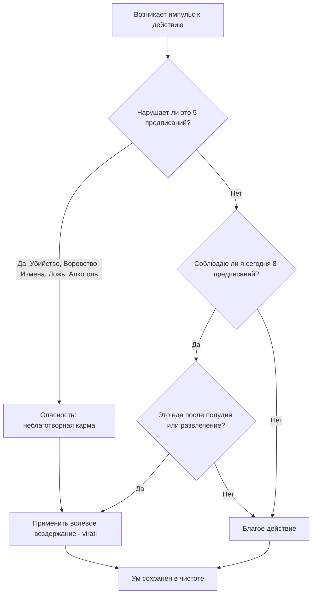

Люди часто пытаются найти душевный покой, сразу погружаясь в медитацию или уезжая на ретриты. Однако многие обнаруживают, что стоит им закрыть глаза, как ум превращается в бурлящий котел тревог, сожалений и бесконечного планирования. Мы пытаемся успокоить ум, не устранив источник его постоянного раздражения — наши собственные неосознанные и неэтичные поступки.

Учение Будды предлагает предельно прагматичный подход: невозможно построить ясное и спокойное сосредоточение на фундаменте из чувства вины и конфликтов. Этим фундаментом, защищающим ум от хаоса, является нравственная дисциплина (*sīla*). Для мирян она кристаллизуется в двух наборах тренировочных правил: Пяти предписаниях для повседневной жизни и Восьми предписаниях для дней интенсивной практики.

## Нравственность: Щит ума и великий дар

**Пять предписаний** (*pañca-sīla*) и **Восемь предписаний** (*aṭṭhaṅga-sīla*) — это не божественные заповеди, навязанные извне, за нарушение которых грозит сверхъестественная кара. В буддизме это добровольно принимаемые правила обучения, которые служат своеобразной гигиеной для нашего ума.

Главная «работа» этих предписаний заключается в том, чтобы перекрыть каналы, через которые мы создаем неблаготворную карму и причиняем вред себе и окружающим. Их психологическая задача — устранить причину жгучего раскаяния. Будда называл эти предписания «великими, первозданными дарами». Отказываясь от насилия, воровства или лжи, практикующий дарует бесчисленному множеству существ свободу от страха, и, как следствие, сам начинает упиваться безграничной безопасностью.

## Три опоры очищения и механика ума

В практике мирянина нравственная дисциплина разворачивается на нескольких уровнях, формируя надежную архитектуру для духовного роста.

**1. Базовая защита: Пять предписаний (*pañca-sīla*)**
Это минимальный стандарт этики, который поддерживает человеческое достоинство и предотвращает перерождение в низших мирах. Благородный ученик сознательно отказывается от:

1.  Отнятия жизни (убийства любых существ).
2.  Взятия того, что не дано (воровства).
3.  Нецеломудрия (неблагого сексуального поведения, такого как прелюбодеяние).
4.  Лживой речи (включая сплетни и грубость).
5.  Употребления вина, одурманивающих веществ и напитков, ведущих к беспечности.

**2. Углубленное очищение: Восемь предписаний (*uposatha*)**
В дни лунного цикла или во время ретритов миряне соблюдают день Упосатхи. Это временный переход от мирского потребления к отречению. К первым пяти правилам добавляются новые ограничения:

  * Третье предписание превращается в полный отказ от любой сексуальной активности (абсолютное целомудрие).
  * 6.  Отказ от принятия твердой пищи после полудня (до рассвета следующего дня).
  * 7.  Отказ от танцев, пения, развлекательных зрелищ, а также использования парфюмерии и косметики.
  * 8.  Отказ от использования высоких, мягких и роскошных кроватей (сон на простом коврике).

**3. Механика ума: Волевое намерение (*cetanā*)**
Нравственность — это внутренний волевой акт. Если вы случайно наступили на насекомое, не заметив его, вы не нарушили предписание, так как отсутствовала воля (*cetanā*), являющаяся главным фактором создания неблагой кармы. Принимая Восемь предписаний, мирянин настраивает ум на подражание полностью просветленным (арахантам), что ослабляет жажду чувственных удовольствий и порождает лучезарную радость безупречности.

## Ментальные модели и границы

**Сравнительная модель (Защитная ограда):** Классическая ментальная модель для понимания *sīla* — это надежная ограда вокруг цветущего сада. Ограда (предписания) не ограничивает рост цветов (вашего ума); она защищает их от вторжения диких животных (гнев, алчность и чувство вины), которые могут всё растоптать.

Другая аналогия — **фундамент и леса**. Пять предписаний — это бетонный фундамент духовного дома, а Восемь предписаний — строительные леса, возводимые на время для безопасной постройки верхних этажей (сосредоточения и мудрости).

Важно четко понимать границы предписаний, чтобы не впасть в догматизм:

| Характеристика | Буддийские предписания (*sīla*) | Светская мораль / Догматизм |
| :--- | :--- | :--- |
| **Основа** | Прагматичный инструмент очищения ума, понимание закона кармы. | Страх социального наказания или божественные заповеди. |
| **Отношение к интоксикантам** | Полный отказ, так как алкоголь — корень потери контроля. | Допускает «умеренное» употребление. |
| **Отношение к ошибкам** | Ошибка — повод для пересмотра намерений и мягкого обновления практики. | Ошибка — это грех, требующий невротической вины и самобичевания. |

## Практическое руководство: Этика в суете дней

Для современного человека предписания являются идеальным инструментом навигации в сложном обществе.

**Сценарий 1: Корпоративная вечеринка (Пять предписаний)**

  * **Ситуация:** На пятничном корпоративе коллеги настойчиво предлагают выпить, чтобы «снять стресс».
  * **Действие Дхаммы:** Вы твердо опираетесь на пятое предписание. Осознавая, что алкоголь ведет к потере бдительности, вы делаете волевой выбор и вежливо отказываетесь, выбирая сок.
  * **Результат:** Утром ваш ум ясен, вы не испытываете разрушительного чувства вины за сказанные глупости, и вы сохраняете энергию для медитации.

**Сценарий 2: Выходной день (Восемь предписаний)**

  * **Ситуация:** У вас свободный выходной. Обычная привычка — переедать фастфудом, смотреть сериалы и листать соцсети.
  * **Действие Дхаммы:** Вы решаете соблюсти Упосатху на 24 часа. Вы отказываетесь от ужина, отключаете развлекательный контент и спите на простом коврике.
  * **Результат:** Лишив ум привычной дофаминовой подпитки, вы столкнетесь со скукой, которая вскоре перерастет в кристально ясный покой. Ум естественным образом склонится к сосредоточению.

**Алгоритм защиты ума (Двери действий):**

## Заключительное послание и источники

Предписания в учении Будды — это не тюремная решетка, лишающая нас радости, а крепкие стены надежного убежища, защищающие нас от собственных омрачений. Отказываясь от причинения вреда, лжи и одурманивания ума, мы дарим величайший дар безопасности себе и миру. Тот, кто хранит свои предписания в чистоте, обретает жизнь без сожалений, которая является плодородной почвой для цветка мудрости и окончательного освобождения.

> «Монахи, есть эти пять даров... Какие пять? Вот ученик благородных оставляет уничтожение жизни и воздерживается от него... оставляет употребление алкоголя и опьяняющих веществ... Поступая так, он дарит свободу от опасности, свободу от вражды, свободу от притеснения безграничному числу существ».
>
> — ([АН 8.39](https://theravada.ru/Teaching/Canon/Suttanta/Texts/an8_39-abhisanda-sutta-sv.htm))

**Источники для изучения:**

  * ([АН 8.39: Абхисанда-сутта](https://theravada.ru/Teaching/Canon/Suttanta/Texts/an8_39-abhisanda-sutta-sv.htm)) — О Пяти предписаниях как великих дарах.
  * ([АН 8.41: Санкхитта-упосатха-сутта](https://theravada.ru/Teaching/Canon/Suttanta/Texts/an8_41-sankhittuposatha-sutta-sv.htm)) — О практике Восьми предписаний.

-----

**Проверка понимания:**

Представьте, что вы приняли Восемь предписаний (*aṭṭhaṅga-sīla*) на время выходного ретрита. Во время вечерней медитации вас начинает больно кусать комар. Внезапно, на чистом рефлексе и автоматизме, не успев даже сформировать мысль, вы хлопаете себя по руке и убиваете его.

Опираясь на понимание волевого намерения (*cetanā*) в буддийской психологии, разорвали ли вы в этот момент Первое предписание (воздержание от убийства), создав тем самым тяжелую неблаготворную карму, которая заблокирует вашу медитацию? Почему да или почему нет?
