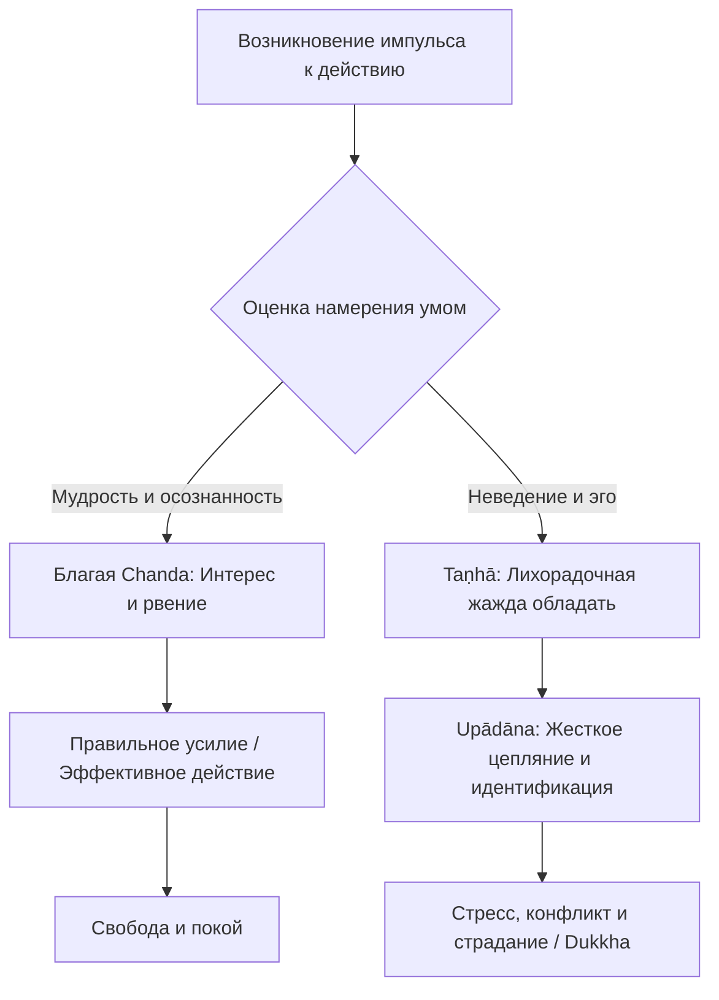

Современная культура часто создает ловушку для людей, интересующихся духовным развитием. Мы постоянно слышим утверждение: «Буддизм учит, что желания — это корень всех страданий, поэтому для обретения покоя нужно перестать чего-либо хотеть». Это вызывает глубокий конфликт у современного человека: как можно строить карьеру, помогать другим или даже достичь духовного прогресса, если мы боимся поставить перед собой любую цель? Из-за этого многие впадают в крайности: либо сгорают в бесконечной гонке за успехом, либо погружаются в апатию.

Но учение Будды не требует от нас превращаться в безвольные камни. Дхамма предлагает точный хирургический инструмент, разделяя здоровую, созидательную мотивацию и токсичную одержимость. Поняв фундаментальную разницу между волевым побуждением (*chanda*), слепой жаждой (*taṇhā*) и мертвой хваткой цепляния (*upādāna*), мы развязываем узел внутренних конфликтов и обретаем способность действовать максимально эффективно, но без страдания.

## Здоровое устремление: Природа желания (*chanda*)

Слово **желание** (*chanda*) в буддийской психологии не несет изначально негативной окраски. В Абхидхамме *chanda* буквально определяется как «желание действовать» (*kattu-kamatā*) или естественное стремление достичь определенного результата. Это базовая движущая сила, подобная руке ума, которая тянется к объекту.

В отличие от алчности (*lobha*) или вожделения (*rāga*), *chanda* является «этически изменчивым» фактором. Это значит, что само по себе побуждение нейтрально. Если оно соединяется с неведением и эгоизмом, оно превращается в яд — чувственное желание. Но если оно направляется мудростью на достойную цель (помощь другим, честный труд или освобождение ума), оно становится добродетельным устремлением (*dhamma-chanda*), без которого невозможен никакой прогресс. Жажда (*taṇhā*) стягивает мир вокруг нашего эго, ее задача — потреблять. Здоровое намерение (*chanda*) направляет энергию ума на созидательный процесс.

## Механика ума: Три ступени вовлеченности

Чтобы понять, как возникает стресс, мы должны рассмотреть три ключевых элемента, которые обычный человек часто смешивает в одно неразделимое «хочу».

1.  **Побуждение / Намерение (*chanda*):** Это первичный интерес к объекту, искра и готовность к действию. Это функциональный двигатель: вы хотите выпить воды, потому что организму нужна жидкость, или хотите написать хороший код на работе. Ум ясен, энергия ровна.
2.  **Жажда (*taṇhā*):** Это слепое, лихорадочное желание, которое рождается из неведения и контакта с чувством (*vedanā*). Возникает острая зависимость: «Я *должен* получить это, чтобы быть счастливым». Это уже не просто действие, это судорожное стремление к потреблению.
3.  **Цепляние (*upādāna*):** Когда жажда усиливается и пускает корни, она перерастает в цепляние. В комментариях *upādāna* определяется как «крепкая, мертвая хватка» (*daḷhaggahaṇa*). Вы уже не просто хотите объект, вы делаете его частью своей личности («Это *моё*, это и есть *Я*»). Утрата объекта на этой стадии вызывает острую душевную боль.

## Ментальные модели и границы

**Аналогия (Голодный путник в пустыне):**
Представьте, что вы идете по пустыне.

  * **Chanda:** Ваше осознанное, спокойное решение свериться с картой и найти оазис, чтобы выжить — это здоровая мотивация. Вы пьете ровно столько, сколько нужно, и идете дальше.
  * **Taṇhā:** Если от паники вы начинаете жадно пить соленую воду из грязной лужи, надеясь, что она утолит жажду — это слепая жажда, движимая инстинктом.
  * **Upādāna:** Если вы находите пустую, разбитую флягу и намертво вцепляетесь в нее, отказываясь выбросить, потому что она стала «вашей» и вы с ней отождествились — это разрушительное цепляние.

Важно четко понимать разницу между этими состояниями ума:

| Характеристика | Побуждение (*Chanda*) | Жажда (*Taṇhā*) | Цепляние (*Upādāna*) |
| :--- | :--- | :--- | :--- |
| **Фокус внимания** | На самом *процессе* действия и его объективной пользе. | На *объекте* (судорожное желание обладать им). | На *идентификации* с объектом (слепое присвоение «моё»). |
| **Состояние ума** | Ясность, энергия, открытость, спокойствие. | Возбужденность, дефицит, зуд, страх не получить. | Жесткая привычка, агрессивная защита, страх потери. |
| **Реакция на неудачу** | Спокойный анализ причин, готовность отпустить. | Острая фрустрация, разочарование, стресс. | Глубокое горе, гнев, крушение картины мира. |

## Практическое руководство: Дхамма в повседневности

Современная жизнь требует от нас целеустремленности. Практика заключается в том, чтобы генерировать *chanda* без скатывания в *taṇhā* и *upādāna*.

**Сценарий 1: Профессиональный проект и амбиции**

  * *Ситуация:* Вам поручили сложный, ответственный проект, и вы хотите получить повышение.
  * *Действие Дхаммы (Taṇhā/Upādāna):* Если вами движет жажда и цепляние, вы будете одержимы статусом и премией. Вы прицепились к результату как к своему «я», поэтому любая критика вызовет колоссальный стресс.
  * *Действие Дхаммы (Chanda):* Вы применяете здоровый интерес к самой задаче. Вы стараетесь сделать работу максимально качественно, фокусируясь на процессе. Если вас не повышают, вы просто анализируете опыт и продолжаете развивать навыки без эмоционального выгорания и крушения личности.

**Сценарий 2: Духовная практика или помощь близким**

  * *Ситуация:* Вы садитесь медитировать и очень хотите достичь состояния глубокого покоя, или вы хотите, чтобы родственник избавился от вредной привычки.
  * *Действие Дхаммы:* Ваше изначальное желание — это благая *chanda*. Но если вы напряжены, требуете результата прямо сейчас или начинаете скандалить, когда родственник вас не слушает — включилось *upādāna*. Вы жестко прицепились к своим ожиданиям.
  * *Результат:* Вы возвращаетесь к осознанности, отпускаете «мертвую хватку» контроля и заменяете ее на Дхамма-чанду: проявляете спокойный, радостный интерес к самому процессу (к ощущению вдоха или к предложению помощи), не цепляясь за идею о результате.

## Итог и источники

Учение Будды не убивает нашу мотивацию, напротив, оно кристаллизует её. Умение отличать созидательное рвение (*chanda*) от разрушительной жажды (*taṇhā*) и жесткого цепляния (*upādāna*) высвобождает колоссальный объем энергии, который раньше тратился на тревоги. Мы начинаем действовать в мире не из эгоистичной нехватки, а из ясности, достигая сложнейших целей, но сохраняя абсолютную внутреннюю неуязвимость. Мы используем инструмент желания, чтобы построить плот, а переправившись на другой берег — спокойно оставляем его.

> С чувством как условием возникает жажда; с жаждой как условием возникает цепляние; с цеплянием как условием возникает становление... Таково возникновение всей этой груды страдания.
>
> — ([СН 12.1](https://theravada.ru/Teaching/Canon/Suttanta/Texts/sn12_1-paticca-samuppada-sutta-sv.htm))

> «Брахман, разве не было у тебя ранее желания [chanda] прийти в этот парк, а когда ты пришёл в парк, то разве не угасло это соответствующее желание? ... Точно так же, брахман, что касается монаха, который является арахантом... то желание достичь арахантства, что было у него ранее — теперь, когда он достиг арахантства, разве не угасло это соответствующее желание?»
>
> — ([СН 51.15](https://theravada.ru/Teaching/Canon/Suttanta/Texts/sn51_15-unnabha-brahmana-sutta-sv.htm))

**Источники для изучения:**

  * ([СН 12.1: Патичча-самуппада-сутта](https://theravada.ru/Teaching/Canon/Suttanta/Texts/sn12_1-paticca-samuppada-sutta-sv.htm))
  * ([СН 51.15: Брахмана-сутта](https://theravada.ru/Teaching/Canon/Suttanta/Texts/sn51_15-unnabha-brahmana-sutta-sv.htm)) — О желании (*chanda*) как средстве достижения цели.
  * ([СН 25.8: Танха-сутта](https://theravada.ru/Teaching/Canon/Suttanta/Texts/sn25_8-tanha-sutta-sv.htm)) — О жажде и непостоянстве.

-----

**Проверка понимания:**
Представьте, что вы активно участвуете в благотворительном проекте по постройке больницы. Вы отдаете этому все свое время и силы. Однако из-за экономического кризиса проект закрывают на полпути. Вы испытываете жгучую обиду, гнев и чувство бессмысленности жизни.

Опираясь на описанную механику ума, скажите: двигало ли вами в этом благом деле только чистое намерение (*chanda*), или же в процесс незаметно проникли жажда (*taṇhā*) и цепляние (*upādāna*)? Как именно они себя проявили?
