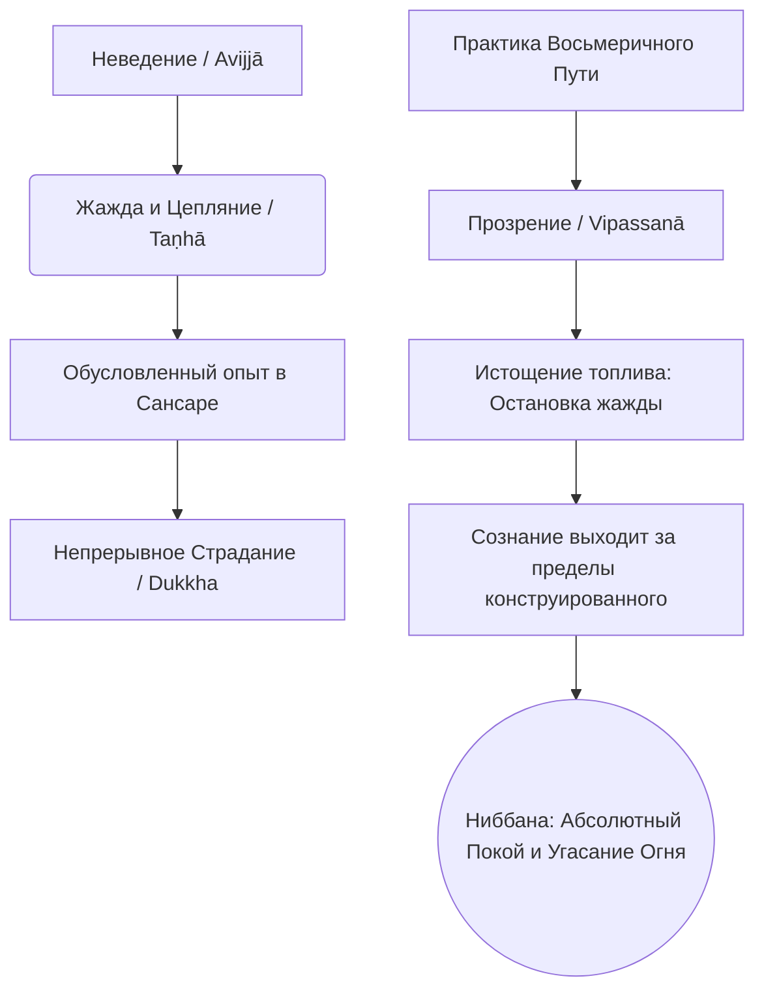

Современный человек проводит жизнь в бесконечной погоне: мы ищем идеальную работу, надежного партнера, финансовую независимость и комфорт, надеясь однажды достичь состояния безопасности и покоя. Однако реальность такова, что все созданные условия нестабильны. Каждое достигнутое желание лишь на время утоляет внутреннюю жажду, после чего неизбежно возникает новая нехватка. Эта непрерывная гонка и попытка найти абсолютную безопасность в изменчивом мире порождает хронический стресс, лихорадку ума и глубокую неудовлетворенность (*dukkha*). Это состояние судорожного поиска и разочарований есть сансара.

Учение Будды не просто предлагает способы временного расслабления или ремонта «горящего дома» обусловленного существования. Оно указывает на радикальный выход — достижение абсолютного, нерушимого покоя, который вообще не зависит от внешних условий. Этот высший идеал и конечная цель буддийского пути называется Ниббаной (*Nibbāna*).

## Ниббана: Высшая цель и угасание жажды

Слово **Ниббана** (*Nibbāna* на пали, *Nirvāṇa* на санскрите) этимологически восходит к глаголу, означающему «быть задутым» или «угаснуть» (подобно пламени свечи). Палийские комментаторы также трактуют его как «уход» от «зарослей» или «путаницы» жажды, привязывающей нас к циклу перерождений.

Главная «работа» Ниббаны — это полное прекращение страдания (*dukkha*). В самом практическом смысле она определяется как абсолютное противоядие — полное сокрушение и уничтожение трех неблагих корней ума: вожделения/страсти (*lobha*), ненависти (*dosa*) и заблуждения/неведения (*moha*). Когда эти три яда угасают, ум обретает непревзойденную свободу, безопасность и кристальную чистоту.

Ниббана — это единственная необусловленная реальность (*asaṅkhata dhātu*). Это означает, что она не рождается из причин, не поддерживается условиями, не изменяется, не исчезает и не подвержена старению и смерти.

## Архитектура освобождения и механика ума

Чтобы понять, как реализуется Ниббана, традиция разделяет это достижение на два элемента:

1.  **Ниббана с остатком (*sa-upādisesa-nibbānadhātu*):** Достигается пробужденным учеником (арахантом) еще при жизни. Все умственные загрязнения полностью уничтожены. Однако «остаток» в виде пяти совокупностей (тела и ума), порожденных прошлой кармой, продолжает существовать. Арахант продолжает испытывать приятные и болезненные физические ощущения, но они больше не вызывают в его уме страсти или отвращения.
2.  **Ниббана без остатка (*anupādisesa-nibbānadhātu*):** Наступает в момент физической смерти араханта. Пять совокупностей распадаются навсегда, и поскольку жажда (топливо для нового рождения) уничтожена, новый психофизический организм не возникает. Происходит полное угасание обусловленного существования.
3.  **Три аспекта Ниббаны:** Она описывается как пустая (*suññata*), так как лишена жажды, ненависти и заблуждения; не имеющая знаков (*animitta*), так как свободна от признаков обусловленных вещей; и лишенная желаний (*appaṇihita*), так как свободна от любого влечения.

**Механика ума:** Путь к Ниббане пролегает через развитие Благородного восьмеричного пути и медитации прозрения (*vipassanā*). Когда ум достигает совершенного прозрения в непостоянство, страдательность и безличность всех обусловленных феноменов, его осознанность достигает предела. Ум перестает цепляться за непрерывный поток феноменов, отворачивается от них и прорывается к необусловленному. Подобно тому как огонь гаснет, когда заканчивается топливо, так и процесс страдания останавливается, когда иссякает топливо жажды.

## Ментальные модели и границы

**Модель угасшего огня:** Будда часто сравнивал Ниббану с огнем, погасшим из-за того, что сгорели его дрова. Если спросить: «Куда ушел огонь, когда закончились дрова? На север, юг, восток или запад?», этот вопрос будет бессмысленным. Огонь никуда не ушел; он просто угас из-за нехватки топлива. Точно так же, когда топливо жажды исчерпано, освобожденный ум не улетает в некое магическое место, он просто «остывает» и обретает высший покой.

> Монахи, подобно тому как масляная лампа горит в зависимости от масла и фитиля и когда и масло, и фитиль израсходованы, то... из-за нехватки топлива лампа угасает...
>
> — ([СН 12.51](https://theravada.ru/Teaching/Canon/Suttanta/Texts/sn12_51-parivimamsana-sutta-sv.htm))

Крайне важно защищать чистоту этого понятия от мирских искажений:

| Характеристика | Ниббана (*Nibbāna*) в Дхамме | Мирские заблуждения (Чем это НЕ является) |
| :--- | :--- | :--- |
| **Суть** | Необусловленный элемент, объективная реальность полного угасания жажды и страдания. | Мрачное небытие, аннигиляция (уничтожение истинно существующего «Я») или физическая смерть. |
| **Отношение к блаженству** | Высшее счастье именно потому, что в ней нет изменчивых, беспокойных чувств и эмоций. | Состояние вечной эйфории, экстаза или божественного транса. |
| **Локация и Достижимость** | Состояние за пределами обусловленного. Может быть испытана прямо здесь и сейчас, в уме. | Райский мир или физическое место, где души наслаждаются вечным блаженством после смерти. |

## Практическое руководство: Вкус освобождения в мире желаний

Будучи мирянином, вы можете начать испытывать «вкус» Ниббаны (вкус освобождения), применяя принципы отпускания прямо сейчас.

**Сценарий 1: Лихорадка потребления и карьерных достижений**

  * *Ситуация:* Вы одержимы получением новой должности или покупкой машины. Мысли крутятся только вокруг этого, вы теряете сон и конфликтуете с близкими.
  * *Действие Дхаммы:* Вы осознаете, что находитесь в огне вожделения (*lobha*). Вы вспоминаете, что высшее благо — это не получение желаемого, а отсутствие жажды. Применяя мудрость, вы видите непостоянство этих объектов.
  * *Результат:* «Топливо» желания сгорает. Лихорадка ума остывает. Вы продолжаете работать, но из состояния равновесия, испытывая микро-переживание прекращения страданий (*nirodha*).

**Сценарий 2: Столкновение с глубокой потерей**

  * *Ситуация:* Ваш многолетний бизнес рушится, вы потеряли деньги или столкнулись с болезнью. Ум охвачен паникой, гневом, неприятием и страхом.
  * *Действие Дхаммы:* Вы понимаете, что гнев (*dosa*) и неведение (*moha*) разжигают внутренний пожар. Страдание вызвано попыткой найти постоянство там, где его нет. Практикуя осознанность, вы отпускаете цепляние за статус и то, что разрушается.
  * *Результат:* Огонь ненависти тухнет. Прекратив внутреннюю борьбу, ум достигает прохлады и непоколебимости, опираясь на мудрое принятие реальности.

## Главный вывод и источники

Ниббана — это не мрачное небытие и не сказочный рай. Это объективная, безупречная реальность полного освобождения и единственная истинная безопасность в мире, где всё остальное подвержено разрушению. Перестав подкидывать в костер своего ума дрова жажды, ненависти и эгоизма, мы позволяем разрушительному пламени угаснуть. То, что остается — это нерушимый мир и высочайшее счастье, превосходящее всё мыслимое в этом мире. Направляя свою жизнь по Восьмеричному Пути, мы шаг за шагом приближаемся к этому достижению, которое навсегда обрывает цепь страданий.

**Источники для изучения:**

  * ([СН 38.1: Ниббана-сутта](https://theravada.ru/Teaching/Canon/Suttanta/Texts/sn38_1-nibbana-panha-sutta-sv.htm))
  * ([АН 9.34: Ниббана-сутта](https://theravada.ru/Teaching/Canon/Suttanta/Texts/an9_34-nibbana-sutta-sv.htm)) — Достопочтенный Сарипутта о том, почему Ниббана приятна.
  * ([МН 72: Аггиваччхаготта-сутта](https://theravada.ru/Teaching/Canon/Suttanta/Texts/mn72-aggi-vacchagotta-sutta-sv.htm)) — Метафора угасшего огня.
  * ([МН 44: Чулаведалла-сутта](https://theravada.ru/Teaching/Canon/Suttanta/Texts/mn44-culavedala-sutta-sv.htm)) — Основа и кульминация святой жизни в Ниббане.

-----

**Проверка понимания:**
Многие люди, впервые сталкивающиеся с буддизмом, пугаются описания Ниббаны. Они думают: *«Если Ниббана — это прекращение всего конструированного, прекращение рождения и даже прекращение чувств, то разве это не является просто полным уничтожением личности (аннигиляцией), против которой выступал сам Будда?»*.

Или представьте практикующего, который после медитации заявляет: *«Я побывал в Ниббане. Там так экстатически прекрасно, что я хочу возвращаться туда снова и снова, и мне грустно, когда я нахожусь в обычном мире»*.

Опираясь на понимание механики Ниббаны и концепции безличности (*anattā*), объясните: почему достижение Ниббаны не является уничтожением «Я», и что *именно* на самом деле прекращается в этот момент? Какую фундаментальную ошибку (какой неблагой корень ума) демонстрирует второй практикующий, принимая свой медитативный транс за абсолютную Ниббану?
