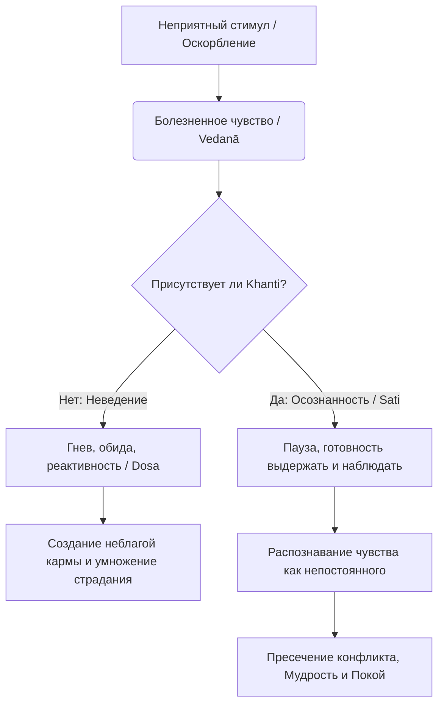

Каждый день мы сталкиваемся с тем, что реальность отказывается соответствовать нашим ожиданиям. Медленный интернет, физический дискомфорт, пробка на дороге или резкое слово коллеги почти мгновенно вызывают в нас глухое раздражение или открытый гнев. Мы тратим колоссальное количество энергии, пытаясь переделать окружающий мир под свои требования, и неизбежно терпим крах. Этот постоянный дефицит выдержки держит нервную систему в напряжении, превращая повседневность в сплошной стресс и умножая нашу глубокую неудовлетворенность (*dukkha*).

Учение Будды предлагает совершенно иной вектор работы с трудностями. Вместо бегства от боли или слепой агрессии Дхамма дает нам инструмент колоссальной силы — терпеливую выдержку. В буддийском понимании это не пассивная покорность жертвы или признак слабости, а прочный внутренний щит и активная ментальная сила. Она позволяет сохранять невозмутимость и ясность даже в эпицентре жизненных бурь, разрывая цепную реакцию страданий на пути к абсолютному освобождению.

## Терпение: Высший аскетизм и броня ума

**Терпение** или терпеливая выдержка (*khanti*) — это способность ума спокойно переносить трудности, боль и внешние провокации, не впадая в гнев, злобу или отторжение (*dosa*). Это фундаментальная добродетель и духовное совершенство, служащее главным противоядием от враждебности.

Главная «работа» этого качества заключается в том, чтобы создать безопасный ментальный буфер (микро-паузу) между болезненным раздражителем и нашей внутренней реакцией. Не позволяя разрушительным эмоциям захватить контроль над поведением и речью, терпение предотвращает прорастание семян враждебности в деструктивные действия и защищает нас от создания неблагой кармы. Будда придавал этой добродетели такое огромное значение, что называл ее высшей формой духовной практики.

> «Выдержка, долготерпение — высший аскетизм, высшая нирвана — говорят просветлённые...»
>
> — ([Дхаммапада 184](https://theravada.ru/Teaching/Canon/Suttanta/Texts/dhm13-14_volovsky.htm))

## Три опоры терпения и механика ума

Практика терпения (*khanti*) охватывает все сферы нашей жизни и опирается на три ключевых столпа:

1.  **Социальное терпение (Выносливость к другим существам):** Это способность переносить оскорбления, насмешки, несправедливость и грубость, не отвечая гневом на гнев. Отвечая злобой на злобу, человек опускается на уровень обидчика и делает хуже самому себе. Сохраняя спокойствие, когда другой зол, мы исцеляем и защищаем сразу двоих — и себя, и своего врага.
2.  **Медитативное терпение (Выносливость к физическим невзгодам):** Это способность ровно переносить жару, холод, усталость, голод и физическую боль (например, онемение или жар во время медитации) без ментального ропота и жалости к себе. Без терпения ум начинает метаться, желая сменить позу, и сосредоточение (*samādhi*) разрушается. Терпеливо отслеживая боль, мы развиваем глубокое прозрение (*vipassanā*).
3.  **Экзистенциальное терпение (Терпение в Дхамме):** Готовность выносить непредсказуемость жизни, ее скуку, сомнения и страхи. Это стойкость в практике и способность бесстрастно принимать глубокие истины (такие как всеобщее непостоянство), открываясь страданию, а не подавляя его или убегая в развлечения.

**Механика ума:** Обычно при контакте с неприятным объектом возникает болезненное чувство (*vedanā*). Из-за неведения ум биологически и кармически обусловлен мгновенно порождать отвращение или гнев. Терпение в связке с осознанностью (*sati*) прерывает эту цепную реакцию. Мы распознаем болезненное чувство просто как безличный процесс. Лишенное «топлива» нашей автоматической реакции, страдание исчерпывает само себя.

## Ментальные модели и границы

Для понимания истинной природы терпения в суттах приводятся классические ментальные модели.

**Метафора непринятого подарка:** В Аккоса-сутте описано, как разгневанный брахман осыпал Будду грубыми оскорблениями. Будда спокойно спросил: «Если ты предлагаешь гостям еду, а они отказываются, кому она достанется?». Получив ответ «Мне», Будда сказал: «Точно так же я не принимаю твою ругань. Она возвращается к тебе». Истинное терпение — это мудрый отказ принять «токсичный подарок» от другого человека.

**Сила истинного владыки:** Правитель богов Сакка, обладая абсолютной властью, сохранял полное спокойствие, когда демон осыпал его оскорблениями. Сакка объяснил, что истинная сила — это когда обладающий мощью терпеливо сносит выходки слабака, а тот, кто силен лишь своим гневом, не обладает реальной силой.

Современная психология и обыватели часто путают буддийское терпение с позицией жертвы или невротическим подавлением эмоций. Важно понимать разницу:

| Характеристика | Истинное терпение (*Khanti*) | Ложное терпение (Подавление / Позиция жертвы) |
| :--- | :--- | :--- |
| **Основа (корень)** | Мудрость (*paññā*), осознанность (*sati*) и сострадание к неведению агрессора. | Страх перед конфликтом, трусость, желание социального одобрения. |
| **Внутреннее состояние** | Ясность, спокойствие, мудрое принятие ситуации, ум просторен и лишен злобы. | Скрытая злоба, обида, стиснутые зубы, внутреннее кипение и фоновый стресс. |
| **Результат** | Гнев угасает, конфликт пресекается, свобода от кармических уз и покой. | Накопление стресса, желание тайной мести, психосоматические болезни, срыв в будущем. |

## Практическое руководство: Выдержка в повседневности

**Сценарий 1: Провокация или несправедливый выговор на работе**

  * **Ситуация:** Начальник грубо отчитывает вас на повышенных тонах, или коллега оставляет несправедливый язвительный комментарий в интернете. Внутри вспыхивает жгучее желание резко ответить и «поставить обидчика на место».
  * **Действие Дхаммы:** Заметьте телесное напряжение (жар в груди, учащенный пульс). Осознайте: «Во мне возникло болезненное чувство, рожденное от контакта уха со звуком». Примените **социальное терпение**, сделав физическую паузу. Вспомните метафору «непринятого подарка» и не нажимайте кнопку «Отправить» в первые секунды. Напомните себе, что агрессор сам ослеплен неведением.
  * **Результат:** Вы сохраняете достоинство и ясность ума. Гнев лишается топлива и угасает, вы не усугубляете конфликт и отвечаете по делу, защищая себя силой Дхаммы, а не силой глупости.

**Сценарий 2: Хроническая боль или дискомфорт при медитации**

  * **Ситуация:** Вы медитируете (или вынуждены долго стоять в переполненном транспорте), и у вас появляется острая, невыносимая боль в спине или ногах. Ум начинает причитать: «За что мне это? Нужно срочно пошевелиться\!».
  * **Действие Дхаммы:** Разделите чистую физическую боль и ментальную реакцию на нее. Примените **медитативное терпение**. Не меняйте позу сразу. Направьте внимание на саму боль и спокойно, мысленно отмечайте: «больно, больно», «оцепенело, оцепенело». Откройтесь этому страданию с выдержкой, не пронзая себя «второй стрелой» ментального сопротивления.
  * **Результат:** Вы заметите, что боль непостоянна. Страдание ума от сопротивления исчезнет, боль останется просто безличным физическим ощущением, а ваше сосредоточение резко возрастет.

## Заключительное слово и источники

Терпение (*khanti*) — это не стискивание зубов в ожидании, когда закончится пытка, и не признак слабости. Это маркер высочайшей духовной силы, глубоко осознанный и смелый отказ от привычного реактивного способа реагирования на дискомфорт. В мире, где люди привыкли инстинктивно отвечать агрессией на малейшие неудобства, человек, обладающий выдержкой, становится редким островком мира. Практикуя терпение, мы перестаем быть рабами своих рефлексов, очищаем ум от яда ненависти и расчищаем путь к нерушимому покою Ниббаны.

> Монахи, даже если разбойники начнут безжалостно распиливать вас двуручной пилой на куски, тот, кто допустит в себе мысль ненависти – тот не исполняет моего наставления. Даже тогда вам следует тренировать себя так: «Наши умы останутся невозмутимыми, и мы не произнесём злых слов; мы будем пребывать сострадательными к их благу, с умом [наполненным] любящей добротой...»
>
> — ([МН 21: Какачупама-сутта](https://theravada.ru/Teaching/Canon/Suttanta/Texts/mn21-kakacupama-sutta-sv.htm))

**Источники для изучения:**

  * [СН 11.4: Вепачитти-сутта](https://suttacentral.net/sn11.4/ru/sv) — Терпение Сакки и спокойствие перед лицом чужого гнева.
  * [СН 7.2: Аккоса-сутта](https://theravada.ru/Teaching/Canon/Suttanta/Texts/sn7_2-akkosa-sutta-sv.htm) — Об оскорблениях и непринятом подарке.
  * [МН 21: Какачупама-сутта](https://theravada.ru/Teaching/Canon/Suttanta/Texts/mn21-kakacupama-sutta-sv.htm) — Пример с пилой и сохранение терпения при жестоком обращении.
  * [МН 28: Махахаттхипадопама-сутта](https://theravada.ru/Teaching/Canon/Suttanta/Texts/mn28-maha-hatthipadopama-sutta-sv.htm) — О контакте уха и реакции на критику.
  * [Дхаммапада 184](https://theravada.ru/Teaching/Canon/Suttanta/Texts/dhm13-14_volovsky.htm) — Строфы Будды о высшем аскетизме.
