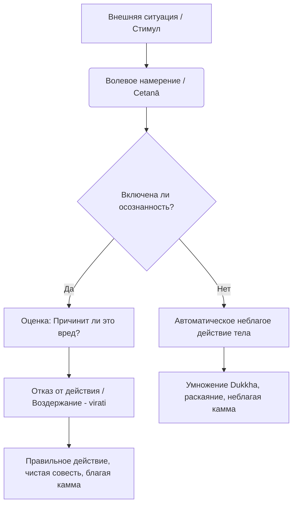

Современная жизнь часто кажется бесконечной гонкой, где мы разрываемся между профессиональным выгоранием, амбициями и раздражением на несправедливость мира. Этот современный мир поощряет достижение результата любой ценой, будь то агрессивная конкуренция или использование других людей ради личной выгоды. Подобные импульсивные поступки и действия на автопилоте оставляют глубокие шрамы в нашей психике, лишая нас внутреннего покоя и умножая неудовлетворенность (*dukkha*).

Учение Будды предлагает прагматичный выход из этого цикла сожалений. До того как мы сможем достичь глубокого медитативного сосредоточения, нам необходимо создать безопасную среду внутри и снаружи нашего ума. Беря под осознанный контроль свои физические действия, мы превращаем тело из источника проблем в надежный фундамент для духовного освобождения.

## Правильное действие: Тело как инструмент очищения ума

**Правильное действие** (*sammā-kammanta*) — это четвертый фактор Благородного Восьмеричного Пути и важнейший элемент группы нравственной дисциплины (*sīla*).

Его главная задача заключается не просто в поддержании социального порядка, а в глубоком очищении ума. Ум контактирует с внешним миром через физические поступки, и Правильное действие работает как надежный защитный барьер, предотвращая трансформацию неблагих намерений ума во вредоносные физические акты. В буддийской психологии это рассматривается не как слепое подчинение правилам, а как **ментальный фактор воздержания** (*virati*). Когда мы намеренно отказываемся от совершения неблагого поступка, мы перерезаем корни жадности, ненависти и заблуждения. С психологической точки зрения это защищает практикующего от жгучего раскаяния и сожалений, создавая спокойный и собранный ум, необходимый для высшего сосредоточения (*samādhi*).

## Три столпа и механика кармы

Правильное действие состоит из трех ключевых предписаний, каждое из которых имеет аспект сознательного воздержания:

1.  **Воздержание от отнятия жизни (*pāṇātipātā veramaṇī*):** Отказ от намеренного лишения жизни любого живого существа, включая животных и насекомых. Это активное развитие сострадания (*karuṇā*) и предоставление дара безопасности всему живому.
2.  **Воздержание от взятия того, что не дано (*adinnādānā veramaṇī*):** Отказ от воровства, мошенничества и присвоения чужого имущества. Это уважение к чужому труду, собственности, времени и энергии.
3.  **Воздержание от нецеломудрия (*kāmesu micchā-cārā veramaṇī*):** Отказ от сексуального поведения, причиняющего страдания другим (например, прелюбодеяние, принуждение). Для монахов и мирян, соблюдающих восемь обетов, это означает полный целибат ради высочайшей чистоты.

**Механика ума:** Любое физическое действие всегда начинается с намерения или воления (*cetanā*). Невольные и ненамеренные действия не являются кармой, так как в них отсутствует воля — фактор, создающий кармический отпечаток. Применяя осознанность (*sati*), мы создаем буфер между импульсом (например, желанием взять чужое) и самим движением тела. Отсекая намерение через воздержание (*virati*), мы перестаем создавать негативную карму.

## Ментальные модели и границы

Для понимания Правильного действия традиция использует две мощные аналогии:

  * **Аналогия забора для сада:** Правильное действие можно сравнить с крепким забором, возведенным вокруг сада вашего ума. Сам по себе забор не выращивает цветы (мудрость и сосредоточение), но без него дикие животные (наши неблагие инстинкты) немедленно растопчут любые всходы.
  * **Аналогия ментальной гигиены:** Классическая модель для понимания нравственности (*sīla*) — это правила гигиены. Вы моете руки не из страха перед божеством, а понимая связь между микробами и болезнью. Так же и Правильное действие — это прагматичная ментальная гигиена, опирающаяся на закон причин и следствий.

Важно понимать разницу между буддийской этикой и светской моралью:

| Характеристика | Правильное действие (*sammā-kammanta*) | Светская мораль / Догматизм |
| :--- | :--- | :--- |
| **Главная цель** | Освобождение ума от страданий (*Nibbāna*), база для медитации. | Поддержание социального порядка, страх наказания. |
| **Основа** | Объективный закон кармы (намерения и их плоды). | Меняющиеся общественные нормы, социальное давление. |
| **Суть практики** | Осознанное воздержание (*virati*) из сострадания и мудрости. | Следование правилам из страха, подавление личности. |

## Практическое руководство

Для человека, живущего в современную эпоху, Правильное действие требует бдительности в сложных ситуациях.

**Сценарий 1: Интеллектуальная собственность и работа**

  * *Ситуация:* Вам поручают сложный проект, и появляется возможность обойти лицензию на ПО или молча присвоить себе заслуги коллеги ради премии.
  * *Действие Дхаммы:* Осознайте намерение получить выгоду за чужой счет. Сделайте волевой выбор применить **воздержание от взятия того, что не дано**.
  * *Результат:* Ваш ум не отягощен страхом разоблачения или виной. Вы сохраняете достоинство и избегаете негативной кармы воровства.

**Сценарий 2: Агрессия в городской среде**

  * *Ситуация:* В транспорте или на парковке кто-то ведет себя грубо, и у вас возникает импульс «проучить» человека физически или толкнуть его.
  * *Действие Дхаммы:* Заметьте напряжение в теле и распознайте гнев (*dosa*). Примените **воздержание от отнятия жизни и причинения вреда**.
  * *Результат:* Вы разрываете кармическую цепь ненависти, не позволяя хаосу проникнуть в ваш ум.

**Алгоритм интеграции в повседневность:**

1.  **Пауза перед действием:** Прежде чем совершить значимое физическое действие, возьмите микро-паузу.
2.  **Проверка намерения:** Спросите себя: «Основано ли это на жадности, гневе или неведении? Пострадает ли кто-то?».
3.  **Выбор воздержания:** Если ответ «да», примените волевое усилие для отказа от действия. Само намеренное воздержание от зла уже является мощной благой кармой.

## Итог и источники

Правильное действие — это не набор жестких ограничений, а активный процесс защиты своего ума и первый шаг к подлинному освобождению. Отказываясь от убийства, воровства и причинения боли, благой человек (*sappurisa*) становится источником умиротворения. Это создает прочный нравственный фундамент, на котором ум успокаивается и проникает в суть реальности.

> Воздержание от отнятия жизни, воздержание от взятия того, что не дано, воздержание от нецеломудрия — вот что называется Совершенными деяниями.
>
> — ([СН 45.8](https://theravada.ru/Teaching/Canon/Suttanta/Texts/sn45_8-magga-vibhanga-sutta-sv.htm))

> В этом мире благой человек воздерживается от уничтожения жизни... воздерживается от взятия того, что не дано... воздерживается от неблагого сексуального поведения... Такого человека называют благим.
>
> — ([Пуггалапаньятти, раздел о четырёх типах личности (Pp 2.4)](https://suttacentral.net/pp2.4))

**Дополнительные источники:**

  * ([МН 9: Саммадиттхи-сутта](https://theravada.ru/Teaching/Canon/Suttanta/Texts/mn9-sammaditthi-sutta-sv.htm))
  * ([МН 44: Чулаведалла-сутта](https://theravada.ru/Teaching/Canon/Suttanta/Texts/mn44-culavedala-sutta-sv.htm))
  * ([АН 6.63 Ниббедхика сутта](https://theravada.ru/Teaching/Canon/Suttanta/Texts/an6_63-nibbedhika-sutta-sv.htm))

-----

**Проверка понимания:**
Представьте, что вы программист, и вам предложили высокооплачиваемую работу: разработать алгоритмы для онлайн-казино, чья бизнес-модель намеренно построена на эксплуатации психологических уязвимостей людей и доведении их до зависимости. Вы не обманываете напрямую и не воруете физические деньги, вы просто пишете код.

Анализируя эту ситуацию через призму Правильного действия и буддийского понятия намерения (*cetanā*), как бы вы оценили кармические последствия такой работы? Нарушается ли здесь тонкая суть принципа «воздержания от взятия того, что не дано»?
