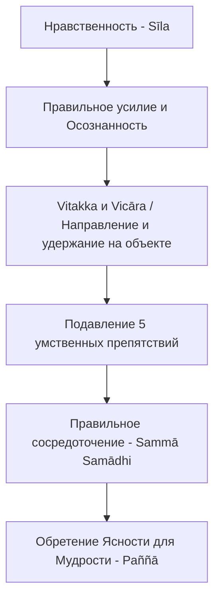

Наша повседневная реальность наполнена бесконечным потоком уведомлений, многозадачностью и информационным шумом, которые разрывают внимание на части. Ум кажется живущим собственной жизнью, постоянно убегая то в сожаления о прошлом, то в тревоги о будущем, что неизбежно приводит к хронической усталости и глубокому внутреннему неудовлетворению (*dukkha*). Попытки обрести покой через развлечения или потребление контента лишь сильнее рассеивают и утомляют сознание.

Учение Будды предлагает мощное противоядие от этой расфокусировки — Правильное сосредоточение (*sammā-samādhi*). Это не просто мистический транс или попытка отключиться от проблем. Это научно выверенный метод объединения ума, способность собрать всю ментальную энергию в единый, мощный луч, который прорезает иллюзии и приносит истинное умиротворение.

## Правильное сосредоточение: Якорь для беспокойного ума

**Правильное сосредоточение** (*sammā-samādhi*) — это восьмой и завершающий фактор Благородного Восьмеричного Пути. Его можно определить как умышленную унификацию и объединение ума на благотворном объекте (однонаправленность, или *citt'ekaggatā*).

Какую именно ментальную проблему решает этот фактор? Он развязывает узел внутренних конфликтов и полностью подавляет пять препятствий (*pañca nīvaraṇāni*), блокирующих мудрость: чувственное желание, враждебность (недоброжелательность), лень и апатию, неугомонность (беспокойство) и сомнение. Без этого якоря ум остается уязвимым для стресса; с ним — обретает безмятежность и становится эффективным, ровным инструментом для глубокого прозрения (*vipassanā*).

## Механика покоя и три уровня концентрации

В буддийской традиции выделяют три уровня развития концентрации:

1.  **Мгновенное сосредоточение** (*khaṇika samādhi*): Однонаправленная осознанность, которая мгновение за мгновением фиксируется на сменяющихся объектах.
2.  **Сосредоточение доступа** (*upacāra samādhi*): Состояние, когда ум стабилен и свободен от пяти препятствий, но еще не слился с объектом окончательно.
3.  **Полное поглощение** (*appanā samādhi*): Глубокие медитативные состояния (джханы, *jhāna*), где ум непоколебимо сливается с единственным объектом.

Будда предельно четко описывал этот путь через четыре последовательные стадии глубокого медитативного поглощения, ведущие от первоначального восторга (*pīti*) и счастья (*sukha*) к абсолютной невозмутимости (*upekkhā*):

> И что такое, монахи, правильное сосредоточение? Вот монах, будучи отстранённым от чувственных удовольствий, отстранённым от неблагих состояний, входит и пребывает в первой джхане... во второй джхане... в третьей джхане... в четвёртой джхане, обладающей ни-удовольствием-ни-болью и чистотой осознанности из-за невозмутимости. Это, монахи, называется правильным сосредоточением.
>
> — ([СН 45.8](https://www.google.com/search?q=https://theravada.ru/Teaching/Canon/Suttanta/Texts/sn45_8-vibhanga-sutta-sv.htm))

**Механика ума:** Как это работает «под капотом»? Когда вы направляете ум на объект через первоначальное применение внимания (*vitakka*) и удерживаете его там (*vicāra*), энергия оттекает от концептуального мышления. Мыслительная надстройка останавливается, ум успокаивается, а освобождение от пяти препятствий высвобождает огромный объем чистой ментальной энергии.

## Ментальные модели и границы

Для понимания процесса традиция использует наглядные метафоры.

**Аналогия (Пчела и цветок):**  Классическая модель для начальных стадий сосредоточения — пчела, летящая к цветку. Ум (пчела) целенаправленно направляется к объекту медитации (например, дыханию), садится на него и остается там, впитывая реальность, вместо того чтобы беспорядочно жужжать вокруг.

**Аналогия (Рыба и Озеро):** Ненатренированный ум Будда сравнивал с рыбой, выброшенной на сушу — она беспорядочно бьется и мечется. Сконцентрированный же ум подобен тихому озеру, не потревоженному ветром: он становится верным зеркалом, без искажений отражающим всё, что перед ним находится.

Крайне важно понимать разницу между буддийским сосредоточением и мирской концентрацией. Программист, увлеченно пишущий код, или амбициозный снайпер обладают сильной однонаправленностью ума, но это не является Правильным сосредоточением.

| Характеристика | Обычная концентрация | Правильное сосредоточение (*sammā-samādhi*) |
| :--- | :--- | :--- |
| **Основа и Мотив** | Может служить любым, даже неблагим целям (амбиции, жадность, гнев). | Опирается исключительно на этическую чистоту и благие состояния ума. |
| **Состояние ума** | Сопровождается напряжением, залипанием, трансом или фиксацией на эго. | Приносит свободу от препятствий, внутреннюю мягкость, радость и кристальную ясность. |
| **Результат** | Достижение мирских результатов, усиление привязанности. | Подготовка ума для прозрения в непостоянство и освобождения от страданий. |

## Практическое руководство в мирской жизни

Развитие концентрации, особенно мгновенного сосредоточения (*khaṇika samādhi*), доступно даже в плотном ритме повседневной работы.

**Сценарий 1: Информационный шторм на работе**

  * *Ситуация:* У вас открыто 20 вкладок, телефон разрывается от уведомлений, ум скачет, возникает тревога и неугомонность из-за горящих сроков.
  * *Действие Дхаммы:* Оторвитесь от экрана на пару минут. Направьте правильное усилие, чтобы отсечь неблагие отвлечения, и используйте осознанность, возвращая внимание к физическому ощущению дыхания (например, движению живота).
  * *Результат:* Концептуальное мышление останавливается. Возникает мгновенное сосредоточение, которое собирает рассеянную энергию в одну точку, подавляет тревогу, и вы возвращаетесь к задаче с ясным фокусом.

**Сценарий 2: Физическая или эмоциональная боль**

  * *Ситуация:* Возникает головная боль или сильное напряжение, ум паникует и прокручивает истории («за что мне это»).
  * *Действие Дхаммы:* Используйте саму боль как объект концентрации. Встречайте ее с пристальным вниманием, фиксируя фокус только на чистом физическом ощущении.
  * *Результат:* Вы перестаете пронзать себя «второй стрелой» ментальных страданий. Сосредоточение позволяет наблюдать боль отстраненно, замечая ее изменчивость.

**Алгоритм интеграции (Шаги к сосредоточению):**

## Главный вывод и источники

**Правильное сосредоточение** — это создание мощного, тихого и непоколебимого центра прямо посреди жизненного хаоса. Собирая рассеянный ум воедино и очищая его от пяти помех, мы создаем прочный фундамент, на котором расцветает освобождающая мудрость, способная навсегда устранить корень страдания.

**Источники для изучения:**

  * ([СН 45.8: Вибханга сутта](https://www.google.com/search?q=https://theravada.ru/Teaching/Canon/Suttanta/Texts/sn45_8-vibhanga-sutta-sv.htm))
  * ([МН 10: Махасатипаттхана-сутта](https://theravada.ru/Teaching/Canon/Suttanta/Texts/mn10-mahasatipatthan-sutta-sv.htm))

-----

**Проверка понимания:**
Представьте амбициозного шахматиста (или трейдера), который может 12 часов подряд не отрываясь смотреть на доску или графики котировок, полностью игнорируя голод и шум вокруг. Его ум полностью поглощен одной целью — заработать как можно больше денег.

С другой стороны, представьте медитатора, чей ум перестал метаться, но при этом он чувствует туман в голове, тяжесть, сильную сонливость (*thīna-middha*) и теряет четкость восприятия объекта.

Опираясь на учение о Пяти препятствиях и критериях Правильного сосредоточения (*sammā-samādhi*), объясните: почему ни первое, ни второе состояние не является фактором Благородного Восьмеричного Пути? Какие ключевые элементы пропущены в каждом из этих случаев?
