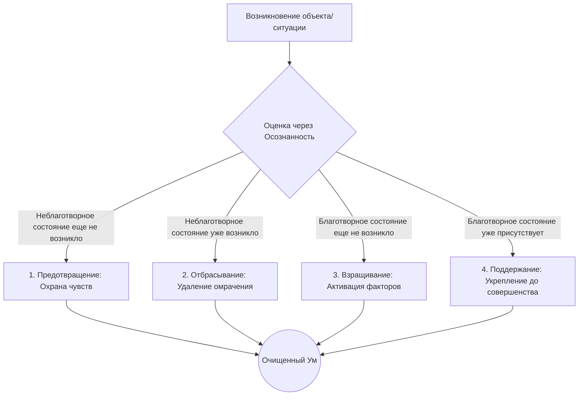

Современная жизнь часто напоминает бесконечную гонку на выживание. Современный мир культа продуктивности приучил нас думать, что любой успех требует истощения и напряжения всех сил. Мы тратим колоссальные объемы энергии на построение карьеры и погоню за удовольствиями, однако в конечном итоге часто сталкиваемся с глубоким эмоциональным выгоранием и экзистенциальной пустотой. Эта базовая неудовлетворенность (*dukkha*) проистекает из-за того, что наша энергия направлена в неверное русло — мы истощаем себя, пытаясь изменить внешний мир.

Учение Будды предлагает радикальный выход: вместо того чтобы растрачивать силы на поддержание иллюзий, мы можем направить эту же самую энергию на очищение своего сознания. Этот преобразующий процесс называется Правильным усилием — двигателем духовного прогресса, который систематически демонтирует причины страдания и взращивает качества, ведущие к абсолютному освобождению.

## Правильное усилие: Энергия, ведущая к освобождению

**Правильное усилие** (*sammā-vāyāma*) — это шестой фактор Благородного Восьмеричного Пути, который вместе с осознанностью и сосредоточением входит в группу тренировки высшего ума (*samādhikkhandha*).

В терминах буддийской психологии (Абхидхаммы) в основе Правильного усилия лежит ментальный фактор энергии или усердия (*viriya*). Согласно Абхидхамме, сама по себе энергия нейтральна и относится к категории «периодических» (*pakiṇṇaka*) факторов. Та же самая сила, которая питает гнев или мирские амбиции, может быть направлена на сосредоточение и понимание. Усилие становится Правильным только тогда, когда оно направляется Правильным взглядом (*sammā-diṭṭhi*) и Правильным намерением (*sammā-saṅkappa*), работая ради освобождения от страдания. Без этого руководства энергия будет лишь накапливать заслуги в рамках колеса перерождений.

## Механика ума: Четыре Великих Усилия

Природа ментальных процессов делит Правильное усилие на четыре «великих старания» (*cattāro sammappadhānā*), описывая всю динамику работы с умом:

1.  **Усилие предотвращения (*Saṃvarappadhāna*):** Направлено на то, чтобы не допустить возникновения еще не возникших неблаготворных состояний. Главными врагами выступают «пять помех» (*pañcanīvaraṇā*): чувственное желание, недоброжелательность, лень и апатия, беспокойство и сожаление, сомнение. Это усилие требует постоянного контроля над чувствами.
2.  **Усилие отбрасывания (*Pahānappadhāna*):** Активная работа по очищению ума от ядов жажды, гнева и иллюзий, как только они были замечены и всплыли из глубоких слоев психики.
3.  **Усилие взращивания (*Bhāvanāppadhāna*):** Культивация благотворных состояний, в первую очередь — семи факторов просветления (*satta bojjhaṅgā*). Этот последовательный процесс включает осознанность, исследование, энергию, восторг, безмятежность, сосредоточение и невозмутимость.
4.  **Усилие поддержания (*Anurakkhaṇappadhāna*):** Сохранение уже возникших благотворных качеств, не позволяя им угаснуть, и доведение их до полного совершенства вплоть до освобождающего прозрения.

> «Вот, монах взращивает желание для невозникновения ещё не возникших злых и неблаготворных состояний; он прилагает усилие, вызывает энергию, склоняет свой ум и создаёт устремление... Он взращивает желание для продолжения уже возникших благотворных состояний, их неубывания, возрастания, расширения и осуществления через взращивание...»
>
> — ([СН 45.8](https://www.google.com/search?q=https://theravada.ru/Teaching/Canon/Suttanta/Texts/sn45_8-vibhanga-sutta-sv.htm))

## Ментальные модели и баланс Индрий

**Модель: Трое мальчиков и цветок**
Для иллюстрации работы группы сосредоточения комментаторы используют аналогию: три мальчика хотят сорвать цветок с высокого дерева. Один подставляет спину, второй забирается на него, а третий подставляет плечо для поддержки, чтобы второй не упал. В этой метафоре мальчик, срывающий цветок — это Правильное сосредоточение; мальчик, подставляющий спину — Правильное усилие (энергия); а мальчик, дающий опору за плечо — Правильная осознанность (стабилизация). Усилие слепо, ему нужен фокус.

**Балансировка энергии (Модели возничего и лютни):**
Махаси Саядо в трактате «Ступени прозрения» описывает критическую важность балансировки Правильного усилия. Достижение высшего баланса сравнивается с возничим: когда лошади бегут ровно, возничему (невозмутимости) не нужно их ни подгонять, ни сдерживать. Энергия подобна струне лютни:

  * **Слабое усилие:** Ум подавляется ленью и апатией (*thīna-middha*), осознанность становится тусклой, как провисшая струна.
  * **Чрезмерное усилие:** Ум подавляется возбужденностью (*uddhacca*), что ведет к судорожным попыткам «поймать» объект, как перетянутая струна, готовая порваться.

**Что НЕ является Правильным усилием:**

| Характеристика | Правильное усилие (*Sammā-vāyāma*) | Мирская амбиция / Выгорание |
| :--- | :--- | :--- |
| **Корень** | Мудрость, отречение, сострадание. | Жажда (*taṇhā*), страх, эгоизм. |
| **Цель** | Очищение ума и освобождение. | Внешние достижения, статус. |
| **Методика** | Срединный путь: упругая бдительность без крайностей. | Трудоголизм, напряжение или апатия. |
| **Результат** | Радость, безмятежность, мудрость. | Истощение, стресс, усиление *dukkha*. |

## Практическое руководство: Усилие в информационной среде

Практика випассаны опирается на непрерывное генерирование Правильного усилия в каждую долю секунды (*Vitakka* и *Khaṇika samādhi*).

**Сценарий 1: Информационная перегрузка и истощение**

  * *Ситуация:* После работы вы чувствуете сильную усталость (*thīna-middha*) и бесцельно листаете ленту соцсетей, не в силах остановиться.
  * *Действие Дхаммы:* Примените усилие отбрасывания (*pahānappadhāna*). Сделайте волевое усилие отложить телефон. Затем примените легкое усилие взращивания для мысленного отмечания самого состояния усталости: «тяжесть, тяжесть».
  * *Результат:* Вы не агрессивно боретесь с усталостью, но и не сдаетесь ей. Ум выходит из оцепенения, возвращается ясность.

**Сценарий 2: Раздражение в конфликтной ситуации**

  * *Ситуация:* Коллега несправедливо критикует вас, внутри закипает гнев, и вы готовы ответить саркастичной фразой.
  * *Действие Дхаммы:* Примените усилие предотвращения (*saṃvarappadhāna*). Заметив первый импульс злобы, не позволяйте ему выплеснуться в речь. Затем сознательно удерживайте фокус на доброжелательности (*mettā*).
  * *Результат:* Вы предотвращаете создание неблаготворной кармы речи. Гнев выгорает, не получив «топлива».

**Алгоритм Четырех Великих Усилий:**

## Заключительное слово и источники

Без личного, непрерывного и мужественного усилия любые теоретические знания Дхаммы остаются мертвым грузом. Будда учил, что никто не может пройти этот путь за нас. Только через неустанную бдительность — предотвращая зло, отбрасывая омрачения, взращивая факторы просветления и поддерживая их баланс — мы можем превратить загрязненный ум в сияющий инструмент мудрости.

**Источники для изучения:**

  * ([СН 45.8: Вибханга сутта](https://www.google.com/search?q=https://theravada.ru/Teaching/Canon/Suttanta/Texts/sn45_8-vibhanga-sutta-sv.htm))
  * ([МН 117: Махачаттариська-сутта](https://theravada.ru/Teaching/Canon/Suttanta/Texts/mn117-mahacattarisaka-sutta-sv.htm))
  * Абхидхаммаматтха Сангаха (Анализ ментальных факторов).
  * Махаси Саядо, «Ступени прозрения» (*Visuddhi-ñāṇa-kathā*).

-----

**Проверка понимания:**
Практикующий медитацию заметил, что его ум стал вялым, а тело охватила сонливость. Желая избавиться от этого, он начал с огромной силой подавлять сонливость, мысленно ругая себя и выкрикивая ярлыки с внутренним напряжением («СОН\!»). В результате сонливость ушла, но ум стал раздраженным, беспокойным и тревожным.

Используя знания о балансе индрий и семи факторах просветления, объясните: какой ментальный фактор (*cetasika*) вышел из-под контроля, подавив Правильное усилие, и как именно медитирующему следовало откалибровать струну своего ума в этой ситуации?
