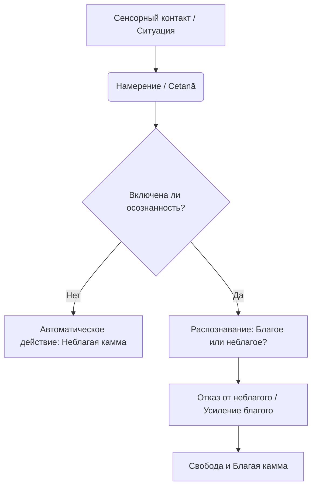

Современная жизнь часто кажется бесконечной гонкой, где мы разрываемся между профессиональным выгоранием и скрытым раздражением на мир. Мы функционируем на автопилоте: импульсивно отвечаем на критику, бездумно тянемся к смартфону при малейшей скуке и принимаем решения под влиянием сиюминутных эмоций. Эта непрерывная цепь автоматических реакций создает постоянный фоновый шум стресса и неудовлетворенности (*dukkha*), лишая нас контроля над собственной жизнью.

Учение Будды предлагает точный инструмент для того, чтобы перехватить этот процесс у самого его истока. До того как мы совершим поступок или произнесем слово, в уме зарождается невидимое семя — импульс к действию. Практика Правильного намерения позволяет осознанно перенаправлять энергию ума от разрушительных поведенческих шаблонов к подлинному внутреннему благополучию и свободе.

## Правильное намерение: Мост между мудростью и действием

**Правильное намерение** (*sammā-saṅkappa*) — это второй фактор Благородного Восьмеричного пути. Если первый фактор (Правильные взгляды) дает нам карту реальности, то Правильное намерение обеспечивает топливо и направление для движения по этой карте. Оно служит важнейшим связующим звеном между нашим концептуальным пониманием реальности и активным взаимодействием с миром.

Главная задача этого фактора — разорвать автоматическую связь между раздражителем и нашей реакцией. Отмечая свои намерения, мы получаем драгоценное время, чтобы признать импульс благом или неблагом. Важно понимать кардинальное различие: Правильное намерение — это не слепое желание (*taṇhā*), продиктованное неведением и эгоизмом, а осознанное **устремление** (*saṅkappa*), рожденное из ясного видения непостоянства и природы страдания.

> «Намерение, монахи, это то, что я называю действием. Через намерение человек действует телом, речью, умом... Троичен результат каммы: созревающий в течение этой жизни, созревающий в течение следующей жизни, созревающий в последующих жизнях...»
>
> — ([АН 6.63 Ниббедхика сутта](https://theravada.ru/Teaching/Canon/Suttanta/Texts/an6_63-nibbedhika-sutta-sv.htm))

## Три опоры и механика воли

Действие Правильного намерения всецело опирается на волю (*cetanā*). Будда прямо указывал, что именно воля является кармой (*kamma*). Учение делит Правильное намерение на три ключевых аспекта, каждый из которых является направленным противоядием от соответствующего неблаготворного корня:

1.  **Намерение отречения** (*nekkhamma-saṅkappa*): Это устремление к свободе от чувственных привязанностей. Оно возникает естественным образом, когда мы глубоко осознаем, что погоня за мирскими удовольствиями пронизана неудовлетворенностью. Оно прямо противостоит жажде и вожделению.
2.  **Намерение доброжелательности** (*abyāpāda-saṅkappa*): Это искреннее устремление, направленное на пожелание счастья и благополучия другим существам. Оно нейтрализует гнев, злобу и отвращение.
3.  **Намерение непричинения вреда** (*avihiṃsā-saṅkappa*): Мысль, направляемая глубоким состраданием (*karuṇā*), — желание, чтобы все живые существа избавились от мучений. Оно растворяет жестокие, агрессивные и насильственные мысли.

**Механика ума:** Этот процесс не работает в вакууме. Правильные взгляды задают перспективу, распознавая мысль как вредную или благую. Затем Правильное усилие предоставляет энергию для отбрасывания плохих мыслей, а осознанность удерживает ум в благом русле. Многократно повторяемые действия формируют наши привычки, которые неумолимо движут нас к нашей судьбе.

## Ментальные модели: Колышек и семена

Для понимания механизма работы с намерениями традиция использует две классические аналогии:

  * **Модель плотника (Гнилой колышек):** Неблаготворная мысль подобна гнилому колышку, застрявшему в доске ума. Благая мысль (Правильное намерение) — это новый, крепкий колышек. Сама практика медитации и осознанности выполняет роль молотка, с помощью которого старый колышек аккуратно выбивается и заменяется новым. Попытки просто подавить гнев безуспешны — они лишь загоняют яд глубже в подсознание.
  * **Модель посева семян:** Любой вид намеренного действия — это брошенное в почву ума семя. Вы не можете посадить семя сорняка (неблагое намерение) и ожидать, что вырастет лотос (счастье).

Чтобы избежать ложного понимания практики, важно четко разделять буддийское устремление и обычные мирские желания:

| Характеристика | Правильное намерение (*sammā-saṅkappa*) | Мирское желание (*taṇhā*) |
| :--- | :--- | :--- |
| **Источник** | Ясное понимание и мудрость | Неведение и слепая жажда |
| **Характер** | Здоровое устремление, наличие паузы перед выбором | Судорожное цепляние, слепое потакание импульсу |
| **Результат** | Спокойствие, сострадание, свобода от зависимостей | Бесконечная конкуренция, эгоистичные страдания |

## Практическое руководство: Дхамма в повседневности

Для современного человека работа с намерением — это мощнейшая практика когнитивной реструктуризации, не требующая ухода в монастырь.

  * **Сценарий 1: Информационный перегруз и скука.**

      * *Ситуация:* После тяжелого рабочего дня вы бездумно прокручиваете ленту новостей, испытывая фоновую тревогу. Рука рефлекторно тянется открыть очередное видео.
      * *Действие Дхаммы:* Заметьте жажду стимуляции до того, как рука совершит движение. Примените **намерение отречения**, осознав, что этот процесс не приносит истинного счастья.
      * *Результат:* Вы не подавляете себя силой, а лишаете импульс энергии. Привязанность отпадает естественно, как сухой лист с дерева, и ум успокаивается.

  * **Сценарий 2: Несправедливость на работе.**

      * *Ситуация:* Коллега резко критикует вас и присваивает ваши заслуги. Внутри закипает гнев и желание отомстить.
      * *Действие Дхаммы:* Остановитесь на этапе формирования воли (*cetanā*). Распознайте гнев (гнилой колышек). Примените **намерение доброжелательности и непричинения вреда**, понимая, что коллега страдает от собственных страхов.
      * *Результат:* Вы отвечаете твердо, но без ненависти, предотвращая отравление собственного ума и создание неблагой словесной каммы.

**Алгоритм внедрения (Метод Махаси Саядо):**

1.  **Перехват:** В течение дня старайтесь обращать внимание на микро-побуждения перед действиями (намерение встать, намерение заговорить, взять телефон).
2.  **Обозначение:** Используйте мысленный ярлык (например, «намерение, намерение»), чтобы отстраниться от импульса.
3.  **Замещение:** Честно ответьте себе, чем продиктована мысль. Если это жажда или злоба, намеренно вызовите противоположное, благотворное размышление (выбейте старый колышек новым).

## Заключительное слово и источники

Правильное намерение — это руль, который направляет кармический корабль нашей жизни. Нравственность (*sīla*) выражается именно в состоянии ума и волевых решениях, которые мы принимаем от момента к моменту. Сознательно выбирая отречение, доброжелательность и сострадание, мы перепрограммируем свой ум и прокладываем прямой путь к абсолютному освобождению.

**Источники для изучения:**
- ([АН 6.63 Ниббедхика сутта](https://theravada.ru/Teaching/Canon/Suttanta/Texts/an6_63-nibbedhika-sutta-sv.htm)) — О природе каммы и роли воли (*cetanā*).
- ([МН 117: Махачаттариська-сутта](https://theravada.ru/Teaching/Canon/Suttanta/Texts/mn117-mahacattarisaka-sutta-sv.htm)) — О связи факторов пути.
- ([МН 19: Дведхавитакка-сутта](https://www.google.com/search?q=https://theravada.ru/Teaching/Canon/Suttanta/Texts/mn19-dvedhavitakka-sutta-sv.htm)) — О разделении мыслей на благие и неблагие (замена «колышка»).

-----

**Проверка понимания:**
Проанализируйте две следующие ситуации сквозь призму учения о намерениях и карме.

  * **Случай 1:** Практикующий заметил в себе сильную привязанность к похвале и статусу в обществе. Испытывая стыд и отвращение к этому недостатку, он мысленно стискивает зубы и думает: *"Я должен любой ценой выжечь и уничтожить в себе это жалкое желание признания, я ненавижу это состояние ума\!"*
  * **Случай 2:** Вы случайно наступили кому-то на ногу в переполненном метро. Человек рассердился, но вы сделали это абсолютно нечаянно, без малейшей мысли навредить.

Опираясь на концепции "нового колышка" и роли воли (*cetanā*), ответьте: какую тонкую ошибку с точки зрения буддийской психологии совершает практикующий в первом случае, и создали ли вы неблагую карму во втором (и почему)?
