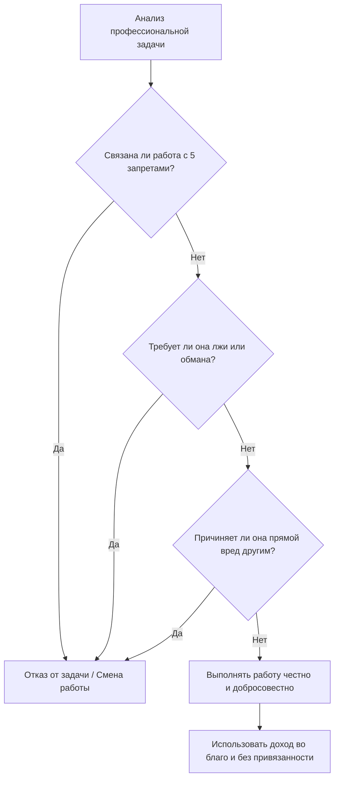

Большую часть времени бодрствования современный человек проводит на работе. Гонка за карьерой, жесткая конкуренция и корпоративная культура «успеха любой ценой» часто вынуждают нас идти на этические компромиссы. Мы приносим этот груз домой: фоновая тревога, профессиональное выгорание и скрытое чувство вины медленно разрушают наш покой, порождая глубокую неудовлетворенность (*dukkha*).

Учение Будды не требует от мирян полного отказа от работы или ухода в лес. Напротив, оно предлагает превратить нашу профессиональную деятельность из источника стресса в мощный инструмент духовного очищения и пробуждения. Этот инструмент — Правильные средства к существованию (*sammā-ājīva*).

## Правильные средства к существованию: Нравственная экология труда

**Правильные средства к существованию** (*sammā-ājīva*) — это пятый фактор Благородного Восьмеричного Пути, входящий в группу нравственной дисциплины (*sīla*). Его суть заключается в том, чтобы зарабатывать на жизнь честным, законным и мирным путем, не причиняя вреда другим живым существам.

Практика Правильных средств к существованию разрушает внутренний конфликт и когнитивный диссонанс. Невозможно достичь глубокого медитативного сосредоточения (*samādhi*), если восемь часов в день вы обманываете людей или способствуете их страданиям. Чистый способ заработка устраняет страх разоблачения и муки совести, создавая прочный фундамент для ясного, бесстрашного и спокойного ума.

## Три столпа чистого труда и механика кармы

Концепция *sammā-ājīva* опирается на три ключевых принципа:

1.  **Отказ от пяти вредоносных профессий:** Будда строго очертил границы недопустимого бизнеса. Запрещена торговля оружием, живыми существами (включая работорговлю, проституцию и выращивание животных на убой), мясом, одурманивающими веществами (алкоголем и наркотиками) и ядами.
2.  **Отказ от нечестных методов:** Доход не должен извлекаться путем обмана, мошенничества, вероломства, гадания или ростовщичества ([МН 117](https://theravada.ru/Teaching/Canon/Suttanta/Texts/mn117-mahacattarisaka-sutta-sv.htm)).
3.  **Честность и правильное использование богатства:** Праведный труд подразумевает добросовестное выполнение обязанностей, уважительное отношение к людям и использование честно заработанных средств во благо (обеспечение семьи, помощь друзьям и поддержка тех, кто ведет духовную жизнь).

> «Мирской последователь не должен заниматься этими пятью видами торговли. Какими пятью? Торговлей оружием, торговлей живыми существами, торговлей мясом, торговлей одурманивающими веществами и торговлей ядами».
>
> — ([АН 5.177](https://www.google.com/search?q=https://theravada.ru/Teaching/Canon/Suttanta/Texts/an5_177-vanijja-sutta-sv.htm))

**Механика ума:** Каждое наше волевое действие оставляет кармический отпечаток на континууме нашего ума. Работа — это не просто набор физических действий, это непрерывная генерация волевых импульсов (*cetanā*). Если вы зарабатываете, эксплуатируя чужие слабости, ваш ум пропитывается жаждой (*taṇhā*) и неведением (*moha*). Выбирая праведный труд, вы ежедневно практикуете безвредность (*avihiṃsā*) и сострадание, генерируя благую карму (*kusala kamma*).

## Ментальные модели и границы

**Аналогия с отравленным колодцем и почвой:** Представьте, что вы посадили прекрасное фруктовое дерево, но поливаете его водой из отравленного источника (вашей неблагой работы). Как бы усердно вы ни медитировали по вечерам, плоды вашей практики будут отравлены. Неправильные средства к существованию (*micchā-ājīva*) — это отравленная почва. Даже если вы используете заработанные нечестным путем деньги на благотворительность, сам процесс их добычи загрязняет ваш ум.

Важно понимать разницу между буддийским подходом к работе и современными корпоративными идеалами:

| Характеристика | Правильные средства (*sammā-ājīva*) | Мирской подход «Успех любой ценой» |
| :--- | :--- | :--- |
| **Основа и цель** | Честный обмен, жизнь без причинения вреда. | Извлечение прибыли любой ценой, статус. |
| **Состояние ума** | Радость от честного труда, спокойствие. | Постоянная неудовлетворенность, стресс, вина. |
| **Отношение к людям** | Клиенты и коллеги — живые существа. | Люди — это средство для извлечения выгоды. |

## Практическое руководство: Дхамма на рабочем месте

Для современного человека применение *sammā-ājīva* часто требует бдительности и тонкой настройки личных границ.

**Сценарий 1: Токсичный проект в IT-компании**

  * *Ситуация:* Программисту поручают разработать алгоритм для онлайн-казино, который намеренно вводит пользователей в заблуждение, стимулируя игровую зависимость.
  * *Действие Дхаммы:* Сотрудник осознает, что этот продукт напрямую умножает чужое страдание и эксплуатирует жажду (*taṇhā*). Он вежливо просит перевести его на другой проект или начинает искать более этичную работу.
  * *Результат:* Избегание соучастия в создании страданий сохраняет внутреннюю чистоту, самоуважение и покой ума.

**Сценарий 2: Давление в продажах**

  * *Ситуация:* Менеджера по продажам заставляют сбывать некачественный товар, скрывая его дефекты, или лгать о свойствах продукта.
  * *Действие Дхаммы:* Менеджер опирается на Правильную речь (*sammā-vācā*) и отказывается использовать мошеннические методы. Он презентует товар честно, даже рискуя потерей части бонусов.
  * *Результат:* Ум остается свободным от раскаяния. Как отмечал Будда, «счастье безупречности» гораздо ценнее мимолетной материальной выгоды.

**Алгоритм этической оценки работы:**

## Итоги и источники

Наша работа — это не просто способ оплаты счетов, это полигон для тренировки нашего ума и проверки наших ценностей. Практикуя Правильные средства к существованию, мы превращаем рутину в благородный путь. Отказываясь от вредоносных профессий и обмана, мы защищаем свой ум от беспокойства и привносим в этот мир частицу справедливости, подготавливая прочный фундамент для продвижения к полному освобождению.

**Источники для изучения:**

  * ([МН 117: Махачаттариська-сутта](https://theravada.ru/Teaching/Canon/Suttanta/Texts/mn117-mahacattarisaka-sutta-sv.htm))
  * ([АН 5.177: Ваниджджа сутта](https://www.google.com/search?q=https://theravada.ru/Teaching/Canon/Suttanta/Texts/an5_177-vanijja-sutta-sv.htm))
  * ([АН 4.62: Анана сутта](https://www.google.com/search?q=https://theravada.ru/Teaching/Canon/Suttanta/Texts/an4_62-anana-sutta-sv.htm))

-----

**Проверка понимания:**
Представьте, что вы работаете маркетологом в компании, производящей экологически чистые продукты питания (что само по себе является благим делом). Однако для резкого повышения продаж руководство поручает вам запустить рекламную кампанию, содержащую заведомо ложные, антинаучные обещания о том, что эти продукты «исцеляют от всех болезней». Начальник аргументирует это тем, что «все так делают», и обещает вам крупную премию.

Опираясь на учение о Правильных средствах к существованию (*sammā-ājīva*) и Правильной речи (*sammā-vācā*), объясните, почему согласие на эту задачу будет считаться «отравленной почвой»? Какие конкретные кармические и психологические последствия это повлечет для маркетолога, даже если он пожертвует часть своей премии на благотворительность, и как эти два фактора Восьмеричного пути пересекаются в данной ситуации?
