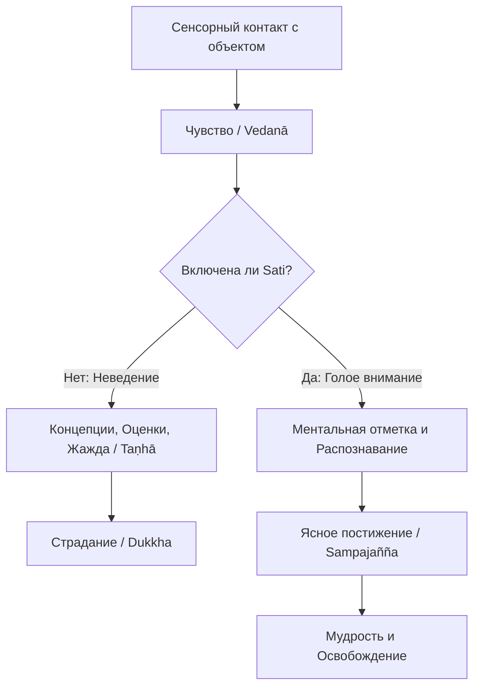

Современный мир — это бесконечный конвейер информации, где наше внимание постоянно похищают цифровые уведомления, тревожные новости и дедлайны. Мы живем на автопилоте: физически находясь в одном месте, мы ментально блуждаем в лабиринтах воспоминаний о прошлом или страхах о будущем. Эта фрагментация внимания порождает хронический стресс и глубокую неудовлетворенность (*dukkha*). Мы теряем контакт с самой жизнью, подменяя реальность своими субъективными интерпретациями.

Учение Будды предлагает надежный якорь в этом шторме — Правильную осознанность. Это не просто модный тренд на релаксацию или бегство от мира. Это точный инструмент, который возвращает нас в «здесь и сейчас», превращая каждое мгновение повседневной жизни в практику для пробуждения и обретения непоколебимого внутреннего покоя.

## Правильная осознанность: Чистое зеркало реальности

**Правильная осознанность** (*sammā-sati*) — это седьмой фактор Благородного Восьмеричного Пути. В контексте буддийской медитации слово *sati* означает не просто память, а присутствие ума, внимательность к настоящему моменту и способность объективно наблюдать за феноменами.

Обычно наш ум моментально покрывает любой опыт слоем оценок и концептуальных проекций (*papañca*). Как только мы что-то чувствуем, скрытые омрачения навешивают ярлыки: «мне это нравится, я хочу этого» или «это неприятно, я должен от этого избавиться». Главная задача Правильной осознанности — остановить эту автоматическую реактивность. Она очищает когнитивное поле, создавая критически важную микро-паузу между стимулом и нашей реакцией, позволяя воспринимать вещи в их чистой непосредственности.

## Архитектура памятования и механика ума

Фундамент Правильной осознанности строится на **Четырех основах памятования** (*satipaṭṭhāna*), которые представляют собой всеобъемлющую систему наблюдения за нашим опытом:

1.  **Созерцание тела** (*kāyānupassanā*): Наблюдение за дыханием, позами и физическими движениями.
2.  **Созерцание чувств** (*vedanānupassanā*): Отслеживание приятных, неприятных и нейтральных ощущений.
3.  **Созерцание ума** (*cittānupassanā*): Распознавание текущего состояния сознания (например, присутствует ли в нем тревога, гнев или спокойствие).
4.  **Созерцание феноменов** (*dhammānupassanā*): Исследование реальности через призму списков Дхаммы, таких как Пять препятствий.

**Механика ума:** Осознанность работает как объективный регистратор, применяя «голое внимание» (bare attention). В цепи зависимого возникновения сенсорный контакт вызывает чувство, чувство рождает жажду (*taṇhā*), а жажда порождает страдание. Правильная осознанность внедряется в эту цепь. Отмечая происходящее, мы распутываем узлы привычных реакций, лишаем омрачения питающей энергии и открываем ум для интуитивной мудрости (*paññā*).

## Ментальные модели и границы

Для понимания сути осознанности буддийская традиция использует наглядные метафоры:

  * **Модель тыквы и камня:** Ум, лишенный осознанности, подобен полой тыкве, брошенной в пруд: она всегда скользит по поверхности и легко уплывает по течению случайных мыслей. Ум, наделенный Правильной осознанностью, подобен камню: он мгновенно погружается в воду, достигая самой глубины явления, и остается там, где его положили.
  * **Модель собаки на привязи:** Неосознанный ум сравнивается с собакой, привязанной на поводке к столбу. Правильная осознанность — это острый нож, который перерезает этот поводок слепой идентификации с телом и мыслями, даруя подлинную свободу.

Важно четко понимать границы этой практики, так как современная поп-культура часто искажает её суть:

| Характеристика | Правильная осознанность (*sammā-sati*) | Светская / Искаженная осознанность |
| :--- | :--- | :--- |
| **Конечная цель** | Прозрение в непостоянство, искоренение причин страдания. | Временное снятие стресса, повышение продуктивности. |
| **Отношение к опыту** | Голое внимание, безоценочное наблюдение без цепляния. | Поиск приятных состояний, избегание дискомфорта. |
| **Этический контекст** | Неразрывно связана с нравственностью (*sīla*). | Этика игнорируется, техника используется вне морали. |

## Практическое руководство: Дхамма в повседневности

**Сценарий 1: Боль и дискомфорт в теле**

  * *Ситуация:* Вы долго сидите за компьютером (или в медитации), и возникает боль в спине. Ум реагирует глухим раздражением: «Я больше не могу это терпеть\!».
  * *Действие Дхаммы:* Примените созерцание чувств (*vedanānupassanā*). Отделите физическое ощущение от ментальной реакции. Мысленно отметьте: «боль, боль» и отдельно реакцию: «раздражение, отторжение».
  * *Результат:* Вы разделяете чистую физическую боль и ментальную надстройку страдания. Боль остается, но умственное сопротивление и паника растворяются.

**Сценарий 2: Тревожные мысли и цифровая скука**

  * *Ситуация:* Ваш ум захвачен страхом перед важной встречей, или же рука рефлекторно тянется за смартфоном, чтобы убежать от скуки.
  * *Действие Дхаммы:* Примените созерцание ума (*cittānupassanā*). Направьте внимание на самый первый импульс. Зарегистрируйте: «ум сжат тревогой» или «намерение отвлечься», не ругая себя за слабость.
  * *Результат:* Осознанность создает паузу и разрывает автоматический паттерн. Страх или скука становятся просто временными объектами наблюдения. Вы перестаете отождествлять себя с ними.

**Алгоритм интеграции (Механика чистого внимания):**
Для объективизации опыта и остановки дискурсивного мышления используйте метод «ментального отмечания» (традиция Махаси Саядо):

1.  **Остановка и Якорь:** Выберите базовый объект (например, движение живота при дыхании). Как только возникает сильный стимул, сделайте микро-паузу.
2.  **Отметка:** Зарегистрируйте явление простейшим ярлыком («слышание», «напряжение», «мысль», «гнев»), не вовлекаясь в сюжет. Это действие объективирует опыт.
3.  **Наблюдение:** Позвольте объекту быть. Заметьте, как он возникает, длится и исчезает сам по себе, не пытаясь им манипулировать.
4.  **Возврат:** После исчезновения объекта мягко верните внимание к якорю (дыханию).

## Главный вывод и источники

Правильная осознанность — это сердцевина буддийской медитации, единственный прямой путь, ведущий к очищению ума. Отказываясь от эгоистичных манипуляций с реальностью и выбирая путь безоценочного наблюдения, мы лишаем скрытые омрачения их силы. Этот процесс возвращает нас к непосредственному опыту, где каждое мгновение становится вратами для постижения истины и освобождения.

> Подобно тому, как укротитель слонов вбивает в землю большой столб и привязывает к нему за шею лесного слона, чтобы подчинить его лесные привычки... так же эти четыре основы осознанности являются привязями для ума благородного ученика...
>
> — ([МН 125](https://theravada.ru/Teaching/Canon/Suttanta/Texts/mn125-dantabhumi-sutta-sv.htm))

**Источники для глубокого изучения:**

  * ([ДН 22: Махасатипаттхана-сутта](https://theravada.ru/Teaching/Canon/Suttanta/Texts/dn22-mahasatipatthansa-sutta-01-ivahnenko.htm)) — Великое наставление об основах осознанности.
  * ([МН 118: Анапанасати-сутта](https://theravada.ru/Teaching/Canon/Suttanta/Texts/mn118-anapanasati-sutta-sv.htm)) — Осознанность к дыханию.
  * Махаси Саядо, «Практика медитации прозрения».

-----

**Проверка понимания:**
Представьте, что во время медитации вы вспомнили о нерешенном рабочем конфликте. Внутри поднимается гнев. Одновременно с этим у вас начинает нестерпимо чесаться лицо. Ум паникует: «Моя медитация испорчена гневными мыслями\! Я должен силой подавить этот гнев, и я обязан срочно почесать лицо, иначе не смогу сосредоточиться\!».

Является ли такая реакция проявлением Правильной осознанности (*sammā-sati*)? Опираясь на алгоритм «чистого внимания» и Четыре основы памятования, опишите пошагово, что именно вы должны сделать в этот момент, чтобы лишить гнев и физический зуд их силы, не прерывая практику и не поддаваясь автоматическим реакциям.
