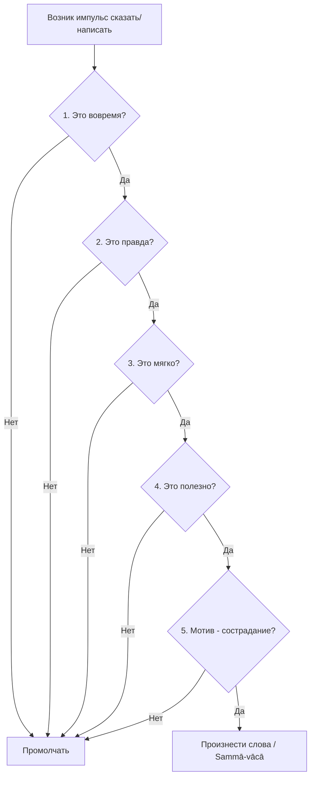

В современном мире мы постоянно погружены в океан слов: социальные сети, бесконечные рабочие чаты, новости и споры. Эта непрерывная коммуникация, когда наши слова часто опережают осознанность, становится источником огромного стресса, тревоги и неудовлетворенности (*dukkha*). Мы печатаем и говорим на автопилоте, движимые сиюминутными эмоциями, и часто раним других неосторожными комментариями.

Учение Будды предлагает радикальное противоядие этому хаосу. Осознанно контролируя то, что мы говорим, мы не только создаем гармонию в отношениях, но и очищаем собственный ум, лишая негативные эмоции «топлива» для роста.

## Правильная речь: Фильтр между умом и миром

**Правильная речь** (*sammā-vācā*) — это третий фактор Благородного Восьмеричного Пути и первая ступень в группе нравственной дисциплины (*sīla*). На базовом уровне для мирян эта практика выражается в воздержании от грубых слов, лжи, сплетен и пустословия.

Ее главная функция заключается в том, чтобы служить вратами между нашим внутренним миром и внешней реальностью. Невежество, жадность и гнев, зарождаясь в уме, ищут выход через слова. Правильная речь выполняет роль строгого фильтра на выходе из ума: она не позволяет внутренним омрачениям просочиться в мир и защищает сам ум практикующего от жгучего раскаяния.

## Три столпа речевой дисциплины и механика ума

Буддийский анализ делит Правильную речь на три ключевых столпа, каждый из которых отсекает определенный яд ума:

1.  **Укорененность в реальности (Отказ от лжи - *musāvāda*):** Слова должны отражать реальность. Намеренная ложь искажает восприятие истины и отдаляет ум от мудрости (*paññā*). Это усилие никогда не искажать факты ради собственной выгоды.
2.  **Сострадание и гармония (Отказ от клеветы и грубости - *pisuṇā vācā*, *pharusā vācā*):** Речь не должна причинять боль или сеять вражду. Грубая речь рождается из гнева, а правильная речь объединяет людей, звучит мягко, вежливо и исцеляет сердца.
3.  **Целенаправленность (Отказ от пустословия - *samphappalāpa*):** Бессмысленная болтовня лишает ум глубины и покоя. Слова должны быть своевременными, обоснованными и приносить реальную пользу.

> «Когда человек рождается, во рту у него рождается топор, которым глупец ранит самого себя, произнося дурные слова».
>
> — ([Сутта Нипата 3.10](https://www.google.com/search?q=https://suttacentral.net/snp3.10/ru/pariibok))

**Механика ума:** Любое слово рождается из волевого намерения (*cetanā*). Неосознанная речь запускается автоматическими реакциями. Применяя осознанность (*sati*), мы создаем микро-паузу между импульсом и самим высказыванием, перехватываем намерение и разрываем цепь зависимого возникновения страдания.

## Ментальные модели и границы

Для оценки нашей речи традиция предлагает мощную метафору, которую Будда использовал при обучении своего сына.

**Модель перевернутой чаши:**
Когда сын Будды, юный монах Рахула, только начал обучение, Будда показал ему чашу с небольшим количеством воды. Затем он выплеснул воду, перевернул чашу вверх дном и сказал: «Точно так же, Рахула, духовные достижения того, кто не стыдится говорить сознательную ложь, выбрасываются и переворачиваются вверх дном. Он становится пустым» ([МН 61](https://www.google.com/search?q=https://theravada.ru/Teaching/Canon/Suttanta/Texts/mn61-ambalatthikarahulovada-sutta-sv.htm)). Эта модель наглядно демонстрирует, что ложь полностью опустошает любой прогресс в медитации и развитии ума. Человек, способный осознанно лгать, способен на любой другой неблагой поступок.

Важно понимать, чем Правильная речь **не** является:

| Концепция | Характеристика | Отношение к Дхамме |
| :--- | :--- | :--- |
| **Радикальная честность** | Говорить «правду в лицо», не считаясь с чувствами. Часто содержит сарказм. | Нарушает отказ от грубой речи. Правда без сострадания — это не *sammā vācā*. |
| **Угодничество** | Говорить то, что хотят услышать (лесть). Скрывать истину из страха конфликта. | Нарушает отказ от лжи и пустословия. Мотивировано жаждой одобрения. |
| **Правильная речь** | Баланс истины и сострадания. Сказано вовремя, правдиво, мягко, с пользой. | Ведет к освобождению ума. Укореняет в реальности без причинения вреда. |

*Примечание:* Правильная речь не означает, что мы всегда должны говорить только приятное. Если резкое на первый взгляд слово объективно правдиво, несет исключительную пользу и сказано в подходящее время, его можно произнести ([МН 139](https://theravada.ru/Teaching/Canon/Suttanta/Texts/mn139-aranavibhanga-sutta-sv.htm)).

## Практическое руководство: Дхамма в повседневности

**Сценарий 1: Рабочий чат и гневные сообщения**

  * *Ситуация:* Коллега оставляет несправедливый и резкий комментарий в общем чате. Ваша первая реакция — написать саркастичный и хлесткий ответ.
  * *Действие Дхаммы:* Заметьте внутреннее напряжение и желание защитить свое эго. Отложите телефон. Дождитесь, пока гнев утихнет. Ответьте только по фактам, без пассивной агрессии.
  * *Результат:* Вы предотвращаете эскалацию конфликта, не трансформируете гнев в словесную карму и сохраняете ум ясным.

**Сценарий 2: Офисные сплетни**

  * *Ситуация:* На обеде коллеги начинают злостно обсуждать личные ошибки начальника или отсутствующего сотрудника.
  * *Действие Дхаммы:* Вы осознаете, что это речь, сеющая распри (*pisuṇā vācā*). Вы мягко, но решительно меняете тему или храните Благородное молчание, не добавляя «дров» в этот костер.
  * *Результат:* Вы не сеете семена ненависти, защищаете свою перевернутую чашу ума от опустошения и остаетесь человеком, которому можно доверять.

**Алгоритм «Пять врат речи»**
Перед тем как отправить сообщение или открыть рот в сложной ситуации, пропустите свои слова через фильтр, предложенный Буддой ([АН 5.198](https://www.google.com/search?q=https://theravada.ru/Teaching/Canon/Suttanta/Texts/an5_198-vaca-sutta-sv.htm)):

## Главный вывод и источники

Слова обладают колоссальной силой: они могут разрушать жизни, сеять глубокую вражду или исцелять и объединять. Выбирая правду, гармонию, мягкость и пользу, мы выравниваем свое внутреннее состояние с объективной реальностью, подготавливая ум к глубокой концентрации (*samādhi*) и высшей мудрости (*paññā*).

**Источники:**

  * ([МН 61: Амбалаттхикарахуловада-сутта](https://www.google.com/search?q=https://theravada.ru/Teaching/Canon/Suttanta/Texts/mn61-ambalatthikarahulovada-sutta-sv.htm)) — Наставление Будды Рахуле о лжи.
  * ([АН 5.198: Вача сутта](https://www.google.com/search?q=https://theravada.ru/Teaching/Canon/Suttanta/Texts/an5_198-vaca-sutta-sv.htm)) — Пять критериев Правильной речи.
  * ([МН 117: Махачаттариська-сутта](https://theravada.ru/Teaching/Canon/Suttanta/Texts/mn117-mahacattarisaka-sutta-sv.htm)) — Место Правильной речи в Восьмеричном Пути.
