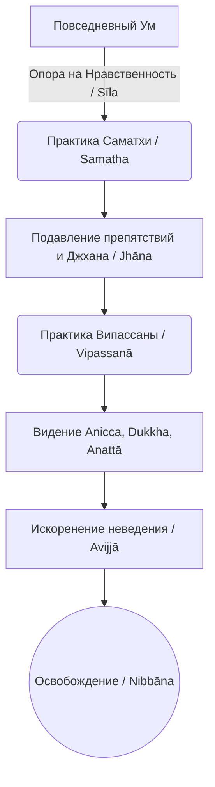

Современная жизнь часто разрывает наше внимание на части: бесконечные потоки информации, рабочие дедлайны и социальное давление создают хронический стресс и глубокое внутреннее напряжение (*dukkha*). В попытках обрести покой мы часто пытаемся силой заставить свой ум замолчать или убегаем в постоянную смену впечатлений и развлечения, но такое подавление лишь временно маскирует проблему и усиливает напряжение.

Учение Будды предлагает практичный, глубокий и терапевтический подход к исцелению ума: систему медитации, состоящую из двух неразрывно связанных навыков. Вместо того чтобы бороться с умом, мы сначала успокаиваем его (*samatha*), превращая в стабильный инструмент, а затем используем эту ясность для прямого прозрения (*vipassanā*). Развивая эти качества, мы не только обретаем идеальный эмоциональный баланс, но и прокладываем прямой путь к абсолютному освобождению.

## Успокоение и прозрение: Два крыла пробуждения

Оба этих качества абсолютно необходимы для обретения истинного знания и освобождения ума, при этом каждое выполняет свою уникальную и незаменимую работу.

**Успокоение (Саматха / *samatha*)** — это безмятежность и тишина ума, достигаемые через объединение внимания на одном подходящем статичном объекте (например, на дыхании). Ее главная функция заключается в развитии сосредоточения (*samādhi*) и полном (но временном) подавлении ментальных колебаний и пяти грубых препятствий: чувственного желания, недоброжелательности, вялости, беспокойства и сомнения. Когда ум развит через успокоение, отбрасывается вожделение и чувственная жажда (*rāga*). В классической традиции эта практика кульминирует в достижении джхан (*jhāna*) — состояний полного медитативного поглощения.

**Прозрение (Випассана / *vipassanā*)** — это прямое медитативное видение явлений в их истинной природе. В отличие от успокоения, прозрение направлено на безоценочное наблюдение за непрерывно меняющимся потоком телесного и умственного опыта. Ее задача — не успокоение ради успокоения, а исследование реальности для постижения непостоянства (*anicca*), страдательности (*dukkha*) и безличности (*anattā*). Прозрение развивает мудрость (*paññā*) и полностью искореняет фундаментальное неведение (*avijjā*).

> Ум, осквернённый вожделением, не освобождается; мудрость, осквернённая неведением, не может расцвести. Таким образом, монахи, вследствие угасания вожделения происходит освобождение ума; вследствие угасания неведения происходит освобождение мудростью.
>
> — ([АН 2.30](https://theravada.ru/Teaching/Canon/Suttanta/Texts/an2_30-dasama-sutta-sv.htm))

## Интеграция в Путь и механика ума

В структуре Благородного восьмеричного пути эти два навыка опираются на прочный фундамент нравственности (*sīla*), которая очищает ум от грубого раскаяния и тревоги. Саматха напрямую развивает группу сосредоточения (*samādhikkhandha*), обеспечивая энергию и стабильность. Випассана развивает группу мудрости (*paññākkhandha*), опираясь на Правильную осознанность для наблюдения за феноменами.

**Механика ума:** Успокоение и прозрение работают в идеальном тандеме. Поскольку мудрость, оскверненная неведением, не может расцвести, саматха подавляет препятствия, делая ум ясным, кристально чистым и неподвижным. Випассана же использует этот сфокусированный ум как острый скальпель, чтобы вырвать корни неведения и навсегда прекратить страдание. Когда вы практикуете випассану (например, через метод мысленного отмечания феноменов по мере их возникновения), энергия оттекает от концептуального ума, позволяя интуитивной мудрости увидеть, что монолитное «Я» — это лишь быстрая последовательность безличных процессов.

## Ментальные модели и границы

Для понимания взаимодействия этих практик используются наглядные аналогии. Загрязнения ума подобны примесям в чаше с водой. **Успокоение** подобно процессу отстаивания воды, когда муть оседает на дно, делая воду прозрачной. **Прозрение** — это сам акт вглядывания в чистую воду для безошибочного постижения истины.

Другая модель — исследование темной комнаты. **Саматха** подобна мощному фонарику в руках: если рука дрожит (ум беспокоен), вы ничего не сможете разглядеть; сосредоточение делает луч света стабильным и ярким. **Випассана** — это сам акт внимательного разглядывания комнаты, благодаря которому вы понимаете, что пугающий монстр в углу — это просто старая одежда.

Важно четко понимать различия этих двух методов:

| Характеристика | Успокоение (*Samatha*) | Прозрение (*Vipassanā*) |
| :--- | :--- | :--- |
| **Объект медитации** | Единый, статичный концептуальный объект (например, дыхание или дружелюбие). | Непрерывно меняющийся поток телесного и умственного опыта (*nāma-rūpa*). |
| **Устраняемое препятствие** | Временно подавляет вожделение, страсть (*rāga*) и пять помех. | Навсегда искореняет фундаментальное неведение (*avijjā*). |
| **Развиваемое качество** | Сосредоточение (*samādhi*), глубокий покой, остановка блуждания ума. | Высшая мудрость (*paññā*) и видение реальности как она есть. |
| **Предел практики** | Ведет к высоким перерождениям, но само по себе не освобождает от сансары. | Ведет к полному постижению Истин и достижению Ниббаны. |

## Практическое руководство: Жизненные сценарии и алгоритм

На практике эти два подхода могут быть адаптированы под нужды современного человека. Согласно «Юганаддха-сутте», Будда указывал, что практикующие могут комбинировать эти методы четырьмя способами (например, сначала развивая саматху как базу для випассаны, или наоборот, опираясь на пороговое сосредоточение для исследования).

**Сценарий 1: Информационный перегруз и паника (Применение Саматхи)**

  * *Ситуация:* После долгого рабочего дня за монитором ваш ум перевозбужден, горят сроки, мысли скачут, вы испытываете стресс и тревогу.
  * *Действие Дхаммы:* Вам нужно сбросить обороты. Практикуйте **успокоение**, сфокусировав всё внимание на простом статичном объекте — например, на дружелюбии (*mettā*) или ощущении дыхания на кончике носа (*ānāpānasati*), игнорируя любые отвлекающие мысли.
  * *Результат:* Ум собирается в одной точке, единонаправленность подавляет препятствие беспокойства (*uddhacca*). Тревога сменяется глубоким покоем и собранностью, ум становится готовым к работе.

**Сценарий 2: Физическая боль или эмоциональное разочарование (Применение Випассаны)**

  * *Ситуация:* Вы испытываете сильную физическую боль от долгого сидения или глубокое раздражение от критики и неудачи.
  * *Действие Дхаммы:* Вместо того чтобы сопротивляться боли или раскручивать сюжет обиды (или пытаться отвлечься от них, что делает саматха), примените **прозрение**. Наблюдайте эти явления просто как безличные процессы психики и материи, бесстрастно отмечая их возникновение и исчезание («боль, боль», «раздражение, раздражение»).
  * *Результат:* Как только турбулентность выражает себя, а вы терпимо за ней наблюдаете, она сгорает. Вы осознаете, что боль или раздражение — это просто меняющееся напряжение, а не ваша истинная сущность (*anattā*). Цепляние ослабевает, и умственное страдание растворяется.

## Главный вывод и источники

Успокоение (*samatha*) и прозрение (*vipassanā*) — это не враждующие техники или лагеря, а два необходимых навыка, идеально дополняющих друг друга. Как птице нужны оба крыла для полета, так и нашему уму требуются непоколебимый покой и пронзительная мудрость. Найдя золотую середину между ними, мы объединяем их силы как «быструю пару посланников» для прорыва к абсолютному освобождению — Ниббане.

**Источники для изучения:**

  * ([АН 2.30: Видджабхагия-сутта](https://theravada.ru/Teaching/Canon/Suttanta/Texts/an2_30-dasama-sutta-sv.htm))
  * ([АН 4.170: Юганаддха-сутта](https://theravada.ru/Teaching/Canon/Suttanta/Texts/an4_170-yuganaddha-sutta-sv.htm))
  * ([СН 35.204: Кимсука-сутта](https://theravada.ru/Teaching/Canon/Suttanta/Texts/sn35_204-atitayadanicca-sutta-sv.htm)) — О быстрой паре посланников (саматхе и випассане).
  * Махаси Саядо, «Прогресс прозрения».

-----

**Проверка понимания:**
Представьте, что практикующий во время медитации достигает невероятно приятного, глубокого, ровного и тихого состояния ума, сфокусировавшись на дыхании. Он чувствует себя защищенным от всех мирских проблем, решает, что это состояние блаженства и есть конечная цель, и начинает просто ежедневно наслаждаться им, избегая любого анализа или наблюдения за изменчивостью этого состояния.

Какую из двух практик активно развивает этот медитирующий, а какой пренебрегает? Какое фундаментальное загрязнение ума (согласно учению Будды) останется нетронутым при таком однобоком подходе, и почему это прекрасное состояние само по себе не приведет к полному освобождению от круговорота перерождений?
