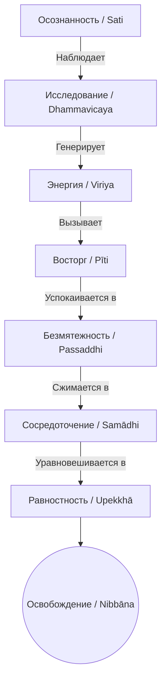

Повседневная рутина часто бросает нас из одной крайности в другую: от нервного истощения и информационной перегрузки к глубокой апатии, лени и выгоранию. В попытках нащупать баланс мы прибегаем к внешним стимуляторам — кофеину для бодрости или цифровым развлечениям для расслабления, — но в итоге лишь сильнее расшатываем свою нервную систему. Эта хроническая усталость и неудовлетворенность (*dukkha*) происходят от того, что мы не умеем правильно регулировать состояния собственного ума.

Учение Будды предлагает точный психологический механизм внутренней саморегуляции, который совершенно не зависит от внешних условий. Взращивая эти качества, мы не только обретаем идеальный эмоциональный баланс, но и прокладываем прямой путь к абсолютному освобождению ума от страданий.

## Семь факторов Пробуждения: Балансир и двигатель освобождения

**Семь факторов Пробуждения** (*satta bojjhaṅgā*) — это ключевой набор ментальных качеств, который в буддийской психологии является как средством достижения просветления, так и самим его содержанием. Эти факторы функционируют как направленное противоядие от пяти умственных помех (*pañcanīvaraṇā*), устраняя сонливость, беспокойство и сомнения, расчищая путь к высшей мудрости.

Их главная задача — трансформировать обычное, нестабильное внимание в мощный инструмент освобождения. В суттах подчеркивается, что эти качества не возникают сами по себе; они требуют осознанного развития, которое опирается на уединение, бесстрастие и прекращение, в конечном итоге созревая в полном оставлении любых привязанностей.

## Анатомия пути: Три группы и механика ума

Семь факторов Пробуждения не являются случайным набором. Их механика разворачивается в строгой последовательности, формируя цельную систему, которую можно разделить на три функциональные группы:

**1. Пробуждающие факторы (Активаторы):**

  * **Исследование феноменов** (*dhammavicayasambojjhaṅga*): Проницательное, аналитическое качество ума, различающее благотворные состояния от неблаготворных (например, объективное наблюдение за телесными ощущениями и эмоциями).
  * **Усердие / Энергия** (*viriyasambojjhaṅga*): Динамичная сила, которая стряхивает апатию. Она растет от начального энтузиазма к непоколебимой настойчивости.
  * **Восторг** (*pītisambojjhaṅga*): Радостный, вдохновляющий интерес к объекту созерцания, наполняющий ум и тело живой энергией.

**2. Успокаивающие факторы (Стабилизаторы):**

  * **Безмятежность** (*passaddhisambojjhaṅga*): Успокоение ментального и физического тела, когда бурный восторг утихает, оставляя ясный покой.
  * **Сосредоточение** (*samādhisambojjhaṅga*): Однонаправленность ума, глубокая собранность на объекте без отвлечений.
  * **Равностность / Невозмутимость** (*upekkhāsambojjhaṅga*): Высший баланс ума, созерцающий происходящее абсолютно ровно, без влечения и отторжения.

**3. Универсальный балансир:**

  * **Осознанность** (*satisambojjhaṅga*): Фундамент всей системы. Осознанность контролирует процесс, гарантируя, что ум остается ясным и сбалансированным, не впадая ни в вялость, ни в возбуждение.

**Механика ума:** Развитие этих качеств запускается осознанностью: утвердившись, она стимулирует исследование феноменов. Процесс исследования порождает энергию. Энергия вызывает восторг. По мере созревания восторг сменяется глубокой безмятежностью, которая позволяет уму сжаться в точку сосредоточения. Наконец, совершенное сосредоточение рождает безупречную равностность.

> Монахи, когда монах взращивает памятование как фактор Пробуждения, которое зиждется на уединении, на бесстрастии, на прекращении и созревает в освобождении... когда семь факторов Пробуждения взращены и развиты таким образом, они наполняют истинное знание и Освобождение.
>
> — ([МН 118](https://theravada.ru/Teaching/Canon/Suttanta/Texts/mn118-anapanasati-sutta-sv.htm))

## Ментальные модели и границы: Искусство поддержания огня

Будда объяснял применение факторов Пробуждения через наглядную аналогию с костром. Если костер угасает (ум находится в состоянии вялости и сонливости), бессмысленно сыпать на него мокрую траву. В этот момент нужно подкинуть сухих дров — применить **пробуждающие факторы** (исследование, энергию, восторг).

Если же костер полыхает слишком сильно (ум охвачен беспокойством и тревогой), нельзя кидать в него сухие ветки. Необходимо полить его водой и накрыть мокрой травой — применить **успокаивающие факторы** (безмятежность, сосредоточение, равностность). **Осознанность** же необходима всегда — как мудрый смотритель за костром, который решает, что именно сейчас нужно добавить.

| Характеристика | Семь факторов Пробуждения (*satta bojjhaṅgā*) | Мирские эмоциональные состояния |
| :--- | :--- | :--- |
| **Основа** | Бесстрастие, уединение и мудрость. | Жажда (*taṇhā*), эгоцентризм, поиск выгоды. |
| **Восторг / Радость** | Возникает из чистоты ума и видения реальности. | Возникает от стимуляции чувств, быстро переходит в скуку. |
| **Равностность** | Ясное, бдительное, сбалансированное наблюдение. | Холодное равнодушие, подавление эмоций, апатия. |

## Практическое руководство: Дхамма в повседневности

**Сценарий 1: Профессиональное выгорание и апатия**

  * **Ситуация:** Вы сидите за рабочим столом, чувствуя тупость в уме, лень и полное отсутствие мотивации.
  * **Действие Дхаммы:** Осознанность фиксирует состояние вялости. Вы активируете **исследование феноменов**: начинаете анализировать свои ощущения (как именно ощущается тяжесть в теле, где она локализована). Это микро-исследование пробуждает **энергию** и интерес.
  * **Результат:** Ментальный туман и апатия рассеиваются, появляется воодушевляющий **восторг** от ясного видения того, как работает ваш ум, возвращая работоспособность без стресса.

**Сценарий 2: Преддедлайновая тревога**

  * **Ситуация:** Завтра важный релиз или выступление. Мысли лихорадочно скачут, перебирая худшие варианты развития событий (неугомонность).
  * **Действие Дхаммы:** Осознанность замечает перевозбуждение. Вы намеренно откладываете стимуляторы и применяете **безмятежность**: расслабляете физическое напряжение и переводите фокус на медленное дыхание. Развивая **сосредоточение** на вдохах и выдохах, вы заземляете ум.
  * **Результат:** Возбуждение утихает, ум приходит к прохладной **равностности**. Тревожные концепции растворяются, и вы начинаете действовать из состояния спокойной уверенности.

**Алгоритм интеграции (Механика медитации):**
При практике сатипаттханы или анапанасати развитие происходит каскадно:

## Заключительное слово и источники

Семь факторов Пробуждения — это не абстрактная догма, а рабочая инструкция по тонкой настройке своего ума. Как опытный музыкант настраивает инструмент, не перетягивая и не ослабляя струны, так и практикующий использует осознанность, чтобы балансировать между успокоением и активацией. Когда эти семь качеств достигают совершенного баланса, они прорезают иллюзии неведения и реализуют наивысшую цель Дхаммы — абсолютную свободу.

**Источники для изучения:**

  * ([МН 118: Анапанасати-сутта](https://theravada.ru/Teaching/Canon/Suttanta/Texts/mn118-anapanasati-sutta-sv.htm))
  * ([СН 46.51: Ахара-сутта](https://theravada.ru/Teaching/Canon/Suttanta/Texts/sn46_51-ahara-sutta-sv.htm))
  * ([СН 46.53: Агги-сутта](https://theravada.ru/Teaching/Canon/Suttanta/Texts/sn46_53-aggi-sutta-sv.htm))

-----

**Проверка понимания:**

Представьте практикующего, который во время медитации испытывает сильное перевозбуждение, его ум вибрирует от избытка навязчивых мыслей (*uddhacca*), и он не может усидеть на месте. Решив, что ему нужно «пробиться» сквозь это состояние, он начинает с огромным напряженным усилием (*viriya*) и агрессивным анализом (*dhammavicaya*) исследовать каждую мысль, пытаясь силой вызвать в себе радостный восторг (*pīti*).

Какую фундаментальную ошибку он совершает с точки зрения механики Семи факторов Пробуждения (согласно аналогии с костром из СН 46.53)? Какие конкретно факторы ему следует применить прямо сейчас, чтобы вернуть ум в состояние баланса?
