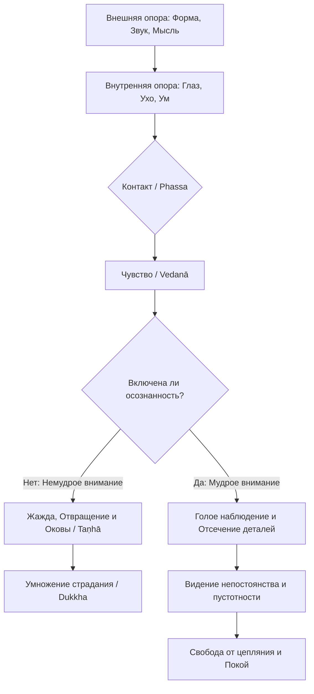

Жизнь в эпоху цифровых технологий — это непрерывная атака на нашу нервную систему. Уведомления смартфонов, рекламные баннеры, несмолкающий гул мегаполиса и бесконечный внутренний диалог перегружают нас, вызывая хронический стресс, выгорание и глубокую неудовлетворенность (*dukkha*). Мы чувствуем себя подавленными, пытаясь контролировать этот огромный внешний мир или свои реакции на него, и часто безуспешно пытаемся отгородиться, меняя работу, партнеров или место жительства.

Однако учение Будды предлагает радикально иной, в высшей степени прагматичный подход. Проблема кроется не в самом мире, а в том, как именно наш ум с ним контактирует. Вместо того чтобы бороться с бесконечной сложностью Вселенной, нам достаточно понять и взять под бдительный контроль те врата, через которые этот мир вообще проникает в сознание. Эти врата называются шестью сферами восприятия, и именно здесь разворачивается главная битва за наш внутренний покой и абсолютную свободу.

## Шесть сфер: Врата конструирования реальности

**Шесть сфер**, или шесть внутренних и внешних опор чувств (*saḷāyatana*), дают исчерпывающее представление о тотальности нашего опыта. В обыденном состоянии мы привыкли верить, что существует некий прочный, объективный внешний мир, внутри которого перемещается наше независимое «я». Но Будда учил, что для нас «Всё» (*sabba*) ограничивается исключительно этими шестью каналами. Вне их мы не способны ничего познать или испытать.

Какую именно ментальную проблему решает этот инструмент? Обучая шести сферам, Будда деконструирует иллюзию монолитного, твердого опыта. Он показывает, что переживаемый нами мир — это не сплошная картина, а непрерывный, стремительно сменяющийся процесс взаимодействия органов чувств и их объектов. Понимание этого факта развязывает узел слепой жажды (*taṇhā*): когда мы ясно видим, что наш опыт разбивается на безличные и непостоянные фрагменты, мы перестаем цепляться за него как за свое «я» или свою собственность.

## Архитектура опыта и механика ума

Учение разбивает процесс восприятия реальности на три ключевых элемента, которые непрерывно взаимодействуют друг с другом:

1.  **Шесть внутренних опор (*Ajjhattikāyatana*):** Это наши воспринимающие аппараты или органы чувств. К ним относятся опора глаза, уха, носа, языка, тела и ума (*mano*). В буддийской психологии ум рассматривается как полноправный шестой орган чувств, воспринимающий абстрактные идеи, воспоминания и эмоции так же объективно, как глаз воспринимает свет.
2.  **Шесть внешних опор (*Bāhirāyatana*):** Это объекты, которые воспринимаются нашими дверями чувств. К ним относятся формы, звуки, запахи, вкусы, осязаемые объекты и ментальные феномены (*dhammā*).
3.  **Точка контакта (*Phassa*):** Точка пересечения. Контакт возникает только тогда, когда здоровый орган чувства, внешний объект и соответствующее им сознание (например, зрительное сознание) встречаются вместе в один момент времени.

**Механика ума:** Шесть опор чувств являются первичной почвой, в которой укореняется и разрастается жажда. Как только происходит контакт, мгновенно и автоматически возникает чувство (*vedanā*) — приятное, болезненное или нейтральное. Если в этот момент отсутствует Правильная осознанность (*sammā-sati*), приятное чувство немедленно порождает страстное вожделение (жажду продлить опыт), а болезненное — гнев и отторжение. Так формируются оковы (*saṃyojana*), запускающие цепную реакцию зависимого возникновения и ведущие к новому витку страданий.

## Ментальные модели и границы

**Модель пылающего костра:** Чтобы проиллюстрировать огромную опасность неосознанного восприятия, Будда использовал мощную метафору огня. В своей знаменитой «Огненной проповеди» он показал, что все врата чувств и их объекты охвачены пламенем загрязнений. Глаз пылает, формы пылают, сознание пылает в огне вожделения, ненависти и заблуждения. Пока мы не охраняем двери своих чувств, каждый новый контакт лишь подбрасывает дрова в этот всепоглощающий пожар.

> Монахи, всё пылает. И что такое это «всё», что пылает? Глаз пылает, формы пылают, сознание глаза пылает, контакт глаза пылает, любое чувство, возникшее при контакте глаза как условии... Пылает в чём? Пылает в огне вожделения, в огне ненависти, в огне заблуждения...
>
> — [СН 35.28](https://theravada.ru/Teaching/Canon/Suttanta/Texts/sn35_28-aditta-sutta-sv.htm)

**Модель пустотности:** Другая важнейшая концепция гласит, что мир изначально «пуст» (*suñña*). Глаз, формы и возникающее на их основе сознание полностью пусты от некоего вечного «я» или того, что могло бы принадлежать этому «я» ([СН 35.85](https://theravada.ru/Teaching/Canon/Suttanta/Texts/sn35_85-sunnyaloka-sutta-sv.htm)).

Что значит практиковать работу с шестью сферами? Это практика защиты дверей чувств (*indriyasaṃvara*). Важно четко понимать, чем эта практика не является, чтобы избежать крайностей:

| Характеристика | Защита дверей чувств в Дхамме | Мирское подавление чувств (Искажение) |
| :--- | :--- | :--- |
| **Реакция на объект** | Видит объект, но не цепляется за его концептуальные детали и нарративы. | Пытается физически закрыть глаза и уши, трусливо убежать от мира. |
| **Состояние ума** | Бдительность, ясное постижение (*sampajañña*) и глубокая расслабленность. | Невротическое напряжение, отторжение и постоянный страх перед объектами. |
| **Результат** | Контакт останавливается на уровне чистого, пустого восприятия. | Фоновая тревога, неизбежный эмоциональный срыв и усиление жажды. |

## Практическое руководство: Охрана врат в IT-эпоху

Как применять это учение мирянину, программисту или офисному работнику, который 10 часов в день проводит в информационном потоке?

**Сценарий 1: Прокрутка ленты новостей и цифровая зависимость**

  * **Ситуация:** Вы бездумно скроллите социальные сети, испытывая фоновую тревогу или зависть к чужой жизни, либо ваша рука автоматически тянется кликнуть на всплывающее уведомление.
  * **Действие Дхаммы:** Вы осознаете базовый процесс: *глаз* контактирует с *формами* (светящимися пикселями на экране). Возникает приятное или неприятное *чувство*. Вы применяете осознанность, мысленно отмечая: «вижу, вижу» или «намерение кликнуть», не позволяя уму достраивать вторичные детали и концептуальные истории («кто это написал?», «что там нового?»).
  * **Результат:** Вы разрываете автоматическую связь между чувством и жаждой. Скроллинг теряет над вами свою гипнотическую власть, цифровая зависимость ослабевает, и ум успокаивается.

**Сценарий 2: Раздражающий шум или агрессивная критика**

  * **Ситуация:** Соседи делают ремонт, звук перфоратора не дает сосредоточиться, или коллега резко критикует вашу работу. Внутри всё сжимается от неприятного чувства.
  * **Действие Дхаммы:** Вы деконструируете опыт на чистые элементы: *ухо* + *звук* + *сознание уха* = *контакт*. Возникает болезненное чувство. Вместо того чтобы питать гнев нарративами («они портят мне день», «он меня совершенно не уважает»), вы фиксируете само голое звучание как непостоянный акустический феномен.
  * **Результат:** Шум остается лишь вибрацией, попадающей в ушную раковину. «Вторая стрела» (умственное страдание и гнев) не выпущена, что позволяет вам отреагировать на ситуацию спокойно, взвешенно и профессионально.

**Алгоритм сдержанности чувств:**

## Заключительное слово и источники

Учение о шести сферах восприятия (*saḷāyatana*) возвращает нас из абстрактных размышлений о природе Вселенной к единственной реальности, которую мы действительно можем наблюдать и изменять, — к нашему собственному текущему опыту. Тщательно охраняя шесть врат чувств и созерцая их абсолютную пустотность, непостоянство и безличность, мы гасим пожар вожделения и ненависти. Переставая быть марионетками в руках внешних раздражителей, ум обретает прочную опору в независимости и естественным образом достигает абсолютного покоя — Ниббаны.

> При этом, монах распознает глаз и зрительные формы, и оковы, порожденные ими; он распознает, как происходит возникновение невозникших оков; он распознает, как происходит исчезновение возникших оков; и он распознает, как происходит невозникновение в будущем исчезнувших оков... [То же самое для уха, носа, языка, тела и ума]...
>
> — [ДН 22: Махасатипаттхана сутта](https://theravada.ru/Teaching/Canon/Suttanta/Texts/dn22-mahasatipatthansa-sutta-01-ivahnenko.htm)

**Источники для изучения:**

  * [ДН 22: Махасатипаттхана-сутта](https://theravada.ru/Teaching/Canon/Suttanta/Texts/dn22-mahasatipatthansa-sutta-01-ivahnenko.htm) — Созерцание качеств ума: Шесть внутренних и внешних опор.
  * [СН 35.28: Адиттапарияя-сутта](https://theravada.ru/Teaching/Canon/Suttanta/Texts/sn35_28-aditta-sutta-sv.htm) — Огненная проповедь о природе шести сфер.
  * [МН 148: Чачхакка-сутта](https://theravada.ru/Teaching/Canon/Suttanta/Texts/mn148-chachakka-sutta-sv.htm) — Детальный разбор шести групп шестёрок.
  * [СН 35.85: Суннья-сутта](https://theravada.ru/Teaching/Canon/Suttanta/Texts/sn35_85-sunnyaloka-sutta-sv.htm) — Сутта о пустоте мира.

-----

**Проверка понимания:**

Представьте, что вы приходите домой после тяжелого рабочего дня и чувствуете запах любимого блюда, которое готовится на кухне. У вас мгновенно текут слюни, и вы начинаете увлекаться этой фантазией, предвкушая удовольствие, испытывая сильное желание немедленно съесть порцию и злясь на то, что ужин еще не готов.

Опираясь на концепцию шести сфер восприятия (*saḷāyatana*), опишите этот процесс:

1.  Какие конкретно *внутренние* и *внешние* опоры задействованы на первом этапе формирования этого опыта?
2.  Какое чувство (*vedanā*) возникает следом за контактом?
3.  В какой именно момент формируются оковы (*saṃyojana*), ведущие к жажде и умственному страданию, и как понимание пустотности (*suñña*) может помочь вам отпустить фантазию и вернуться в осознанное состояние?
