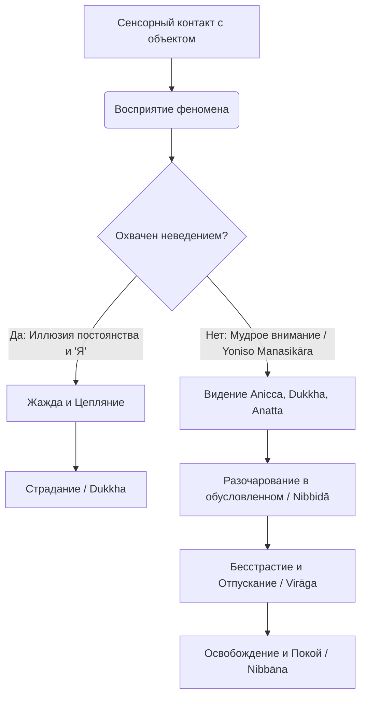

Ежедневная рутина часто превращается в изматывающую гонку за стабильностью. Мы отчаянно пытаемся зафиксировать карьерный успех, удержать ускользающую молодость, сохранить идеальные отношения и выстроить незыблемый образ самих себя. Но поскольку реальность непрерывно меняется, эти попытки удержать контроль неизбежно рушатся, оставляя нас в состоянии хронического стресса, выгорания и тревоги. Этот внутренний надлом происходит не из-за враждебности окружающей среды, а из-за фундаментальной ошибки нашего восприятия.

Учение Будды предлагает точный и радикальный инструмент для перенастройки этого искаженного взгляда. Вместо того чтобы бессмысленно сражаться с естественным ходом вещей, мы можем научиться видеть истинную природу явлений. Постижение трех универсальных характеристик бытия снимает с нас неподъемный груз попыток контролировать неконтролируемое и открывает прямой путь к абсолютному внутреннему покою.

## Три характеристики бытия: Ключ к разобусловливанию ума

В самом сердце буддийского учения лежит концепция **трех характеристик существования** (_ti-lakkhaṇa_). Это фундаментальный закон природы, описывающий истинное положение всех обусловленных феноменов. Буддизм не требует слепой веры в эти характеристики; он предлагает использовать их как практическую линзу, увеличительное стекло для исследования любого своего физического и ментального опыта.

Главная «работа» этого учения заключается в разрушении когнитивных иллюзий. Наш ум скован узлом неведения (_avijjā_), из-за которого мы плетем плотную сеть из трех заблуждений: мы верим, что обусловленные явления постоянны, что они могут стать источником истинного счастья и что они обладают неким неизменным ядром, нашим «я». Это неведение порождает жажду (_taṇhā_) и цепляние. Учение о трех характеристиках последовательно разрезает этот узел: когда ум ясно видит, что ни за что в этом мире невозможно удержаться, чары разрушаются, цепляние отпадает само собой, и наступает освобождение.

## Механика восприятия: Аничча, Дуккха, Анатта

Все телесные и ментальные факторы — это преходящие, динамичные процессы, которые можно свести к трем ключевым принципам:

1. **Непостоянство (_anicca_):** Ни один физический или ментальный феномен не является статичным. Это сам процесс возникновения, падения и изменения феноменов. На микроуровне наши мысли, эмоции и телесные ощущения рождаются и исчезают каждое мгновение. Осознание того, что ничто не остается неизменным даже на долю секунды, — это прямое видение непостоянства.
2. **Неудовлетворенность (_dukkha_):** Поскольку все явления нестабильны и мимолетны, они фундаментально неспособны обеспечить нам вечное, надежное убежище. Любые попытки возложить на элементы нашего опыта надежды на прочное счастье обречены на провал. Любое счастье, зависящее от непостоянных вещей, неизбежно закончится, оставив после себя боль утраты.
3. **Безличность (_anattā_):** Характеристика безличности означает, что феномены ума и материи не поддаются нашему абсолютному контролю и властвованию. Элементы нашего опыта появляются в строгом соответствии с причинами и условиями. Будда указывал: если бы наше тело или ум были нашим «я», мы могли бы приказать им не стареть и не страдать. Но поскольку мы не имеем такой власти, ни в теле, ни в уме нет никакого неизменного ядра или души; понятие самости является лишь концептуальным ярлыком.

Эти три принципа связаны строгой логической последовательностью: прозрение в непостоянство обнажает тот факт, что изменчивые вещи приносят страдание, а то, что непостоянно и приносит страдание, не может быть нашим истинным «я».

> Чувство непостоянно… Восприятие непостоянно… Волевые конструкции непостоянны… Сознание непостоянно. То, что непостоянно, то страдательно. То, что страдательно, то безлично.
>
> — [СН 22.59](https://theravada.ru/Teaching/Canon/Suttanta/Texts/sn22_59-anatta-lakkhana-sutta-sv.htm)

**Механика ума:** В практике медитации прозрения (_vipassanā_) мы наблюдаем феномены без концептуальных надстроек. Когда интуитивный интеллект (_paññā_) видит, что мысль — это просто вибрация энергии, которая исчезнет через секунду (_anicca_), ум перестает отождествлять себя с ней (_anattā_) и избавляется от страдания (_dukkha_), которое эта мысль могла бы причинить.

## Ментальные модели и границы иллюзий

Для глубокого постижения изменчивой природы ума Будда использовал мощные природные аналогии. Наше чувствование (_vedanā_) он уподоблял водяному пузырю, который мгновенно лопается во время проливного дождя, будучи полым внутри. Наше восприятие (_saññā_) он сравнивал с дрожащим миражом в летний полдень, который лишь обманывает зрение.

Другая классическая аналогия — **попытка удержать воду в плотно сжатом кулаке**. Чем сильнее мы сжимаем пальцы (цепляние за «Моё»), тем быстрее вода утекает (_anicca_), оставляя нас с болезненным спазмом в руке (_dukkha_). Понимание _anattā_ — это осознание того, что ни вода, ни сам кулак нам на самом деле не принадлежат. Расслабление ладони не уничтожает руку, но мгновенно избавляет от боли.

Важно правильно понимать границы этих принципов, избегая современных искажений:

| Характеристика | Истинное понимание Дхаммы | Обыденное заблуждение / Искажение |
| :--- | :--- | :--- |
| **Аничча** | Прямое видение того, как каждый феномен возникает и исчезает микро-моментами. | Тревога о будущем, обесценивание жизни («всё равно всё умрет»). |
| **Дуккха** | Фундаментальная ненадежность всего обусловленного (даже приятного). | Депрессивный пессимизм, позиция жертвы, фокус только на боли. |
| **Анатта** | Понимание того, что явления — это безличные процессы без фиксированного ядра. | Нигилизм: вера в то, что «меня вообще нет» или безответственность за поступки. |

## Практическое руководство: Дхамма в повседневности

**Сценарий 1: Профессиональный провал (Кризис перемен)**

*   **Ситуация:** Вы потеряли важный проект или престижную должность, с которой себя глубоко идентифицировали. Ум генерирует панику: «Я неудачник, моя жизнь рушится».
*   **Действие Дхаммы:** Примените принцип _anattā_ (безличности) и _anicca_ (непостоянства). Напомните себе, что карьера и статус — это набор внешних, обусловленных условий, которые всегда были нестабильны. Вы не являетесь своей профессией.
*   **Результат:** Прекращение отождествления с социальной ролью снимает тяжесть экзистенциального провала и снижает уровень стресса. Ум восстанавливает ясность для прагматичных действий.

**Сценарий 2: Тревога о здоровье и физическая боль**

*   **Ситуация:** Вы обнаруживаете первые признаки старения или сталкиваетесь с сильной физической болью. Возникает сопротивление: «Только не сейчас! За что мне это?».
*   **Действие Дхаммы:** Рассмотрите боль через призму _dukkha_ и _anicca_. Признайте, что тело физически не способно оставаться неизменным. Перестаньте бороться с фактом наличия боли. Направьте внимание на само ощущение и мысленно отмечайте: «боль, пульсация, напряжение».
*   **Результат:** Вместо того чтобы сопротивляться, вы принимаете изменчивость как объективный закон. Вы перестаете пронзать себя «второй стрелой» ментального сопротивления, и умственное страдание угасает. Боль остается чистым физическим ощущением, не затрагивающим ваше «Я».

**Алгоритм реализации прозрения:**

## Заключительное слово и источники

Постижение непостоянства, неудовлетворенности и безличности — это не пессимистичный взгляд на мир, а высшая форма реализма и глубоко терапевтический процесс. Будда учил этому не для того, чтобы ввергнуть нас в уныние, а чтобы показать выход. Перестав требовать от мира вечности и абсолютного контроля, перестав искать свое «я» в безличном, мы сбрасываем тяжкое бремя ожиданий. Именно это разочарование в иллюзиях становится началом пути к непревзойденной свободе и высшему счастью освобожденного ума.

**Источники для изучения:**

*   [СН 22.59 Анатталаккхана сутта](https://theravada.ru/Teaching/Canon/Suttanta/Texts/sn22_59-anatta-lakkhana-sutta-sv.htm) — Беседа о характеристике безличностности.
*   [СН 22.95 Пхенапиндупама сутта](https://theravada.ru/Teaching/Canon/Suttanta/Texts/sn22_95-phena-pinduphama-sutta-sv.htm) — Метафоры пустотности (Комок пены).

---

**Проверка понимания:**

Практикующий медитацию достиг состояния невероятного спокойствия, радости и кристальной ясности ума (глубокого сосредоточения). Почувствовав это тонкое блаженство, он думает: _«Вот оно! Наконец-то я нашел истинное, безопасное прибежище. Это прекрасное состояние покоя и есть мое истинное, совершенное, очищенное 'Я'»_.

Опираясь на учение о трех характеристиках (_ti-lakkhaṇa_), объясните: какую фундаментальную когнитивную ошибку совершает медитирующий? Как применение принципов _anattā_ (безличности) и _anicca_ (непостоянства) к этому возвышенному состоянию радости должно трансформировать его опыт, чтобы оно не стало новой, еще более тонкой ловушкой неведения?
