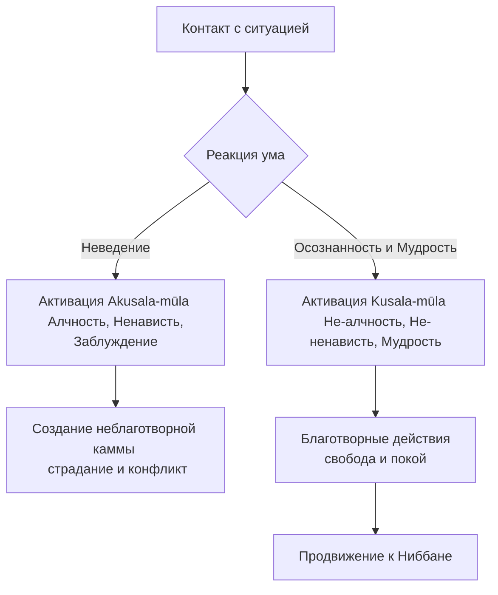

Каждому из нас знакомо чувство, когда жизнь выходит из-под контроля. Нас изматывает бесконечная погоня за статусом, мы выгораем от раздражения на несправедливость и чувствуем глубинную растерянность. Мы пытаемся бороться с внешними обстоятельствами, надеясь обрести покой, но стресс лишь усиливается. Учение Будды предлагает радикально иной подход, указывая, что корень всех наших проблем лежит не во внешнем мире, а в фундаментальной болезни нашего собственного ума.

Постигнув и методично искоренив три неблагих корня (*akusala-mūla*), мы устраняем саму причину неудовлетворенности (*dukkha*) и открываем прямой путь к абсолютному освобождению.

## Три неблагих корня: Вирус в операционной системе ума

В буддийской психологии любые наши намеренные действия (*kamma*) оцениваются как благотворные или неблаготворные в зависимости от базовых мотивов, из которых они произрастают. Эти фундаментальные мотивы называются «корнями» (*mūla*). Три неблагих корня — это алчность (*lobha*), ненависть (*dosa*) и заблуждение (*moha*).

Их главная «работа» заключается в том, чтобы искажать наше восприятие реальности и генерировать разрушительные мысли, слова и поступки. Любое действие, совершенное под их влиянием, неизбежно приносит страдание как самому человеку, так и окружающим. Заменяя эти ядовитые мотивы на их благотворные противоположности, мы развязываем кармические узлы и постепенно очищаем свой ум.

## Архитектура страданий и механика ума

Механика ума в учении Будды опирается на три ключевых неблаготворных фактора, которые порождают весь спектр человеческих конфликтов и негативных эмоций:

1.  **Алчность / Жадность (*lobha*):** Это эгоцентричное желание, привязанность, страсть и стремление к удовольствиям, выживанию, власти и престижу. Алчность подобна клею: она заставляет ум судорожно цепляться за приятные объекты, не желая их отпускать.
2.  **Ненависть / Отвращение (*dosa*):** Это реакция отторжения, включающая в себя гнев, раздражение, осуждение, враждебность и насилие. Если алчность притягивает ум к объекту, то ненависть агрессивно отталкивает его, пытаясь уничтожить или отвергнуть причину дискомфорта.
3.  **Заблуждение / Неведение (*moha*):** Это ментальная слепота, фундаментальное неведение (*avijjā*), которое скрывает истинную природу вещей. Заблуждение является самым коварным корнем, так как именно оно служит толстым слоем нечувствительности и питательной средой, в которой произрастают алчность и ненависть.

**Механика ума:** Когда эти три корня захватывают власть над умом, человек теряет способность ясно различать, что ведет к благу, а что к пагубе. Движимый ими, он может убивать, воровать, лгать и причинять боль другим, ошибочно полагая, что это принесет ему счастье. Однако, согласно объективному закону кармы, эти действия неминуемо возвращаются к нему в виде боли и духовной деградации. Активация этих корней запускается в момент сенсорного контакта: если отсутствует правильная осознанность, приятное чувство автоматически порождает жадность, неприятное — отвращение, а нейтральное погружает ум в заблуждение.

## Ментальные модели и границы

Для описания разрушительной природы этих корней традиция использует мощные метафоры.

**Аналогия с бамбуком:** Будда сравнивал ум, пораженный алчностью, ненавистью и заблуждением, с тростником или бамбуком, который погибает, когда приносит собственный плод. Точно так же неблагие корни рождаются внутри самого человека и разрушают его изнутри.

**Отравленное дерево:** Если корни дерева пропитаны ядом, то соки отравят каждую ветку и каждый плод. Даже если мы совершаем благотворительный поступок, но глубоко внутри нами движет жажда славы (*lobha*), этот поступок не принесет чистого счастья.

Чтобы избежать ошибок в практике, важно понимать разницу между неблагими корнями и их благотворными альтернативами:

| Характеристика | Неблаготворные корни (*Akusala-mūla*) | Благотворные корни (*Kusala-mūla*) |
| :--- | :--- | :--- |
| **Эмоциональный тон** | Алчность (*lobha*), Ненависть (*dosa*), Заблуждение (*moha*). | Не-алчность (*alobha*), Не-ненависть (*adosa*), Мудрость (*amoha* / *paññā*). |
| **Практическое проявление** | Эгоизм, агрессия, невежество и слепая жажда. | Отречение (щедрость), доброжелательность и ясное видение. |
| **Конечный результат** | Бесконечное страдание (*dukkha*) и вращение в сансаре. | Очищение ума, покой и достижение Ниббаны. |

## Практическое руководство: Дхамма в повседневности

**Сценарий 1: Зависть и статус на работе**

  * **Ситуация:** Вашего коллегу повысили, и вы чувствуете жгучую зависть, убеждая себя, что он этого не заслужил, и испытываете желание распускать сплетни.
  * **Действие Дхаммы:** Вы используете осознанность, чтобы заметить проявление **ненависти (*dosa*)** к коллеге и **алчности (*lobha*)** к статусу. Понимая, что злонамеренная речь — это неблаготворная камма, приносящая страдание, вы применяете корень не-ненависти (*adosa*), сознательно генерируя сорадование успехам коллеги.
  * **Результат:** Зависть сгорает, ум остается ясным, а ваша репутация и внутренний покой не страдают.

**Сценарий 2: Слепой потребительский импульс**

  * **Ситуация:** Вы испытываете стресс и покупаете очередную ненужную вещь в интернете, пытаясь заглушить внутренний дискомфорт.
  * **Действие Дхаммы:** Вы фиксируете импульс **алчности (*lobha*)**, подпитываемый **заблуждением (*moha*)** (верой в то, что внешняя вещь способна дать надежное счастье). Вы делаете паузу, применяя корень не-алчности (*alobha*), и просто наблюдаете за тем, как желание возникает и исчезает.
  * **Результат:** Вы сохраняете ресурсы и тренируете ум быть независимым от чувственных стимулов.

**Алгоритм отсечения неблагих корней:**

## Главный вывод и источники

Три неблагих корня — алчность, ненависть и заблуждение — являются первопричиной всех наших личных и социальных бед. Систематически заменяя их на щедрость, любовь и мудрость через практику Благородного восьмеричного пути, мы шаг за шагом разрушаем тюрьму собственного ума и достигаем абсолютного умиротворения.

> «Алчность — это корень неблаготворного, ненависть — это корень неблаготворного, заблуждение — это корень неблаготворного».
>
> — [МН 9: Саммадиттхи-сутта](https://theravada.ru/Teaching/Canon/Suttanta/Texts/mn9-sammaditthi-sutta-sv.htm)

**Источники для изучения:**

  * [МН 9: Саммадиттхи-сутта](https://theravada.ru/Teaching/Canon/Suttanta/Texts/mn9-sammaditthi-sutta-sv.htm) — Сутта о правильных воззрениях и корнях неблагого.
  * [АН 3.69: Акусламула-сутта](https://theravada.ru/Teaching/Canon/Suttanta/Texts/an3_69-akusala-mula-sutta-sv.htm) — О неблагих корнях.
  * [СН 3.2: Пуггала-сутта](https://theravada.ru/Teaching/Canon/Suttanta/Texts/sn3_2-purisa-sutta-sv.htm) — Сутта о человеке и разрушительной природе корней.

-----

**Проверка понимания:**
Представьте человека, который начал активно практиковать суровую медитацию по много часов в день. Однако делает он это исключительно с мыслью: «Я должен стать самым продвинутым практиком в своей группе, чтобы все мной восхищались, а если у меня не получается сосредоточиться, я начинаю ненавидеть себя и свой ум».

Или представьте политического активиста, который борется за социальную справедливость. Видя страдания людей, он переполняется праведным гневом и начинает публично оскорблять оппонентов, искренне считая, что делает доброе дело.

С точки зрения учения Будды о корнях каммы (*akusala-mūla*), являются ли действия этих людей полностью благотворными? Какие именно яды ума маскируются здесь под духовную практику или благородную цель, и к каким кармическим последствиям они приведут, если не изменить состояние ума?
