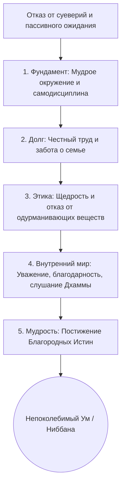

Современный человек тратит колоссальное количество энергии в попытках «поймать удачу за хвост». Мы ищем благоприятные знаки, читаем гороскопы, надеемся на удачное стечение обстоятельств или правильные знакомства, чтобы обрести безопасность и успех. Но когда обстоятельства неизбежно меняются, наша иллюзия контроля рушится, оставляя нас наедине с тревогой и глубокой неудовлетворенностью (*dukkha*). Мы ищем счастье там, где его по определению быть не может — во внешних, не зависящих от нас вещах.

Учение Будды предлагает радикальный сдвиг перспективы. В одной из самых известных своих бесед — «Маха-мангала сутте» (Великой сутте о благословениях) — Будда забирает концепцию удачи из рук слепого случая и возвращает ее нам. Он показывает, что истинное благословение — это не магический знак небес, а прагматичный, пошаговый процесс выстраивания своей жизни через правильные намерения и поступки (*kamma*), который ведет от простого бытового комфорта к абсолютному освобождению ума.

## Истинное благословение: Прагматичная архитектура счастья

Во времена Будды (как и сегодня) люди отчаянно спорили о том, что такое благословение или счастливое предзнаменование (*maṅgala*). Многие верили, что это увиденный с утра благоприятный символ, услышанное правильное слово или приятное чувственное переживание. Этот спор охватил и людей, и божеств, пока один из дэвов не обратился к Будде за окончательным ответом.

Главная «работа» этой сутты заключается в полном переопределении самого понятия удачи. Будда отверг суеверное значение «благословения» и наполнил его глубоким этическим смыслом. Истинное *maṅgala* — это не то, что с нами *случается*, а то, что мы *делаем*. Сутта развязывает узел суеверного страха перед будущим, предлагая вместо него 38 конкретных шагов, которые служат надежной защитой ума и гарантируют продвижение к безопасности и покою.

> «Не связываться с глупцами, общаться с мудрыми и почитать тех, кто достоин почитания: это высшее благословение».
>
> — ([Сн 2.4](https://suttacentral.net/snp2.4/ru/suddhaka))

## Три уровня развития и механика ума

Архитектура «Маха-мангала сутты» уникальна тем, что она не требует от мирянина немедленного ухода в лес. 38 благословений выстроены в строгую логическую цепочку, которую можно разделить на три фундаментальных столпа:

**1. Фундамент мирского благополучия (Внешняя настройка)**
Путь начинается с организации здоровой среды. Это правильное окружение (избегание глупцов и дружба с мудрыми), проживание в подходящем месте, наличие образования, дисциплины и честной профессии. Сюда же входит безупречное выполнение социальных долгов: забота о родителях, поддержка супруги и детей.

**2. Очищение поведения (Нравственность и характер)**
Когда бытовой фундамент заложен, начинается внутренняя работа. Практикующий взращивает щедрость (*dāna*), соблюдает нравственные предписания (*sīla*), отказывается от одурманивающих веществ и развивает благотворные качества: почтение, скромность, благодарность и терпение.

**3. Высшее постижение (Надмирская свобода)**
Опираясь на чистую совесть и спокойный ум, человек переходит к духовной практике: слушанию Дхаммы, аскезе, постижению Четырех Благородных Истин и, наконец, реализации Ниббаны (*nibbāna*). Венцом всех благословений является ум араханта — непоколебимый перед лицом мирских потрясений, свободный от печали и страстей.

**Механика ума:** Эта сутта показывает закон обусловленности в действии. Невозможно обрести глубокое сосредоточение, если вас мучает чувство вины за плохие поступки или неоплаченные долги перед семьей. Выполнение мирских обязанностей успокаивает ум, спокойный ум способен к медитации, а медитация открывает путь к освобождающей мудрости.

## Ментальные модели и границы

**Метафора (Строительство дома):** Попытка достичь просветления, игнорируя базовые благословения (честный труд, заботу о семье, избегание дурных людей), подобна попытке возвести тяжелую крышу без фундамента и стен. Ум, лишенный социальной и этической опоры, рухнет под тяжестью медитативных усилий.

Критически важно понимать границы того, что Дхамма называет благословением, в отличие от мирских заблуждений:

| Характеристика | Истинное благословение (*maṅgala*) | Мирское «счастье» / Суеверие |
| :--- | :--- | :--- |
| **Источник** | Собственные благотворные намерения и действия ума, речи, тела. | Слепой случай, астрология, приметы, ритуалы или внешние силы. |
| **Природа** | Систематический рост: от мирской ответственности к духовному очищению. | Ожидание пассивного получения благ; судорожное цепляние за комфорт. |
| **Результат** | Безопасность ума, который не дрожит от жизненных бурь; достижение Ниббаны. | Краткосрочная радость, за которой следуют страх потери и разочарование. |

## Практическое руководство: Благословения в современной жизни

**Сценарий 1: Токсичная среда на работе.**
*   *Ситуация (Modern Life):* Ваши коллеги постоянно сплетничают, жалуются на жизнь и злоупотребляют алкоголем. Вы чувствуете хроническую усталость и заражаетесь их цинизмом.
*   *Действие Дхаммы:* Примените самое первое благословение: «не общаться с глупцами» и «общаться с мудрыми». Вы осознанно дистанцируетесь от пустых разговоров и ищете общество людей, стремящихся к развитию и нравственной чистоте.
*   *Результат:* Ваш ум перестает впитывать ментальный яд. Появляется пространство для культивации осознанности и спокойствия.

**Сценарий 2: Поиск себя и выгорание.**
*   *Ситуация (Modern Life):* Вы мечетесь между тренингами личностного роста в надежде найти «свое предназначение», пренебрегая при этом близкими людьми.
*   *Действие Дхаммы:* Вы возвращаетесь к базовым благословениям: «забота о матери и отце, поддержка жены и детей, честное занятие». Вы направляете энергию на качественное выполнение своих текущих обязанностей перед семьей.
*   *Результат:* Вместо тревоги от поиска мифического предназначения, вы обретаете твердую почву под ногами. Ум успокаивается через благодарность близких и чувство исполненного долга.

**Алгоритм интеграции (Путь Благословений):**

## 38 Шагов Высшей Защиты (Полный список)

### Строфа 1: Базовое социальное окружение

1.  **Не общаться с глупцами (*Asevanā ca bālānaṃ*):** Главный фундамент безопасности. Буддизм определяет "глупца" не по интеллекту, а по его неблагому поведению (человек, мыслящий, говорящий и действующий во вред; лишенный веры и нравственности, скупой и побуждающий других к неблагим действиям). Избегание таких людей (например, сплетников или толкающих на обман коллег) защищает ум от деструктивного влияния.
2.  **Общаться с мудрыми (*Paṇḍitānañca sevanā*):** Поиск общества тех, кто обладает нравственностью и мудростью, кто способен вдохновить и направить на правильный путь. Мудрый "хороший друг" обладает верой, соблюдает мораль, имеет широкие познания и щедр.
3.  **Почитать тех, кто достоин почитания (*Pūjā ca pūjanīyānaṃ*):** Уважение к родителям, праведным учителям и святым (Будде, Дхамме, Сангхе). Это взращивает смирение и благодарность.

### Строфа 2: Место обитания и личный вектор

4.  **Жить в подходящем месте (*Patirūpadesavāso ca*):** Проживание в среде, где царит мир, где есть доступ к духовным наставникам и благоприятные экономические условия для честной жизни. (Например, мегаполис с честной работой и возможностью медитировать — подходящее место; зона боевых действий или криминальная среда — неподходящее).
5.  **Иметь заслуги, накопленные в прошлом (*Pubbe ca katapuññatā*):** Кармический капитал, созданный благими делами в прошлом, который открывает благоприятные возможности в настоящем. Сам факт рождения человеком с ясным умом и интересом к Дхамме — признак огромных прошлых заслуг.
6.  **Правильно направлять себя (*Attasammāpaṇidhi ca*):** Твердая волевая решимость отказаться от дурных привычек и направить свою жизнь по пути нравственности и развития (например, потратить средства на помощь нуждающимся или образование, а не на тщеславие).

### Строфа 3: Обучение и дисциплина

7.  **Обширные познания (*Bāhusaccañca*):** Хорошее мирское и духовное образование, эрудиция.
8.  **Владение ремеслом/искусством (*Sippañca*):** Практические профессиональные навыки, позволяющие честно и независимо зарабатывать на жизнь (чтобы приносить пользу обществу и обрести финансовую стабильность для спокойной практики, избегая тревоги от нищеты).
9.  **Хорошо усвоенная дисциплина (*Vinayo ca susikkhito*):** Знание и соблюдение законов общества, этических норм (Пять Правил) и правил поведения. Это устраняет страх наказания и муки совести.
10. **Приятная, правильная речь (*Subhāsitā ca yā vācā*):** Речь, свободная от лжи, грубости, сплетен и пустословия; слова, сказанные вовремя и приносящие пользу.

### Строфа 4: Семья и работа

11. **Поддержка матери и отца (*Mātāpitu upaṭṭhānaṃ*):** Забота о престарелых родителях как выражение высшего человеческого долга. (Даже если родители токсичны, поддержка означает дистанционную помощь без преумножения конфликтов).
12. **Забота о жене и детях (*Puttadārassa saṅgaho*):** Создание гармонии, безопасности, финансового благополучия, а также обеспечение семьи вниманием, эмоциональной поддержкой и верностью.
13. **Мирные занятия (*Anākulā ca kammantā*):** Работа, которая не приносит вреда другим живым существам (воздержание от торговли оружием, ядами, обмана) и не оставляет кармических «узлов» (судов, ненависти клиентов, стресса).

### Строфа 5: Социальная этика

14. **Щедрость (*Dānañca*):** Практика дарения и благотворительности, которая напрямую разрушает ментальный фактор скупости (*macchariya*) и поддерживает общество.
15. **Праведное поведение (*Dhammacariyā ca*):** Жизнь в строгом соответствии с Пятью предписаниями нравственности.
16. **Помощь родственникам (*Ñātakānañca saṅgaho*):** Поддержка членов расширенной семьи и близких людей в трудную минуту.
17. **Безупречные поступки (*Anavajjāni kammāni*):** Социально полезные и морально чистые дела (участие в волонтерстве, донорстве), за которые человека никогда не упрекнут мудрецы.

### Строфа 6: Очищение ума

18. **Ментальное отвращение ко злу (*Āratī*):** Внутреннее, психологическое неприятие неблагих мыслей и поступков (моральный стыд, *hiri*).
19. **Физическое воздержание от зла (*Viratī pāpā*):** Волевой отказ от совершения дурных поступков телом и речью из-за страха перед кармическими последствиями (*ottappa*).
20. **Воздержание от опьяняющих веществ (*Majjapānā ca saṃyamo*):** Полный отказ от алкоголя и наркотиков, которые напрямую порождают забывчивость и уничтожают осознанность.
21. **Бдительность в благих делах (*Appamādo ca dhammesu*):** Непрерывная внимательность и усердие в развитии благих качеств (не позволяя уму скатываться в лень и сонливость).

### Строфа 7: Внутренние добродетели

22. **Почтительность (*Gāravo ca*):** Вежливое и уважительное отношение к старшим по возрасту и тем, кто превосходит в духовных достоинствах.
23. **Смирение (*Nivāto ca*):** Отсутствие эгоистичной гордыни (*māna*) и высокомерия, способность объективно видеть свои недостатки.
24. **Удовлетворенность (*Santuṭṭhī ca*):** Радость от того, что имеешь; свобода от бесконечной жажды потребления и зависти (*issā*) к чужому успеху.
25. **Благодарность (*Kataññutā*):** Памятование о добре, которое сделали для вас другие (качество, которое Будда называл крайне редким в мире).
26. **Слушание Дхаммы в подходящее время (*Kālena dhammassavanaṃ*):** Регулярное изучение Учения, чтобы рассеять сомнения и освежить восприятие реальности.

### Строфа 8: Практика в социуме

27. **Терпение (*Khantī ca*):** Выдержка; отсутствие злобы и мстительной враждебности; способность переносить оскорбления, жизненные трудности и боль с холодным, ясным умом, без вспышек гнева.
28. **Податливость к наставлениям (*Sovacassatā*):** Умение с благодарностью, без обиды и защиты эго принимать конструктивную критику от мудрых наставников.
29. **Видение аскетов (*Samaṇānañca dassanaṃ*):** Встречи с теми, кто посвятил свою жизнь духовному очищению (монахами), что дает вдохновение и правильный пример.
30. **Обсуждение Дхаммы в подходящее время (*Kālena dhammasākacchā*):** Углубление понимания через диалог о духовных истинах.

### Строфа 9: Высшая практика

31. **Самоограничение / Аскетизм (*Tapo ca*):** Контроль над чувствами, временный отказ от излишнего комфорта (например, соблюдение Восьми Правил в дни Упосатхи) для интенсификации медитации и тренировки ума в отречении.
32. **Святая жизнь / Целомудрие (*Brahmacariyañca*):** Воздержание от чувственных страстей для достижения глубокого сосредоточения (джхан).
33. **Видение Благородных Истин (*Ariyasaccānadassanaṃ*):** Прямое прозрение в природу страдания, его причину, прекращение и путь (практика випассаны, ведущая к вступлению в поток).
34. **Реализация Ниббаны (*Nibbānasacchikiriyā ca*):** Окончательное уничтожение всех омрачений ума (жажды, злобы, неведения) и достижение высшего освобождения (стадия Араханта).

### Строфа 10: Плоды освобождения

35. **Ум, не колеблющийся от мирских условий (*Phuṭṭhassa lokadhammehi cittaṃ yassa na kampati*):** Абсолютная, кристально ясная невозмутимость перед лицом 8 мирских ветров (приобретений/потерь, славы/позора, хвалы/хулы, удовольствия/боли).
36. **Отсутствие печали (*Asokaṃ*):** Состояние ума, полностью свободное от горя, привязанностей и сожалений.
37. **Отсутствие загрязнений (*Virajaṃ*):** Чистота от малейших следов страсти или ненависти.
38. **Безопасность / Покой (*Khemaṃ*):** Высшая духовная неуязвимость. Ничто в мире больше не способно причинить такому уму страдание.

## Заключительное слово и источники

«Маха-мангала сутта» — это, пожалуй, самое доступное и в то же время самое глубокое руководство по выживанию и процветанию в непредсказуемом мире. Будда показывает, что мы сами являемся творцами своих благословений. Шаг за шагом, от простого уважения к родителям и честного труда до глубочайшего прозрения в природу реальности, мы выстраиваем броню для своего ума. Когда ум становится чистым, безмятежным и не подверженным мирским потрясениям — это и есть высочайшее благословение, которое никто не в силах у нас отнять. Будда завершает эту лекцию словами, что те, кто выполнили эти 38 шагов (или хотя бы двигаются по ним), *«непобедимы везде и всюду идут к безопасности — это их высшее благословение (маха-мангала)»*.

**Источники для изучения:**
*   ([Сн 2.4: Маха-мангала сутта](https://suttacentral.net/snp2.4/ru/suddhaka))

-----

**Проверка понимания:**

Представьте амбициозного практикующего, который решил быстро достичь Ниббаны (которую он считает «высшим благословением»). Чтобы полностью посвятить себя медитации, он бросает престарелых родителей без финансовой помощи, уходит с работы, оставив жену с долгами, и запирается в комнате, требуя, чтобы его не беспокоили.

Опираясь на последовательную структуру 38 благословений из «Маха-мангала сутты», объясните, какую фундаментальную ошибку в архитектуре духовного пути он совершает? Почему его медитативные усилия, скорее всего, приведут к глубокому разочарованию и ментальной нестабильности, а не к «непоколебимому уму»?
