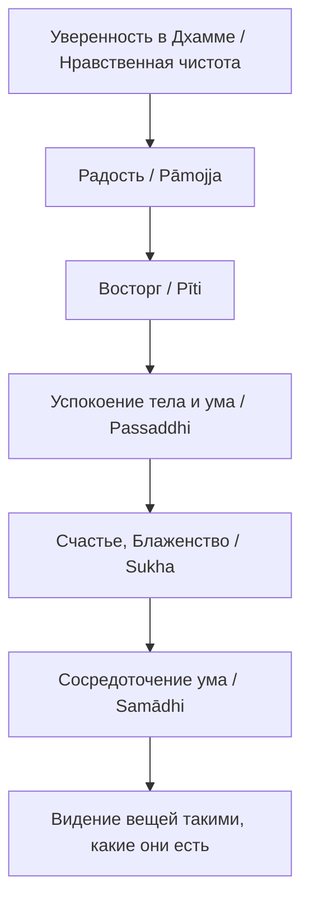

Мы находимся в непрерывной гонке за наполнением своей жизни смыслами и эмоциями. Мы пытаемся обрести спокойствие через карьерные достижения, накопление материальных благ, поиск идеального партнера или бесконечное потребление информации. Однако, достигая желаемого, мы часто обнаруживаем, что эйфория быстро угасает, оставляя нас в состоянии фоновой тревоги и глубокой неудовлетворенности. Мы требуем от изменчивого мира того, что он по своей природе дать не может — вечной стабильности.

Учение Будды предлагает радикально иной подход. Оно не отрицает радость и не призывает к мрачному существованию, как часто ошибочно полагают. Напротив, Дхамма — это детальная карта, которая ведет нас от грубых, мимолетных удовольствий к нерушимому, абсолютному внутреннему покою, не зависящему от капризов внешнего окружения.

## Истинное счастье: Многомерная шкала благополучия

В буддийской психологии счастье (*sukha*) и радость (*somanassa*) — это многогранные понятия. Базовое удовольствие определяется как переживание желаемого объекта, в то время как более глубокая радость — это состояние ментального наслаждения и легкости.

Главная проблема обычного мирского счастья заключается в его абсолютной зависимости от внешних условий. Буддизм решает эту задачу, предлагая перенести источник радости внутрь. Практика Дхаммы последовательно распутывает узлы наших привязанностей, заменяя лихорадочную жажду (*taṇhā*) безмятежностью и ясностью. Истинное значение наивысшего блаженства — это мирное, трансцендентное сознание, свободное от внутренних конфликтов и эгоизма.

## Три уровня счастья и механика ума

Будда, как предельно прагматичный учитель, не требовал от всех своих последователей немедленного отказа от мира и ухода в лес. Он классифицировал пользу и счастье от практики Дхаммы в виде трех последовательных ступеней:

1.  **Счастье в текущей жизни (*diṭṭha-dhamma-hitasukha*):** Это мирское благополучие, доступное мирянину. Оно включает в себя гармонию в семье и честный труд. Будда выделил четыре конкретных вида такого счастья: радость владения праведным богатством, радость наслаждения этим богатством (и щедрого даяния), радость свободы от долгов и высшее из них — радость безупречности в поступках, словах и мыслях.
2.  **Счастье будущих жизней (*samparāyika-hitasukha*):** Это благополучие, достигаемое через накопление благих заслуг (*puñña*). Практикуя щедрость, нравственность и медитацию любящей доброты, человек закладывает фундамент для рождения в благоприятных условиях в будущих существованиях.
3.  **Высшее благо (*paramattha*):** Абсолютная цель — Ниббана. Это полное освобождение от цикла перерождений и окончательное прекращение страданий. Именно здесь достигается наивысшее, безупречное блаженство, превосходящее любые возможные мирские радости.

**Механика ума:** Как работает это постепенное очищение? Наш ум обычно разрывается между притяжением к приятному и отторжением неприятного. Когда мы отпускаем эту полярную жажду, ум перестает метаться. Будда указывал, что по мере погружения в глубокую медитацию (достижения джхан), практикующий последовательно отбрасывает грубые виды чувств, достигая все более утонченного блаженства: от радости уединения (*pavivekasukha*) и успокоения (*upasamasukha*) до блаженства Пробуждения (*sambodhasukha*). Высшее наслаждение достигается не через получение новых стимулов, а через свободу от любых омрачений.

## Ментальные модели и границы

**Метафора освобождения:** Чтобы описать счастье, возникающее при очищении ума от пяти помех (чувственного желания, злобы, лени, беспокойства и сомнений), Будда использовал мощную жизненную аналогию.

> Представьте себе узника, заточённого в тюрьму, который смог бы освободиться, обрести волю и оказаться в безопасности, не потеряв своего имущества; размышляя об этом, он был бы преисполнен радости и воодушевления. Подобно этому монах... когда он смог отбросить в себе эти пять препятствий, он воспринимает это как свободу от долгов, исцеление от болезни, освобождение из тюрьмы...
>
> — [МН 39](https://theravada.ru/Teaching/Canon/Suttanta/Texts/mn39-maha-assapura-sutta-sv.htm)

Счастье в буддизме имеет четкие границы. Крайне важно понимать разницу между судорожной погоней за удовольствиями и истинным благополучием:

| Характеристика | Мирская радость домашней жизни | Радость, основанная на отречении |
| :--- | :--- | :--- |
| **Источник** | Приобретение желаемых форм, звуков, статуса и богатства. | Понимание непостоянства и исчезновения всех явлений. |
| **Природа** | Всегда связана с лихорадкой, жаждой и страхом потери. | Прохладная, безопасная, приносит внутреннее умиротворение. |
| **Результат** | Ненасытность, привязанность и, в итоге, страдание (*dukkha*). | Разобусловливание ума, бесстрастие, Ниббана. |

## Практическое руководство: Дхамма в повседневности

**Сценарий 1: Радость честного труда (Мирская жизнь)**

  * **Ситуация:** Вы усердно работали над проектом, получили заслуженную оплату, раздали долги и обеспечили семью всем необходимым.
  * **Действие Дхаммы:** Осознайте это состояние. Вместо того чтобы немедленно начинать тревожиться о следующих заработках или желать большего, остановитесь. Испытайте **счастье свободы от долгов** и **счастье безупречности** (вы никого не обманули и не подвели ради этих денег).
  * **Результат:** Возникает чувство собственного достоинства и глубокого спокойствия, которое становится идеальной и чистой почвой для дальнейшей медитативной практики.

**Сценарий 2: Очищение ума (Медитация)**

  * **Ситуация:** Вы садитесь медитировать после тяжелого дня. Ум лихорадочно требует проверить социальные сети или съесть сладкое (чувственное желание).
  * **Действие Дхаммы:** Вы применяете **радость отречения** (*nekkhammasukha*). Вы осознанно понимаете, что временный отказ от стимулов — это не потеря и не лишение, а сбрасывание тяжелого груза зависимости.
  * **Результат:** Как только ум перестает бороться и успокаивается, возникает восторг и безмятежность, многократно превосходящие любые физические удовольствия.

**Алгоритм возникновения счастья освобождения:**
Будда описал строгий причинно-следственный механизм того, как нравственность естественным образом перетекает в высшее блаженство и мудрость:

## Итог и источники

Счастье в буддизме — это путь от грубого к утонченному. Начиная с радости честной, этичной и щедрой жизни, мы шаг за шагом тренируем свой ум. Отказываясь от судорожного цепляния за изменчивый мир, мы приходим к состоянию абсолютной эмоциональной стабильности, безмятежности и высшего блаженства, которое не может быть разрушено внешними кризисами, болезнями или утратами.

**Источники для изучения:**

  * ([АН 4.62: Анана-сутта](https://theravada.ru/Teaching/Canon/Suttanta/Texts/an4_62-ananya-sutta-sv.htm)) — О видах счастья мирянина.
  * ([МН 39: Маха-ассапура-сутта](https://theravada.ru/Teaching/Canon/Suttanta/Texts/mn39-maha-assapura-sutta-sv.htm)) — Метафора об освобождении из тюрьмы.
  * ([МН 137: Салаятанавибханга-сутта](https://theravada.ru/Teaching/Canon/Suttanta/Texts/mn137-salayatana-vibhanga-sutta-sv.htm)) — Шесть видов радости отречения.

-----

**Проверка понимания:**

Успешный бизнесмен пожертвовал огромную сумму денег на строительство больницы. Он искренне радуется своему благому поступку, но его ум постоянно возвращается к мысли: *«Благодаря этому великому даянию, в следующей жизни я обязательно стану богаче и успешнее других, и люди будут уважать меня еще больше»*.

Какой из трех видов блага (счастья) преследует этот бизнесмен? Является ли его радость абсолютно безупречной с точки зрения высшей цели (Ниббаны), и какой скрытый корень (загрязнение ума) может со временем превратить эту радость в страдание (*dukkha*)?
