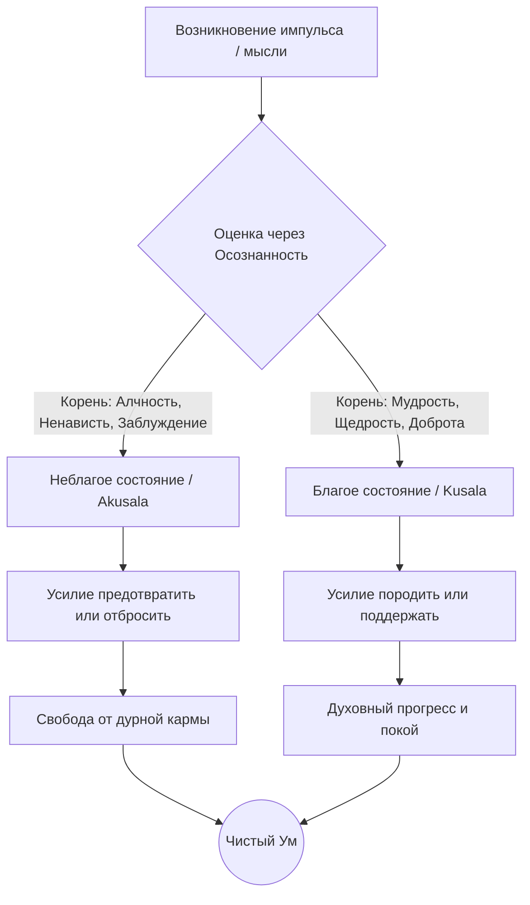

В современном ритме жизни мы часто действуем на автопилоте, позволяя внешним раздражителям диктовать наши реакции. Этот бесконечный цикл автоматических ответов, продиктованных стрессом, раздражением или жаждой комфорта, истощает нас и порождает глубокую неудовлетворенность (*dukkha*). Мы пытаемся изменить внешние обстоятельства, чтобы обрести покой, но подлинная причина наших проблем кроется в фундаментальных привычках нашего собственного ума.

Учение Будды предлагает точный психологический скальпель для работы с этой проблемой. Оно учит, что наше счастье или страдание зависят от того, какие ментальные состояния — неблагие (*akusala*) или благие (*kusala*) — мы позволяем укореняться в нашем сознании. Разорвав цепь автоматических реакций на уровне намерений, мы перестаем питать ум ядом и начинаем взращивать качества, ведущие к непоколебимому внутреннему миру и высшему освобождению.

## Внутренний компас ума: Kusala и Akusala

В буддийской психологии качества нашего сознания строго разделены на две категории:

1.  **Неблагие состояния (*akusalā dhammā*):** Это ментально нездоровые («неумелые», «болезненные»), морально предосудительные состояния, которые сужают восприятие, сопровождаются ментальной лихорадкой и неизбежно приносят болезненные кармические результаты.
2.  **Благие состояния (*kusalā dhammā*):** Это ментально здоровые («умелые», «искусные»), морально безупречные состояния, которые приносят уму ясность, легкость и порождают приятные, полезные плоды, ведущие к освобождению.

Какую проблему решает этот инструмент? Распознавание этих состояний развязывает узел слепой кармической обусловленности. Учение дает объективный критерий для оценки наших действий: мы учимся смотреть не на внешнюю форму поступка, а на его скрытый мотив, корень (*mūla*), из которого он произрастает. Благодаря этому мы обретаем способность намеренно очищать ум от разрушительных тенденций.

## Архитектура кармы и механика ума

Вся человеческая активность рассматривается через три ключевых аспекта:

1.  **Корни действий (*mūla*):** Неблагие состояния укоренены в трех ядах: алчности (*lobha*), ненависти (*dosa*) и заблуждении (*moha*). Благие состояния произрастают из их противоположностей: не-алчности (щедрости, *alobha*), не-ненависти (доброжелательности, *adosa*) и не-заблуждения (мудрости, *amoha / paññā*).
2.  **Десять путей действия (*kammapatha*):** Неблагие корни проявляются через три «двери»: телесные (убийство, воровство, прелюбодеяние), вербальные (ложь, злонамеренная речь, грубость, пустая болтовня) и умственные (алчность, недоброжелательность, ложные воззрения). Благие пути заключаются в осознанном воздержании от этих поступков.
3.  **Плоды (*vipāka*):** Неблаготворная карма неминуемо оборачивается против человека, ведя к страданиям и дурным перерождениям. Благотворная карма ведет к счастью и духовному прогрессу.

**Механика ума:** Любое волевое действие (*cetanā*) оставляет отпечаток в уме. Переход между благим и неблагим совершается в момент контакта органов чувств с объектом (*phassa*). Если в этот миг присутствует осознанность (*sati*), ум опирается на благие корни. Если осознанности нет — активируется автопилот неведения (*moha*), и мы поливаем сорняки своих омрачений.

> «И что такое, друзья, неблаготворное и корень неблаготворного?.. Разрушение жизни — это неблаготворное... ложные воззрения — это неблаготворное. И в чём корень неблаготворного? Алчность — это корень неблаготворного, ненависть — это корень неблаготворного, заблуждение — это корень неблаготворного».
>
> — ([МН 9: Саммадиттхи-сутта](https://theravada.ru/Teaching/Canon/Suttanta/Texts/mn9-sammaditthi-sutta-sv.htm))

## Ментальные модели и границы

**Аналогия (Горькое и сладкое семя):** Будда сравнивал неблагие воззрения с семенем нима (горькой тыквы). Посаженное во влажную почву, оно впитает воду, но неизбежно принесет горький плод, потому что сама природа семени дурна. Благие состояния подобны семени сахарного тростника: оно закономерно дает сладкий плод, потому что природа этого намерения блага.

**Модель садовника:** Наш ум — это сад. Неблагие состояния — сорняки, благие — полезные культуры. Садовник должен приложить Правильное усилие (*sammā-vāyāma*), чтобы вырвать сорняки с корнем и поливать семена полезных растений.

Важно понимать отличие Дхаммы от светской морали:

| Характеристика | Благие/Неблагие состояния в Дхамме | Светская мораль «Хорошо/Плохо» |
| :--- | :--- | :--- |
| **Критерий оценки** | Объективный корень намерения (жадность/гнев или мудрость/доброта). | Изменчивые социальные нормы, традиции и законы. |
| **Результат** | Кармические плоды: объективное духовное очищение или деградация. | Социальное одобрение, статус или юридическое наказание. |
| **Ощущение в уме** | *Kusala*: Легкость, простор, прозрачность. *Akusala*: Тяжесть, сжатие, лихорадочность. | Фокус на внешнем поддержании общественного порядка. |

## Практическое руководство: Четыре Правильных Старания

Чтобы направить энергию ума на освобождение, Будда предложил четкий алгоритм — Четыре правильных старания (*sammappadhānāni*): предотвращать и отбрасывать неблагие состояния, пробуждать и поддерживать благие.

**Сценарий 1: Конфликт в социальных сетях или на работе**

  * *Ситуация:* Кто-то несправедливо критикует вашу работу. Ваша первая реакция — написать резкий ответ, чтобы защитить свое эго.
  * *Действие Дхаммы (Устранение akusala):* Вы останавливаетесь и включаете осознанность (*sati*). Вы распознаете в уме неблагой корень ненависти (*dosa*) и намерение грубой речи. Вы применяете усилие для отбрасывания этого состояния, осознавая, что оно разрушает вашу собственную психику. Вы выбираете ответить с позиции не-ненависти (*adosa*).
  * *Результат:* Гнев лишается подпитки и угасает. Вы предотвращаете создание неблаготворной кармы, сохраняете внутренний покой и разрешаете конфликт профессионально.

**Сценарий 2: Слепое потребление и стресс**

  * *Ситуация:* Чувствуя вечернюю тревогу и усталость, вы начинаете компульсивно покупать ненужные вещи в интернете или бездумно листать ленту новостей.
  * *Действие Дхаммы (Зарождение kusala):* Вы замечаете присутствие алчности (*lobha*), лени (*thīna-middha*) и заблуждения (*moha*), ищущих надежное счастье в преходящих вещах. Вы применяете Правильное усилие (*viriya*), чтобы успокоить ум (например, делаете осознанную ходьбу), и заменяете жажду на благое состояние не-алчности (*alobha*).
  * *Результат:* Лень и лихорадочная жажда рассеиваются, ум наполняется ясными факторами, избегая лишних трат и разочарования.

**Алгоритм работы с состояниями ума:**

## Итоги и источники

Умение различать неблагие и благие состояния — это компас на духовном пути. Каждая мысль, в которой присутствует жадность или злоба, оставляет микроскопический шрам на психике. Каждая мысль, наполненная осознанностью и мудростью, исцеляет нас. Сознательно выбирая отказ от эгоизма и культивируя щедрость и доброжелательность, мы берем в свои руки управление собственной судьбой и превращаем жизнь в ясный путь к абсолютному освобождению — Ниббане.

**Источники для изучения:**

  * ([МН 9: Саммадиттхи-сутта](https://theravada.ru/Teaching/Canon/Suttanta/Texts/mn9-sammaditthi-sutta-sv.htm)) — О правильных воззрениях и корнях благого/неблагого.
  * ([СН 45.8: Вибханга-сутта](https://theravada.ru/Teaching/Canon/Suttanta/Texts/sn45_8-magga-vibhanga-sutta-sv.htm)) — О Четырех правильных стараниях.
  * ([АН 10.104: Биджа-сутта](https://theravada.ru/Teaching/Canon/Suttanta/Texts/an10_104-bija-sutta-sv.htm)) — Метафора о горьком и сладком семени.

-----

**Проверка понимания:**

Представьте, что состоятельный бизнесмен активно участвует в волонтерской программе и жертвует крупную сумму денег на строительство больницы. Внешне это абсолютно благое действие. Однако внутри он постоянно сравнивает себя с другими волонтерами, гордится тем, что он «духовнее» их, делает пожертвование исключительно ради того, чтобы получить публичную похвалу, и испытывает скрытое раздражение, если его заслуги не замечают организаторы.

Опираясь на учение Абхидхаммы о ментальных факторах и корнях каммы (*mūla*), ответьте: можно ли назвать этот поступок всецело благим (*kusala*)? Какими конкретно неблагими корнями и факторами (*akusala cetasika*) в данный момент отравлен ум этого человека, и как они повлияют на кармический плод его внешне щедрого действия? Как именно ему следует применить Правильное усилие (*sammā-vāyāma*), чтобы вернуть действие в русло подлинной благости?
