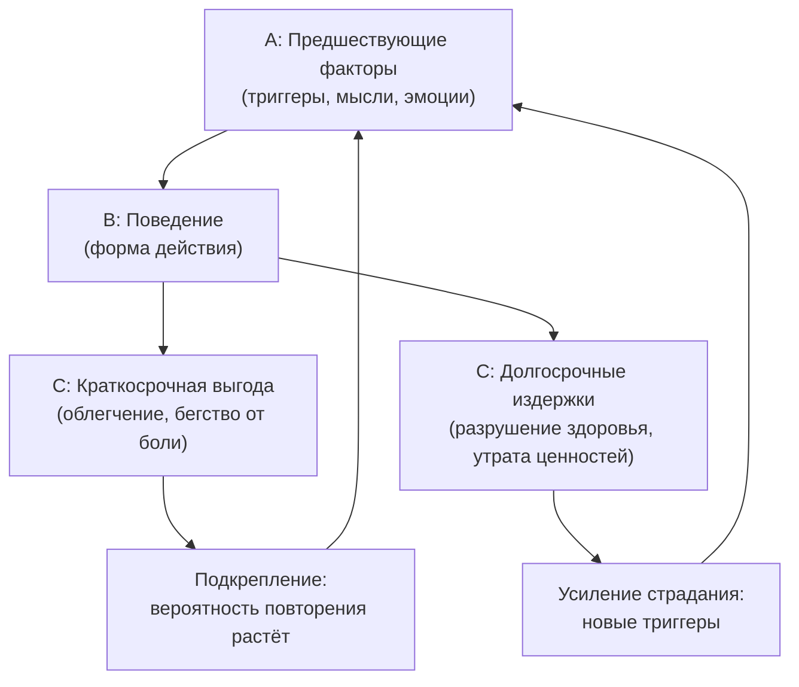

Человек пробует избавиться от тревоги — и вместо облегчения получает новые проблемы. Бросает пить, но начинает переедать. Уходит с головой в работу, чтобы не чувствовать пустоту, но теряет близких. Внешне стратегии меняются, а страдание остаётся. Эта ловушка знакома многим, и она не случайна.

**Функциональный анализ** по модели АВС в Терапии принятия и ответственности (ACT) объясняет, почему так происходит. Этот инструмент помогает увидеть скрытую логику поведения: не *что* делает человек, а *зачем* он это делает и *какую внутреннюю боль* пытается контролировать. Далее вы узнаете, как работает АВС-анализ и почему он открывает путь к настоящим изменениям.

### Функциональный анализ: взгляд на поведение через призму функции

**Функциональный анализ** (модель АВС) в ACT — это прагматический метод оценки клинически значимого поведения. Базовой единицей здесь выступает не форма действия (как оно выглядит), а его **функция** (какой цели оно служит) в неразрывной связи с предшествующими факторами и последствиями *(Бах & Моран, 2021)*.

Терапевт использует этот инструмент для «дебаггинга» клиентских стратегий. Задача — наглядно показать: кажущиеся логичными попытки контролировать внутреннюю боль на самом деле поддерживают и усугубляют страдания *(Хейс, Штросаль & Уилсон, 2021)*.

> Функциональный анализ смещает фокус с содержания мыслей и внешнего вида поступков на динамическую карту взаимодействия человека со средой.

Без этого инструмента психология оставалась бы в плену медицинской синдромальной модели. Терапевт и клиент пытались бы бесконечно искоренять симптомы, навешивая на них ярлыки из диагностических руководств, и упускали бы реальные причины в окружающей среде *(Бах & Моран, 2021)*. Терапия превращалась бы в игру «ударь крота»: устранение одной формы избегания (например, алкоголизма) приводило бы к появлению новой (например, трудоголизма), потому что базовая функция поведения оставалась бы незамеченной.

Модель АВС включает три ключевых компонента:

| Компонент | Расшифровка | Описание |
|-----------|-------------|----------|
| **A** (Antecedents) | Предшествующие факторы | Контексты, триггеры, мысли и чувства, запускающие реакцию |
| **B** (Behavior) | Поведение | Явное или скрытое действие клиента (форма) |
| **C** (Consequences) | Последствия | Краткосрочные выгоды и долгосрочные издержки действия |

### Форма против функции: ключевой разрыв в ACT

В рамках структурализма поведение категоризируется по **форме** (топографии) — как оно выглядит физически. Человек кричит, плачет, замыкается в себе, моет руки 40 раз в день или перерабатывает. Структуралист фиксирует внешнюю картину.

В рамках контекстуализма поведение категоризируется по **функции** — какой результат оно генерирует *(Торнеке, 2010)*. Действия с абсолютно разной топографией могут относиться к одному функциональному классу. Человек пытается избавиться от неприятных чувств, отводя взгляд, умолкая или агрессивно повышая голос. Топографически это разные действия, но функционально — один и тот же процесс **эмпирического избегания**.

Клинический анализ выделяет четыре основные функции поведения:

1. Получение материальных благ
2. Привлечение социального внимания
3. Автоматическое (сенсорное) подкрепление
4. **Избегание и уход (эмпирическое избегание)** *(Бах & Моран, 2021)*

Именно последняя функция является главной мишенью анализа в ACT.

> Проблема клиента часто не в конкретном поведении (форма), а в отчаянной попытке убежать от собственного внутреннего опыта (функция).

Человеческая речь (описываемая Теорией реляционных фреймов) позволяет связывать любые стимулы с любыми другими. Это делает невозможным полное искоренение формы избегания *(Торнеке, 2010)*. Если терапевт устранит только форму (уговорит клиента перестать пить), но не затронет функцию (избегание тревоги), мозг клиента мгновенно создаст новую форму поведения для достижения той же цели. Медицинская модель терпит крах именно потому, что лечит форму *(Бах & Моран, 2021)*.

| Аспект | Структурализм (форма) | Контекстуализм (функция) |
|--------|----------------------|--------------------------|
| Фокус | Как выглядит поведение | Какую цель оно выполняет |
| Диагностика | Ярлыки из DSM | Анализ контекста и последствий |
| Лечение | Устранение симптома | Изменение контекста |
| Риск | Замена одного симптома другим | Отсутствует |
| Пример | «У Джонни расстройство поведения» | «Джонни избегает трудных задач» |

### Петля АВС: анатомия поведенческого цикла

Фундаментальным ядром структуры АВС является **функция (последствие)**. Согласно закону эффекта, поведение является функцией собственных последствий. Если убрать последствия, поведение угаснет, а вся петля разрушится *(Бах & Моран, 2021)*.

Структура разворачивается не линейно, а циклически. Предшествующие обстоятельства (А) формируют контекст для реакции (В). Однако вероятность этой реакции в будущем полностью определяется тем, какие последствия (С) она вызывала в прошлом *(Торнеке, 2010)*.

В ACT выделяют два типа предшествующих факторов:

- **Дискриминативные стимулы** — сигналы, указывающие, что определённое поведение приведёт к подкреплению. Например, вид дилера на улице сигнализирует о возможности купить наркотик.
- **Мотивационные предпосылки (установочные операции)** — внутренние состояния, изменяющие ценность подкрепления. Например, сильный стресс резко повышает ценность успокоительного эффекта от алкоголя *(Бах & Моран, 2021)*.

**Пример Антонио.** Клиент жалуется, что пьёт по 7–8 бутылок пива за вечер *(Хэррис, 2021)*. Триггер (А) — ссоры, усталость и болезненные мысли о собственной неадекватности. Поведение (В) — употребление алкоголя. Краткосрочное последствие (С) — расслабление и бегство от тяжёлых мыслей. Долгосрочное последствие (С) — разрушение здоровья и усугубление депрессии.

Отталкиваясь от этой петли, терапевт делает обобщающий вывод: проблема Антонио не в алкоголе (форма), а в отчаянной попытке убежать от внутреннего опыта (функция). Любое другое поведение, выполняющее ту же функцию эмпирического избегания (даже социально одобряемое, вроде ухода с головой в работу), будет функционально идентичным алкоголизму и приведёт к такой же психологической ригидности *(Хэррис, 2021)*.

### Креативная безнадёжность: конечная цель анализа

Главная цель функционального анализа — привести клиента к состоянию **креативной безнадёжности** *(Бах & Моран, 2021)*. Терапевт собирает данные о триггерах и последствиях не для теоретических рассуждений. Он наглядно показывает клиенту: *все* его стратегии (какую бы форму они ни принимали) служат одной функции — попытке контролировать боль. Эта стратегия безнадёжна, так как она лишь увеличивает страдания.

Осознание этого факта разрушает старую «программу контроля» и открывает пространство для готовности и принятия *(Хейс, Штросаль & Уилсон, 2021)*.

> Креативная безнадёжность — это не отчаяние. Это освобождение от иллюзии контроля, открывающее путь к принятию.

На макроуровне радикальный бихевиоризм утверждает: любое поведение живого организма формируется и поддерживается последствиями *(Торнеке, 2010)*. Применительно к людям этот закон гласит: любая психопатология поддерживается тем, что в краткосрочной перспективе она приносит облегчение. Чтобы помочь человеку, терапевт перестаёт смотреть на форму симптомов (депрессия, обсессии, паника) и начинает анализировать функцию — каких именно переживаний клиент избегает. Из этого вытекает ключевой принцип: терапевт не борется с мыслями, а меняет контекст, который делает их опасными.

### АВС на сессии: механика и клинические случаи

**Как провести АВС-анализ.** Терапевт исследует три вопроса вместе с клиентом в режиме любознательности:

1. **Что выступает триггером (А)?** Терапевт выявляет ситуации, мысли, воспоминания и эмоции, запускающие привычку. Ключевая задача — найти «мотивационную предпосылку»: ощущение угрозы или уязвимости *(Хэррис, 2021)*.
2. **Что я делаю (В)?** Клиент описывает конкретное поведение без ярлыков. Вместо абстрактного «я прокрастинирую» терапевт фиксирует: «Я лежу в кровати и листаю ленту новостей» *(Хэррис, 2021)*.
3. **Какова расплата и выгода (С)?** Терапевт выявляет краткосрочную выгоду («это помогает скрыться от неприятных мыслей») и долгосрочную расплату (ущерб для здоровья, потеря отношений, упущенные ценности). Ключевые вопросы: «Работают ли эти стратегии в долгосрочной перспективе?» и «Во что обходится вам эта борьба?» *(Бах & Моран, 2021)*.

Если клиент не осознаёт триггеры и последствия, терапевт не давит на него. Вместо этого используется **«Дневник событий»** — между сессиями клиент фиксирует: когда произошёл срыв, что случилось непосредственно перед ним (А), что именно он сделал (В) и что произошло после (С) *(Бах & Моран, 2021)*.

**Случай Джонни: структурализм против функционализма.** Подросток Джонни проявляет агрессию и срывает уроки. Медицинская модель диагностирует «расстройство поведения» и предлагает химическое вмешательство *(Бах & Моран, 2021)*. Однако АВС-анализ показывает иную картину. Агрессия Джонни (В) проявляется в ответ на академические требования, с которыми он не справляется (А). Результат — его выгоняют из класса, позволяя избежать трудной задачи (С). Функционально его поведение — это уход и избегание. Помогать ему нужно не таблетками, а изменением контекста требований.

Структурный подход создаёт порочный круг псевдо-объяснений. «Почему Джонни хулиганит?» — «Потому что у него расстройство поведения». «Откуда это известно?» — «Потому что он хулиганит». Это тавтология, лишающая возможности влиять на проблему *(Бах & Моран, 2021)*.

**Социальная тревога: иллюзия разных проблем.** Человек с социальной тревогой может использовать разные формы поведения. Он может физически не прийти на вечеринку. Может прийти, но напиться до беспамятства. Может прийти, но непрерывно сканировать реакции окружающих и контролировать свою мимику *(Хейс, Штросаль & Уилсон, 2021)*. По форме это три разных действия: остаться дома, злоупотреблять алкоголем, осуществлять гиперконтроль. Но функционально — это один процесс эмпирического избегания, направленный на предотвращение контакта с чувством уязвимости.

**Ловушка хронической боли.** Пациентка Сьюзан отказывается от физической активности, встреч с друзьями и работы ради одной цели — снизить или контролировать свою боль *(Маккракен, 2005)*. Краткосрочно это снижает остроту ощущений, но в долгосрочной перспективе приводит к депрессии, изоляции и «ценностной болезни», когда боль занимает всё жизненное пространство. Сьюзан потерпела поражение не потому, что недостаточно старалась, а потому, что сама программа контроля боли оказалась главной проблемой *(Маккракен, 2005)*.

### Микро-практика: аудит одного действия

Чтобы прямо сейчас интегрировать навык разделения формы и функции, выполните упражнение **«Дебаггинг одного действия»** (3–5 минут):

1. **Определите форму (В).** Вспомните одно действие, о котором вы слегка сожалеете (съели лишнее сладкое, «залипли» в соцсетях на 40 минут, резко ответили близкому человеку или отложили сложное письмо). Опишите его физически: *«Я 40 минут смотрел короткие видео на телефоне»*.
2. **Найдите триггер (А).** Задайте себе вопрос: какая мысль, эмоция или дискомфортная задача присутствовала за 5 секунд до того, как вы взяли телефон? Например: «Я почувствовал скуку и тревогу перед сложной рабочей задачей».
3. **Раскройте функцию (С).** Задайте финальный вопрос: какого именно внутреннего переживания вы успешно избежали в краткосрочной перспективе? Например: «Я избежал столкновения с чувством собственной некомпетентности».

Просто зафиксируйте результат: «Моё листание ленты (форма) функционально было бегством от страха некомпетентности». Это первый шаг к креативной безнадёжности — и к осознанному выбору.

### Заключение и Литература

Функциональный анализ по модели АВС в ACT — это практический инструмент, позволяющий терапевту и клиенту выйти за пределы внешней формы поведения и увидеть его скрытую функцию: попытку контролировать внутреннюю боль. Разделяя предшествующие факторы (А), поведение (В) и последствия (С), терапевт наглядно демонстрирует, как краткосрочные выгоды оборачиваются долгосрочными потерями. Результатом становится креативная безнадёжность — осознание того, что стратегия контроля исчерпала себя, открывающее пространство для принятия и жизни, основанной на ценностях.

- *Бах, П. А., & Моран, Д. Дж. (2021). ACT на практике. Концептуализация случаев в терапии принятия и ответственности. ООО «Диалектика».*
- *Маккракен, Л. М. (2005). Contextual cognitive-behavioral therapy for chronic pain.*
- *Торнеке, Н. (2010). Теория реляционных фреймов в клинической практике.*
- *Хейс, С. С., Штросаль, К. Д., & Уилсон, К. Г. (2021). Терапия принятия и ответственности. Процессы и практика осознанных изменений. ООО «Диалектика».*
- *Хэррис, Р. (2021). Когда жизнь сбивает с ног. Преодолеваем боль и справляемся с кризисами.*

---

Клиент обратился к терапевту с жалобой на бессонницу. Чтобы уснуть, он каждый вечер выпивает два бокала вина. Когда терапевт предложил отказаться от алкоголя, клиент начал вместо этого часами листать социальные сети перед сном — бессонница вернулась. Проведите АВС-анализ обоих поведений (вино и скроллинг), определите их общую функцию и объясните, почему замена одной формы поведения другой не решает проблему с позиции ACT.
