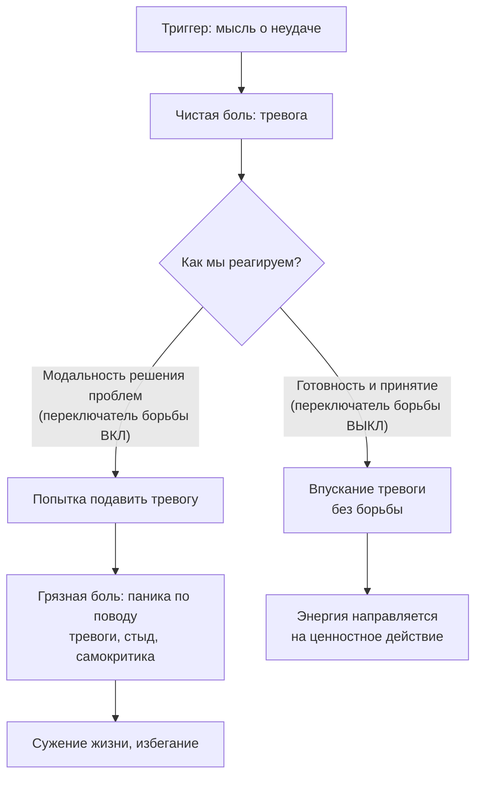

Человек, переживающий тревогу перед важным разговором, делает естественную вещь: он пытается от этой тревоги избавиться. Он отвлекается, откладывает разговор, пьёт успокоительное, убеждает себя «не нервничать». Проблема в том, что каждая из этих попыток лишь усиливает тревогу, делая её центральной осью жизни. Чем отчаяннее борьба — тем крепче хватка.

В Терапии принятия и ответственности (ТПО/ACT) **готовность** — это добровольный поведенческий выбор вступить в контакт с неприятными переживаниями ради значимой цели. **Принятие** — это намеренно открытая, восприимчивая и безоценочная позиция по отношению к этому опыту в настоящем моменте *(Хейс, Штросаль, & Уилсон, 2021)*. Это не пассивное терпение, а активный, сострадательный процесс впускания реальности.

### Чистая боль и грязная боль: анатомия лишних страданий

ACT проводит фундаментальное разграничение между двумя видами дискомфорта *(Хейс, Штросаль, & Уилсон, 2021)*:

| Вид боли | Определение | Пример |
| :--- | :--- | :--- |
| **Чистая боль** | Естественный дискомфорт, возникающий как реакция на жизненные трудности | Грусть после утраты, тревога перед экзаменом, страх неопределённости |
| **Грязная боль** | Дополнительное страдание, которое человек создаёт сам, сопротивляясь чистой боли | Паника по поводу тревоги, стыд за свой страх, гнев на себя за грусть |

Чистая боль неизбежна — она приходит вместе с любой значимой жизнью. Грязная боль — продукт **модальности решения проблем**, применённой к внутреннему миру. Человек пытается «устранить» тревогу так же, как устранил бы мусор с пола — но психика работает по другим законам. Попытка не думать о тревоге делает тревогу центральной темой жизни.

### Переключатель борьбы: почему контроль — это сама проблема

Представьте, что внутри вас есть «переключатель борьбы». Когда он включён, любая тревога или грусть воспринимается как угроза, требующая уничтожения *(Хэррис, 2020)*. Принятие и готовность — это сознательный перевод этого переключателя в положение «ВЫКЛ». Эмоции по-прежнему приходят и уходят. Они могут быть болезненными. Но человек больше не тратит силы на то, чтобы выталкивать их за дверь.

Попытка просто «перетерпеть» эмоцию тоже не работает. Терпение сохраняет внутреннее сопротивление: мозг остаётся в режиме сканирования угрозы, постоянно проверяя «Она уже ушла? А сейчас?» *(Хейс, Штросаль, & Уилсон, 2021)*. Это сканирование само поддерживает активность симпатической нервной системы.

### Принятие — это не терпение: ключевое различие

Толерантность — это стиснуть зубы и ждать, пока боль закончится, сохраняя внутреннее сопротивление. Принятие полностью лишено ожидания конца *(Хейс, Штросаль, & Уилсон, 2021)*. Это активный шаг навстречу пугающему содержанию с искренним любопытством. Без этого качественного сдвига терапия превращается в соревнование на выносливость.

> Мы принимаем боль не для того, чтобы она ушла. Мы принимаем боль для того, чтобы забрать свою жизнь обратно.

Принятие — это позиция хозяина дома, который гостеприимно открывает дверь незваному гостю на вечеринке. Хозяин не обязан любить этого гостя (тревогу), но он освобождает для него место, не пытаясь вытолкать его взашей *(Хэррис, 2020)*. Принятие не означает *желание* испытывать боль. Это также не капитуляция перед судьбой.

### Техника физиализации: от абстрактного ужаса к конкретному объекту

**Физиализация (опредмечивание)** — это практический инструмент активного впускания, переводящий эмоцию из концептуального пространства в перцептивное *(Бах & Моран, 2021; Хэррис, 2021)*.

**Шаг 1. Локализация и называние.** Клиент сканирует тело и находит место, где эмоция ощущается острее всего. «Я замечаю чувство злости в груди».

**Шаг 2. Придание свойств объекта.** Терапевт задаёт вопросы: «Если бы у этого чувства была форма, какая бы она была? Какого оно цвета, размера, текстуры?» Например: «Это колючий, красный, горячий квадрат» *(Бах & Моран, 2021)*.

**Шаг 3. Создание пространства.** Клиент мысленно направляет воздух в эту область, представляя, как расширяется пространство, чтобы объект мог свободно находиться внутри *(Хэррис, 2021)*.

**Шаг 4. Разрешение быть.** Клиент мысленно или вслух говорит: «Мне не нравится этот объект, но я разрешаю ему быть здесь», прекращая любую мышечную борьбу *(Хэррис, 2020)*.

Когда абстрактный, всепоглощающий ужас превращается в локализованный объект, клиент может мысленно отодвинуть его, рассмотреть со всех сторон. Из этого микро-опыта вырастает глобальное обобщение: «Если я могу безопасно наблюдать свой самый страшный симптом как просто "объект", значит, я больше своих эмоций» *(Бах & Моран, 2021)*.

### Случай Рика: под маской гнева скрывалась любовь

Рик курил марихуану, чтобы избежать чувства вины и мыслей о том, что его мать в доме престарелых скоро умрёт *(Бах & Моран, 2021)*. Терапевт попросил Рика закрыть глаза и физиализовать мысль о смерти матери.

Рик описал её как «очень тёмную, чёрную, большую — заполняет всю комнату, вязкую, как туман». Терапевт попросил мысленно отодвинуть эту массу. Под ней обнаружилась злость — «красная». Отодвинув и её, Рик внезапно расплакался, обнаружив чистую боль: *«Я не хочу, чтобы она умирала. Я даже не смогу сказать ей, что люблю её»* *(Бах & Моран, 2021)*.

Физиализация позволила обойти ментальные защиты, прекратить борьбу с «плохими» мыслями и установить контакт с глубокой любовью и уязвимостью клиента. Это стало фундаментом для подлинного принятия.

### Готовность как прыжок: качество «всё или ничего»

Терапевт кладёт на пол книгу, встаёт на неё и говорит: «Готовность подобна прыжку. Вы не можете перепрыгнуть каньон за два шага» *(Маккракен, б.г.)*. Затем он просто спускает один носок на пол: «Дотянуться пальцем ноги — это не прыжок». Затем реально спрыгивает двумя ногами.

Клиент может выбрать высоту — спрыгнуть с книги или с крыши (выбрать масштаб ситуации: пойти в магазин на 5 минут или на час). Но само качество действия не может быть половинчатым. Внутри выбранной ситуации клиент полностью, на 100% отказывается от защит и открывается опыту *(Хейс, Штросаль, & Уилсон, 2021)*.

### Экспозиция в ACT: не угасание страха, а расширение репертуара

Традиционная экспозиция учит находиться в пугающей ситуации, пока тревога не спадёт. В ACT (подход FEEL — «Чувства обогащают жизнь») экспозиция применяется ради готовности впускать опыт *(Хейс, Штросаль, & Уилсон, 2021)*.

Клиента с паническим расстройством могут попросить вдыхать углекислый газ. Цель — не заставить его перестать бояться удушья, а развить способность сказать «Да» этому ощущению. Наблюдая за ним как за объектом, клиент учится нести это чувство с собой — чтобы в будущем, когда паника настигнет его в супермаркете, он не убегал, а продолжал двигаться к своим целям.

### Ловушка псевдопринятия

Клиент говорит: «Хорошо, я приму свою панику, чтобы она поскорее прошла». Это классическая ловушка *(Бах & Моран, 2021)*. Если клиент впускает демона только ради того, чтобы от него избавиться, это скрытая форма контроля. Терапевт должен чётко прояснить цель: мы принимаем не для того, чтобы боль ушла, а для того, чтобы жить полноценной жизнью в её присутствии.

### Заключение и Литература

Готовность и принятие разрывают токсичный цикл эмпирического избегания. Человек учится не «чувствовать себя лучше» (избавляясь от дискомфорта), а «лучше чувствовать» — проживать весь спектр эмоций без защитных барьеров. Это высвобождает колоссальную энергию, которая раньше уходила на подавление переживаний, и направляет её на построение жизни, наполненной подлинным смыслом.

- Бах, П. А., & Моран, Д. Дж. (2021). *ACT на практике. Концептуализация случаев в терапии принятия и ответственности*. ООО «Диалектика».
- Маккракен, Л. (б.г.). *Хроническая боль (Перевод Е. Сушан, И. Розов)*.
- Хейс, С. С., Штросаль, К. Д., & Уилсон, К. Г. (2021). *Терапия принятия и ответственности. Процессы и практика осознанных изменений*. ООО «Диалектика».
- Хэррис, Р. (2020). *Ловушка счастья. Перестаем переживать — начинаем жить*.
- Хэррис, Р. (2021). *Когда жизнь сбивает с ног. Преодолеваем боль и справляемся с кризисами*. ООО «Манн, Иванов и Фербер».

---

Клиентка обратилась к терапевту с жалобой на сильную тревогу в отношениях. Она хочет спасти свой брак (это её глубокая ценность), но каждый раз, когда приходит время для трудного разговора с мужем, её захлёстывает страх отвержения. Она выбирает молчание. Терапевт обучает её технике физиализации: клиентка описывает страх как «ледяной синий комок в горле». Через неделю она сообщает: «Я визуализировала комок, он немного уменьшился, и я решила промолчать, потому что поняла — он стал меньше, значит, скоро совсем пройдёт, и тогда я смогу поговорить».

**Вопрос:** Опираясь на различие между подлинным принятием и псевдопринятием, а также на качество готовности «всё или ничего», определите, в какую ловушку попала клиентка. Как бы вы скорректировали её стратегию?
