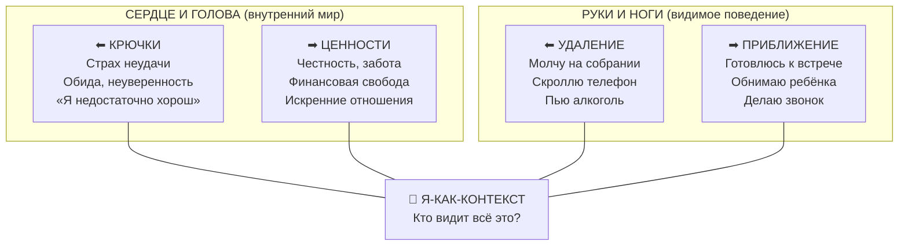

В момент острого стресса сложная теория гексафлекса вылетает из головы. Человек не может вспомнить, какой из шести процессов нужно применить, когда его захлёстывают эмоции. Разум использует саму теорию терапии как новый повод для интеллектуальных споров, парализуя способность действовать.

**Матрица ACT** — это визуальный инструмент из двух пересекающихся осей, который мгновенно переводит все концепции Терапии принятия и ответственности в интуитивно понятный формат *(Хейс, 2020)*. Вместо шести терминов — одна простая развилка: «Я сейчас двигаюсь влево (от боли) или вправо (к ценностям)?»

### Анатомия координатной сетки

Матрица строится на пересечении двух линий, образующих четыре квадранта и центр *(Хейс, 2020)*:

**Вертикальная ось (Внутреннее — Внешнее).** Нижняя часть представляет «Сердце и Голову» — невидимые для других мысли, чувства, страхи и ценности. Верхняя часть — «Руки и Ноги» — явные физические действия, которые могут увидеть окружающие.

**Горизонтальная ось (Удаление — Приближение).** Левая сторона — движение *от* нежелательных переживаний (избегание). Правая — движение *к* тому, что действительно важно (ценности).

**Центр.** Точка пересечения символизирует **Я-как-контекст** — трансцендентное наблюдающее «Я», которое осознаёт всё происходящее во всех квадрантах *(Хейс, 2020)*.

| Квадрант | Содержание | Пример |
| :--- | :--- | :--- |
| **Низ-Право** (Внутреннее приближение) | Глубинные ценности, мотивы, смыслы | Радость от помощи людям, честность, любовь к семье |
| **Низ-Лево** (Внутреннее удаление) | «Крючки»: мысли, страхи, воспоминания | Страх показаться глупым, обида, неуверенность |
| **Верх-Лево** (Внешнее удаление) | Поведение избегания, импульсивные реакции | Молчание на совещании, скроллинг соцсетей, алкоголь |
| **Верх-Право** (Внешнее приближение) | Проактивные действия навстречу ценностям | Подготовка к встрече, обнять ребёнка, сделать звонок |

### Как Матрица разрушает иллюзию причинности

Клиент говорит: «Я не пошёл на собеседование, потому что у меня низкая самооценка». Разум склеивает внутреннее чувство и внешнее действие в единый неразрешимый ком. Матрица физически разрушает эту связь, помещая самооценку *внизу*, а поход на собеседование *наверху* *(Хейс, 2020)*.

Клиент на собственном опыте видит: это разные плоскости. Страх находится внизу слева, а способность действовать — вверху справа. Ему не нужно уничтожать свои мысли внизу, чтобы его руки и ноги двигались вправо-вверх.

### Пошаговый алгоритм заполнения

Матрица заполняется последовательно, начиная с правого нижнего квадранта против часовой стрелки *(Хейс, 2020)*:

**Шаг 1 (Низ-Право / Ценности).** «В сфере работы: что внутри вас хочет двигаться вперёд?» Клиент находит: радость от помощи клиентам, удовлетворение от честности.

**Шаг 2 (Низ-Лево / Крючки).** «Что внутри вас движет в противоположном направлении?» Клиент находит: обиду, страх показаться глупым, неуверенность.

**Шаг 3 (Верх-Лево / Избегание).** «Когда вы отдаляетесь от ценностей, что делают ваши руки и ноги?» Клиент записывает: «Молчу на совещаниях, сплетничаю, уклоняюсь от ответственности».

**Шаг 4 (Верх-Право / Проактивность).** «Когда вы движетесь к ценностям, что вы делаете?» Клиент записывает: «Готовлюсь к встречам, вношу предложения».

**Шаг 5 (Центр / Я-контекст).** Финальный интегрирующий шаг. «Кто видит ответы, которые вы написали?» *(Хейс, 2020)*. Осознание того, что вы — не ваши страхи и не ваши ошибки. Вы — сознание, способное выбирать направление.

### Применение Матрицы при вспышке Эбола

Принцип Матрицы оказался настолько универсальным, что во время вспышки лихорадки Эбола в Сьерра-Леоне психологи использовали его для работы с целыми общинами *(Хейс, 2020)*.

Жители деревень были заперты в левой стороне Матрицы: из-за страха, боли и традиций (внутренние барьеры) они продолжали обмывать тела умерших (внешнее поведение избегания карантина), что усугубляло эпидемию. Используя Матрицу, общины смогли найти общие ценности (нижний правый угол) и увидеть эмоциональные барьеры (нижний левый угол).

Результат: жители сами придумали новые, безопасные способы чтить память близких без омовения тел, остановив распространение вируса *(Хейс, 2020)*. Этот пример доказывает: Матрица работает как для одного сотрудника, так и для спасения целых популяций.

### Ловушки при работе с Матрицей

**Позитивное слияние.** Клиент заполняет правый верхний квадрант глобальными невыполнимыми целями: «Стану идеальным работником». Терапевту необходимо вернуть фокус на конкретные микро-действия (Руки и Ноги), которые можно выполнить прямо сейчас.

**Попытка «стереть» левую сторону.** Клиент говорит: «Я просто вычеркну свои страхи из Матрицы». Но нервная система работает только на прибавление, а не на вычитание. Попытка стереть левую нижнюю часть лишь плодит новые избегающие действия в левой верхней. Суть Матрицы — *нести* всю нижнюю часть с собой, двигаясь вправо-вверх.

### Заключение и Литература

Матрица ACT превращает сложную теорию психологической гибкости в мгновенно доступный навигационный инструмент. Заполнив её один раз с терапевтом, клиент может в любой трудный момент вызвать в памяти образ координатной сетки и мысленно пройтись по квадрантам. Матрица не делит мир на «правильное» и «неправильное» — она просто подсвечивает, где человек находится прямо сейчас, и возвращает ему ответственность за выбор направления.

- Хейс, С. С. (2020). *Освобожденный разум. Как побороть внутреннего критика и повернуться к тому, что действительно важно*. ООО «Издательство «Эксмо».
- Хейс, С. С., Штросаль, К. Д., & Уилсон, К. Г. (2021). *Терапия принятия и ответственности. Процессы и практика осознанных изменений*. ООО «Диалектика».

---

Представьте офисного сотрудника, который заполнил свою Матрицу следующим образом. Правый нижний квадрант (ценности): «Радость от помощи клиентам, честность, желание менять мир к лучшему». Левый нижний (крючки): «Страх показаться глупым, неуверенность в своих способностях». Левый верхний (избегание): «Молчу на собраниях, сплетничаю, уклоняюсь от ответственности». Правый верхний (действия): «Буду идеальным сотрудником и никогда не допущу ни одной ошибки».

**Вопрос:** Определите, какая из записей в квадрантах Матрицы содержит ловушку, и объясните, почему она нарушает принцип работы инструмента. Как бы вы помогли клиенту переформулировать эту запись?
