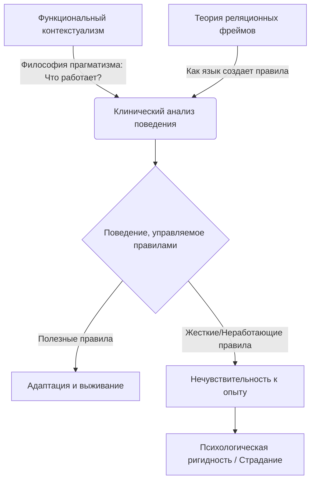

Современная психотерапия давно вышла за рамки простых советов в духе «мысли позитивно». В основе наиболее эффективных методов лежат глубокие научные и философские концепции, объясняющие, почему наш разум так часто заводит нас в тупик. Терапия принятия и ответственности (ТПО, или ACT) — яркий тому пример. Ее невероятная клиническая эффективность строится на прочном фундаменте, который часто называют «тремя столпами ACT».

Первый столп — это **функциональный контекстуализм** (философия прагматизма, рассматривающая любое событие как неразрывное «действие-в-контексте»). Второй столп — **Теория реляционных фреймов (ТРФ)** (всеобъемлющая теория языка, объясняющая, как слова приобретают функции реальных угроз).

Однако эти философские и лингвистические концепции остались бы лишь академическими теориями, если бы не третий, объединяющий их столп — **современный клинический анализ поведения**. Именно он переводит сложную теорию в плоскость реальных человеческих поступков, объясняя, как наш язык трансформирует базовые процессы обучения и приводит к хронической психологической ригидности _(Hayes, Barnes-Holmes, & Roche, 2001)_.

В этом лонгриде мы подробно разберем, как анализ поведения сплетает воедино философию и теорию языка, раскрывая истинную анатомию человеческих страданий.

## Эволюция бихевиоризма: От рефлексов к языку

Традиционный (ранний) бихевиоризм фокусировался на обусловливании через непосредственные последствия. Схема была простой: если животное или человек совершает действие и получает награду (подкрепление), действие повторяется. Если получает наказание — действие прекращается. Животные учатся исключительно на прямом опыте: собака не будет избегать огня, пока не обожжется.

Но с людьми все иначе. Современный клинический поведенческий анализ в ТПО акцентирует внимание на том, что появление человеческого языка (реляционного фрейминга, согласно ТРФ) радикально усложняет и трансформирует эти базовые процессы обучения _(Hayes, Barnes-Holmes, & Roche, 2001)_. Мы можем бояться того, с чем никогда не сталкивались, и избегать действий, которые объективно принесли бы нам пользу, просто потому, что в нашей голове звучат определенные слова.

### Поведение, управляемое правилами: Главная ловушка разума

Основой сложного человеческого познания является **поведение, управляемое правилами**. Это поведение, которое возникает и регулируется на основе символически выводимых вербальных предпосылок (инструкций), а не формируется исключительно под воздействием непосредственных последствий или прямого опыта в окружающей среде _(Skinner, 1969)_.

Способность следовать правилам — величайший дар эволюции. Благодаря ей мы можем передавать знания сквозь поколения. Нам не нужно прыгать со скалы, чтобы понять, что это смертельно — достаточно услышать правило: «Прыгнешь — разобьешься».

Однако у этой способности есть темная сторона, которая является главным объектом клинического поведенческого анализа:

* **Нечувствительность к прямым последствиям:** Правила могут продолжать существовать в нашем уме и жестко управлять поведением, даже когда они становятся неточными, неэффективными или откровенно вредными _(Hayes, Brownstein, Zettle, Rosenfarb, & Korn, 1986)_. Если у человека есть правило «Никому нельзя доверять», он будет избегать близости и разрушать отношения, даже если перед ним любящий и надежный партнер. Человек перестает реагировать на реальность (партнер добр) и реагирует только на правило в голове.
* **Психологическая ригидность:** Жесткое следование таким вербальным инструкциям делает индивида невосприимчивым к фактическим непредвиденным обстоятельствам и изменениям в окружающей среде. Человек слепо следует правилу («это должно работать именно так»), даже когда реальные последствия его поступков кричат об обратном _(Catania, Shimoff, & Matthews, 1989)_.

Именно эта фатальная оторванность от реальности и жесткая опора на дисфункциональные словесные сети (описанные в ТРФ) порождает то, что мы называем психопатологией.

## Анатомия страдания: Шесть процессов негексафлекса

В клиническом поведенческом анализе ТПО последствия разрушительного поведения, управляемого правилами, описываются через шесть взаимосвязанных процессов психологической ригидности (модель негексафлекса) _(Hayes, Strosahl, & Wilson, 1999)_.

Рассмотрим каждый из них в неразрывной связи с тем, как наш язык и попытки избежать дискомфорта искажают наше поведение.

### 1. Избегание опыта (Эмпирическое избегание)
Эмпирическое избегание возникает, когда индивид не желает контактировать с нежелательными внутренними событиями (болезненными мыслями, эмоциями, телесными ощущениями, воспоминаниями) и предпринимает активные попытки изменить их форму, частоту или контекст их возникновения _(Hayes, Wilson, Gifford, Follette, & Strosahl, 1996)_.
Человек применяет «модальность решения проблем» из физического мира к своему внутреннему миру. Парадокс заключается в том, что такое поведение усиливает неприятный внутренний опыт, делает эмоции более токсичными и приводит к долгосрочному сужению жизненного пространства _(Wenzlaff & Wegner, 2000)_.

### 2. Когнитивное спутывание (Слияние)
Этот процесс напрямую вытекает из Теории реляционных фреймов. Слияние происходит, когда вербальные правила и оценки начинают жестко доминировать над поведением, исключая другие контекстуальные переменные. Человек воспринимает свои мысли как буквальное отражение реальности _(Hayes, Strosahl, Bunting, Twohig, & Wilson, 2004)_.
В этом состоянии человек реагирует на символическую мысль о событии (например, мысль о возможном увольнении) так, словно само катастрофическое событие реально происходит с ним прямо сейчас, полностью утрачивая способность отличить процесс мышления от его продуктов _(Hayes, Strosahl, & Wilson, 1999)_.

### 3. Отсутствие контакта с настоящим моментом
Из-за тотального слияния с вербальными конструкциями человек утрачивает способность гибко, добровольно и целенаправленно контактировать с тем, что происходит "здесь и сейчас" _(Hayes, Strosahl, & Wilson, 1999)_.
Вместо взаимодействия с непосредственным настоящим, внимание становится ригидным. Человек постоянно оценивает концептуализированное, реконструированное языком прошлое (руминации) или живет страхами перед лингвистически сконструированным будущим (тревога и беспокойство) _(Davis & Nolen-Hoeksema, 2000)_.

### 4. Неясность ценностей (Поведение, управляемое ЭИ)
Когда поведение человека жестко регулируется правилами эмпирического избегания, социальной податливостью (стремлением подчиняться чужим правилам) или попытками угодить другим, он катастрофически теряет контакт с тем, что для него по-настоящему значимо _(Wilson & Byrd, 2004)_.
Жизнь превращается в бесконечное бегство от дискомфорта и попытки "решить проблему" своих негативных переживаний. При этом человек лишается витальности и энергии, которые дает следование свободно выбранным ценностям _(Hayes, Strosahl, & Wilson, 1999)_.

### 5. Бездействие или дезорганизованная деятельность (Импульсивность)
На уровне внешних поступков неспособность эффективно действовать проявляется в узких и негибких паттернах. Это может быть постоянное бездействие (прокрастинация, изоляция), импульсивные деструктивные поступки или упорное избегание _(Hayes, Strosahl, & Wilson, 1999)_.
С точки зрения поведенческого анализа, эти действия (например, алкоголизм, компульсии, селфхарм) контролируются *аверсивно* — они направлены на краткосрочное устранение неприятных состояний. Однако в долгосрочной перспективе они стремительно уводят человека прочь от ценностных целей и лишь усугубляют его клинические проблемы _(Hayes, Strosahl, & Wilson, 1999)_.

### 6. Спутанность с описательным Селф (Концептуализированное "Я")
Благодаря комбинаторному следованию (механизму ТРФ) люди способны сплетать разрозненные события своей жизни и внешние оценки в жесткий внутренний нарратив (историю) о том, кем они являются _(Hayes, Strosahl, & Wilson, 1999)_.
Сильная привязанность к этому описательному Селф (например, "я сломлен", "я жертва" или, наоборот, "я всегда должен быть победителем") заставляет человека воспринимать любую информацию, противоречащую этой истории, как экзистенциальную угрозу. Это приводит к самообману, отчаянной защите своего образа и фатальной потере поведенческой гибкости _(Hayes, Strosahl, & Wilson, 1999)_.

## Синтез трех столпов: Практический выход

Как мы видим, клинический анализ поведения в ACT не существует в вакууме. Он является той самой призмой, через которую функциональный контекстуализм и Теория реляционных фреймов обретают свой психотерапевтический смысл.

1. **Контекстуализм** задает цель: нам не важно, "правдивы" ли мысли клиента. Нам важно, прагматичны ли они, работают ли они на его благополучие.
2. **Теория реляционных фреймов** объясняет механизм: как именно слова обрели такую огромную власть над эмоциями и почему попытка логически оспорить эти слова лишь укрепляет их сеть.
3. **Анализ поведения** диагностирует поломку и предлагает решение: он показывает, что клиент застрял в *управляемом правилами поведении*, став нечувствительным к реальности.

Именно этот мощный трехчастный фундамент позволяет терапевтам ACT не тратить годы на копание в прошлом клиента или бесплодные логические диспуты с его страхами. Вместо этого терапия направлена на разрушение шести столпов негексафлекса через развитие **психологической гибкости** — способности осознанно контактировать с настоящим моментом и, невзирая на тяжелые мысли и эмоции, менять или сохранять свое поведение в зависимости от того, служит ли оно выбранным жизненным ценностям.
