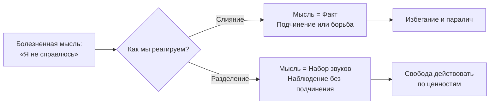

Когда разум произносит «Я неудачник», тело реагирует так, будто это физический факт — учащается пульс, сжимается горло, человек отказывается от действий. Слова приобретают плотность предметов. Мысль о провале причиняет такую же боль, как сам провал. Человек перестаёт видеть разницу между процессом мышления и его продуктами — и начинает жить в воображаемой реальности, сотканной из слов.

**Когнитивное разделение** (defusion) — это процесс изменения отношения к мыслям, при котором человек перестаёт смотреть на мир *через* призму вербальных конструкций и учится смотреть *на* сами эти конструкции, воспринимая их как поток преходящих слов и образов, а не как буквальную истину *(Хейс, Штросаль, & Уилсон, 2021)*. Разделение не убирает мысли — оно лишает их диктаторской власти над поведением.

### Слияние как иллюзия буквальности: что удерживает человека в ловушке

**Когнитивное слияние** возникает, когда человек настолько отождествляет себя с содержанием разума, что полностью утрачивает способность критически оценивать реальность *(Хейс, Штросаль, & Уилсон, 2021)*. Оценочные суждения («Я никчёмный», «Эта ситуация безнадёжна», «Людям нельзя доверять») превращаются в непреложные факты. Человек реагирует на символическую мысль о событии так, словно событие реально происходит прямо сейчас.

Метафорически слияние похоже на жёлтые солнцезащитные очки. Человек носит их так давно, что искренне верит: весь мир вокруг жёлтый. Когнитивное разделение не меняет цвет стёкол (не занимается когнитивной реструктуризацией) — оно помогает снять очки, подержать их в руках, изучить форму и осознать, что это просто инструмент, искажающий свет *(Бах & Моран, 2021)*.

### Нестираемость нейронных сетей: почему нельзя просто «передумать»

Теория реляционных фреймов (ТРФ) доказывает: человеческий мозг работает исключительно на прибавление связей, а не на их удаление *(McCracken, б.г.)*. Попытка логически доказать обратное («Нет, я не ничтожество, я хороший специалист!») лишь создаёт новую связку «ничтожество — успех», делая концепцию «ничтожества» ещё более центральной в нейронной сети *(Хейс, Штросаль, & Уилсон, 2021)*.

Вместо того чтобы перестраивать нейронные сети (что долго, трудно и подвержено рецидивам), интервенции разделения изменяют **функциональный контекст** — то, как мозг реагирует на эти сети. Разум переходит из режима диктатора в режим фонового радио.

### Три типа интервенций разделения

Стратегии разделения делятся на три категории, каждая из которых атакует слияние с разной стороны *(Хейс, Штросаль, & Уилсон, 2021; Бах & Моран, 2021)*:

| Тип | Механизм | Примеры техник |
| :--- | :--- | :--- |
| **Ослабляющие вербальный смысл (делитерализация)** | Многократное повторение лишает слова привычной смысловой нагрузки | Упражнение Титченера: быстрое повторение пугающего слова 45 секунд |
| **Объективизирующие (физиализация)** | Мысли превращаются в предметы с формой, цветом и размером | «Какого цвета эта мысль? Какой она формы? Где она находится?» |
| **Дистанцирующие (наблюдение)** | Мысли помещаются в визуальный поток, за которым клиент наблюдает со стороны | «Листья в ручье», «Мысли на параде», бегущая строка |

### Техники в живой динамике сессии

Терапевт ТПО не читает лекций. Он постоянно ловит клиента на слиянии и применяет техники «на лету» *(Хейс, 2020; Хэррис, 2020)*:

**«Листья в ручье» / «Мысли на параде».** Клиенту предлагают представить мысли как надписи на плакатах, которые несут марширующие солдаты, или как листья, плывущие по воде. Задача — наблюдать. Как только парад останавливается (клиент слился с мыслью, начал её обдумывать или оценивать упражнение как «глупое»), терапевт просит отступить на шаг, осознать, *какая именно мысль* остановила парад, поместить её на новый плакат и позволить параду идти дальше *(Хейс, Штросаль, & Уилсон, 2021)*. Это тренирует мышцу перехвата слияния.

**«Дурацкие голоса».** Если клиент постоянно ругает себя («Я полный идиот»), терапевт просит произнести эту мысль вслух голосом Микки-Мауса, Дарта Вейдера или Гомера Симпсона *(Хэррис, 2020)*. Изменение контекста мгновенно сдувает авторитет внутреннего диктатора.

**«Пение мыслей».** Клиент пропевает самую страшную мысль на мотив песенки «Happy Birthday» или «В лесу родилась ёлочка» *(Хэррис, 2020)*. Это доказывает мозгу: слова — не закон гравитации, а просто текст, который можно положить на любую музыку.

**«У меня есть мысль, что...»** Простая лингвистическая вставка. Вместо «Я не справлюсь» клиент учится говорить: «Прямо сейчас я замечаю, что у меня появилась мысль о том, что я не справлюсь» *(Хэррис, 2020)*. Это мгновенно меняет позицию с объекта на субъекта-наблюдателя.

### Кейс Яны: когда слова теряют власть

Расс Хэррис описывает клиническую историю Яны, страдавшей от хронической депрессии и навязчивых мыслей: «Ты толстая, ты некрасивая, из тебя не выйдет ничего путного» *(Хэррис, 2020)*. На сессиях Яна применяла технику «Дурацкие голоса», озвучивая жестокие интроекты своей матери пронзительным, визгливым голосом.

Мысли не исчезли полностью. Но они утратили авторитет. Яна перестала воспринимать их всерьёз — и это помогло ей выйти из депрессии *(Хэррис, 2020)*.

### Доказательная база: эксперименты с делитерализацией

**Эффект Титченера.** Исследования показывают: если взять негативную самооценочную мысль и быстро повторять её в течение 30-45 секунд (например, слово «глупый»), правдоподобность этой мысли и вызываемый ею дистресс стремительно снижаются *(Хейс, 2020; Хейс, Штросаль, & Уилсон, 2021)*. Слово превращается в бессмысленный набор звуков, напоминающий «птичий щебет» или «поломанный ксерокс».

**Поведенческий тест «Я не могу ходить».** Ирландские исследователи провели эксперимент: люди, вслух непрерывно повторяющие «Я не могу ходить по этой комнате», продолжали спокойно по ней ходить *(Хейс, 2020)*. После такой демонстрации тщетности слов толерантность участников к реальной физической боли увеличилась почти на 40%. Разделение мгновенно повышает терпимость к дискомфорту.

### Разделение — это не контроль: главная ловушка

Клиент поёт мысль голосом Дональда Дака, а потом жалуется: «Я спел, но тревога не ушла!». Это ловушка скрытого избегания *(Хэррис, 2020)*. Цель разделения — **не убить мысль**. Цель — спеть её и взять с собой на вечеринку. Человек разделяется не для того, чтобы избавиться от слов, а чтобы не дать им управлять ногами.

Вторая опасность — юмор без эмпатии. Техники вроде «Дурацких голосов» могут показаться обесценивающими. Если терапевт не установил эмпатическую связь, клиент почувствует, что над его болью смеются *(Хейс, Штросаль, & Уилсон, 2021)*. Терапевт должен чётко артикулировать: «Мы смеёмся не над вашими страданиями. Мы высмеиваем тиранический механизм разума, который пытается вас поработить».

### Заключение и Литература

Когнитивное разделение позволяет человеку превратить мысль из линзы, через которую он смотрит, в объект, на который он смотрит. Мы не меняем содержание мыслей и не стираем их. Мы лишаем слова автоматической власти над поведением — и возвращаем человеку свободу действовать в соответствии с ценностями, а не с приказами внутреннего диктатора.

- Бах, П. А., & Моран, Д. Дж. (2021). *ACT на практике. Концептуализация случаев в терапии принятия и ответственности*. ООО «Диалектика».
- Хейс, С. С. (2020). *Освобожденный разум. Как побороть внутреннего критика и повернуться к тому, что действительно важно*. ООО «Издательство «Эксмо».
- Хейс, С. С., Штросаль, К. Д., & Уилсон, К. Г. (2021). *Терапия принятия и ответственности. Процессы и практика осознанных изменений*. ООО «Диалектика».
- Хэррис, Р. (2020). *Ловушка счастья. Перестаем переживать — начинаем жить*.
- McCracken, L. (б.г.). *ACT for Chronic Pain (Хроническая боль. Перевод Е. Сушан, И. Розов)*.
- Торнеке, Н. (2022). *Теория реляционных фреймов в клинической практике*. Компьютерное издательство «Диалектика».

---

Клиент с паническим расстройством боится лифтов. Само слово «лифт» вызывает тахикардию. Терапевт предлагает ему повторять слово «лифт» быстро и непрерывно в течение 60 секунд. Через минуту клиент замечает, что слово превратилось в бессмысленный набор звуков. Однако на следующей сессии клиент сообщает: «Я попробовал повторять это слово перед каждой поездкой, чтобы *убрать* тревогу, но она возвращается ещё сильнее».

**Вопрос:** Опираясь на различие между когнитивным разделением и скрытым эмпирическим избеганием, объясните, почему стратегия клиента провалилась. Как бы вы скорректировали его понимание цели упражнения?
