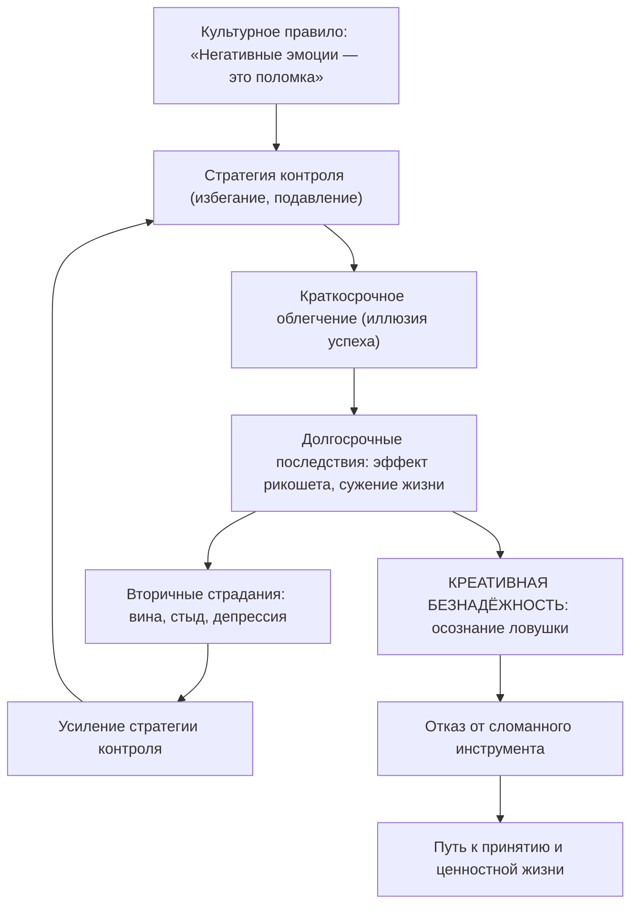

Человек годами борется с тревогой, подавляет неприятные мысли, избегает болезненных ситуаций. Разум подсказывает: нужно лишь найти правильную технику, и страдания отступят. Но чем упорнее эта борьба, тем глубже яма. Знакомый тупик.

**Креативная безнадёжность** в Терапии принятия и ответственности (ТПО/ACT) предлагает парадоксальный выход: перестать копать. Это не про отчаяние и не про сдачу перед жизнью. Это ясное осознание того, что сломан инструмент, а не сам человек. Когда клиент признаёт провал стратегий контроля, перед ним открывается путь к принципиально иным действиям — **радикальному принятию** и жизни в согласии с ценностями *(Торнеке, 2010)*.

### Программа контроля: культурное правило, порождающее страдание

Культура учит людей простому правилу: негативные эмоции — сигнал поломки, от них нужно избавиться *(Хейс, Штросаль, & Уилсон, 2021)*. Разум блестяще решает внешние проблемы. Человеку холодно — он строит дом и включает отопление. На пути гора — он строит туннель *(Бах & Моран, 2021)*. Эта логика «найди проблему — устрани её» работает безотказно в физическом мире.

Трудности начинаются, когда тот же механистический подход переносится во внутренний мир. Человек пытается «построить мост» над тревогой или «убежать» от воспоминаний. Но внутренние переживания не подчиняются законам физики. Чем сильнее человек пытается не думать о чём-то, тем более значимым это становится *(Хейс, Штросаль, & Уилсон, 2021)*.

> **Программа контроля** — это культурно навязанное правило о том, что от негативного внутреннего опыта нужно и можно избавиться. В ACT именно эта программа рассматривается как источник хронических страданий.

### Ловушка контроля: от мгновенного облегчения к сужению жизни

Каузальная цепочка страдания разворачивается в четыре этапа. Сначала культура формирует правило: «Негативные эмоции опасны, контролируй их». Затем человек применяет стратегию контроля — например, избегает социальных контактов, чтобы не тревожиться *(Бах & Моран, 2021)*. В краткосрочной перспективе тревога на минуту отступает, создавая иллюзию успеха. Но в долгосрочной перспективе изоляция лишает человека ценностных подкреплений, жизнь сужается, а подавляемые мысли возвращаются с удвоенной силой — это **эффект рикошета** *(Бах & Моран, 2021)*.

Женщина, пережившая сексуальное насилие, испытывает сильную тревогу при перспективе интимной близости с новым, любящим партнёром *(Бах & Моран, 2021)*. Как только возникает страх, она выходит из спальни. На микроуровне тревога спадает мгновенно. Но терапевт задаёт вопрос: «Помогает ли это в долгосрочной перспективе? Во что обходится эта стратегия?» Клиентка признаёт: тревога нарастает, возникает во всё большем числе ситуаций, а цена бегства — разрушение отношений, которые для неё критически важны *(Бах & Моран, 2021)*. Решение проблемы (бегство) официально становится главной проблемой.

### Аудит вместо убеждения: опыт как единственный авторитет

Самый фундаментальный элемент креативной безнадёжности — перенос авторитета с того, что говорит разум («это должно сработать»), на то, что говорит реальный опыт клиента («это делает мою жизнь только хуже») *(Бах & Моран, 2021)*. Терапевт не выступает лектором и не пытается логически убедить клиента в неправоте. Человеческий разум способен рационализировать и оспаривать любые аргументы *(Торнеке, 2010)*. Попытка доказать клиенту, что «решение является частью проблемы», сама по себе становится неработающим решением со стороны терапевта *(Бах & Моран, 2021)*.

Вместо логических споров терапевт проводит **совместный аудит** — безоценочное и предельно честное исследование. Он методично собирает все попытки клиента справиться со стрессом и взвешивает их на весах жизненной эффективности *(Хейс, Штросаль, & Уилсон, 2021)*.

| Вопрос аудита | Что исследуется |
|---|---|
| Чего клиент пытается достичь? | Цель стратегии контроля |
| Какие стратегии он уже испробовал? | Полный перечень попыток решения |
| Насколько они сработали в долгосрочной перспективе? | Честная оценка результата |
| Во что обошлось их применение? | Цена: энергия, время, упущенные возможности |

> Боль неудачи — главный союзник терапии. Только личный опыт провалов является неоспоримым доказательством для клиента *(Хейс, Штросаль, & Уилсон, 2021)*.

В групповой терапии хронической боли терапевт просит каждого участника перечислить все стратегии устранения боли *(McCracken, 2005)*. Группа заполняет таблицу результатов. Попытки контролировать боль не только не устранили её, но привели к разрушению карьеры, социальной изоляции и депрессии *(McCracken, 2005)*. Если контроль не работает, возможно, пришло время фокусироваться на полноценной жизни *вместе* с болью.

### Метафоры ACT: инструменты осознания ловушки

Креативная безнадёжность опирается на метафоры, которые обходят интеллектуальные защиты и обращаются к непосредственному опыту клиента.

**Метафора «Человек в яме».** Клиент оказался в глубокой яме с завязанными глазами, а в руках у него только лопата *(Хейс, Штросаль, & Уилсон, 2021)*. Копание — метафора контроля тревоги. Человек копает всё глубже, потому что лопата — единственный инструмент, который у него есть. Креативная безнадёжность наступает в тот момент, когда человек понимает: для спасения нужно выбросить лопату *(Хейс, Штросаль, & Уилсон, 2021)*.

**Метафора «Идеальный полиграф».** Терапевт просит клиента представить, что тот подключён к сверхчувствительному детектору лжи, а у его виска — пистолет. «Расслабьтесь, или я застрелю вас» *(Хейс, Штросаль, & Уилсон, 2021)*. Прямое требование не испытывать тревогу парадоксальным образом вызывает всплеск этой тревоги. Метафора наглядно демонстрирует невозможность волевого контроля над внутренними состояниями.

**Китайская ловушка для пальцев.** Чем сильнее человек пытается вырвать из неё пальцы, тем туже она сжимается. Чтобы освободиться, нужно вдавить пальцы внутрь — пойти навстречу дискомфорту *(Бах & Моран, 2021)*. Каждая метафора доносит одну и ту же мысль: борьба с внутренним опытом усиливает его, а движение навстречу открывает выход.

### Псевдопринятие: когда капитуляция становится уловкой

Креативная безнадёжность — это не депрессивное состояние, не вера в вечность страданий и не суицидальное отчаяние *(Хейс, Штросаль, & Уилсон, 2021)*. Безнадёжен не сам человек. Безнадёжна система правил, по которой он пытался играть в игру «избавление от боли» *(Бах & Моран, 2021)*.

Однако клиент нередко попадает в ловушку **псевдопринятия**. Человек формально соглашается с аудитом, но тайно сохраняет надежду на контроль. Типичная фраза: «Хорошо, я приму свою тревогу... так она теперь исчезнет?» *(Бах & Моран, 2021)*. Клиент пытается использовать принятие как более хитрый способ контроля. Терапевт тоже рискует попасть в ловушку, предлагая советы, которые клиент отвергает по принципу «Да, но...» *(Бах & Моран, 2021)*.

> Конечная цель креативной безнадёжности — не отчаяние, а перенаправление энергии. Человек отказывается от изнурительной войны с собственным разумом и направляет высвободившиеся ресурсы на проактивные действия в соответствии со своими глубинными ценностями *(Бах & Моран, 2021)*.

### Пятиминутный аудит: от теории к практике

Любой человек может провести экспресс-аудит собственных стратегий контроля за пять минут.

1. Напишите одну негативную эмоцию, от которой пытаетесь избавиться
2. Разделите лист на две колонки. В левой — 3–4 способа контроля (откладываю, ругаю себя, пью кофе)
3. В правой честно ответьте: дало ли это долгосрочное избавление и какую цену пришлось заплатить
4. Произнесите вслух: «Моя попытка закопать эту проблему — это лопата, которая роет яму. Сегодня я откладываю лопату в сторону»

Это упражнение не требует терапевта. Оно опирается на тот же принцип, что и профессиональный аудит: авторитет собственного опыта весомее любых логических аргументов *(Хейс, Штросаль, & Уилсон, 2021)*.

### Заключение и Литература

Креативная безнадёжность — это генеративный и освобождающий акт капитуляции перед сломанным инструментом. Человек сдаётся не перед жизнью и не перед своими целями. Он признаёт, что стратегии контроля внутреннего опыта не работают, и открывает двери для принципиально новых поведенческих альтернатив: готовности переживать свой опыт таким, какой он есть, и проактивного движения к ценностям *(Хейс, Штросаль, & Уилсон, 2021)*. Путь начинается с простого вопроса к самому себе: «Мои стратегии работают... или делают яму глубже?»

- Бах, П. А., & Моран, Д. Дж. (2021). *ACT на практике. Концептуализация случаев в терапии принятия и ответственности.* ООО "Диалектика".
- McCracken, L. (2005). *ACT for Chronic Pain.*
- Торнеке, Н. (2010). *Теория реляционных фреймов в клинической практике.*
- Хейс, С. С., Штросаль, К. Д., & Уилсон, К. Г. (2021). *Терапия принятия и ответственности. Процессы и практика осознанных изменений.* ООО "Диалектика".

---

**Вопрос для размышления:** Клиент с социальной тревожностью говорит терапевту: «Я перепробовал всё — медитацию, дыхательные техники, даже алкоголь перед вечеринками. Ничего не помогает. Наверное, мне просто нужна более мощная техника релаксации». Как терапевт ACT может использовать этот момент для создания креативной безнадёжности, не скатываясь в логическое убеждение и не вызывая у клиента ощущения безысходности?
