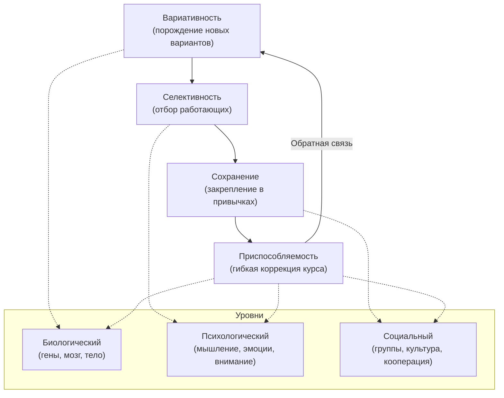

Традиционная психиатрия часто рассматривает человека по частям. Депрессию объявляют «поломкой мозга», тревогу — «химическим дисбалансом». При этом социальная изоляция, жёсткая Я-концепция и образ жизни остаются за кадром. Между тем изменение мышления физически меняет структуру мозга и экспрессию генов *(Хейс, 2020)*.

**Расширенная эволюционная мета-модель (EEMM)** предлагает иной путь. Она применяет фундаментальные принципы эволюции ко всем измерениям человеческой жизни — от биологии до культуры. Конечная цель модели — помочь человеку перейти от эволюции, слепо управляемой прошлым, к сознательному построению желаемого будущего *(Хейс, 2020)*.

### Кризис синдромального мышления: зачем нужна новая модель

Психиатрия десятилетиями классифицировала людей по диагнозам. EEMM стремится преодолеть этот кризис **синдромального мышления** и предложить единый процессно-ориентированный подход *(Хейс, Штросаль, & Уилсон, 2021)*. Это не набор техник для устранения симптомов. Это всеобъемлющая структура, объединяющая биологию, психологию и социологию в одну карту.

Без такой модели медицина продолжала бы рассматривать человека фрагментарно: лечить депрессию таблетками, игнорируя разрушенные социальные связи и ригидную Я-концепцию, которые физически меняют экспрессию генов *(Хейс, 2020)*. Человек — не изолированный разум, а сложнейшая живая система в экосистеме. Психология стоит в центре биологии и социологии *(Хейс, 2020)*.

> EEMM помещает человека в контекст эволюции: не как жертву генетики, а как участника осознанного развития на всех уровнях — от клетки до сообщества.

### Четыре двигателя эволюции: ядро модели

Контекстуальная наука утверждает: живые организмы приспосабливаются на основе четырёх фундаментальных процессов *(Хейс, 2020)*:

1. **Вариативность** — способность системы порождать новые варианты поведения, мышления и взаимодействия
2. **Селективность** — отбор тех вариантов, которые работают в данном контексте
3. **Сохранение** — закрепление отобранных паттернов в привычках, культуре и генах
4. **Приспособляемость** — гибкость, позволяющая менять курс при изменении условий

Эти четыре процесса действуют не только в биологической эволюции. Они работают в психике каждого человека каждый день *(Хейс, 2020)*.

### Уровни и измерения: карта человеческой сложности

EEMM описывает человека по двум осям: **уровни** (шкала) и **измерения** (баланс) *(Хейс, 2020)*.

**Три уровня** показывают, где происходит эволюция:

| Уровень | Что включает | Пример |
| :--- | :--- | :--- |
| Биологический | Гены, нейропластичность, эпигенетика | Изменение привычек меняет экспрессию генов |
| Индивидуально-психологический | Мышление, эмоции, внимание, мотивация | Когнитивное разделение расширяет репертуар |
| Социальный | Группы, кооперация, культурные нормы | Просоциальное поведение укрепляет сообщество |

Успех только на одном уровне недостаточен *(Хейс, 2020)*. Человек, который развивает мышление, но пренебрегает телом и отношениями, строит дом на одной опоре.

**Семь измерений** определяют, что именно нуждается в балансе *(Хейс, 2020)*:

- **Биологическое** — сон, питание, физическая активность
- **Когнитивное** — способность мыслить гибко
- **Эмоциональное** — открытость к переживаниям
- **Аттенциональное** — способность удерживать внимание в настоящем
- **Мотивационное** — контакт с ценностями
- **Поведенческое** — действия в направлении ценностей
- **Духовное** — ощущение связи с чем-то большим

Здоровье в модели EEMM — это не отсутствие симптомов. Это динамическое равновесие всех семи измерений *(Хейс, 2020)*.

### Каузальность многомерна: всё связано со всем

EEMM отвергает линейную причинность. Влияние распространяется в обоих направлениях *(Хейс, 2020)*.

**От поведения к биологии.** Человек меняет привычки — это запускает нейропластичность и эпигенетические процессы. Изменение мышления приводит к физическим изменениям в каждой клетке через включение и выключение генов *(Хейс, 2020)*.

**От общества к индивиду.** Групповые адаптации (кооперация, язык, культура) создают контекст для мышления и речи *(Хейс, Штросаль, & Уилсон, 2021)*. Люди эволюционировали как *Homo prosocialis* — вид, выживание которого зависело от сотрудничества *(Хейс, 2020)*.

**Снизу вверх: от микробиома к социальному краху.** В кишечнике человека живут триллионы микроорганизмов, без которых организм погибнет *(Хейс, 2020)*. Если человек сливается с негативной мыслью (ригидность Я-концепции), это сужает поведенческий репертуар. Он перестаёт выходить из дома. Социальные связи разрушаются. Неудача на одном измерении (когнитивном) приводит к краху всей цепочки *(Хейс, 2020)*.

> Фокус только на когнитивном измерении без контакта с настоящим моментом и духовностью приводит к ригидности. Баланс всех измерений — ключ к устойчивости.

### Навыки ACT как инструменты сознательной эволюции

Шесть навыков психологической гибкости из ACT напрямую соответствуют четырём критериям эволюции *(Хейс, 2020)*:

| Навык ACT | Двигатель эволюции | Как работает |
| :--- | :--- | :--- |
| Осознанность настоящего момента | Приспособляемость | Гибкое внимание позволяет замечать изменения контекста |
| Когнитивное разделение | Вариативность | Человек видит альтернативы вместо одной жёсткой истории |
| Я-как-контекст | Вариативность | Расширяет пространство для нового опыта |
| Ценности | Селективность | Человек отбирает действия по критерию «ради чего» |
| Ответственное действие | Сохранение | Регулярные поступки формируют устойчивые привычки |
| Забота о теле и социальной сети | Шкала (уровни) | Развитие охватывает все три уровня |

Эта интеграция превращает ACT из набора психотерапевтических техник в прикладную модель сознательной эволюции *(Хейс, 2020)*.

### Пять проверочных вопросов модели

EEMM структурирует понимание через пять вопросов *(Хейс, Штросаль, & Уилсон, 2021; Хейс, 2020)*:

**Почему?** Традиционные подходы зашли в тупик. Цель — создать трансдиагностическую науку для помощи людям и сообществам. Конечный ориентир — более добрый и заботливый мир *(Хейс, 2020)*.

**Что?** Эволюция происходит на трёх уровнях и в семи измерениях. Успех на одном уровне при провале на другом не приводит к благополучию *(Хейс, 2020)*.

**Потому что?** Поведение, гены и культура неразделимы. Психологическая гибкость приводит к изменениям в экспрессии генов и структуре мозга. Дэвид Слоан Уилсон доказал: групповая кооперация — фундаментальный механизм выживания *(Хейс, 2020)*.

**Как?** Человек применяет шесть навыков гибкости к четырём критериям эволюции. Осознанность развивает приспособляемость. Когнитивное разделение порождает вариативность. Ценности направляют селективность. Ответственное действие обеспечивает сохранение *(Хейс, 2020)*.

**А что, если нарушить баланс?** Человек, здоровый эмоционально, но нездоровый физически, получает мало пользы *(Хейс, 2020)*. Осознанность для эгоистичных целей ведёт в тупик. Развитие мышления без заботы о физиологии и отношениях — ложное развитие.

### Доказательная база: от генов до сообществ

**Эпигенетика.** Изменение мышления вызывает физические изменения в каждой клетке организма. Гены не приговор — они включаются и выключаются в зависимости от поведения и среды *(Хейс, 2020)*.

**Кооперация и просоциальность.** Элинор Остром (нобелевский лауреат) продемонстрировала, как просоциальные группы решают коллективные проблемы *(Хейс, 2020)*. Масштабный пример: обучение ACT-принципам при вспышке Эбола в Сьерра-Леоне помогло сообществам изменить опасные ритуалы захоронения *(Хейс, 2020)*. Принципы психологической гибкости вышли за рамки кабинета терапевта и спасли жизни.

**ИПОО (имплицитная процедура оценки отношений).** Эта методика демонстрирует, как глубоко заложены ригидные автоматические оценки. Когнитивное разделение и гибкое внимание разрывают обусловленность и возвращают человеку выбор *(Хейс, 2020)*.

### Микро-действие: «Эволюционный баланс» за пять минут

Нарисуйте треугольник и оцените каждый угол по шкале от 1 до 10 *(Хейс, 2020)*:

1. **Левый угол: «Биология»** — сон, питание, физическая активность
2. **Правый угол: «Социум»** — связи с близкими, помощь другим
3. **Вершина: «Психология: Внимание и Мотивация»** — присутствие в моменте, действия ради ценностей

Если одна оценка критически ниже остальных, сделайте *одно* конкретное действие для баланса. Стакан воды для биологии. Тёплое сообщение другу для социума. Минута осознанного дыхания для психологии.

> Эволюционный баланс — это не совершенство по всем фронтам. Это честная оценка и один маленький шаг в сторону слабого звена.

### Заключение и Литература

Расширенная эволюционная мета-модель превращает Терапию принятия и ответственности из набора психотерапевтических техник в целостную карту человеческого развития. Четыре двигателя эволюции (вариативность, селективность, сохранение, приспособляемость) работают на трёх уровнях и в семи измерениях. Когда человек развивает все навыки ACT в контексте биологии, психологии и социума, он переходит от слепой реакции на прошлое к сознательному строительству будущего — и это подтверждается данными эпигенетики, исследованиями кооперации и полевыми испытаниями от терапевтических кабинетов до кризисных зон.

- Бах, П. А., & Моран, Д. Дж. (2021). *ACT на практике. Концептуализация случаев в терапии принятия и ответственности*. ООО «Диалектика».
- Торнеке, Н. (2022). *Теория реляционных фреймов в клинической практике*. Компьютерное издательство «Диалектика».
- Хейс, С. С. (2020). *Освобожденный разум. Как побороть внутреннего критика и повернуться к тому, что действительно важно*. ООО «Издательство «Эксмо».
- Хейс, С. С., Штросаль, К. Д., & Уилсон, К. Г. (2021). *Терапия принятия и ответственности. Процессы и практика осознанных изменений*. ООО «Диалектика».

---

Мария, 34 года, пришла к терапевту с жалобой на хроническую усталость и ощущение бессмысленности. Она занимается медитацией осознанности ежедневно по 40 минут, читает книги по саморазвитию и считает себя «психологически продвинутой». При этом она спит по 5 часов, питается фастфудом, последние полгода не виделась с друзьями и отклоняет приглашения коллег на обед. На вопрос терапевта о физическом здоровье Мария отмахивается: «Это не важно, я работаю над сознанием».

**Вопрос:** Опираясь на модель EEMM и принцип баланса уровней и измерений, объясните, почему интенсивная работа Марии исключительно на когнитивном и аттенциональном измерениях не приводит к улучшению. Какие конкретные «слепые зоны» в её эволюционном треугольнике вы бы выделили и какое первое микро-действие предложили?
