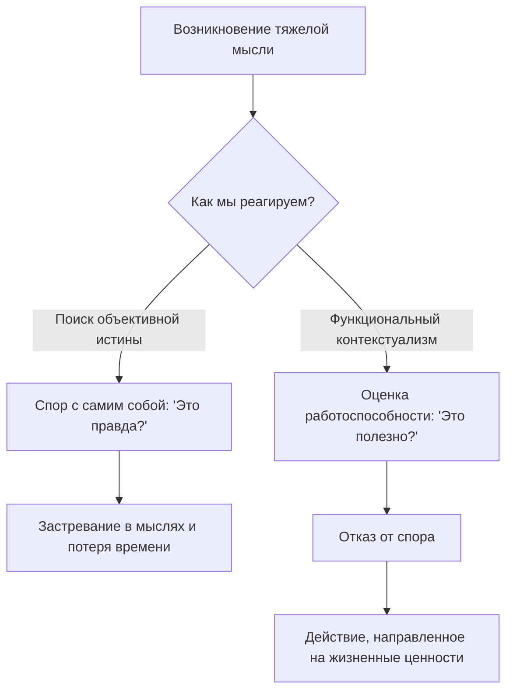

Мы часто попадаем в ловушку бесконечных внутренних споров. Когда в голове возникает болезненная мысль вроде «Я ужасный человек» или «Моя жизнь бессмысленна», наш первый инстинкт — начать искать доказательства, чтобы подтвердить или опровергнуть ее. Мы тратим колоссальное количество энергии на попытки доказать своему мозгу, что он неправ, искренне веря, что наши слова и ярлыки — это абсолютная объективная реальность.

Этот подход предлагает совершенно иной взгляд на устройство нашего разума. Он учит нас выходить из зала внутреннего суда и перестать тратить жизнь на выяснение того, кто прав. Вместо этого мы начинаем задавать себе один-единственный вопрос, который действительно имеет значение: помогает ли мне эта мысль двигаться вперед?

## Определение и польза: Смена фокуса с истины на пользу

**Функциональный контекстуализм** (философская и научная база Терапии принятия и ответственности, в которой любые мысли и действия оцениваются исключительно по их полезности в конкретной ситуации) — это подход, рассматривающий человека не как сломанный механизм, а как живой организм, неразрывно связанный со своей средой *(Hayes et al., 2012)*.

Главная утилитарная функция этого подхода заключается в освобождении от ментального паралича. Клиентам и терапевтам больше не нужно доказывать, что пугающие мысли ошибочны, нелогичны или не соответствуют действительности *(Harris, 2009)*. Отказываясь от бесконечных дебатов о том, чья картина мира более «правильная», вы получаете возможность направить всю свою энергию на реальные действия, которые делают вашу жизнь лучше.

## Большая картина и механика: Три опоры прагматизма

Архитектура функционального контекстуализма держится на трех фундаментальных принципах:

1. **Действие-в-контексте (Холизм):** Невозможно понять мысль или поведение в отрыве от ситуации. Любое психологическое событие — это неразрывное взаимодействие целостного человека с его текущим окружением и прошлым опытом *(Hayes et al., 2012)*.
2. **Отказ от онтологии:** Онтология — это поиск абсолютной, объективной истины. В этом подходе мы отказываемся от претензий на знание того, как всё устроено «на самом деле». Мысли воспринимаются просто как слова, а не как строгие факты реальности *(Harris, 2009)*.
3. **Прагматический критерий (Успешность работы):** Утверждение считается «истинным» только тогда, когда оно приводит к успешному достижению вашей цели. Главным мерилом становится **работоспособность** мысли *(Hayes et al., 2012)*.

**Механика работы (Под капотом):** Человеческий язык устроен так, что он автоматически подталкивает нас к категоричности. Когда мозг говорит «Я неудачник», нервная система реагирует на это как на свершившийся, объективный материальный факт. Функциональный контекстуализм искусственно разрывает эту иллюзию. Смещая фокус с содержания мысли («Правда ли это?») на ее функцию («К чему приведет вера в эту мысль?»), мы лишаем болезненные установки их парализующей силы *(Harris, 2009)*.

## Ментальные модели и границы: Тяжелое зимнее пальто

**Аналогия (Зимнее пальто):** Представьте себе тяжелое, плотное зимнее пальто. Является ли оно «хорошим» или «плохим» само по себе? Это бессмысленный вопрос. В контексте суровой снежной бури это пальто прекрасно — оно спасет вам жизнь (оно *работоспособно*). Но если вы наденете это же пальто, чтобы переплыть глубокое озеро, оно утянет вас на дно. Ваши мысли работают точно так же. Мысль «Будь осторожен, людям нельзя доверять» могла быть крайне полезной в контексте опасного детства. Но сегодня, когда вы пытаетесь построить близкие отношения с любящим партнером, эта же мысль тянет вас на дно. Мы оцениваем не саму мысль, а то, как она работает в текущем контексте.

**Чем это не является:** Функциональный контекстуализм принципиально отличается от классического механистического подхода, принятого в некоторых ранних формах психотерапии.

| Механицизм (Починка сломанного) | Функциональный контекстуализм (Оценка пользы) |
| :--- | :--- |
| **Отношение к мыслям:** Негативные мысли рассматриваются как «неисправные детали» или дефекты, которые нужно починить или заменить *(Hayes et al., 2012)*. | **Отношение к мыслям:** Мысли — это просто реакции организма на контекст. Их не нужно чинить, их нужно наблюдать *(Harris, 2009)*. |
| **Цель терапии:** Доказать клиенту, что его страхи нелогичны и не соответствуют фактам реальности. | **Цель терапии:** Понять, помогает ли данная мысль двигаться к ценностям. Спор об истинности не имеет значения *(Hayes et al., 2012)*. |

## Практическое руководство: Алгоритм оценки работоспособности

Чтобы перенести философию прагматизма в реальную жизнь, используется четкий алгоритм. Ниже представлены четыре шага, каждый из которых сопровождается примером заполненного результата для типичной ситуации: клиент боится выступить с презентацией из-за мысли «Я выставлю себя полным идиотом».

**Шаг 1: Идентификация события (Действие)**
Зафиксируйте болезненную мысль или эмоцию как событие, а не как объективный факт. Дайте ей название.
> *Пример заполненного результата:* «Я фиксирую, что прямо сейчас мой разум генерирует мысль: 'Я выставлю себя полным идиотом на завтрашнем совещании'».

**Шаг 2: Описание контекста**
Отметьте текущую ситуацию: где вы находитесь, что происходит вокруг и каков ваш исторический бэкграунд в подобных делах.
> *Пример заполненного результата:* «Контекст: Я сижу дома за ноутбуком, поздно вечером. Завтра важное выступление. В прошлом у меня был неудачный опыт публичной речи, поэтому мой мозг сейчас бьет тревогу, пытаясь меня защитить».

**Шаг 3: Проверка на работоспособность (Прагматический критерий)**
Откажитесь от оценки на истинность. Не ищите доказательства того, идиот вы или нет. Задайте вопрос о полезности: «Если я позволю этой мысли управлять моим поведением, куда это меня приведет?».
> *Пример заполненного результата:* «Отказ от онтологии: Я не буду спорить с мозгом о том, как пройдет выступление. Проверка работоспособности: Если я поверю в эту мысль и пойду за ней, это поможет мне хорошо подготовить слайды? Нет, это заставит меня закрыть ноутбук, сдаться и сказаться больным».

**Шаг 4: Выбор действия в контексте ценностей**
Примите осознанное решение о следующем шаге. Если мысль неработоспособна, позвольте ей оставаться фоновым шумом и сделайте то, что важно для вас.
> *Пример заполненного результата:* «Поскольку эта мысль не помогает мне достичь цели, я позволяю ей просто быть где-то на фоне. Моя ценность — профессиональное развитие. Поэтому я открываю презентацию и репетирую первые три слайда, несмотря на присутствие страха».

*Частая ловушка:* В момент сильного стресса вы можете сорваться и начать доказывать себе: «Нет, я не идиот, я умный!». Это возвращение к онтологическим спорам. Заметив это, просто мягко верните себя к вопросу: «Работает ли этот спор на меня прямо сейчас?».

## Отказ от правоты ради жизненных целей

Овладение навыком функционального контекстуализма требует значительного сдвига в привычном мировоззрении. Отказаться от желания быть правым в своих страданиях и перестать доказывать миру свою правоту бывает невероятно сложно. Наше эго жаждет определенности, оно хочет точно знать, «какие мы на самом деле» и «справедлив ли мир». Волевое решение отпустить эти вечные философские дебаты ради простых, прагматичных шагов навстречу своим целям часто сопровождается чувством уязвимости.

Однако именно этот отказ от бесконечной борьбы за объективную истину в собственной голове приносит самое глубокое психологическое освобождение. Перестав делить мысли на правильные и неправильные, вы экономите колоссальные запасы энергии. Ваше внимание переключается с бесплодного анализа на реальную жизнь. В конечном итоге вы обнаружите, что для создания осмысленной и богатой жизни совершенно не обязательно иметь идеальный, логически выверенный ум — достаточно лишь умения выбирать те действия, которые действительно работают на вас в данный момент времени.

## Главный вывод и литература

> Вам не нужно побеждать свои негативные мысли в интеллектуальном споре, чтобы начать жить. Переход к оценке мыслей по их практической пользе, а не по их абсолютной истинности, является ключом к настоящей психологической гибкости.

**Источники:**
* *Harris, R. (2009). ACT made simple: An easy-to-read primer on acceptance and commitment therapy. New Harbinger Publications.*
* *Hayes, S. C., Strosahl, K. D., & Wilson, K. G. (2012). Acceptance and commitment therapy: The process and practice of mindful change (2nd ed.). The Guilford Press.*

---

### Проверка понимания

Представьте, что ваша клиентка страдает от синдрома самозванца. На сессии она заявляет: *«Моя мысль о том, что я обманщица и не заслуживаю своей должности, — это абсолютная, объективная правда! У меня нет профильного образования, я делаю задачи медленнее коллег, и вчера я допустила ошибку. Я могу доказать вам, что я самозванка, опираясь на эти жесткие факты!»*

**Вопрос:** Опираясь на принципы функционального контекстуализма и отказ от онтологии, как бы вы перенаправили беседу? Какой конкретный вопрос (или серию вопросов) вы бы ей задали, чтобы перевести фокус с поиска «объективной истины» на оценку работоспособности ее убеждений?
