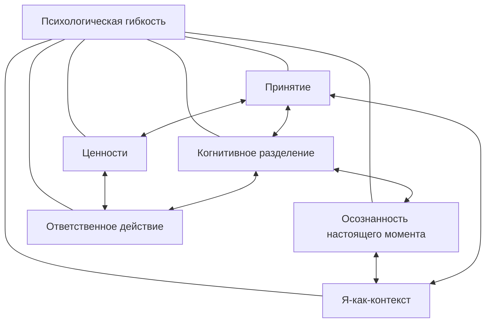
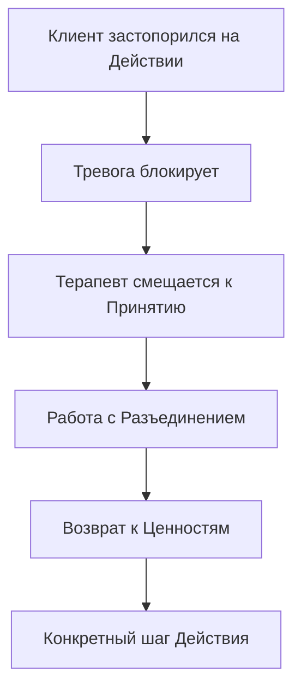

Человек приходит к терапевту с конкретной жалобой: тревога, депрессия, хроническая боль. Терапевт может работать с каждым симптомом отдельно, но ACT предлагает другой путь — увидеть за разрозненными проблемами единый механизм. Этот механизм называется **гексафлекс**: шесть взаимосвязанных процессов, которые вместе формируют психологическую гибкость.

Гексафлекс — не список техник и не пошаговый протокол. Это динамическая система, где каждый процесс обретает смысл только в связи с остальными пятью. Понимание этой системы меняет сам подход к терапии: от механического применения упражнений — к гибкой навигации между процессами *(Хейс, Штросаль, & Уилсон, 2021)*.

### Гексафлекс как трансдиагностическая экосистема: универсальный язык гибкости

**Гексафлекс** — единая, научно обоснованная, трансдиагностическая модель. Она состоит из шести поведенческих процессов: **Принятие**, **Когнитивное разделение**, **Осознанность настоящего момента**, **Я-как-контекст**, **Ценности** и **Ответственное действие** *(Хейс, Штросаль, & Уилсон, 2021)*.

Главное назначение модели — сместить фокус терапии с перечисления симптомов на фундаментальные процессы, лежащие в основе страданий и человеческого потенциала. Гексафлекс создаёт универсальный язык, применимый к любым ситуациям — от психозов и хронической боли до спорта и бизнеса *(Хейс, 2020)*.

Между шестью узлами существует 30 возможных направлений взаимосвязи. Ни один процесс не имеет полного смысла в отрыве от остальных. Потянув за один узел, терапевт приводит в движение все остальные *(Хейс, Штросаль, & Уилсон, 2021)*.

> Без системного подхода терапия ACT превращается в набор механистических техник. «Принятие» становится скрытым избеганием, а «ценности» — жёсткими моральными догмами *(Бах & Моран, 2021)*.

### Психологическая гибкость как ядро: шесть точек обзора одной способности

**Психологическая гибкость** — способность осознанно и открыто контактировать с настоящим моментом и изменять или сохранять поведение в соответствии с ценностями *(Хейс, Штросаль, & Уилсон, 2021)*. Все шесть процессов гексафлекса — разные точки обзора этой центральной способности.

Процессы связаны сетевой каузальностью. Человек не может совершать ответственные действия, если он слит с мыслью «у меня ничего не выйдет» (недостаток разделения) и не готов выносить тревогу (недостаток принятия) *(Бах & Моран, 2021)*. Принятие без привязки к ценностям превращается в пассивное смирение *(Хейс, Штросаль, & Уилсон, 2021)*.

### Трифлекс: три столпа гибкости как опоры треноги

Шесть процессов группируются в три функциональные пары — **трифлекс** *(Хейс, Штросаль, & Уилсон, 2021)*:

| Столп | Процессы | Функция |
| :--- | :--- | :--- |
| **Открытость** | Принятие + Разъединение | Демонтаж избегания и когнитивного слияния |
| **Центрированность** | Настоящий момент + Я-как-контекст | Гибкий контакт с реальностью из трансцендентной точки наблюдения |
| **Вовлечённость** | Ценности + Ответственное действие | Трансформация открытости в конкретные осмысленные шаги |

Архитектура подобна треноге: если одна опора ослабевает, вся конструкция рушится. Открытость без вовлечённости — пустое наблюдение. Вовлечённость без центрированности — слепое рвение. Центрированность без открытости — интеллектуальная игра.

### Эволюционная логика гексафлекса: вариативность, селекция, сохранение

Процессы гексафлекса — форма прикладной эволюционной науки *(Хейс, 2020)*. Каждый столп выполняет определённую эволюционную функцию:

- **Вариативность.** Разъединение и принятие разрушают ригидные правила, создавая пространство для новых реакций
- **Селективность.** Ценности устанавливают критерий отбора: не «помогает ли избежать боли», а «делает ли жизнь осмысленной»
- **Сохранение.** Ответственное действие формирует новые поведенческие привычки
- **Контекст.** Осознанность и Я-как-контекст обеспечивают адаптацию к текущим условиям

Такая эволюционная модель объясняет, почему гексафлекс работает как целостная система. Изъятие любого компонента нарушает весь цикл «вариация → отбор → закрепление».

### Клиническое мгновение Теда: гексафлекс в действии

Тед живёт с глубокой социальной тревожностью. Он хочет построить отношения (Ценность), но изолируется из-за страха. На сессии у него перехватывает дыхание.

Терапевт переводит внимание Теда на ощущения в груди (Настоящий момент). Просит дать имя страху и поблагодарить свой разум за попытку защитить (Разъединение) *(Бах & Моран, 2021)*. Затем спрашивает: «Готов ли ты освободить место для этого чувства (Принятие), если это шаг к тому, чтобы пригласить девушку на свидание (Ценность и Действие)?» *(Бах & Моран, 2021)*.

В одном клиническом эпизоде терапевт задействовал четыре процесса гексафлекса. Он не следовал жёсткому протоколу «сессия 1 — принятие, сессия 2 — разделение». Он гибко перемещался по системе, следуя за клиентом.

> Концептуализация случая в ACT — «текучий, рекурсивный и нелинейный танец», где терапевт использует сильные стороны клиента для проработки слабых *(Бах & Моран, 2021)*.

### Доказательство целостности: что происходит без отдельных компонентов

Исследователи провели эксперимент с неполной ACT-терапией *(Хейс, 2020)*. Результаты наглядно демонстрируют системную природу гексафлекса:

| Условие | Результат |
| :--- | :--- |
| **Без Принятия и Разъединения** | Клиенты стали действовать активнее, но испытывали острую симптоматику |
| **Без Ценностей и Действия** | Клиенты научились меньше страдать, но не стали жить богаче |
| **Полная ACT** | Фундаментальные изменения и в переживаниях, и в поведении |

Процессы меняют жизнь фундаментально только как единый пакет *(Хейс, 2020)*. Открытость без направления — облегчение без роста. Направление без открытости — активность в тисках боли.

### Риски изолированной работы: когда отдельный процесс вредит

Изолированная проработка одного узла без связи с остальными приводит к клиническим провалам *(Хейс, Штросаль, & Уилсон, 2021)*. Терапевт, который не видит системы, рискует создать ятрогенный эффект:

- **Принятие без ценностей** превращается в депрессивное смирение. Человек «принимает» страдание, но не делает ничего осмысленного
- **Ценности без Я-как-контекста и разделения** порождают перфекционизм и самобичевание. Человек фиксируется на «правильном» поведении и жестоко критикует себя за любое отклонение
- **Интеллектуальные дебаты о процессах** приводят к тому, что терапевт моделирует ригидность вместо гибкости *(Хейс, Штросаль, & Уилсон, 2021)*

Когнитивное слияние и избегание взаимно усиливают друг друга. Человек избегает *потому что* слит с мыслью об угрозе, а избегая — *подтверждает* истинность этой мысли *(Хейс, Штросаль, & Уилсон, 2021)*.

### Навигация по гексафлексу: как терапевт работает с системой

Терапевт ACT не идёт по линейному маршруту. Он плавно перемещается по гексафлексу, используя инструменты вроде методики «Черепаха» или радара профиля гибкости «Пси‑Флекс» *(Хейс, Штросаль, & Уилсон, 2021)*.

Если клиент застопорился на действии из-за тревоги, терапевт смещается влево — к принятию и разделению. Когда тревога получает место, терапевт возвращается к ценностям и конкретным шагам *(Бах & Моран, 2021)*.

Гексафлекс — не список задач, а карта навигации. Терапевт читает клиента и определяет, какой процесс нуждается в поддержке прямо сейчас. Сильные стороны клиента (например, хорошая осознанность) становятся рычагом для проработки слабых (например, сильное когнитивное слияние) *(Бах & Моран, 2021)*.

### Трифлекс-сканирование: практика интеграции за две минуты

Трифлекс-сканирование — простое упражнение, которое позволяет человеку за две минуты пройти через все три столпа гибкости:

1. **Открытость.** Заметьте тяжесть в теле. Скажите себе: «Я замечаю это чувство и готов освободить для него место»
2. **Центрированность.** Сделайте глубокий вдох. Поставьте стопы на пол. Заметьте: есть мысли, и есть вы — тот, кто наблюдает
3. **Вовлечённость.** Спросите себя: «Какое крошечное, но осмысленное действие я могу сделать в следующие 10 минут?» Встаньте и сделайте его

> Трифлекс-сканирование — не замена терапии. Это способ ежедневно тренировать системную гибкость, задействуя все три столпа за один подход.

### Заключение и Литература

Гексафлекс — не коллекция разрозненных приёмов, а единая динамическая система из шести взаимосвязанных процессов, формирующих психологическую гибкость. Эти процессы группируются в три столпа (открытость, центрированность, вовлечённость), следуют эволюционной логике и работают только как целостный пакет. Изъятие любого компонента приводит к клиническим провалам: принятие без ценностей становится смирением, ценности без разделения — перфекционизмом. Терапевт ACT не идёт по жёсткому протоколу, а гибко перемещается по системе, используя сильные стороны клиента для проработки слабых.

- *Бах, П. А., & Моран, Д. Дж. (2021). ACT на практике.*
- *Торнеке, Н. (2022). Теория реляционных фреймов в клинической практике.*
- *Хейс, С. С. (2020). Освобождённый разум.*
- *Хейс, С. С., Штросаль, К. Д., & Уилсон, К. Г. (2021). Терапия принятия и ответственности.*

---

**Вопрос для размышления:** Терапевт работает с клиенткой, которая чётко определила свои ценности (семья, творчество) и начала активно действовать — записалась на курсы, стала проводить больше времени с детьми. Однако через месяц она пришла на сессию в состоянии истощения и самокритики: «Я делаю всё правильно, но чувствую себя ужасно. Значит, со мной что-то не так». Какие процессы гексафлекса, вероятнее всего, были недостаточно проработаны, и как их дефицит привёл к такому результату?
