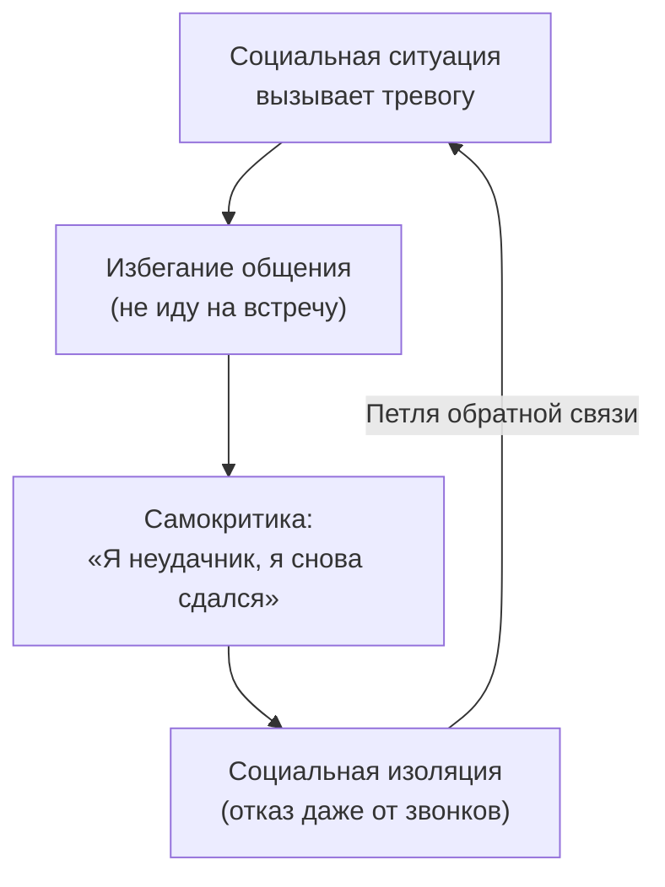

Традиционная психиатрия стремится поставить клиенту диагноз из справочника — «большое депрессивное расстройство», «генерализованное тревожное расстройство» — и назначить соответствующий протокол. Но реальность человеческого страдания редко укладывается в аккуратные категории. У одного клиента избегание подпитывает депрессию, у другого — перфекционизм, у третьего — изоляцию. Универсальный протокол не учитывает этих уникальных связей.

**Идиографическое сетевое моделирование** в процессно-ориентированной терапии (PBT) — это аналитический инструмент, позволяющий визуализировать уникальные для конкретного клиента взаимосвязи между событиями, мыслями, эмоциями и поведением в виде графа (сети), состоящего из узлов и связей *(Hayes & Hofmann, 2018)*. Терапевт больше не «втискивает» живого человека в рамки диагноза — он создаёт индивидуальную карту процессов, которые порождают страдания.

### Элементы сетевой архитектуры

Любая идиографическая сеть строится из трёх базовых элементов *(Hayes & Hofmann, 2018)*:

| Элемент | Определение | Графическое представление |
| :--- | :--- | :--- |
| **Узлы** | Конкретные события, мысли, эмоции или паттерны поведения, описанные языком клиента | Квадраты на схеме |
| **Связи** | Функциональные зависимости между узлами, показывающие направление влияния | Стрелки (однонаправленные или двунаправленные) |
| **Субсети** | Замкнутые петли обратной связи из трёх и более узлов — порочные круги | Циклы на схеме |

Событие А становится *процессом*, если оно изменяет то, как человек справляется с событием Б. Например, история буллинга в школе — не просто факт прошлого. Она является активным процессом, если напрямую ведёт к формированию низкой самооценки сегодня *(Hayes & Hofmann, 2018)*.

### Механика порочного круга: как избегание ведёт к изоляции

Рассмотрим, как один процесс перетекает в другой *(Hayes & Hofmann, 2018)*:

Клиент решает не идти на встречу, чтобы не испытывать дискомфорт. Сидя дома, он начинает руминировать: «Я неудачник, я снова сдался». Самокритика снижает самооценку, что заставляет его в следующий раз отказываться даже от телефонных звонков. Изоляция усиливает тревогу перед людьми — и замкнутая субсеть начинает поддерживать саму себя без внешней подпитки.

### Шесть этапов концептуализации случая

PBT-терапевт категоризирует работу в строгую последовательность *(Hayes & Hofmann, 2018)*:

1. **Составление списка** ключевых проблем на основе целей клиента
2. **Выявление** предшествующих факторов и последствий каждой проблемы
3. **Организация** особенностей в сеть адаптивных и дезадаптивных процессов (поиск самоподдерживающихся связей)
4. **Добавление** инструментов измерения процессов и результатов
5. **Интеграция** сети в единый процессуально-ориентированный диагноз (функциональный анализ)
6. **Выбор мишени** для возмущения (perturbation) доминирующих элементов

### Совместное рисование вместо готовых схем

Терапевт не приносит готовую сложную схему из учебника. Он берёт лист бумаги и спрашивает клиента: «Когда происходит X, что вы делаете дальше?» *(Hayes & Hofmann, 2018)*. Используя *исключительно язык клиента*, избегая синдромальных терминов («депрессия», «ПТСР»), они вместе рисуют квадраты.

Терапевт спрашивает: «Насколько сильно чувство одиночества влияет на вашу оценку себя?» Клиент отвечает: «Очень сильно». Терапевт рисует *жирную* стрелку от «Одиночества» к «Низкой самооценке» *(Hayes & Hofmann, 2018)*.

В этот момент происходит микро-трансформация: просто *наблюдая* за тем, как автоматические паттерны обслуживают бесполезные функции, клиент уже испытывает терапевтический эффект. Осознание механизма ослабляет его власть.

### Стратегия упрощения: схлопывание узлов

Один из главных инструментов архитектора — **упрощение на основе функционального сходства** *(Hayes & Hofmann, 2018)*. Предположим, клиент руминирует (зацикливается на прошлом), беспокоится (тревожится о будущем) и прокрастинирует (откладывает дела). Вначале эти проблемы рисуются как три разных квадрата.

Но в ходе анализа выясняется, что все три обслуживают одну функцию: они являются проявлениями перфекционизма, вызванного страхом социального отвержения. Тогда архитектор **схлопывает** три квадрата в один узел, радикально упрощая карту и получая чёткую мишень для воздействия *(Hayes & Hofmann, 2018)*.

### Клинический пример: две субсети одной клиентки

В руководстве PBT описан случай клиентки с двумя первичными субсетями *(Hayes & Hofmann, 2018)*:

**Субсеть 1.** Одиночество усиливает плохое настроение. Плохое настроение снижает самооценку. Низкая самооценка усиливает одиночество — цикл замыкается.

**Субсеть 2.** Низкая самооценка и плохое настроение вовлечены и во вторую подсеть, связанную с другими аспектами жизни клиентки.

Анализируя графы, терапевт замечает: узлы «Низкая самооценка» и «Плохое настроение» участвуют в *обеих* субсетях. Узел «Одиночество» имеет прямое и сильное влияние на оба этих узла. Клинический вывод: воздействие на реакции, связанные с одиночеством, плохим настроением или самооценкой, станет наиболее эффективным путём к обрушению дезадаптивной сети *(Hayes & Hofmann, 2018)*.

### Ловушки сетевого моделирования

**Навязывание своей логики.** Проблема возникает, когда терапевт полагается на номотетические (усреднённые) прототипы и игнорирует опыт конкретного клиента *(Hayes & Hofmann, 2018)*. Стрелки в сети — условные вероятности опыта *данного* человека. Если терапевт навязывает свою логику («Ваше избегание должно приводить к чувству вины»), а клиент этого не чувствует, модель теряет трансформационную силу. Терапевт должен постоянно сверяться: «Эта схема отражает ваш опыт?»

**Каскадные последствия.** Изменяя один узел, терапевт должен сохранять бдительность относительно того, как это парадоксально повлияет на другие части сети *(Hayes & Hofmann, 2018)*.

### Заключение и Литература

Идиографическое сетевое моделирование превращает работу психотерапевта из «починки» абстрактных диагнозов в архитектуру конкретных процессов. Клиент больше не рассматривается как набор симптомов — он предстаёт как сложная, взаимосвязанная экосистема. Совместное рисование карты процессов обеспечивает точность интервенций и уже само по себе запускает терапевтические изменения.

- Hayes, S. C., & Hofmann, S. G. (2018). *Learning Process-Based Therapy: A Skills Training Manual for Targeting the Core Processes of Psychological Change in Clinical Practice*. New Harbinger Publications.
- Хейс, С. С., Штросаль, К. Д., & Уилсон, К. Г. (2021). *Терапия принятия и ответственности. Процессы и практика осознанных изменений*. ООО «Диалектика».
- Бах, П. А., & Моран, Д. Дж. (2021). *ACT на практике. Концептуализация случаев в терапии принятия и ответственности*. ООО «Диалектика».

---

Клиент приходит на терапию с жалобой на хроническую бессонницу. Традиционный подход предписал бы работу с гигиеной сна и когнитивными искажениями вокруг сна. Однако в ходе совместного построения идиографической сети терапевт и клиент обнаруживают, что бессонница связана жирными двунаправленными стрелками с узлами «Страх близости» и «Избегание разговоров с партнёром», а узел «Самокритика перед сном» оказывается лишь периферийным, с одной тонкой стрелкой.

**Вопрос:** Опираясь на принципы идиографического моделирования и стратегию выбора мишени, объясните, почему лечение бессонницы как изолированного симптома, скорее всего, даст лишь временный результат. Какой узел вы бы выбрали в качестве мишени для терапевтического воздействия и на каком основании?
