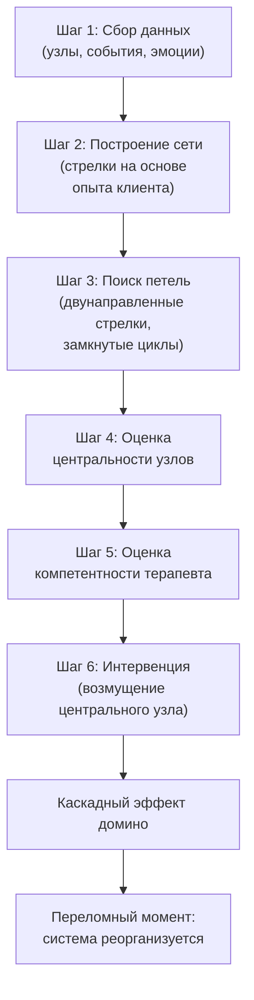

Многие клиенты годами ходят на терапию, разбирая одну проблему за другой — бессонницу, тревогу, конфликты на работе — но общее состояние меняется мало. Терапия напоминает игру «ударь крота»: подавишь один симптом, и тут же выскакивает другой. Проблема в том, что удары наносятся по периферийным элементам, а устойчивая патологическая конструкция поглощает эти слабые интервенции и возвращает человека в привычное состояние.

**Поиск точек воздействия** (leverage points) в процессно-ориентированной терапии (PBT) — это стратегический процесс выявления и целенаправленной дестабилизации наиболее центральных узлов в идиографической сети клиента, изменение которых способно вызвать эффект домино и привести всю патологическую систему к переломному моменту *(Хейс & Хофманн, 2021)*.

### Анатомия сетевой устойчивости

Человеческая психика подчиняется законам сложных динамических систем. Любая сложная сеть стремится к гомеостазу — стабильному состоянию. В математических моделях это изображается как шар, лежащий на дне глубокой долины *(Хейс & Хофманн, 2021)*.

Патологическая сеть чрезвычайно устойчива — долина глубока. Незначительные терапевтические вмешательства лишь слегка подталкивают шар вверх по склону. Как только усилие прекращается, шар скатывается обратно.

Однако если найти точку максимального воздействия и осуществить системное возмущение (perturbation), локальное изменение каскадирует по всей системе. Шар выталкивается на вершину холма — **переломный момент (tipping point)** — и скатывается в новую, адаптивную долину *(Хейс & Хофманн, 2021)*.

### Что делает узел центральным

Точка воздействия — это пересечение двух характеристик *(Хейс & Хофманн, 2021)*:

| Характеристика | Определение | Как оценивается |
| :--- | :--- | :--- |
| **Центральность** | Количество и сила связей, входящих в узел и исходящих из него | Узел участвует в нескольких субсетях, имеет много двунаправленных стрелок |
| **Компетентность** | Способность терапевта эффективно воздействовать на этот узел | Наличие навыков (когнитивное разделение, работа с ценностями, экспозиция) |

> Точка воздействия — это *не всегда* та проблема, на которую клиент жалуется громче всего. Клиент может прийти с бессонницей, но сетевой аудит покажет, что бессонница — лишь следствие глубинного избегания близости.

### Механизм обрушения системы

Алгоритм поиска и активации точки воздействия строго структурирован *(Хейс & Хофманн, 2021)*:

**Прямое и косвенное воздействие.** Прямое воздействие — это изменение самого узла (например, снижение гнева). Косвенное (часто более эффективное) — «удар» по соседним факторам, которые подпитывают проблему. Терапевт формирует сеть так, чтобы адаптивные процессы получали поддержку, а дезадаптивные умирали от «голода» *(Хейс & Хофманн, 2021)*.

### Кейс Майи: один удар обрушил всю конструкцию

Майя страдает от последствий производственной травмы *(Хейс & Хофманн, 2021)*. На микроуровне у неё хроническая боль в спине. Боль вызывает руминации («это никогда не пройдёт»). Руминации порождают гнев. Гнев заставляет ограничивать активность и избегать работы.

Если терапевт попытается лечить просто «боль», он потерпит неудачу. Но построив сеть, терапевт видит: **Гнев** и **Руминации** имеют двунаправленные стрелки с чувством **Несправедливости** («травма — вина работодателя») и **Ограничением активности**. Узел «Гнев» — центральный хаб. Узел «Руминации» участвует в нескольких циклах.

Терапевт принимает решение нанести удар не по боли, а по руминациям — через техники когнитивного разделения ACT. Как только руминации ослабевают, они перестают питать гнев. Гнев, лишённый «топлива», снижается. Снижение гнева позволяет Майе начать двигаться, что разрушает паттерн избегания активности. Один точечный удар по центральному узлу обрушил всю деструктивную систему.

### Кейс Майкла: утренний туман и беспокойство

Майкл страдает от «утреннего тумана» в голове, который напрямую питает **беспокойство о рабочих показателях** *(Хейс & Хофманн, 2021)*. Беспокойство находится в двунаправленной связи с **фрустрацией**. Утренний туман также напрямую питает фрустрацию.

В этой структуре «беспокойство о работе» — точка пересечения множества влияний (включая давление статуса и провал в самозаботе). Разорвав связь между утренним состоянием и когнитивным беспокойством (через когнитивное разделение), терапевт лишает фрустрацию подпитки — и вся патологическая конструкция рушится.

### Признаки надвигающегося переломного момента

Изменение сложных сетей редко бывает медленным и постепенным. Система сопротивляется до последнего, а затем рушится внезапно *(Хейс & Хофманн, 2021)*.

Важнейшим маркером надвигающегося обрушения является **критическое изменение скорости реакции системы**: либо её замедление (critical slowing down), либо ускорение. Например, если клиенту внезапно требуется гораздо меньше времени, чтобы оправиться от стрессора, это верный признак того, что система достигла переломной точки.

Если терапевт не знает этого свойства сложных систем, он может ошибочно прервать терапию за шаг до прорыва, посчитав её неэффективной из-за отсутствия видимых изменений.

### Заключение и Литература

Поиск точек воздействия превращает терапию из бесконечного «латания дыр» в хирургически точный инструмент. Нанося минимально необходимый, но максимально эффективный удар по центральному узлу сети, терапевт запускает каскад изменений, который приводит всю патологическую систему к переломному моменту. Результат — самоподдерживающиеся адаптивные изменения, делающие клиента независимым от терапевта.

- Хейс, С. С., & Хофманн, С. Г. (2021). *Учебное руководство по процессно-ориентированной терапии (Learning Process-Based Therapy)*. Context Press / New Harbinger Publications.
- Хейс, С. С. (2020). *Освобожденный разум. Как побороть внутреннего критика и повернуться к тому, что действительно важно*. ООО «Издательство «Эксмо».
- Хейс, С. С., Штросаль, К. Д., & Уилсон, К. Г. (2021). *Терапия принятия и ответственности. Процессы и практика осознанных изменений*. ООО «Диалектика».

---

Терапевт построил сеть клиента и выявил, что центральным узлом с наибольшим количеством двунаправленных стрелок является **глубинный стыд**, связанный с историей сексуального насилия. Однако терапевт специализируется на когнитивно-поведенческих техниках и не имеет опыта работы с травмой. Узел «Перфекционизм на работе» также обладает высокой центральностью и входит в две субсети.

**Вопрос:** Опираясь на двойной критерий выбора мишени (Центральность + Компетентность), объясните, какую стратегию должен избрать терапевт. Допустимо ли косвенное воздействие через «Перфекционизм» для обрушения субсетей, связанных со стыдом?
