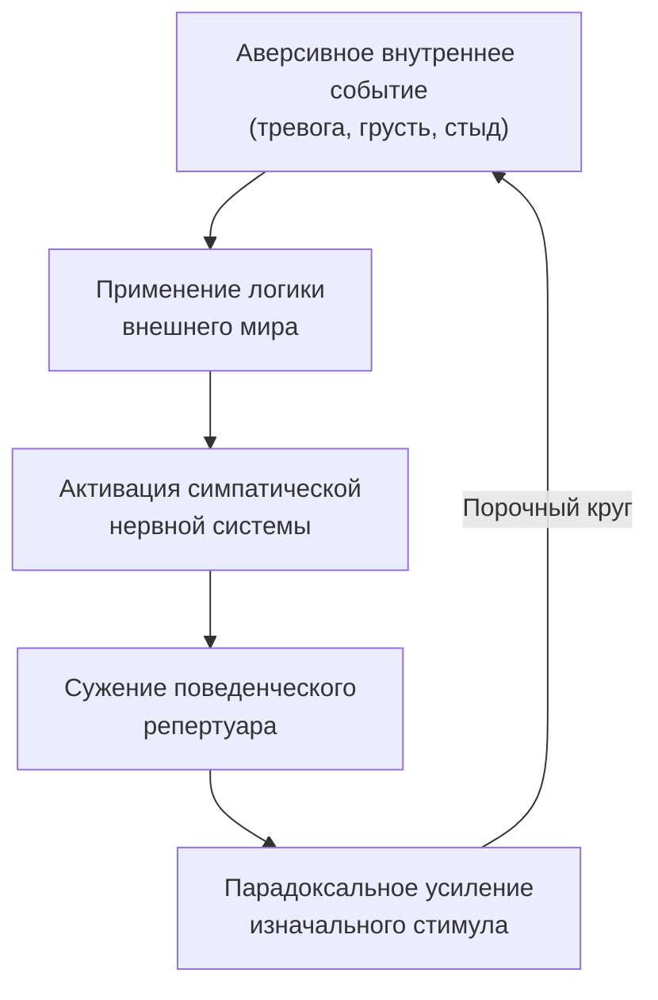
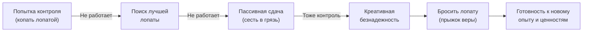

Человек, попавший в эмоциональную яму, инстинктивно берется за лопату. Он копает усерднее, пробует разные техники, но грунт осыпается, а дно уходит все глубже. Так работает **эмпирическое избегание** — попытка решить внутреннюю проблему инструментами внешнего мира *(Хейс, Штросаль, & Уилсон, 2021)*.

Терапия принятия и ответственности (ACT) использует метафоры **«Человек в яме»** и **«Полиграф»**, чтобы показать парадокс контроля без логических споров. Эти два образа помогают человеку ощутить тщетность старых стратегий и освободить руки для того, что действительно важно.

### Метафора как инструмент: обход ловушек разума

**Метафоры в ACT** — это эмпирические вербальные инструменты. Они используют перенос функций стимула, чтобы помочь клиенту осознать неэффективность попыток контролировать внутренний мир *(Торнеке, 2010)*. Терапевт не говорит напрямую «перестаньте контролировать тревогу». Такая инструкция превратилась бы в новое правило для контроля и спровоцировала бы бесконечные интеллектуальные споры *(Хейс, Штросаль, & Уилсон, 2021)*.

Метафора действует иначе. Она берет знакомую сеть отношений (копание лопатой в реальной яме) и устанавливает отношение подобия с проблемной сетью (попытки избавиться от депрессии алкоголем) *(Торнеке, 2010)*. Благодаря **преобразованию функций стимула** ощущение тщетности от копания автоматически переносится на привычные стратегии «справиться». Клиент ощущает, а не просто понимает, что его действия — рытье собственной могилы.

> Метафора подрывает вербальное доминирование правил, не вступая в спор с разумом.

Конечная цель обеих метафор — вызвать состояние **креативной безнадежности**. Это осознание того, что все предыдущие стратегии контроля мыслей и чувств безнадежны *(Хейс, Штросаль, & Уилсон, 2021)*. Только когда старая повестка отброшена, откроется пространство для принятия и ценностно-ориентированных действий.

### Парадокс контроля: почему усилия усиливают страдание

В основе обеих метафор лежит один феномен — ложное применение стратегий внешнего контроля к внутреннему миру *(Хейс, Штросаль, & Уилсон, 2021)*.

Цепочка выглядит так:

Человек пытается подавить тревогу — тревога усиливается. Пытается заглушить грусть алкоголем — грусть возвращается с удвоенной силой. Каждая новая попытка контроля раскручивает маховик страдания *(Хейс, Штросаль, & Уилсон, 2021)*.

Две метафоры раскрывают разные грани этого парадокса:

| Метафора | Аспект контроля | Что показывает |
|---|---|---|
| **Человек в яме** | Поведенческий | Бесполезные действия (алкоголь, изоляция, агрессия) углубляют проблему |
| **Полиграф** | Физиологический и когнитивный | Невозможно заставить нервную систему отключить эмоции по приказу |

### «Человек в яме»: лопата не создает выход

Представьте: человеку завязали глаза, выдали сумку с инструментами и выпустили в огромное поле, полное ям. Он падает в яму. Единственное, что находит в сумке, — саперная лопата. Он копает ступени, но грязь осыпается, и он оказывается глубже *(Хейс, Штросаль, & Уилсон, 2021)*.

**Лопата** — это привычные стратегии копинга. Человек копает с огромным усердием. Он не ленив. Проблема не в нехватке усилий, а в инструменте *(Хейс, Штросаль, & Уилсон, 2021)*. Копание не создает выход — оно делает яму шире и глубже.

Терапевт вплетает метафору в реальный опыт клиента:

1. Сбор данных — что клиент уже пробовал (алкоголь, изоляция, подавление мыслей)
2. Демонстрация тщетности — помогло ли это в долгосрочной перспективе
3. Введение метафоры, адаптированной к конкретной ситуации
4. Слияние метафоры с реальностью — «Ваш алкоголь — та самая лопата»
5. Прыжок веры — «Пока вы не отпустите лопату, руки заняты» *(Хейс, Штросаль, & Уилсон, 2021)*

Пока клиент держит лопату, руки заняты и он не нащупает лестницу, спущенную сверху. Бросить лопату — прыжок веры *(Хейс, Штросаль, & Уилсон, 2021)*.

> Метафора валидирует старания клиента: «Вы копали с огромным усердием. Проблема не в вас, а в инструменте».

### «Полиграф»: пистолет у виска и приказ расслабиться

К человеку подключены холодные провода полиграфа, а к виску приставлен пистолет *(Хейс, Штросаль, & Уилсон, 2021)*. Врач говорит: «Просто расслабьтесь, и я не выстрелю. Но если начнете нервничать — мне придется убить вас». Пульс учащается, ладони потеют. Малейшая попытка подавить страх распознается машиной. Подавление усиливает вегетативную реакцию *(Хейс, Штросаль, & Уилсон, 2021)*.

Вот ключевой контраст двух миров. Если наставить пистолет и приказать покрасить дом — человек покрасит. Внешним поведением можно управлять через угрозу. Но если приказать расслабиться — угроза вызовет прямо противоположный эффект *(Хейс, Штросаль, & Уилсон, 2021)*.

Человеческая нервная система совершеннее любого детектора лжи. Приставляя к себе невидимый пистолет («я должен быть нормальным», «я не должен тревожиться»), человек провоцирует панику *(Харрис, 2020)*. Переключатель борьбы переходит в положение «ВКЛ» — возникает тревога по поводу тревоги.

> Вся культура, требующая «успокоиться» или «взять себя в руки», приставляет к голове невидимый пистолет социальной оценки.

### Ловушки внутри ловушки: «а что если лопата побольше»

Клиент нередко ищет выход внутри старой системы координат. «А что если нужна лопата побольше — позолоченная, с ортопедической ручкой?» *(Хейс, Штросаль, & Уилсон, 2021)*. Терапевт не спорит. Он углубляет метафору: «Вы уже пробовали, но земля осыпалась».

Другая типичная реакция — пассивная сдача. Клиент говорит, что смирится и сядет в яме. Но пассивное сидение в грязи — та же программа контроля в виде сдачи позиций *(Хейс, Штросаль, & Уилсон, 2021)*. Принятие в ACT — это не пассивность. Это активная готовность контактировать с неприятным опытом, освобождая руки для ценностных действий.

### Заключение и Литература

Метафоры «Человек в яме» и «Полиграф» демонстрируют фундаментальный парадокс: стратегии, которые прекрасно работают во внешнем мире, оборачиваются против человека, когда он применяет их к своим эмоциям и мыслям. Оба образа помогают человеку ощутить тщетность контроля, валидируют его усердие и открывают путь к креативной безнадежности — точке, в которой прежние стратегии признаются неработающими, а руки освобождаются для ценностно-ориентированных действий *(Хейс, Штросаль, & Уилсон, 2021)*.

Бах, П. А., & Моран, Д. Дж. (2021). *ACT на практике*.

Торнеке, Н. (2010). *Теория реляционных фреймов в клинической практике*.

Харрис, Р. (2020). *Ловушка счастья*.

Хейс, С. С., Штросаль, К. Д., & Уилсон, К. Г. (2021). *Терапия принятия и ответственности*.

---

**Микро-кейс для практики.** Клиент с генерализованным тревожным расстройством описывает свою стратегию: каждый вечер он выпивает два бокала вина, чтобы «отпустить напряжение», а утром практикует позитивные аффирмации, чтобы «переключить мозг». Несмотря на годы усилий, тревога усилилась и теперь мешает работе. Определите: какие «лопаты» использует клиент, к какому аспекту контроля (поведенческому или когнитивному) относится каждая из них, и как бы вы ввели метафору ямы или полиграфа, чтобы инициировать состояние креативной безнадежности, не обесценив его старания.
