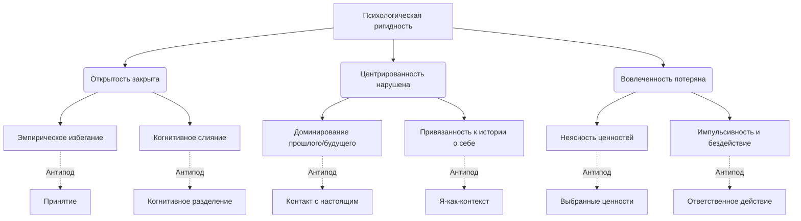

Многим из нас знакомо изматывающее чувство того, что мы застряли. Мы пытаемся «взять себя в руки», подавить нарастающую тревогу, прогнать навязчивые воспоминания о прошлых ошибках или заставить себя не думать о пугающем будущем. Нам кажется, что если мы будем достаточно сильно бороться со своими внутренними демонами, то в конце концов победим и заживем счастливо. Однако парадокс заключается в том, что чем отчаяннее мы боремся со своими мыслями и чувствами, тем сильнее они нами управляют, сужая нашу жизнь до размеров крошечной, но якобы безопасной клетки.

Современная когнитивно-поведенческая терапия предлагает радикально иной взгляд на эту проблему. Она доказывает, что корень наших страданий кроется не в самом наличии плохих мыслей или эмоций, а в нашей реакции на них. Понимая механизмы того, как наш собственный разум заводит нас в тупик, мы можем перестать тратить жизненные силы на бессмысленную внутреннюю войну и направить их на построение той жизни, о которой действительно мечтаем.

## Парадокс контроля: Природа наших страданий

В Терапии принятия и ответственности (ТПО/ACT) **психологическая ригидность** (или негибкость) рассматривается как фундаментальная причина ненужных человеческих страданий и неадаптивного функционирования *(Hayes, Strosahl, & Wilson, 2016)*. Ригидность возникает, когда естественные вербально-когнитивные процессы человека излишне сужают его поведенческий репертуар, лишая способности адаптироваться к текущим обстоятельствам и двигаться к значимым жизненным целям *(Hayes, Strosahl, & Wilson, 2016)*.

Главная функция концептуализации этой проблемы заключается в том, чтобы сместить фокус с «починки сломанной психики» на расширение возможностей. Эта модель психопатологии, часто графически изображаемая как «негексафлекс», доказывает, что наши страдания — это не болезнь, а результат использования нормальных механизмов ума там, где они не работают *(Bach & Moran, 2008)*. Осознав это, мы можем перестать отождествлять себя со своей болью и вернуть себе способность действовать эффективно.

## Анатомия застревания: Три стиля реагирования и шесть процессов

Модель психологической ригидности описывается через шесть взаимосвязанных поведенческих процессов, которые объединяются в три крупные категории (или стиля реагирования): Открытость, Центрированность и Вовлеченность. Для поддержания гибкости человеку необходимо уравновешивать эти стили, как три устойчивые ножки штатива.

**1. Открытость (Отношение к внутреннему опыту)**
Эта категория описывает нашу привычку защищаться от внутреннего мира.
* **Эмпирическое избегание (Избегание внутреннего опыта):** Это нежелание поддерживать контакт с неприятными мыслями, чувствами, воспоминаниями или телесными ощущениями и попытки изменить их форму или частоту *(Bach & Moran, 2008)*. Усилия по подавлению внутреннего дискомфорта (например, через социальную изоляцию, зависимости или компульсии) в долгосрочной перспективе лишь усиливают психологическую боль *(Bach & Moran, 2008)*.
* **Когнитивное слияние:** Состояние, при котором вербальные правила и оценки жестко доминируют над поведением, и человек воспринимает свои мысли как буквальное отражение реальности или абсолютную истину *(Hayes, Strosahl, & Wilson, 2016)*. Человек реагирует на ментальное описание события так, словно оно является реальной физической угрозой.

**2. Центрированность (Контакт с настоящим и перспектива)**
Эта категория касается того, откуда мы воспринимаем мир и в каком времени живем.
* **Ригидное внимание (Доминирование прошлого и будущего):** Это неспособность гибко и добровольно контактировать с настоящим моментом. Внимание человека жестко зацикливается на вербальной реконструкции прошлого (руминация) или страхах о будущем (беспокойство), что лишает его возможности осознанно реагировать на требования текущей ситуации *(Hayes, Strosahl, & Wilson, 2016)*.
* **Привязанность к концептуализированному «Я»:** Люди сплетают факты своей жизни в жесткие истории (нарративы) о том, кто они такие (например, «я неудачник»). Привязанность к такому образу заставляет человека защищать его, даже если это мешает жить, так как угроза истории воспринимается как угроза самому существованию *(Torneke, 2010)*.

**3. Вовлеченность (Действия и смысл)**
Эта категория переводит внутренние процессы в плоскость реальных поступков.
* **Неясность ценностей (Нарушение ценностной сферы):** Когда поведение жестко контролируется попытками избежать дискомфорта или стремлением угодить другим, человек теряет контакт с тем, что действительно важно для него и придает жизни смысл *(Bach & Moran, 2008)*.
* **Постоянное бездействие, импульсивность или упорное избегание:** Столкнувшись с барьерами, человек выбирает узкие паттерны внешнего поведения (пассивность или деструктивные поступки), главная функция которых — снижение немедленного дискомфорта в ущерб построению полноценной жизни *(Hayes, Strosahl, & Wilson, 2016)*.

## Китайская ловушка для пальцев: Ментальные модели и границы

**Аналогия (Рыба на крючке и густой туман):** Когда тяжелые мысли овладевают нами, мы подобны рыбе, попавшейся на крючок. Мысли подтягивают нас к себе и начинают управлять нами, словно кукловод марионеткой. Запутавшись в размышлениях, человек словно блуждает в густом психологическом тумане, теряя контакт с происходящим «здесь и сейчас». Если же мы используем эмпирическое избегание, мы попадаем в «китайскую ловушку для пальцев»: чем сильнее мы дергаем руки в попытках освободиться (пытаемся подавить эмоцию), тем туже плетеная трубка сжимает наши пальцы. Единственный способ освободиться — это перестать тянуть и мягко податься навстречу дискомфорту (принятие).

**Чем это не является:** Концепция психологической гибкости не означает, что вы должны стать бесчувственным роботом или научиться генерировать исключительно позитивные мысли.

| Психологическая ригидность (Ловушка) | Психологическая гибкость (Здоровый подход) |
| :--- | :--- |
| **Борьба:** Требование к себе контролировать, игнорировать или немедленно подавлять любую тревогу и боль. | **Принятие:** Добровольное принятие открытой, восприимчивой позиции по отношению к своему опыту, чтобы не тратить жизнь на бессмысленную войну. |
| **Слияние:** Восприятие мысли «Я сломлен» как абсолютного факта реальности, которому нужно подчиняться. | **Разъединение:** Навык отстранения. Способность заметить мысль как последовательность слов и звуков: «У меня появилась мысль о том, что я сломлен». |
| **Реактивность:** Жизнь на автопилоте, где поведение диктуется страхом или социальным давлением (податливостью). | **Ответственность:** Способность совершать конкретные проактивные поступки, основанные на свободно выбранных жизненных направлениях (ценностях). |

## Освобождение из сетей: Практическое руководство и клинические кейсы

Когда человек запутывается в своих мыслях (когнитивное слияние), он обычно начинает реагировать на них в двух контрпродуктивных режимах: либо «ПОДЧИНЯЙСЯ» (капитулирует перед мыслью «это бесполезно» и сдается), либо «БОРИСЬ» (объявляет эмоциям войну через алкоголь или изоляцию). Оба этих режима истощают энергию и подталкивают человека к разрушительным «шагам в сторону».

* **Ситуация — Действие — Результат (Когнитивное слияние и бездействие):** Клиентка хочет сменить профессию, но парализована мыслью «У меня ничего не выйдет, я слишком старая». Она находится в режиме подчинения, сливаясь с жесткой историей о себе (концептуализированное «Я»).
    * *Действие:* Терапевт не спорит с содержанием мысли. Вместо этого он применяет навыки **расцепления (когнитивного разделения)**. Клиентка учится смотреть *на* свои мысли, а не смотреть на мир *через* них. Она произносит: «Я замечаю, что мой разум сейчас генерирует историю о том, что я слишком старая».
    * *Результат:* Мысль теряет свою тираническую власть. Клиентка восстанавливает контакт с ценностью самореализации и переходит к **ответственному действию** — откликается на первую вакансию.
* **Ситуация — Действие — Результат (Избегание и ригидное внимание):** Мужчина переживает тяжелый развод и пытается заглушить боль бесконечной работой по 14 часов в сутки (эмпирическое избегание). При этом его разум постоянно пережевывает прошлое (руминация).
    * *Действие:* Специалист обучает его **гибкому контакту с настоящим моментом**. Мужчина учится целенаправленно возвращать внимание в «здесь и сейчас», замечая уводящие в прошлое мысли, и практикует **принятие** — активный выбор впустить в себя грусть, перестав от нее убегать.
    * *Результат:* Снижение общего уровня стресса. Мужчина начинает осознанно проводить время с детьми, вместо того чтобы прятаться от собственных чувств в офисе.

**Алгоритм возвращения психологической гибкости:**
1. **Заметьте крючок (Слияние):** Отследите момент, когда мысль или история о себе начинает восприниматься как строгий приказ к подчинению или непреложный факт.
2. **Откажитесь от борьбы (Принятие):** Заметив неприятную эмоцию, прекратите попытки отвлечься от нее, подавить или «запить». Разрешите ей просто присутствовать в вашем теле.
3. **Заземлитесь (Контакт с настоящим):** Если ваш разум улетел в руминации о прошлом или тревогу о будущем, осознанно верните внимание к текущей задаче или телесным ощущениям.
4. **Сверьтесь с компасом (Ценности):** Спросите себя: «Каким человеком я хочу быть прямо сейчас в этой ситуации? Что для меня по-настоящему важно?».
5. **Сделайте шаг (Ответственное действие):** Совершите конкретный поступок, основанный на вашей ценности, позволив всем тяжелым мыслям просто сопровождать вас в этом движении.

*Частая ловушка:* Пытаться использовать техники осознанности или принятия с тайной целью *избавиться* от боли. Это лишь замаскированное эмпирическое избегание. У нашего мозга нет «кнопки удаления» для стирания мыслей. Цель — не стереть негативную историю, а научиться действовать эффективно, несмотря на ее присутствие.

## Цена осознанности: Трудный путь к осмысленной жизни

Все шесть процессов психологической ригидности тесно переплетены и взаимно поддерживают друг друга, образуя монолитный панцирь, защищающий нас от жизненных бурь, но одновременно лишающий нас кислорода. Разрушение этого панциря — задача, требующая колоссальной смелости и непрерывной работы над собой. Отказ от эмпирического избегания означает, что вам придется добровольно открыться навстречу своей боли, тревоге и уязвимости. Разрушение привязанности к жесткой истории о себе («Я всегда прав» или «Я безнадежно болен») вызовет сильнейшее сопротивление эго, которое панически боится потерять свои привычные рамки. Вам придется совершать ответственные действия, спотыкаться, испытывать страх и снова возвращаться на выбранный путь.

Однако именно эти волевые усилия обеспечивают возвращение к подлинной, наполненной смыслом жизни. Когда вы перестаете истощать свои ресурсы в бесконечной войне с собственным разумом, к вам возвращается колоссальный объем энергии. Уравновесив в себе открытость опыту, центрированность в настоящем моменте и вовлеченность в реализацию собственных ценностей, вы обретаете фундаментальную устойчивость. Психологическая гибкость не обещает вам жизни без боли, но она гарантирует, что эта боль больше не будет стоять между вами и тем миром, который вы хотите построить.

## Главный вывод и литература

> Наши страдания многократно усиливаются, когда мы пытаемся управлять своим внутренним миром с помощью тех же жестких правил контроля, которые используем во внешнем мире. Отказавшись от избегания и слияния с мыслями, мы обретаем психологическую гибкость — способность осознанно двигаться к своим ценностям сквозь любой эмоциональный шторм.

**Источники:**
* *Bach, P. A., & Moran, D. J. (2008). ACT in practice: Case conceptualization in acceptance and commitment therapy. New Harbinger Publications.*
* *Hayes, S. C., Strosahl, K. D., & Wilson, K. G. (2016). Acceptance and commitment therapy: The process and practice of mindful change (2nd ed.). The Guilford Press.*
* *Törneke, N. (2010). Learning RFT: An introduction to relational frame theory and its clinical application. New Harbinger Publications.*

---

### Проверка понимания (Микро-кейс)

Представьте себе мужчину по имени Сергей, который невероятно боится публичных выступлений на работе. Когда ему поручают провести презентацию, его разум мгновенно генерирует мысль: «Я обязательно начну заикаться, все увидят мой непрофессионализм, и это будет концом моей карьеры». Сергей верит этой мысли на 100% и воспринимает ее как непреложный факт. Чтобы не сталкиваться с паникой, он принимает решение соврать начальнику, что сильно заболел, и остается дома. Сидя дома, он чувствует кратковременное облегчение, но затем погружается в бесконечное самобичевание, осознавая, что в очередной раз упустил шанс на повышение, о котором давно мечтал.

**Вопрос:** Опираясь на шесть базовых процессов психологической ригидности (модель негексафлекса), идентифицируйте и назовите как минимум **три** конкретные ловушки, в которые попал Сергей в описанной ситуации. Как бы выглядело его поведение, если бы он применил антиподы этих ловушек (навыки психологической гибкости)?
