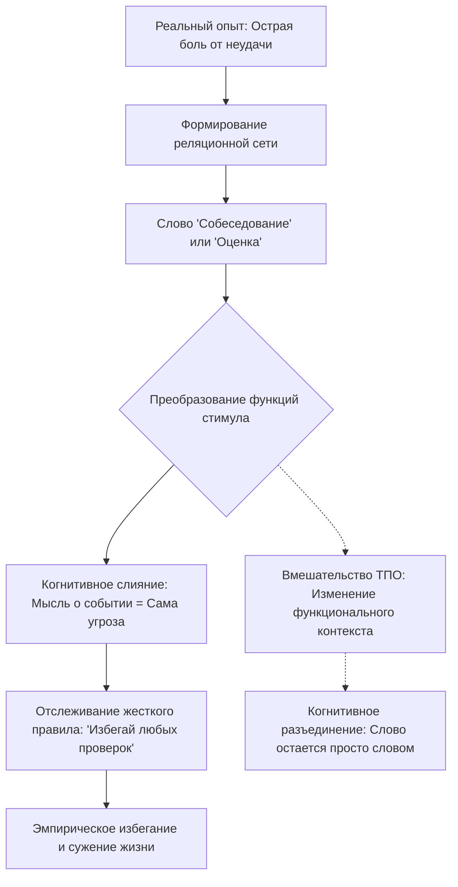

Каждому из нас знакомы парадоксальные ситуации, когда мы находимся в абсолютной физической безопасности — например, отдыхаем в своей теплой постели или пьем утренний кофе, — но при этом испытываем леденящий ужас, учащенное сердцебиение и невыносимую душевную боль. Нам не угрожает реальный хищник, мы не падаем в пропасть, но наш разум прокручивает воспоминание о прошлой неудаче или рисует картину гипотетического будущего провала, и тело реагирует так, словно катастрофа разворачивается прямо здесь и сейчас.

Почему человеческая психика способна так глубоко и длительно страдать без наличия реальной внешней угрозы? Современная психотерапия предлагает масштабный, научно обоснованный ответ, раскрывая двойственную природу нашего языка и мышления. Понимая скрытые философские и когнитивные механизмы того, как обычные слова автоматически связываются с реальными физиологическими реакциями и диктуют нам жесткие правила жизни, мы получаем возможность перестать воевать с собственным умом и обрести подлинную свободу действий.

## Отказ от поиска истины: Сущность и практическая польза метода

Для понимания того, как работает наш разум, Терапия принятия и ответственности (ТПО/ACT) опирается на два фундаментальных столпа: философскую базу и поведенческую теорию. **Функциональный контекстуализм** (прагматическая философия науки, в которой любые мысли и действия оцениваются исключительно по их полезности в конкретной ситуации, а не по их объективной истинности) выступает базисом для всех терапевтических вмешательств *(Hayes et al., 2012)*. В свою очередь, **Теория реляционных фреймов (ТРФ)** (всеобъемлющая функционально-контекстуальная теория человеческого языка и познания) объясняет, как именно способность человека мыслить порождает как эволюционные достижения, так и специфические психологические страдания *(Harris, 2009)*.

Главная утилитарная задача этого комплексного инструментария заключается в разрешении дилеммы человеческой боли. ТРФ доказывает, что наша непрекращающаяся внутренняя тревога не является признаком «поломки» или дефекта головного мозга. Напротив, она возникает из-за безупречной, порой слишком эффективной работы нашего речевого аппарата. Осознание того, что болезненные мысли — это лишь произвольные символы, искусственно наделенные пугающими функциями, позволяет нам прекратить изматывающие попытки контролировать или стирать свои воспоминания. Мы переключаемся с бесплодного оспаривания содержания мыслей на изменение того, как именно они влияют на наше поведение.

## Архитектура мышления: Столпы реляционных связей и правил

Согласно ТРФ, человеческий язык базируется на способности к **реляционному фреймингу** (выученному поведению по выстраиванию связей между любыми стимулами в зависимости от социального контекста, а не от их реальных физических свойств) *(Hayes et al., 2012)*. Наша способность выводить новые знания без прямого опыта, формируя **производные отношения** (связи, возникающие спонтанно, без предварительного обучения), держится на трех уникальных свойствах:

1. **Взаимное следование (Mutual entailment):** Если человек усваивает, что событие А связано с событием Б, он автоматически, без дополнительного обучения, делает вывод об обратной связи: Б связано с А. Например, если ребенка учат, что пушистое животное называется словом «собака», он мгновенно понимает, что произнесенное слово «собака» относится именно к этому животному *(Hayes et al., 2012)*. Произвольные отношения между стимулами всегда двунаправленны.
2. **Комбинаторное следование (Combinatorial entailment):** Если А связано с Б, а Б связано с В, человек автоматически выстраивает новые словесные связи между А и В. Если вы узнаете, что квартиры дороже машин, а машины дороже велосипедов, вы без прямого сравнения делаете немедленный вывод, что велосипеды дешевле квартир *(Harris, 2009)*. Это позволяет нашему разуму выстраивать бесконечные, сложнейшие сети смыслов на основе минимального объема информации.
3. **Преобразование функций стимула (Transformation of stimulus functions):** Это самое критическое свойство для понимания тревоги. Психологические реакции (страх, радость, отвращение) могут мгновенно переноситься с одного элемента на другие внутри словесной сети. Если в детстве вас сильно испугала реальная собака, функция страха перенесется на само произнесенное слово «собака». В будущем вы можете начать плакать или паниковать, просто услышав эти звуки или прочитав это слово в книге, хотя сами по себе буквы на бумаге не способны причинить физический вред *(Hayes et al., 2012)*.

**Под капотом (Управляемое правилами поведение):** Преобразование функций не происходит хаотично; оно строго регулируется контекстом. Из этих нейронных сетей рождается **управляемое правилами поведение** (поведение, контролируемое вербальными инструкциями, а не непосредственным контактом со средой). Наш разум постоянно комбинирует слова в жесткие правила, которые начинают контролировать нашу жизнь, часто делая нас невосприимчивыми к реальному опыту. ТРФ выделяет три типа таких правил:

* **Повиновение / Податливость (Pliance):** Выполнение правил ради социального одобрения или избегания наказания (например, «Я должен всегда радовать других, иначе меня бросят»). Это ведет к психологической ригидности и потере контакта со своими истинными потребностями *(Hayes et al., 2012)*.
* **Следование / Отслеживание (Tracking):** Опора на то, как устроен мир. Это правило становится разрушительным, когда мы следуем ложным выводам (например, «Я должен полностью избавиться от тревоги, прежде чем искать новую работу»), что приводит к тотальному жизненному ступору и **эмпирическому избеганию** (попыткам любой ценой избавиться от дискомфортных переживаний).
* **Усиление / Дополнение (Augmenting):** Изменение значимости события с помощью слов. Оно может многократно усиливать панику («Этот страх абсолютно невыносим, я сойду с ума!») или, наоборот, создавать глубокую мотивацию через прояснение ценностей («Этот дискомфорт стоит того, чтобы построить крепкую семью») *(Hayes et al., 2012)*.

## Универсальный молоток и зимнее пальто: Ментальные модели

**Аналогия 1 (Многофункциональный молоток):** Представьте, что эволюция выдала вам идеальный инструмент — тяжелый, надежный молоток. С его помощью (как и с помощью нашего логического языка, то есть «модальности решения проблем») вы можете построить дом, защититься от диких зверей и спроектировать мост. Этот инструмент великолепно работает во внешнем, физическом мире: если вам не нравится мусор в комнате, вы берете его и выбрасываете.

Но однажды вы чувствуете сильную душевную боль и пытаетесь использовать тот же самый логический молоток, чтобы «починить» или «выбить» из себя эту эмоцию. Вы пытаетесь «выбросить» грусть, как физический мусор. Ударяя логическим инструментом по собственной психике, вы наносите себе лишь новые увечья. Алгоритмы, безупречные для внешнего мира, становятся абсолютно разрушительными, когда мы применяем их к своему внутреннему опыту *(Harris, 2009)*.

**Аналогия 2 (Зимнее пальто и прагматизм):** Представьте себе тяжелое, плотное зимнее пальто. Является ли оно «хорошим» или «плохим» само по себе? Это бессмысленный вопрос. В контексте суровой снежной бури это пальто прекрасно — оно спасет вам жизнь. Но если вы наденете это же пальто, чтобы переплыть глубокое озеро, оно утянет вас на дно. Ваши мысли работают точно так же. В функциональном контекстуализме мы практикуем **отказ от онтологии** (отказ от споров о том, объективно ли «истинны» наши мысли). Мысль «Будь осторожен, людям нельзя доверять» могла быть крайне полезной в контексте опасного детства. Но сегодня, когда вы пытаетесь построить близкие отношения с любящим партнером, эта же мысль тянет вас на дно. Мы оцениваем не саму мысль, а то, как она работает в текущем контексте.

**Контраст: Чем подход ТРФ не является.** Функциональный контекстуализм радикально отличается от механистического подхода классической психотерапии.

| Механицизм / Классическое оспаривание | Функциональный контекстуализм и ТПО |
| :--- | :--- |
| **Отношение к мыслям:** Человек рассматривается как машина. Негативные мысли — это «неисправные детали», которые нужно починить или заменить *(Hayes et al., 2012)*. | **Отношение к мыслям:** Холистический подход. Мысли — это просто реакции организма на контекст. Их не нужно чинить, их нужно наблюдать *(Harris, 2009)*. |
| **Цель вмешательства:** Попытка изменить **реляционный контекст**. Терапевт ищет доказательства того, что пугающая мысль нелогична или ложна. | **Цель вмешательства:** Изменение **функционального контекста**. Истина измеряется **прагматическим критерием** (работоспособностью мысли). |
| **Борьба с симптомами:** Требование подавить или проконтролировать негативные эмоции. | **Разъединение:** Попытка «не думать» о слоне лишь добавляет новые реляционные связи. ТПО ослабляет влияние мысли, не стирая ее *(Hayes et al., 2012)*. |

## Ослабление диктатуры правил: Практическое руководство

Функциональный контекстуализм требует рассматривать любое событие как **действие-в-контексте** (неразрывное взаимодействие целостного организма с его текущим и историческим окружением). Наши языковые способности постоянно генерируют жесткие вербальные правила. Когда человек беспрекословно им подчиняется, возникает **когнитивное слияние** (состояние, при котором слова воспринимаются как абсолютная материальная реальность). Рассмотрим, как использовать эти знания для выхода из психологических ловушек.

* **Ситуация — Действие — Результат (Перенос функций угрозы):** У клиента случилась тяжелая паническая атака в закрытом пространстве. Теперь само слово «лифт» или мысль о нем вызывают у него тахикардию.
    * *Действие:* Вместо логических убеждений в безопасности лифтов, терапевт использует технику изменения функционального контекста (когнитивное разъединение). Клиент быстро и громко повторяет пугающее слово «лифт» непрерывно в течение 60 секунд, наблюдая за звуками.
    * *Результат:* Слово временно теряет свою производную функцию угрозы, превращаясь в бессмысленный набор забавных звуков. Иллюзия того, что слово тождественно реальной опасности, разрушается *(Harris, 2009)*.
* **Ситуация — Действие — Результат (Онтологическая ловушка самозванца):** Клиентка утверждает: «Моя мысль о том, что я обманщица и не заслуживаю своей должности, — это абсолютная, объективная правда! У меня нет профильного образования, и вчера я допустила ошибку».
    * *Действие:* Терапевт практикует отказ от онтологии и переходит к оценке работоспособности. Он спрашивает: «Даже если мы признаем эту мысль на 100% истинной, помогает ли вам вера в нее качественно выполнять текущий проект и быть хорошим специалистом сегодня?».
    * *Результат:* Клиентка осознает, что спор об истинности не имеет смысла. Она использует усиление (augmenting), фокусируется на ценности профессионализма и продолжает работу, позволяя мыслям о самозванстве просто звучать на фоне *(Hayes et al., 2012)*.

**Алгоритм возвращения психологической гибкости:**

1. **Заметьте когнитивное слияние:** Отследите момент, когда ваши слова или оценки начинают восприниматься как абсолютная материальная реальность или строгий приказ, не терпящий возражений (например, мысль «Я не справлюсь» воспринимается как физическая непреодолимая стена). Идентифицируйте это как действие-в-контексте.
2. **Сформулируйте неработающее правило:** Четко озвучьте словесную инструкцию, которая диктует вам избегание. Какому правилу следования (tracking) или повиновения (pliance) вы сейчас подчиняетесь? (Например: «Если я почувствую грусть, я не имею права идти на праздник»).
3. **Проверьте работоспособность (Прагматический критерий):** Откажитесь от философских споров с самим собой о том, насколько это правило справедливо или правдиво. Задайте один вопрос: «Если я позволю этой мысли управлять моим поведением, куда это меня приведет? Поможет ли это мне построить ту жизнь, которую я хочу?».
4. **Измените функциональный контекст (Разъединение):** Лишите мысль ее автоматического воздействия. Произнесите пугающее правило предельно медленно, спойте его на мотив веселой детской песни или озвучьте голосом мультяшного персонажа. Это не изменит суть мысли, но физически разорвет привычный паттерн переноса функций стимула, возвращая словам их изначальную природу — просто вибрации воздуха *(Harris, 2009)*.
5. **Смените фокус на ценности (Полезное усиление):** Выберите действие, основанное на ваших долгосрочных целях. Сделайте шаг в выбранном направлении, позволив дискомфортным мыслям просто сопровождать вас, как попутчикам в автобусе *(Hayes et al., 2012)*.

> *Частая ловушка:* Использование техник разъединения (например, быстрого повторения слов) с тайной целью *уничтожить* или *изгнать* тревогу. В парадигме ТРФ это является тонкой формой эмпирического избегания. Ваша нервная система немедленно распознает, что вы всё еще считаете эту мысль смертельной угрозой, и перенос пугающих функций возобновится с новой силой. Цель — не избавиться от мысли, а научиться действовать независимо от ее присутствия *(Hayes et al., 2012)*.

## Осознанный выбор вместо бесконечной борьбы

Отказаться от укоренившейся привычки «решать» свои внутренние эмоциональные проблемы с помощью тех же логических алгоритмов, которые мы блестяще применяем для починки сломанной техники — задача, требующая колоссальной осознанности и ежедневной выдержки. Наш разум эволюционно запрограммирован анализировать, классифицировать и устранять любые потенциальные угрозы. Наше эго жаждет онтологической определенности: оно хочет точно знать, «какие мы на самом деле» и «справедлив ли этот мир».

Когда мы сталкиваемся с мучительными воспоминаниями, всё наше естество требует найти правильное слово, аргумент или действие, чтобы хирургически вырезать эту боль и доказать свою правоту. Требуется огромное мужество, чтобы добровольно сложить оружие в этой внутренней войне. Нам приходится смириться с неопровержимым научным фактом, который доказывает ТРФ: мы не можем стереть созданные реляционные сети. Слова, болезненные ассоциации и дезадаптивные производные отношения останутся записанными в нашей нервной системе навсегда. Нервная система работает только на добавление информации, а не на ее удаление.

Однако эта дисциплинированная готовность отпустить иллюзию контроля над содержанием своих мыслей окупается сторицей. Переставая относиться к словам как к реальным хищникам и прекращая слепо подчиняться дезадаптивным правилам избегания, вы возвращаете себе безусловное авторство над собственными поступками. Энергия, которая десятилетиями уходила на подавление переживаний, философские дебаты с самим собой и самокопание, высвобождается. Эта энергия направляется на созидание, развитие и подлинный контакт с миром. Способность наблюдать за своим мыслительным процессом со стороны, оценивать его исключительно через призму прагматической пользы и не подчиняться каждому его импульсу, формирует глубокую **психологическую гибкость** — умение осознанно и свободно двигаться к тому, что для вас по-настоящему ценно, проходя сквозь любой внутренний шторм.

## Главный вывод и литература

> Наша способность к языку и созданию смыслов — это обоюдоострый меч. Он позволяет нам строить цивилизации, но неизбежно создает невидимые клетки из наших собственных мыслей. Перестав требовать от своих мыслей абсолютной истины и начав оценивать их исключительно по их реальной пользе для вашей жизни, вы навсегда лишаете тревогу ее парализующей власти.

**Источники:**
* *Harris, R. (2009). ACT made simple: An easy-to-read primer on acceptance and commitment therapy. New Harbinger Publications.*
* *Hayes, S. C., Strosahl, K. D., & Wilson, K. G. (2012). Acceptance and commitment therapy: The process and practice of mindful change (2nd ed.). The Guilford Press.*

---

### Проверка понимания (Микро-кейс)

Представьте, что ваш клиент страдает от навязчивых воспоминаний о болезненном увольнении, произошедшем несколько лет назад. На сессии он эмоционально рассказывает: *«Каждый раз, когда я слышу слово "собеседование" или "оценка", я чувствую физическую тошноту. Мой мозг сразу же выдает жесткое правило: "Любые проверки всегда приводят к унижению, тебе нужно избегать новых компаний, чтобы снова не пострадать". Я изо всех сил стараюсь логически оспорить это, заставляя себя повторять: "Я хороший специалист, не все начальники плохие", но мне становится только хуже, а мой страх перед поиском работы лишь растет!»*

**Вопрос:** Опираясь на концепции Теории реляционных фреймов и функционального контекстуализма, объясните, почему попытки клиента логически спорить со своими мыслями (попытка изменить реляционный контекст) лишь усиливают его страдания? Используя понятия *преобразование функций стимула* и *эмпирическое избегание*, опишите, какой конкретный шаг из предложенного алгоритма когнитивного разъединения вы бы порекомендовали ему выполнить, чтобы лишить эти слова их разрушительной власти.
