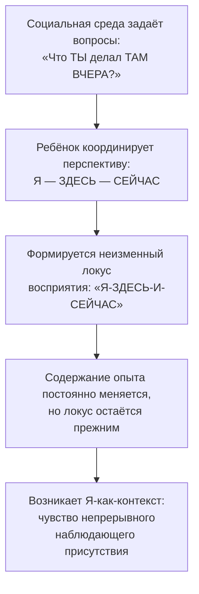

Многие люди приходят в терапию с ощущением, что их определяют собственные ярлыки. «Я тревожный», «Я неудачник», «Я плохая мать» — эти истории звучат внутри так убедительно, что человек воспринимает любую угрозу этой истории как угрозу самому своему существованию. Каждая критика, каждое сомнение превращается в экзистенциальный удар. Человек тратит огромное количество энергии на защиту образа, который причиняет ему боль.

Терапия принятия и ответственности (ТПО/ACT) предлагает радикальный выход: не менять историю о себе на более приятную, а обнаружить внутри себя пространство, которое вообще не нуждается ни в какой истории. Это пространство называется **Я-как-контекст** (Я-наблюдатель) — неизменная точка зрения, из которой человек воспринимает все свои мысли, эмоции и ощущения, не сливаясь с ними *(Хейс, Штросаль, & Уилсон, 2021)*.

### Три измерения самости: контент, процесс и контекст

Контекстуально-поведенческая наука выделяет три модуса самопознания. Каждый из них играет определённую роль, но только один способен стать надёжным убежищем.

| Измерение | Определение | Пример | Ограничения |
| :--- | :--- | :--- | :--- |
| **Концептуализированное «Я» (Я-как-контент)** | Жёсткая вербальная история из ярлыков, оценок и ролей *(Бах & Моран, 2021)* | «Я тревожный бухгалтер, который никому не нравится» | Любая информация, противоречащая истории, воспринимается как экзистенциальная угроза |
| **Непрерывное самоосознание (Я-как-процесс)** | Гибкое внимание к текущим переживаниям *(Хейс, Штросаль, & Уилсон, 2021)* | «Прямо сейчас я замечаю злость и учащённое сердцебиение» | Фиксирует содержание, но не обеспечивает дистанцию от него |
| **Я-наблюдатель (Я-как-контекст)** | Само чистое сознание, перспектива, из которой ведётся наблюдение *(Хейс, Штросаль, & Уилсон, 2021)* | «Кто тот, кто замечает все эти мысли?» | Не поддаётся прямому описанию словами |

Концептуализированное «Я» — самый распространённый и самый опасный модус. Человек сплетает факты жизни, внешние оценки и внутренние правила в жёсткий нарратив, а затем защищает его любой ценой. Если история гласит «я неудачник», человек будет избегать риска, чтобы не столкнуться с доказательствами обратного — ведь смена истории ощущается как потеря себя *(Торнеке, 2022)*.

### Метафора безоблачного неба: как работает Я-наблюдатель

Представьте разум как бескрайнее небо. Мысли, чувства, воспоминания и телесные импульсы — это облака. Лёгкие и пушистые, чёрные и грозовые, они приходят и уходят. Человек в обычной жизни склонен сливаться с облаками и пытаться разогнать штормовые тучи руками *(Бах & Моран, 2021)*.

**Я-как-контекст — это само небо.** Небу не нужно сражаться с облаками. Ему не нужно избавляться от них. Оно просто вмещает их в себя. Как бы ни бушевал ураган, он не способен нанести небу ни малейшего вреда. За любой бурей небо остаётся чистым и нетронутым *(Бах & Моран, 2021)*.

Этот навык предоставляет человеку абсолютно безопасное психологическое убежище. Самость, лишённая содержания, не может быть повреждена содержанием *(Хейс, Штросаль, & Уилсон, 2021)*. Когда клиент осознаёт себя пространством для переживаний, он обретает смелость впустить в себя даже самые болезненные эмоции — травму, горе, чувство вины — без страха быть уничтоженным ими.

### Откуда берётся чистое сознание: дейктическое фреймирование

Я-как-контекст формируется благодаря уникальной способности языка выстраивать **дейктические (указательные) отношения**: «Я / Ты», «Здесь / Там», «Сейчас / Тогда» *(Торнеке, 2022)*. В отличие от характеристик размера или цвета, эти отношения не имеют физических свойств — они зависят исключительно от точки зрения говорящего.

В детстве социальная среда постоянно задаёт ребёнку вопросы, смещающие контекст: «Что *ты* делал *там вчера*?» *(Хейс, Штросаль, & Уилсон, 2021)*. Чтобы правильно отвечать, ребёнок вынужден абстрагироваться от содержания действий и научиться координировать перспективу. Через тысячи повторений формируется постоянный локус восприятия. Поскольку содержание опыта меняется каждую секунду, а точка «Я-ЗДЕСЬ-И-СЕЙЧАС» остаётся неизменной, возникает чувство непрерывности — то самое чистое сознание *(Торнеке, 2022)*.

### Шахматная доска Сандры: клинический случай

Сандра обратилась за помощью, страдая от всепоглощающего чувства вины. Она считала себя плохой матерью *(Бах & Моран, 2021)*. Её внутренний мир представлял собой поле боя: белые фигуры (страхи, вина, мысли «ты плохая мать») непрерывно атаковали чёрные фигуры (попытки доказать обратное, мысли «я помогаю детям»). Сандра отчаянно пыталась «выиграть» эту войну, тратя на неё всю свою жизнь.

Терапевт предложил ей изменить уровень восприятия. Если Сандра — это чёрные фигуры, то белые фигуры для неё смертельно опасны. Но что, если Сандра — это **сама шахматная доска**? *(Бах & Моран, 2021)*

Доске абсолютно всё равно, кто победит — белые или чёрные. Она не принимает участия в бою. Она просто предоставляет пространство для того, чтобы битва могла разворачиваться. Когда Сандра осознала себя шахматной доской, она поняла: ей не нужно тратить усилия на борьбу. Она может удерживать все эти мысли и чувства на себе и, будучи доской, отправиться к своим жизненным ценностям, неся битву с собой *(Бах & Моран, 2021)*.

> Я-как-контекст — это не убежище *от* жизни. Это убежище *для* того, чтобы полностью впустить жизнь в себя.

### Позитивная самооценка как скрытая ловушка

Традиционная психология часто пытается заменить негативное концептуализированное «Я» на позитивное: вместо «я лузер» — «я успешный и хороший». ACT отказывается от этого пути *(Бах & Моран, 2021)*.

Привязанность к *любому* содержанию ограничивает поведенческую гибкость. Человек, слившийся с мыслью «я умный и компетентный», начинает избегать сложных задач, критики и новых начинаний — потенциальная неудача разрушит его позитивный образ *(Бах & Моран, 2021)*. Более того, позитивное утверждение через реляционные фреймы автоматически актуализирует свою противоположность: убеждая себя «я сильный», человек подспудно напоминает себе о слабости.

Истинная свобода наступает, когда человек отказывается от инвестиций в *любую* историю о себе.

### Упражнение «Наблюдатель»: как прикоснуться к Я-как-контексту

Терапевт не может объяснить это состояние логически — логика принадлежит Я-как-контенту. Переживание Я-наблюдателя достигается через эмпирические упражнения *(McCracken, б.г.)*.

**Шаг 1.** Человек переносит внимание в воспоминания прошлого лета. Видит обстановку, слышит звуки. Терапевт просит: «Заметьте, что *вы* были там тогда, и *вы* сейчас здесь. Человек за вашими глазами, который осознаёт это».

**Шаг 2.** Человек переносится в подростковый возраст. Вновь вспоминает обстановку. «Посмотрите, можете ли вы хотя бы на секунду уловить, что за вашими глазами был тот же человек, который видел, слышал и чувствовал всё это».

**Шаг 3.** Человек возвращается в возраст 6-7 лет. «Вы были собой всю свою жизнь. Везде, где бы вы ни были, вы присутствовали, замечая это. Вот что я имею в виду под Я-наблюдателем».

Затем терапевт проводит различие между Наблюдателем и меняющимся содержанием: тело изменилось, роли поменялись, эмоции колеблются каждую минуту, мысли постоянно перескакивают. Вывод переживается, а не формулируется интеллектуально: «Если всё это меняется, а вы остаётесь — вы не ваше тело, не ваши эмоции и не ваши мысли. Вы — это пространство, в котором они разворачиваются» *(McCracken, б.г.)*.

### Ловушки на пути к Наблюдателю

**Я-как-контекст как форма избегания.** Клиент может попытаться «уйти в Наблюдателя», чтобы отстраниться от боли и ничего не чувствовать. Но Я-как-контекст находится в самом тесном контакте с переживаниями — как доска вплотную соприкасается с фигурами. Оно не сливается с ними, но и не отстраняется.

**Интеллектуализация.** Если клиент говорит: «Я понял, моя проблема в том, что я не умею входить в состояние Наблюдателя», он снова в ловушке концептуализированного «Я». Терапевт не вступает в логический спор, а спрашивает: «А кто прямо сейчас замечает эту мысль?» *(Бах & Моран, 2021)*. Глаз не может увидеть сам себя — он является контекстом для зрения *(Хейс, Штросаль, & Уилсон, 2021)*.

### Место в модели психологической гибкости

Я-как-контекст не существует в вакууме. Вместе с осознанностью настоящего момента оно образует колонну **«Центрированность»** в гексафлексе ACT *(Хейс, Штросаль, & Уилсон, 2021)*. Без когнитивного разделения невозможно найти контакт с Я-наблюдателем. А без безопасной гавани Я-наблюдателя человек не сможет проявить готовность (принятие) столкнуться с барьерами на пути к ценностям *(Бах & Моран, 2021)*.

Этот навык порождает и нечто большее. Поскольку Я-как-контекст формируется на основе дейктических фреймов «Я — Ты», человек физически не может осознать своё «Я», не признавая одновременно «Ты» — перспективу другого человека. Я-наблюдатель по своей природе социален и порождает глубокое сострадание и духовную связь со всем человечеством *(Хейс, Штросаль, & Уилсон, 2021)*.

### Заключение и Литература

Я-как-контекст открывает человеку безопасное пространство, из которого он может встретить любую боль, не рискуя быть уничтоженным ею. Вместо того чтобы бесконечно менять одну историю о себе на другую, человек обнаруживает внутри себя неизменного наблюдателя — чистое сознание, которое вмещает любые переживания, оставаясь нетронутым. Это фундамент для принятия уязвимости и ценностно-ориентированной жизни.

- Бах, П. А., & Моран, Д. Дж. (2021). *ACT на практике. Концептуализация случаев в терапии принятия и ответственности*. ООО «Диалектика».
- Торнеке, Н. (2022). *Теория реляционных фреймов в клинической практике*. Киев: Компьютерное издательство «Диалектика».
- Хейс, С. С. (2020). *Освобожденный разум. Как побороть внутреннего критика и повернуться к тому, что действительно важно*. ООО «Издательство «Эксмо».
- Хейс, С. С., Штросаль, К. Д., & Уилсон, К. Г. (2021). *Терапия принятия и ответственности. Процессы и практика осознанных изменений*. ООО «Диалектика».
- McCracken, L. (б.г.). *ACT for Chronic Pain (Хроническая боль. Перевод Е. Сушан, И. Розов)*.

---

Представьте клиента, который много лет живёт с историей «Я слабый человек, неспособный справляться с трудностями». Он избегает ответственных проектов, отказывается от отношений и тратит колоссальную энергию на поддержание этого образа — ведь любой успех угрожает разрушить привычный нарратив. Терапевт предлагает ему позитивное замещение: «Попробуйте сказать себе "Я сильный"». Через неделю клиент возвращается и сообщает, что ему стало ещё хуже.

**Вопрос:** Опираясь на концепцию трёх измерений самости и механизм дейктического фреймирования, объясните, почему замена негативной истории на позитивную усугубила состояние клиента. Какую альтернативную стратегию, основанную на Я-как-контексте, вы бы предложили?
