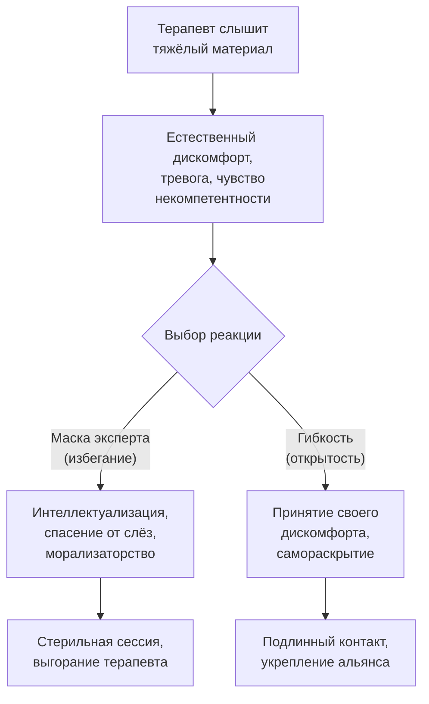

В традиционной модели психотерапии терапевт выступает как «здоровый эксперт», который починит «сломанного пациента». Он знает ответы, ставит диагноз и назначает лечение. Между креслами пролегает невидимая иерархия: один — наверху, другой — внизу. В Терапии принятия и ответственности эта модель переворачивается с ног на голову.

**Терапевтический альянс в ACT** — это радикально эгалитарная позиция, в которой терапевт отказывается от роли «просветлённого эксперта» в пользу равного партнёра, разделяющего с клиентом универсальные человеческие страдания и ловушки разума *(Хейс, Штросаль, & Уилсон, 2021)*. Метафора «два альпиниста на разных горах» означает: терапевт не спустился с вершины, чтобы спасти клиента. Он сам продолжает восхождение — просто имея возможность со стороны наблюдать за маршрутом клиента.

### Философский фундамент равенства

Функциональный контекстуализм утверждает: не существует объективно «правильных» или «неправильных» мыслей — есть только мысли, которые работают или не работают в данном контексте *(Хейс, Штросаль, & Уилсон, 2021)*. Поскольку правила языка связывают абстрактные концепции с реальной болью, **все** люди запрограммированы на избегание этой боли.

Из этого следует: терапевт не обладает высшим психологическим иммунитетом. Он не может сказать: «Ваши мысли ошибочны, а мои — истинны». Когда терапевт искренне транслирует: «Мы попали в одни и те же ловушки. По иронии судьбы я мог бы сидеть напротив вас, а вы — напротив меня», это создаёт беспрецедентный контекст для радикального принятия *(Хейс, Штросаль, & Уилсон, 2021)*.

### Четыре опоры «человеческого элемента»

Архитектура альянса в ACT строится на четырёх компонентах *(Хейс, Штросаль, & Уилсон, 2021; Бах & Моран, 2021)*:

| Опора | Определение | Антипод |
| :--- | :--- | :--- |
| **Радикальное уважение** | Вера в изначальную способность клиента к достижению ценных целей | Осуждение, морализаторство |
| **Мягкое ободрение** | Валидация боли без попыток её «починить» | Обесценивание, «позитивное мышление» |
| **Избирательное самораскрытие** | Использование личного опыта терапевта на благо клиента | Жалобы на свою жизнь, просьбы об утешении |
| **Психологическая гибкость терапевта** | Применение процессов ACT к самому себе в реальном времени | Маска «идеального эксперта», избегание |

### Гексафлекс по обе стороны кресла

Альянс можно категоризировать через призму процессов гексафлекса, применяемых самим терапевтом *(Хейс, Штросаль, & Уилсон, 2021)*:

**Открытость терапевта.** Готовность не избегать сложных тем и не цепляться за правило «я должен знать все ответы».

**Центрированность терапевта.** Способность вовремя заметить, что его «зацепили» слова клиента, и вернуться в настоящий момент, а не улетать в мысли о правильном применении техники.

**Вовлечённость терапевта.** Радикальное уважение к ценностям клиента, даже если они расходятся с личными предпочтениями специалиста (при условии, что они не причиняют вреда).

### Парадокс уверенности начинающих терапевтов

Исследования Лаппалайнена и соавторов обнаружили парадоксальный результат: начинающие терапевты, прошедшие краткий курс ACT, чувствовали себя *менее уверенно* и испытывали *больше дискомфорта*, чем те, кто обучался традиционной КПТ *(Бах & Моран, 2021)*. Однако их клиенты демонстрировали **лучшие результаты** лечения.

Это доказывает: дискомфорт и неуверенность терапевта не только не вредят — они очеловечивают работу. Отказ от маски всезнайки открывает новые горизонты для терапевтического альянса. Игра в «безупречного эксперта» истощает нервную систему. Аутентичное присутствие позволяет расслабиться в своей человечности.

### Отказ от морализаторства: чистые руки терапевта

Терапевт может столкнуться с поведением, вызывающим моральное отторжение. Но в ACT терапевт не имеет права выступать агентом социального контроля *(Хейс, Штросаль, & Уилсон, 2021)*.

Если терапевт скажет алкоголику: «Вы должны бросить пить, потому что ваш выбор неправилен», он перейдёт к принуждению. Такое морализаторство лишь усилит сопротивление. Терапевт подходит к работе с «чистыми руками», исследуя, как действия клиента соотносятся с *его собственными* ценностями, а не с моральным компасом терапевта.

В самом закоренелом зависимом скрывается человеческий дух, стремящийся к чему-то позитивному *(Бах & Моран, 2021)*. Фраза «Я просто хочу напиться» — не конечная цель, а дисфункциональное средство избежать боли. Вступая в альянс с этим духом, терапевт проясняет истинные ценности.

### Юмор как инструмент гуманизации

Терапевт ACT использует юмор — но этот юмор направлен не на клиента, а на абсурдность ловушек языка *(Хейс, Штросаль, & Уилсон, 2021)*. Ироничное отношение к диктатуре разума помогает клиенту понять: он не сломан, просто его мозг делает то же самое, что и мозги всех людей.

### Ловушка «интеллектуализации ACT»

Терапевт, изучив ACT, начинает сыпать терминами: «Вы сейчас сливаетесь со своими мыслями», «Вам нужно практиковать принятие» *(Хейс, Штросаль, & Уилсон, 2021)*. Терапия превращается в обвиняющую конфронтацию. Терапевт сам попадает в слияние со своей «правильной теорией». Решение — говорить меньше, не превышать лимит в 20% времени на объяснение концепций и возвращаться к невербальным, эмпирическим упражнениям.

### Заключение и Литература

Терапевтический альянс в ACT строится не на экспертности, а на человечности. Кабинет терапевта — не операционная, где хирург удаляет «болезнь», а укрытие на горном перевале, где два человека, подверженные одним и тем же штормам, сверяют карты. Терапевт не свободен от боли и когнитивного слияния — его квалификация заключается лишь в том, что он научился замечать эти процессы и готов идти вперёд вместе со своими страхами, моделируя этот путь для клиента.

- Бах, П. А., & Моран, Д. Дж. (2021). *ACT на практике. Концептуализация случаев в терапии принятия и ответственности*. ООО «Диалектика».
- Хейс, С. С. (2020). *Освобожденный разум. Как побороть внутреннего критика и повернуться к тому, что действительно важно*. ООО «Издательство «Эксмо».
- Хейс, С. С., Штросаль, К. Д., & Уилсон, К. Г. (2021). *Терапия принятия и ответственности. Процессы и практика осознанных изменений*. ООО «Диалектика».
- Торнеке, Н. (2022). *Теория реляционных фреймов в клинической практике*. Киев: Компьютерное издательство «Диалектика».

---

Начинающий терапевт после первого курса ACT проводит сессию с клиентом, страдающим от хронической прокрастинации. Во время разговора терапевт замечает, что клиент явно избегает темы отношений с отцом. Вдохновлённый материалом курса, терапевт торжественно объявляет: «Я вижу, что вы сейчас находитесь в состоянии эмпирического избегания. Ваше когнитивное слияние с мыслью о том, что разговор об отце опасен, — это классический случай психологической ригидности. Давайте применим когнитивное разделение».

**Вопрос:** Опираясь на принципы радикального равенства и опасность интеллектуализации, объясните, какие ошибки допустил терапевт. Как бы выглядел тот же момент сессии, если бы терапевт применил «человеческий элемент» вместо «экспертного элемента»?
