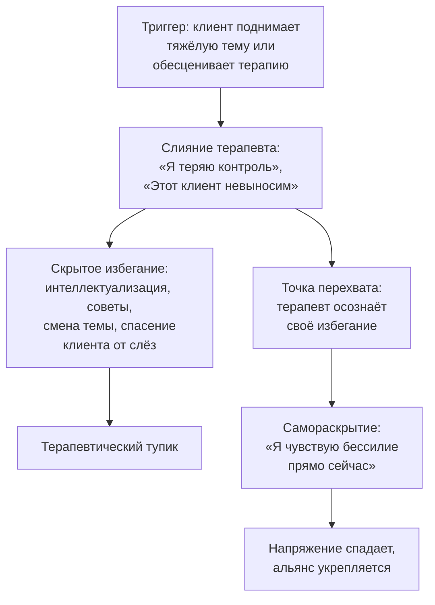

Терапевт ведёт сессию, и клиент внезапно поднимает тему суицида. Терапевт чувствует волну паники. Его разум кричит: «Я теряю контроль! Я не знаю, что делать!» Первый инстинкт — спрятать эту панику за маской профессионализма. Начать сыпать метафорами, сменить тему, дать директивный совет. Сделать вид, что всё идёт по плану.

В Терапии принятия и ответственности (ТПО/ACT) такое поведение рассматривается как **эмпирическое избегание терапевта** — попытка уйти от собственного дискомфорта за счёт качества сессии. Психологическая гибкость терапевта — это способность осознанно отслеживать собственные реакции, не сливаться с ролью «идеального эксперта» и открыто признавать ошибки ради сохранения подлинного контакта с клиентом *(Хейс, Штросаль, & Уилсон, 2021)*.

### Терапевт и клиент сделаны из одного теста

Фундаментальный принцип ACT: терапевт и клиент подчиняются одним и тем же законам языка *(Хейс, Штросаль, & Уилсон, 2021)*. Разум терапевта точно так же генерирует жёсткие правила, склонен к слиянию с мыслями и подталкивает к избеганию. Если изъять этот элемент равенства, терапия превращается в социальный контроль.

Осознание собственной уязвимости — не слабость, а главный ресурс. Невозможно научить клиента принятию, сидя в броне пуленепробиваемого эксперта. Когда клиент видит, что специалист способен ошибиться, заметить это и мягко вернуться к работе, он получает бесценный урок: «Со мной всё в порядке, даже если я ошибаюсь».

### Анатомия «сбоя» на сессии

Логика кризиса разворачивается предсказуемо. Клиент поднимает болезненную тему — терапевт ловит «зацеп». У него возникает тревога или раздражение. Желая уйти от дискомфорта, терапевт начинает сыпать метафорами не к месту, давать директивные советы или спасать клиента от слёз.

Точка перехвата наступает, когда терапевт осознаёт своё избегание. Он обращается к настоящему моменту, центрируется и вслух признаёт ошибку: «Упс, я только что поймал себя на том, что выношу суждение» или «Я чувствую бессилие прямо сейчас» *(Хейс, Штросаль, & Уилсон, 2021)*.

### Кейс стажёра Алана: от отвращения к состраданию

Стажёр Алан испытывал сильное отвращение к клиенту — человеку с биполярным расстройством и наркоманией, не соблюдавшему гигиену *(Бах & Моран, 2021)*. Алан злился, что клиент «ленился» выполнять домашние задания. Во время сессий Алан выпадал из контакта и забывал о целях терапии.

Супервизор не стал читать Алану лекции. Он предложил применить ACT к самому себе. Алан начал замечать свои мысли: «У меня возникла мысль, что клиент ленится». Когда Алан сам провалил домашнее задание по осознанности, он признался: «Почему меня расстраивает то, что клиенты не выполняют домашнюю работу, если я сам не смог выполнить своё?»

Когда клиент заговорил о чувстве неудачи, Алан открыто поделился собственными мыслями о провале. Барьер рухнул — и у них получилась глубокая терапевтическая сессия по принятию *(Бах & Моран, 2021)*.

### Механика возвращения в колею

Если сессия идёт не так, терапевт применяет ACT к самому себе *(Хейс, Штросаль, & Уилсон, 2021)*:

**Шаг 1. Центрирование.** Главное правило: «Если сомневаешься — прежде всего центрируйся». Терапевт делает паузу, замечает дыхание, осознаёт внутренний дискомфорт.

**Шаг 2. Разделение.** Терапевт отмечает: «У меня возникла мысль, что я провалил сессию».

**Шаг 3. Самораскрытие.** Терапевт озвучивает происходящее вслух: «Боже, меня это зацепило! Вас это тоже зацепило?» или «Я чувствую тревогу и растерянность. Я не хочу, чтобы вы меня спасали, но мне интересно наблюдать, как мой разум пытается от этого избавиться. Может, мы оба позволим себе встревожиться?» *(Хейс, Штросаль, & Уилсон, 2021)*.

**Шаг 4. Юмор.** Лёгкая непочтительность к человеческому разуму: «Упс, я снова поймал себя на том, что выношу суждение. Позвольте мне перефразировать».

### Три ловушки терапевта

| Ловушка | Механизм | Как распознать |
| :--- | :--- | :--- |
| **Интеллектуализация** | Терапевт превращает сессию в лекцию по теории ACT | Клиент кивает, но ничего не чувствует. Терапевт говорит больше 20% времени |
| **Сострадательный саботаж** | Терапевт защищает клиента от полезной боли, чтобы самому не испытывать тревогу | Смена темы, когда клиент начинает плакать. Порыв «спасти» от слёз |
| **Осуждение** | Слияние с мыслью, что клиент «ленивый» или «трудный» | Раздражение, желание отчитать, потеря эмпатии |

**Сострадательный саботаж** — самая коварная из ловушек. Терапевту кажется, что сессия идёт «не так», потому что клиент плачет. Разум терапевта кричит: «Я делаю ему больно!» Истинная гибкость — осознать этот порыв, принять собственную тревогу от вида чужой боли и остаться в дискомфорте вместе с клиентом, позволяя ему пережить необходимый опыт.

### Самораскрытие: что это и чем не является

**Что это:** безоценочная, сострадательная констатация факта слияния или избегания в поведении самого терапевта, направленная на пользу клиента.

**Чем это НЕ является:** повод переключить сессию на психотерапию самого терапевта. Это не жалобы клиенту на свои проблемы и не просьба об утешении. Самораскрытие всегда избирательно и обслуживает интересы клиента *(Хейс, Штросаль, & Уилсон, 2021)*.

> Когда терапевт защищает свой авторитет, он сливается с концептуализированным «Я» — «Я — Великий Доктор». Рассеивая эту иллюзию фразой «Ну, это было не очень эффективно, не правда ли?», терапевт сбрасывает напряжение и предотвращает выгорание.

### Заключение и Литература

Психологическая гибкость терапевта — не дополнительный бонус, а необходимое условие эффективной работы в ACT. Терапевт, который способен заметить собственное слияние, принять дискомфорт и открыто признать ошибку, моделирует на своём примере те процессы, которым обучает клиента. Боль от ошибки превращается в мощный инструмент терапевтического альянса, а отказ от маски эксперта спасает самого специалиста от выгорания.

- Бах, П. А., & Моран, Д. Дж. (2021). *ACT на практике. Концептуализация случаев в терапии принятия и ответственности*. ООО «Диалектика».
- Хейс, С. С. (2020). *Освобожденный разум. Как побороть внутреннего критика и повернуться к тому, что действительно важно*. ООО «Издательство «Эксмо».
- Хейс, С. С., Штросаль, К. Д., & Уилсон, К. Г. (2021). *Терапия принятия и ответственности. Процессы и практика осознанных изменений*. ООО «Диалектика».
- Торнеке, Н. (2022). *Теория реляционных фреймов в клинической практике*. Компьютерное издательство «Диалектика».

---

На сессии клиент обесценивает терапию: «Ничего не работает, вы мне не помогаете». Терапевт чувствует укол в самооценку. Его разум мгновенно генерирует две реакции: 1) желание доказать клиенту свою компетентность, перечислив достижения терапии, и 2) раздражение из-за «неблагодарности» клиента.

**Вопрос:** Идентифицируйте, какие из трёх ловушек терапевта (интеллектуализация, сострадательный саботаж, осуждение) активированы в этой ситуации. Предложите конкретную фразу самораскрытия, которую терапевт мог бы использовать в этот момент, и объясните, как она одновременно демонстрирует когнитивное разделение и принятие.
