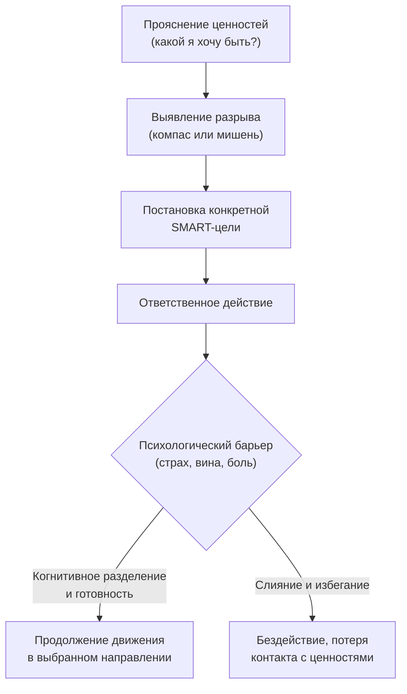

Человек увольняется с работы, получает повышение, женится, разводится, переезжает — и через некоторое время снова чувствует пустоту. Достигнув цели, он испытывает мимолетную радость, которая быстро испаряется. Внутренний диктатор немедленно требует новой цели. Жизнь превращается в изматывающую беговую дорожку, где финишная ленточка постоянно отодвигается.

В Терапии принятия и ответственности (ТПО/ACT) **ценности** определяются как свободно выбранные качества действий — то, какими людьми мы хотим быть и ради чего мы готовы действовать *(Хэррис, 2009)*. Ценности работают как внутренний компас: когда жизнь наносит удар, именно контакт с тем, что по-настоящему небезразлично, даёт силы выносить боль и продолжать двигаться *(Хейс, 2020)*.

### Ценности — это не цели: парадокс горнолыжника

Архитектура ACT жёстко разграничивает два понятия, которые люди постоянно путают *(Хэррис, 2009)*:

| Ценности (Направление) | Цели (Пункт назначения) |
| :--- | :--- |
| Процесс без завершения. Идти на запад можно всю жизнь, но нельзя сказать: «Я прибыл на запад» | Достижимый результат, который можно вычеркнуть из списка |
| «Быть любящим партнёром» | «Вступить в брак» |
| «Заботиться о здоровье» | «Пробежать марафон» |
| Неисчерпаемый источник мотивации | Мимолётная радость и запрос новой цели |

Представьте, что вы стоите на вершине заснеженного склона, предвкушая спуск *(Бах & Моран, 2021)*. Вдруг подлетает вертолёт, пилот затаскивает вас в кабину и через минуту высаживает у подножия горы: «Я помог вам достичь вашей цели — оказаться внизу!» Вы будете в ярости. Суть катания на лыжах не в том, чтобы оказаться внизу, а в самом спуске. ACT провозглашает: *«Результат — это процесс, благодаря которому процесс приносит результат»* *(Бах & Моран, 2021)*.

Расс Хэррис приводит другую метафору: двое детей едут в Диснейленд. Один всю дорогу ноет «Мы уже приехали?», страдая от недостигнутой цели. Другой наслаждается видами из окна и играми в дороге *(Хэррис, 2022)*. Ценности позволяют быть успешным в каждую секунду пути.

### Ценности — это качества действий, а не эмоции

Многие путают ценность любви с чувством любви *(Бах & Моран, 2021)*. Если любовь — это только чувство, то отношения обречены при первом конфликте, потому что чувства постоянно меняются. Любовь как ценность — это выбор совершать заботливые действия, даже когда человек чувствует гнев или усталость.

Ценности также не должны формулироваться как отсутствие чего-либо. В ACT существует проверка «целью мёртвеца» *(McCracken, б.г.)*: если мёртвый человек может справиться с задачей лучше вас (мертвецы никогда не злятся, не курят, не тревожатся), значит, это не поведение, не цель и не ценность.

### Свободный выбор: ядро ценности

Фундаментальное ядро ценности — её абсолютная свобода от внешнего принуждения *(Хейс, Штросаль, & Уилсон, 2021)*. Ценности не могут быть навязаны обществом, родителями или страхом наказания *(Хейс, 2020)*. Если из мотивации убрать свободный выбор, ценность мгновенно мутирует в жёсткое **правило** («Я обязан быть идеальным мужем, иначе я плохой»), которое порождает тревогу и лишает жизненных сил *(Хэррис, 2022)*.

Терапевт выявляет подмену мысленным экспериментом: «Если бы никто никогда не узнал, что вы совершили этот поступок, вы бы всё равно стали это делать?» *(Хейс, Штросаль, & Уилсон, 2021)*. Если клиент отвечает «нет», перед терапевтом не ценность, а попытка избежать социального осуждения или заработать одобрение.

### Случай Фреда: ценности как броня от обстоятельств

Фред владел бизнесом, но потерпел крах, потерял сбережения и был вынужден переехать в деревню, устроившись надзирателем в интернате *(Хэррис, 2022)*. Его жизненная цель (успешный бизнес) была разрушена. Если бы Фред жил только ради целей, он впал бы в глубочайшую депрессию.

Однако Фред выбрал жить в соответствии с ценностями прямо на этой незавидной работе: быть отзывчивым, заботливым и дружелюбным по отношению к ученикам *(Хэррис, 2022)*. Это позволило ему извлекать удовлетворение из каждого рабочего дня и сохранять энергию, пока он не достиг новой цели — должности организатора фестиваля.

> Внешние обстоятельства могут заблокировать наши цели, но никакая трагедия не способна запретить нам поступать в соответствии с ценностями здесь и сейчас.

### Жизненный компас: инструмент калибровки

Терапевт извлекает ценности с помощью специальных инструментов. Клиенту предлагают рассмотреть ключевые домены (семья, работа, духовность, досуг, здоровье) и в каждом ответить: «Каким человеком я хочу быть здесь?» *(Хэррис, 2022)*.

В инструменте **«Жизненный компас»** клиент оценивает каждую сферу по двум шкалам от 1 до 10 *(Хейс, 2020)*:
1. Насколько эта сфера *важна*
2. Насколько его *реальное поведение* в последнюю неделю соответствовало этой ценности

Если важность равна 10, а действия на 2, терапевт наглядно демонстрирует разрыв — и этот разрыв становится топливом для изменений *(Хейс, 2020)*. Другой вариант — визуальная доска **«Мишень» (Bull's Eye)**, где центр означает идеальное соответствие жизни ценностям, а периферия — отклонение *(Бах & Моран, 2021)*.

### Боль и ценности: две стороны одной медали

Обращение к ценностям часто вызывает невыносимую душевную боль. В ACT есть аксиома: «Нам больно там, где нам не всё равно» *(Хейс, 2020)*. Боль и ценности неразделимы. Невозможно убрать боль от потери, не уничтожив способность любить. Человек с социальной фобией чувствует боль именно потому, что высоко ценит общение с людьми.

Стивен Хейс описывает исследование: студентам предложили потратить 15 минут на письменное упражнение о ценностях в учёбе. В течение следующего семестра средний балл успеваемости этих студентов вырос на 0,2 балла *(Хейс, 2020)*. Простой контакт с ценностями — даже без специальной терапии — уже порождает поведенческие изменения.

### Упражнение «Эпитафия»: зеркало подлинных смыслов

Терапевт просит клиента закрыть глаза и представить собственные похороны: «Что бы вы хотели, чтобы люди написали на вашем надгробии, отражая то, ради чего вы жили?» *(Бах & Моран, 2021)*.

Клиенты никогда не хотят, чтобы там значилось: «Здесь лежит Фред. Он всю жизнь избегал тревоги» *(Хейс, Штросаль, & Уилсон, 2021)*. Это упражнение молниеносно срывает завесу с избегающего поведения и высвечивает подлинный смысл человеческого бытия.

### Заключение и Литература

Ценности предоставляют человеку неисчерпаемый источник мотивации, который не зависит от внешних обстоятельств. Они работают как Полярная звезда — не устраняют тернии на пути, но гарантируют, что каждый шаг пропитан смыслом. Жизнь, управляемая ценностями, перестаёт быть беговой дорожкой и превращается в путешествие, где сам процесс движения и есть награда.

- Бах, П. А., & Моран, Д. Дж. (2021). *ACT на практике. Концептуализация случаев в терапии принятия и ответственности*. ООО «Диалектика».
- Хейс, С. С. (2020). *Освобожденный разум. Как побороть внутреннего критика и повернуться к тому, что действительно важно*. ООО «Издательство «Эксмо».
- Хейс, С. С., Штросаль, К. Д., & Уилсон, К. Г. (2021). *Терапия принятия и ответственности. Процессы и практика осознанных изменений*. ООО «Диалектика».
- Хэррис, Р. (2009). *ACT made simple*. New Harbinger Publications.
- Хэррис, Р. (2022). *Ловушка счастья. Перестаем переживать — начинаем жить*.
- McCracken, L. (б.г.). *ACT for Chronic Pain (Хроническая боль. Перевод Е. Сушан, И. Розов)*.

---

Клиент Рик заявляет терапевту, что не может навещать мать в доме престарелых, потому что чувствует там только отвращение и вину. Терапевт просит Рика представить абсурдную ситуацию: его высшей жизненной ценностью стало, чтобы все коллеги писали только зелёными ручками *(Бах & Моран, 2021)*. «Смог бы ты раздавать зелёные ручки, даже если твой разум кричит, что это глупость?» Рик отвечает «Да».

**Вопрос:** Опираясь на различие между ценностями как качествами действий и ценностями как эмоциями, объясните, какой инсайт терапевт пытался вызвать у Рика с помощью метафоры зелёных ручек. Как этот инсайт помогает разрешить его проблему с посещением матери?
