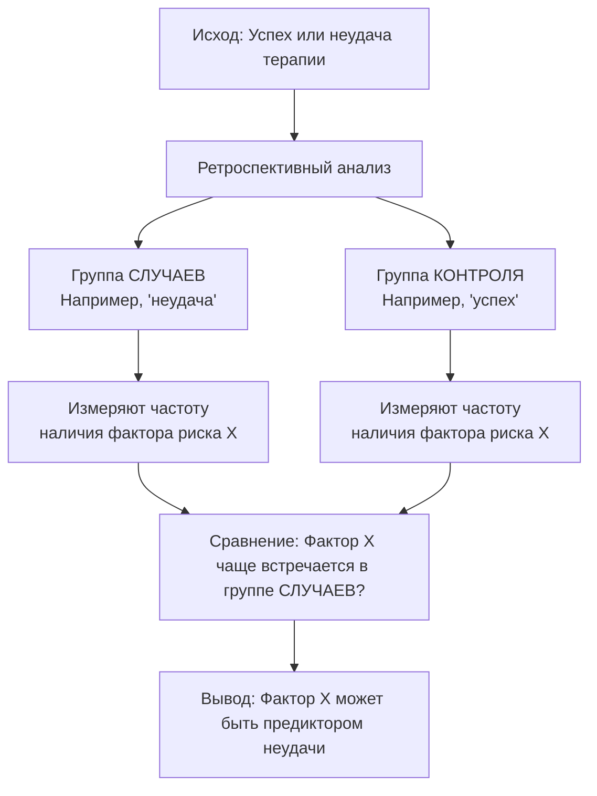
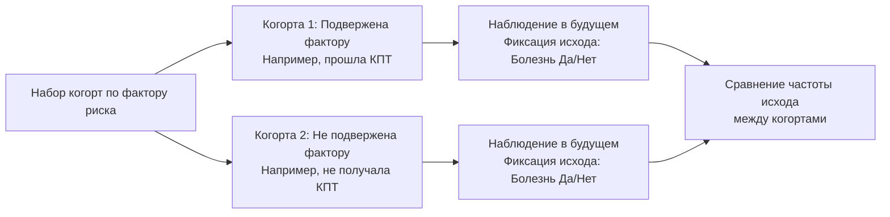

## Как измеряется эффективность психотерапии?

Клиент, завершающий курс терапии с ощущением облегчения и новыми навыками, — это яркая, но субъективная картина, которую необходимо дополнить объективными данными. Эффективность психотерапии сегодня оценивается с помощью комплексной системы методов, образующих иерархию по степени доказательности. На нижних ступенях этой иерархии находятся **единичные клинические наблюдения (case reports)** и **самоотчеты клиентов**, которые служат ценным источником гипотез и индивидуальной обратной связи, но не могут доказать эффективность метода в целом из-за высокой субъективности и отсутствия контроля.

Более строгие данные предоставляет **шкалирование показателей** с помощью стандартизированных опросников, таких как шкала депрессии Бека или шкала тревоги Спилбергера. Этот метод позволяет количественно измерить динамику состояния клиента до, после и в процессе терапии, превращая субъективные переживания в сравнительные цифры. Исследовательский «золотой стандарт» — **рандомизированные контролируемые исследования (РКИ)** — специально создан для установления причинно-следственной связи: приводит ли именно терапия к улучшению? Современные технологии также позволяют зафиксировать **изменение нейрофизиологических показателей** (активности мозга, уровня гормонов стресса) в ходе психотерапии, предоставляя биологические корреляты психологических изменений. Ключевым итоговым критерием является **устойчивость изменений**, то есть сохранение положительного эффекта через месяцы и годы после завершения лечения.

## Доказательная практика в психотерапии: три столпа

Термин «доказательная медицина», утвердившийся в 1990-е годы, закономерно проник и в сферу помощи психического здоровья, породив концепцию **доказательной практики (Evidence-Based Practice, EBP)**. Американская психологическая ассоциация в 2005 году дала классическое определение, согласно которому доказательная практика представляет собой интеграцию трех равнозначных компонентов. Первый компонент — **лучшие доступные исследовательские доказательства**, полученные в результате систематических исследований, мета-анализов и РКИ, которые указывают на относительную эффективность разных методов для конкретных расстройств.

Второй столп — **клинический опыт специалиста**, который включает навыки оценки, понимание процессов терапии, способность выстраивать рабочий альянс и принимать решения в условиях неполной информации. Без этого опыта даже самый эффективный по исследованиям метод может быть применен неудачно. Третий, и критически важный, компонент — **особенности, культура, ценности и предпочтения клиента**. Доказательная практика не является диктатом протокола; она требует адаптации научно обоснованных методов под уникальный жизненный контекст, убеждения и цели конкретного человека. Таким образом, эффективная терапия возникает не из слепого следования инструкции, а на пересечении научного знания, мастерства терапевта и личности клиента.

## Иерархия доказательств: от клинических случаев к мета-анализу

Чтобы ориентироваться в потоке научной информации, специалисты опираются на иерархию дизайнов исследований, где каждый уровень обладает разной силой доказательности и решает свои задачи.

### Клинические случаи (Case Reports)

Что делать терапевту, столкнувшемуся с уникальной, ни на что не похожей реакцией клиента на стандартную технику? Описание единичного случая, или **кейс-репорт**, — это отправная точка научного осмысления необычных явлений. Такие отчеты фиксируют редкие состояния, неожиданные побочные эффекты или новые терапевтические приемы, выполняя роль системы раннего оповещения профессионального сообщества. Их сила — в генерации гипотез и углубленном качественном анализе, однако они не могут служить доказательством эффективности из-за отсутствия контроля, статистики и риска субъективной интерпретации.

### Исследование «случай–контроль» (Case-Control Study)

Когда ученые пытаются понять, почему терапия помогла одним клиентам и не помогла другим, они часто прибегают к ретроспективному дизайну «случай–контроль». Логика этого исследования разворачивается от исхода к возможной причине: сначала формируются две группы — **группа случаев** (например, клиенты, у которых терапия не дала результата) и **группа контроля** (клиенты с успешным исходом). Затем исследователи ретроспективно, оглядываясь в прошлое, ищут и сравнивают частоту встречаемости определенных **факторов риска или предикторов** (например, низкое качество рабочего альянса на ранних сессиях, специфические черты личности, comorbidность) в этих группах.

Этот тип исследований идеально подходит для изучения редких исходов (например, суицида после терапии), так как позволяет целенаправленно набрать нужную группу. Главный недостаток — высокий риск **смещения припоминания**: люди, пережившие негативный исход, могут по-другому, более пристрастно вспоминать и интерпретировать прошлые события.

### Когортное исследование (Cohort Study)

В отличие от предыдущего дизайна, когортное исследование движется от предполагаемой причины к возможному следствию, следуя естественному течению времени. Исследователи формируют две или более **когорты** — группы участников, отличающиеся по наличию воздействия изучаемого фактора (например, одна когорта проходит курс когнитивно-поведенческой терапии, а другая получает обычную помощь). Затем за этими группами наблюдают в течение определенного периода, фиксируя, у кого и когда наступает интересующий исход (например, ремиссия депрессии).

Когортные исследования, особенно проспективные (когда наблюдение начинается сейчас и ведется в будущее), отлично подходят для изучения частых исходов и длительных эффектов терапии. Их слабость — в дороговизне, длительности и риске «потерь для наблюдения», когда участники выбывают из исследования.

Для наглядности сравним два ключевых наблюдательных дизайна:

| Критерий | Когортное исследование | Исследование «случай–контроль» |
| :--- | :--- | :--- |
| **Логика и направление** | От фактора риска → к исходу | От исхода → к фактору риска |
| **Временная перспектива** | Преимущественно проспективная (вперед) | Всегда ретроспективная (назад) |
| **Что сравнивается?** | Частота развития исхода в группах с фактором и без | Частота наличия фактора риска в группах с исходом и без |
| **Эффективность для редких заболеваний** | Неэффективно (требует огромной когорты) | **Идеально** (можно целенаправленно набрать случаи) |
| **Эффективность для редких факторов риска** | **Идеально** (можно набрать группу с редким воздействием) | Неэффективно (в случайной выборке таких людей мало) |
| **Основные риски смещения** | Потери для наблюдения | Смещение припоминания, смещение отбора контроля |
| **Время и стоимость** | Обычно длительные и дорогие | Относительно быстрые и дешевые |

### Рандомизированное контролируемое испытание (РКИ)

Если бы нужно было выбрать один метод, максимально приближенный к установлению истинной причинно-следственной связи, это было бы **рандомизированное контролируемое испытание (РКИ)**. Его статус «золотого стандарта» обеспечен четырьмя ключевыми компонентами. **Рандомизация** — это случайное распределение участников по группам (например, экспериментальная терапия, контрольная группа, группа плацебо), которое уравнивает группы по всем известным и неизвестным факторам (возраст, тяжесть состояния, мотивация), кроме самого изучаемого вмешательства.

**Контрольная группа** служит точкой отсчета, позволяя отделить эффект терапии от эффекта времени, спонтанного улучшения или неспецифических факторов (внимание, ожидание). **Стандартизированный протокол вмешательства** гарантирует, что все участники экспериментальной группы получат одинаковое по содержанию и качеству лечение, что делает исследование воспроизводимым. Наконец, **ослепление (слепой метод)** минимизирует предвзятость: когда оценщики результатов не знают, к какой группе принадлежит участник (одинарное слепое), а в идеале — и сам участник не знает, получает ли он активную терапию или плацебо (двойное слепое, что в психотерапии сложно организовать).

| Компонент РКИ | Суть | Пример в психотерапии |
| :--- | :--- | :--- |
| **1. Рандомизация** | Случайное распределение по группам для уравнивания характеристик. | 100 пациентов с паническим расстройством случайно делятся на группу КПТ (50 чел.) и группу листа ожидания (50 чел.). |
| **2. Контрольная группа** | Группа для сравнения, не получающая исследуемое вмешательство. | **Группа листа ожидания:** не получает терапию. **Группа плацебо:** получает неспецифическую поддержку. **Группа сравнения:** получает другой вид терапии. |
| **3. Протокол вмешательства** | Проведение терапии по строгому, стандартизированному руководству. | Все терапевты проводят 16 сессий КПТ по единому manual, работая с когнициями и поведением при панике. |
| **4. Ослепление** | Сокрытие информации о принадлежности к группе для избежания предвзятости. | Оценщик, анализирующий финальные опросники, не знает, проходил ли пациент КПТ или был в списке ожидания. |

### Систематические обзоры и мета-анализы

Отдельное исследование, даже хорошо проведенное РКИ, — это всего лишь часть мозаики. **Систематический обзор** — это всесторонний, методичный сбор и критический анализ всех качественных исследований по конкретному вопросу (например, «Эффективность интерперсональной терапии при подростковой депрессии»). Он следует строгому протоколу поиска и отбора работ, минимизируя случайные ошибки и предвзятость автора.

Когда результаты отдельных исследований в рамках систематического обзора можно выразить в числовой форме (например, размер эффекта), наступает очередь **мета-анализа**. Это статистическая процедура, которая объединяет количественные данные из множества исследований, вычисляя сводный, усредненный показатель эффективности. Например, мета-анализ 80 РКИ может показать, что КПТ при депрессии имеет средний размер эффекта (d Коэна) 0.9, что считается высоким показателем. Мета-анализ — самый мощный инструмент для обобщения знаний и выработки объективных выводов об эффективности того или иного метода.

## Причинно-следственные связи в психотерапевтических исследованиях

Как отличить простую последовательность событий от настоящей причинно-следственной связи? Утверждение «после этого — не значит вследствие этого» является краеугольным камнем научной методологии. Чтобы обоснованно заявить, что именно психотерапия *вызвала* улучшение, должны быть соблюдены три критерия. Первый — **временная последовательность**: причина (вмешательство) должна предшествовать следствию (улучшению). Это кажется очевидным, но во многих наблюдательных исследованиях (типа «случай-контроль») данные собираются ретроспективно, что затрудняет точное установление порядка событий.

Второй критерий — **наличие статистической связи**: изменение независимой переменной должно устойчиво коррелировать с изменением зависимой переменной. Однако, как учат на первом курсе статистики, корреляция не есть причинность. Две переменные могут быть связаны из-за того, что А вызывает В, В вызывает А, или существует третья, скрытая переменная С, которая вызывает и А, и В. Именно для устранения этих альтернативных объяснений служит третий, самый сложный критерий — **исключение правдоподобных альтернативных гипотез**. В идеальном эксперименте этому служат рандомизация и контроль всех существенных внешних переменных. В психотерапии это означает контроль за эффектом ожидания, терапевтическим вниманием, естественным течением расстройства и другими неспецифическими факторами.

Понятия **независимой (НП)** и **зависимой переменной (ЗП)** являются операциональным языком для описания этой причинности. Независимая переменная — это то, что активно изменяет или варьирует исследователь (например, тип терапии: КПТ vs. психодинамическая терапия, количество сессий, частота встреч). Зависимая переменная — это измеряемый исход, который, как предполагается, зависит от манипуляций с НП (например, баллы по шкале депрессии, частота панических атак, качество жизни). Четкое определение этих переменных — основа любого строгого исследования.

## Клинические рекомендации: мост между наукой и практикой

Каким образом терапевт в своем кабинете может оперативно воспользоваться результатами тысяч РКИ и мета-анализов? **Клинические рекомендации (гайдлайны)** являются практическим воплощением доказательной медицины, переводя сложные научные данные в конкретные алгоритмы действий. Это систематически разработанные документы, которые помогают клиницисту и пациенту принять обоснованное решение о выборе помощи в конкретных клинических обстоятельствах.

Современные гайдлайны (например, от NICE в Великобритании или APA в США) строятся на вершине иерархии доказательств: в их основе лежат данные мета-анализов и систематических обзоров высококачественных РКИ. Они определяют методы лечения первой и второй линии, их продолжительность, комбинации с фармакотерапией, показания и противопоказания. Важно понимать, что рекомендации — это не жесткий диктат, а руководство, которое должно быть интегрировано с клиническим опытом и предпочтениями пациента в рамках уже упомянутой триады доказательной практики.

## Запомнить

*   **Эффективность психотерапии** — не вопрос веры, а предмет научного изучения с помощью шкал, наблюдений, РКИ и нейрофизиологических измерений.
*   **Доказательная практика** — это интеграция трех равнозначных элементов: 1) лучших доступных исследований, 2) клинического опыта терапевта, 3) ценностей и особенностей клиента.
*   **Иерархия исследований** строится по силе доказательности: клинические случаи (гипотезы) → исследования «случай-контроль» (поиск предикторов) → когортные исследования (наблюдение за развитием) → РКИ («золотой стандарт» причинности) → систематические обзоры и мета-анализы (обобщение знаний).
*   **РКИ** доказывает причинно-следственную связь благодаря четырем компонентам: рандомизации, контрольной группе, стандартизированному протоколу и ослеплению.
*   **Причинный вывод** требует соблюдения трех условий: временной последовательности, наличия связи и исключения альтернативных объяснений, что реализуется через контроль переменных.
*   **Клинические рекомендации (гайдлайны)** — это основанные на доказательствах практические алгоритмы, помогающие выбрать эффективный метод лечения для конкретного расстройства.
