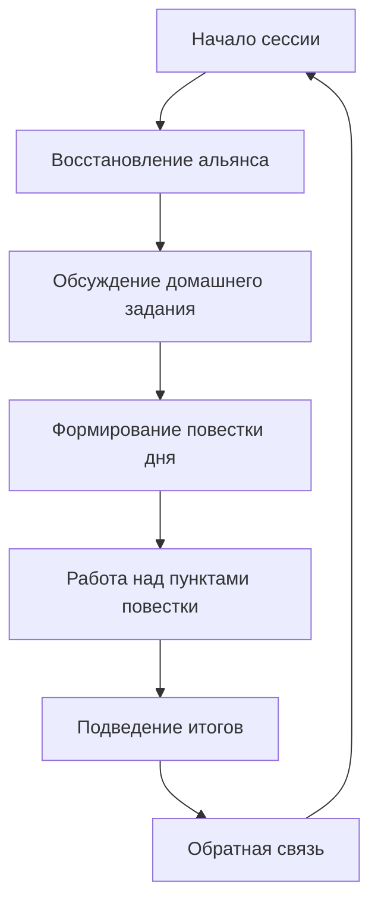

Когнитивно-поведенческая терапия (КПТ) — это не набор техник, а целостная система, опирающаяся на чёткие принципы. Эти принципы определяют, как терапевт строит отношения, планирует лечение и проводит каждую сессию. В современной КПТ выделяют 14 базовых принципов, которые адаптируются под индивидуальные особенности клиента, но остаются универсальным каркасом метода.

## 1. План лечения основывается на постоянно развивающейся когнитивной концептуализации

Терапевт не применяет техники наугад. С первых встреч формируется **когнитивная концептуализация** — модель, объединяющая текущие проблемы, автоматические мысли, промежуточные и глубинные убеждения, компенсаторные поведенческие стратегии. В эту модель с самого начала включаются сильные стороны, позитивные качества и ресурсы клиента.

Концептуализация не статична. По мере сбора новых данных на каждой сессии терапевт дорабатывает её и использует для выбора стратегий лечения. Это исключает хаотичное применение методов.

## 2. КПТ предполагает построение устойчивых терапевтических отношений

У всех клиентов разная способность устанавливать крепкий терапевтический альянс. Вклад в его укрепление вносят:
- роджерианские консультативные навыки (эмпатия, безусловное принятие, конгруэнтность);
- получение обратной связи по поводу плана лечения;
- совместное принятие решений;
- рациональное обоснование интервенций;
- самораскрытие терапевта, когда это уместно;
- обратная связь во время и в конце сессий;
- усердная работа над достижением прогресса.

В некоторых случаях сам альянс становится инструментом изменения дисфункциональных межличностных убеждений.

## 3. КПТ подразумевает непрерывное наблюдение за прогрессом клиента

В первом руководстве по КПТ («Когнитивная терапия депрессии») рекомендовалось использовать еженедельные чек-листы симптомов и получать обратную связь в конце сессии как в устной, так и в письменной форме. Многочисленные исследования подтвердили: постоянное наблюдение улучшает исход лечения.

С развитием подхода, ориентированного на восстановление, многие терапевты измеряют:
- активность клиента;
- прогресс в достижении целей;
- чувство удовлетворенности;
- ощущение связи с другими людьми.

## 4. КПТ адаптируется под культурные и индивидуальные особенности человека

Традиционно КПТ отражает ценности западной культуры, но эффективная практика требует адаптации. Клиенты различной этнической и культурной принадлежности показывают лучшие результаты, когда терапевт учитывает их культурные различия, предпочтения и традиции.

В других культурах могут быть иные ценности и предпочтения:
- эмоциональное обоснование вместо строго рационального;
- варьирование степени выраженности эмоций;
- коллективизм или взаимозависимость вместо индивидуализма.

Терапевт адаптирует язык примеров, поведенческие эксперименты и метафоры, сохраняя при этом структуру метода.

## 5. КПТ делает акцент на позитивном

Исследования демонстрируют важность акцента на позитивных эмоциях и когнициях в лечении депрессии. Терапевт помогает клиенту активно работать над развитием позитивного мышления и настроения, а также вселяет надежду на успех лечения.

Это не «позитивное мышление» в упрощённом смысле, а систематическое выявление и укрепление того, что уже работает, и формирование новых конструктивных паттернов.

## 6. КПТ придает особое значение сотрудничеству и активному участию

Активность проявляют оба участника. Терапия воспринимается как командная работа. Вместе решают:
- над чем работать на каждой сессии;
- как часто встречаться;
- чем клиент может заняться между сессиями.

Клиент выступает равноправным партнёром, а не пассивным получателем помощи.

## 7. КПТ основывается на ценностях и устремлениях, ориентирована на достижение цели

На первых встречах терапевт спрашивает:
- о ценностях клиента (что для него действительно важно в жизни);
- об устремлениях (каким он хочет быть и какой хочет видеть свою жизнь);
- о конкретных целях лечения (чего хочет достичь в результате терапии).

Ощущение консенсуса в отношении целей — критически важный фактор успеха.

## 8. КПТ изначально делает акцент на настоящем

Лечение большинства клиентов требует фокуса на навыках, необходимых для улучшения настроения и жизни в целом. Клиенты, которые используют эти навыки на постоянной основе (на протяжении курса лечения и после его завершения), демонстрируют лучшие результаты, даже в случае сильного стресса.

**Смещение фокуса на прошлое** происходит только в трёх случаях:
1. Клиент выражает настойчивое желание это сделать.
2. Работа, направленная на текущие проблемы, приносит недостаточные изменения.
3. Терапевт и клиент решают, что важно понять, когда возникли и чем подпитываются ключевые дисфункциональные мысли и поведенческие стратегии.

## 9. КПТ несет образовательную функцию

Главная цель лечения — сделать терапевтический процесс понятным для клиента. На первой сессии терапевт рассказывает:
- о природе и течении расстройства клиента;
- о структуре КПТ;
- о когнитивной модели.

В течение всего курса лечения терапевт обучает клиента пользоваться техниками самостоятельно, чтобы он мог стать **терапевтом самому себе**.

## 10. В КПТ важное значение имеет время лечения

КПТ традиционно считается краткосрочной терапией. Многим пациентам с депрессией и тревожными расстройствами требуется от 6 до 16 сессий. Однако для некоторых состояний нужно больше времени.

Лечение делают настолько коротким, насколько это возможно, не забывая о задачах. Некоторым пациентам требуется более интенсивное и продолжительное лечение. В таких случаях годового или двухгодичного курса может быть недостаточно.

## 11. Сессии КПТ четко структурированы

Структура помогает работать эффективно и помогает клиенту быстрее почувствовать себя лучше.

**Первая половина сессии:**
- восстановление терапевтического альянса;
- обсуждение плана действий (домашнего задания);
- сбор данных для выработки повестки дня и расстановки приоритетов.

**Вторая половина сессии:**
- обсуждение проблем или целей, обозначенных в повестке.

**Финал сессии:**
- терапевт или клиент подводит итоги.

## 12. КПТ использует методику направляемого открытия и обучает клиента формировать ответ на свои дисфункциональные когниции

В ходе обсуждения проблемы терапевт задаёт вопросы, чтобы помочь клиенту:
- выявить дисфункциональные мысли (выясняя, о чём он думал);
- оценить валидность и полезность этих мыслей, используя различные техники;
- продумать план действий.

**Важно:** терапевт воздерживается от оспаривания когниций — попыток убедить клиента, что его мысли или убеждения невалидны. Вместо этого используется **когнитивная реструктуризация** — процесс, в котором клиент сам оценивает дезадаптивные мысли и учится реагировать на них иначе.

## 13. КПТ включает в себя планы действий (терапевтическая домашняя работа)

Важная цель лечения — помочь клиенту почувствовать себя лучше к концу сессии и настроить на то, чтобы следующая неделя прошла хорошо.

**Планы действий обычно включают:**
- выявление и оценку автоматических мыслей, которые препятствуют достижению целей;
- решение проблем, с которыми клиент столкнулся на прошедшей неделе;
- отработку поведенческих навыков, усвоенных во время сессии.

Всё, что клиенту нужно запомнить, записывается.

## 14. КПТ задействует множество техник для изменения мышления, настроения и поведения

В рамках когнитивного подхода терапевт адаптирует стратегии многих психотерапевтических направлений. Выбор техники зависит от концептуализации, а не от личных предпочтений.

**Используемые подходы могут включать:**
- терапию принятия и ответственности (ACT);
- поведенческую терапию;
- психотерапию, сфокусированную на сострадании;
- диалектическую поведенческую терапию (DBT);
- гештальттерапию;
- интерперсональную психотерапию;
- метакогнитивную терапию;
- когнитивную терапию, основанную на осознанности;
- клиент-центрированную психотерапию;
- психодинамическую психотерапию;
- схема-терапию;
- терапию, ориентированную на решение;
- терапию благополучия.

## Запомнить

- **Когнитивная концептуализация** — живая модель, которая обновляется на каждой сессии и лежит в основе всех решений о стратегии лечения.
- **Терапевтические отношения** строятся через роджерианские навыки, совместное принятие решений, прозрачность и постоянную обратную связь.
- **Акцент на настоящем** — основной, но прошлое исследуется в трёх чётко определённых случаях.
- **Направляемое открытие** заменяет прямое оспаривание мыслей: терапевт помогает клиенту самому оценить свои когниции.
- **Структура сессии** (альянс → домашнее задание → повестка → работа → итоги) делает терапию предсказуемой и эффективной.
- **Домашние задания** — не опция, а необходимый компонент, обеспечивающий перенос навыков в повседневную жизнь.
- **Множество техник** из разных направлений интегрируются в когнитивный каркас, но выбор всегда определяется концептуализацией.
